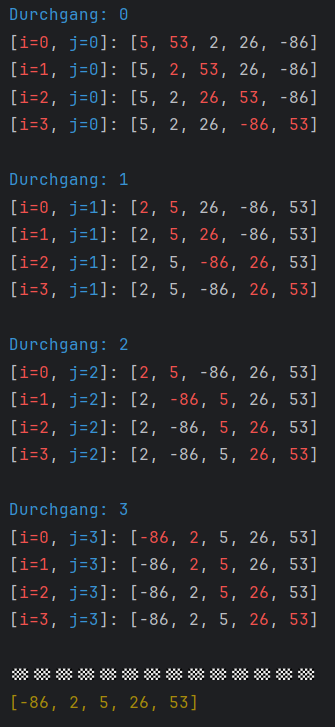

# Modultest 1 - BITEC

Sie haben `180 Minuten` Zeit die Aufgaben zu lösen
* Sie können maximal 100 Punkte erreichen
* Es sind zur Prüfung zugelassen:
    * Taschenrechner (wenn erwünscht)
    * Transparente Wasserflasche
    * Papier, Geodreieck, Stifte, usw.
    * Am Computer sind alle Unterlagen sowie die Nutzung des Internets erlaubt.

Die Nutzung des Internets umfasst nicht
* Chatbots
* Veröffentlichung der Lösungen
* sonstige Kommunikation mit anderen Usern

Die Nutzung von allen anderen Dingen, muss vorher mit mir abgesprochen werden
(z.B. Nutzung von Ohropax), ansonsten wird dies als schummeln gewertet. 
Die Folge des Schummeln ist eine Bewertung mit 0 Punkten.

* Die Abgabe des Programmcodes erfolgt über Teams (ein zip-File des Projektes mir bis spätestens 15 nach dem Ende der Prüfung schicken)
* Viel Erfolg! :)

Notenschlüssel:
[0-50): N5; [50-62.5%): G4; [62.5-75%): B3; [75-87.5%): G2; [87.5-100%]: S1., (Schulnotensystem)

---

## Aufgabe 1: Arrays [35 / 100 Punkte]

### Programmverständnis [15 / 25 Teilpunkte]
Gegeben ist folgender Code, welcher den ``Bubble Sort`` darstellt.

```java
package VergangeneTests.ModulTest_2025_05.Aufgabe_1;

import java.lang.reflect.Array;
import java.util.Arrays;

public class Programmieren_02 {
    static String ANSI_RESET = "\u001B[0m";
    static String ANSI_RED = "\u001B[31m";
    static String ANSI_BLUE = "\u001B[34m";
    static String ANSI_YELLOW = "\u001B[33m";
    static String colorOfOuterLoop = ANSI_RED;
    static String colorOfInnerLoop = ANSI_BLUE;

    public static void main(String[] args) {
        int[] zahlen = {53, 5, 2, 26, -86};

        for (int j = 0; j < zahlen.length - 1; j++) {
            System.out.println(colorOfInnerLoop + "Durchgang: " + j + ANSI_RESET);

            for (int i = 0; i < zahlen.length - 1; i++) {
                if (zahlen[i] > zahlen[i+1]) {
                    int platzhalter = zahlen[i-1];
                    zahlen[i-1] = zahlen[i];
                    zahlen[i] = platzhalter;
                }
            
                // Bunte - Ausgabe
                String zahlenColored = colorAt(
                        zahlen,
                        new int[]{i+1, i},
                        new String[]{colorOfOuterLoop, colorOfOuterLoop},
                        ANSI_RESET
                );

                System.out.println(
                        "[" +
                            colorOfOuterLoop + "i=" + i + ANSI_RESET + ", " +
                            colorOfInnerLoop + "j=" + j + ANSI_RESET +
                        "]: " +
                        zahlenColored + ANSI_RESET
                );

            }
            System.out.println();
        }

        System.out.println("🏁".repeat(14));
        System.out.println(ANSI_YELLOW + Arrays.toString(zahlen) + ANSI_RESET);
    }

    static String colorAt(int[] zahlen, int[] posToColor, String[] colorOfPos, String baseColor) {
        String[] coloredZahlen = new String[zahlen.length];

        for (int i = 0; i < zahlen.length; i++) {
            coloredZahlen[i] = Integer.toString(zahlen[i]);
        }

        for (int i = 0; i < posToColor.length; i++) {
            coloredZahlen[posToColor[i]] = colorOfPos[i] + zahlen[posToColor[i]] + baseColor;
        }

        return baseColor + Arrays.toString(coloredZahlen);
    }
}
```

Dieses Programm erzeugt, wenn die Fehler behoben wurden folgenden Output:

<div style="text-align: left; ">
    
</div>

1) Kopiere den gegebenen Programmcode in [Aufgabe_1/01_Programmveständnis.md](../Aufgabe_1/01_Programmverstaendnis.md). Suche dort Fehler im Code, markiere diese Durch den Text ``//Fehler in dieser Zeile! Begründung: TODO`` und erkläre warum es ein Fehler ist.
2) Beantworte außerhalb des Programmcodes in ``Aufgabe_1/01_Programmveständnis.md`` folgende Fragen:
    * Was ist die Aufgabe der äußeren For-Schleife?
    * Was ist die Aufgabe der inneren For-Schleife?
    * Was ist die Aufgabe der If-Anweisung?
    * Was ist die Aufgabe der Variable *platzhalter*?
    * Was würde passieren, wenn wir ohne *platzhalter* arbeiten würden? Also innerhalb der ``IF-Anweisung`` folgendes schreiben würden?
```java
zahlen[i] = zahlen[i+1];
zahlen[i+1] = zahlen[i];
```
3) Wir betrachten folgende animierte Grafik:
<table style="width:100%">
  <tr>
    <td style="vertical-align: top; padding-right: 10px; width: 50%;">
      <ul>
        <li>Ist es notwendig schwarz umrandete Zahlen mit anderen Zahlen zu vergleichen? Bergüne kurz warum oder warum nicht.</li>
        <li>Kann eine schwarz umrandete Zahl ignoriert werden? Begründe kurz warum oder warum nicht.</li>
        <li>Wird eine schwarz umrandete Zahl in dem oben gegebenen Code ignoriert? Begründe kurz warum oder warum nicht.</li>
      </ul>
    </td>
    <td style="vertical-align: top; padding-left: 10px; width: 50%;">
      <div style="text-align: center;">
        
      </div>
    </td>
  </tr>
</table>

---

### Programmieren [5 / 25 Teilpunkte]
Kopiere den Programmcode aus [Programmverständnis](#programmverständnis-15--25-teilpunkte) nach [Aufgabe_1/Programmieren_02.java](../Aufgabe_1/Programmieren_02.java). 
1) Bessere dort die Fehler aus und 
2) verbessere den Algorithmus um folgenden Output zu erzeugen. 

**Hinweise:** Denke an die schwarz umrandete Zahl um die Optimierung umzusetzen.

Erwarteter Output:
```
Durchgang: 0
[i=0, j=0]: [53, 5, 2, 26, -86]
[i=1, j=0]: [5, 53, 2, 26, -86]
[i=2, j=0]: [5, 2, 53, 26, -86]
[i=3, j=0]: [5, 2, 26, 53, -86]

Durchgang: 1
[i=0, j=1]: [5, 2, 26, -86, 53]
[i=1, j=1]: [2, 5, 26, -86, 53]
[i=2, j=1]: [2, 5, 26, -86, 53]

Durchgang: 2
[i=0, j=2]: [2, 5, -86, 26, 53]
[i=1, j=2]: [2, 5, -86, 26, 53]

Durchgang: 3
[i=0, j=3]: [2, -86, 5, 26, 53]

🏁🏁🏁🏁🏁🏁🏁🏁🏁🏁🏁🏁🏁🏁
[-86, 2, 5, 26, 53]
```

---

### Theorie [5 / 35 Teilpunkte]
Kopiere folgende Angabe nach [Aufgabe_1/03_Theorie.md](../Aufgabe_1/03_Theorie.md) und beantworte dort die folgenden Fragen.

1) Finde Fehler in dem folgenden Code. Beantworte dazu ``//Fehler! Begründung: TODO`` und lösche dazu ``//n. erzeugter Wert hat Typ: TODO oder``
2) Wenn kein Fehler in der Zeile ist, was ist der ``Typ`` des erzeugten ``Werte`` in folgendem Code. Beantworte dazu ``//n. erzeugter Wert hat Typ: TODO`` und lösche ``oder Fehler! Begründung: TODO``.
```java
String[][][][][] daten = new String[10][5][15][8][2];
daten[0][0][0][0]    // 1. erzeugter Wert hat Typ: TODO oder Fehler! Begründung: TODO
daten[3][1][6][5]    // 2. erzeugter Wert hat Typ: TODO oder Fehler! Begründung: TODO
Daten[0][0][0]       // 3. erzeugter Wert hat Typ: TODO oder Fehler! Begründung: TODO
daten[0]             // 4. erzeugter Wert hat Typ: TODO oder Fehler! Begründung: TODO
String[][][][][] daten[0][0][0][0][0] // 5. erzeugter Wert hat Typ: TODO oder Fehler! Begründung: TODO
```

**Hinweise:** 
* Falls es nicht im Kopf geht, versuche ``JAVA`` den ``Typ`` mit ``System.out.println`` ausgeben zu lassen. Recherchiere dazu im Internet.
* Achte auf korrekte Schreibweisen der Variablen und die Größe der Indices.

---

## Aufgabe 2: Userinput verarbeiten - RegEx, Schleifen und Scanner [60 Punkte]
### Programmverständnis [10 / 60 Teilpunkte]
Kopiere folgende Angabe nach [Aufgabe_2/01_Programmverständnis.md](../Aufgabe_2/01_Programmverstaendnis.md) und beantworte dort die folgenden Fragen.

Gegeben ist ein ``RegEx``. 
1) Suche und beschreibe die ``Operatoren`` welche hier verwendet wurden.
2) Beschreibe ca. was dieser ``RegEx`` darstellen soll.

```rx
^ein-hundert|(zwanzig|dreißig|vierzig|fünfzig|sechzig|siebzig|achtzig|neunzig)|((ein|zwei|drei|vier|fünf|acht|neun|sechs|sieben)-und-(zwanzig|dreißig|vierzig|fünfzig|sechzig|siebzig|achtzig|neunzig))|((drei|vier|fünf|acht|neun|sech|sieb)-zehn)|(zwei|drei|vier|fünf|acht|neun|sechs|sieben)|(null|eins|zehn|elf|zwölf)$
```

**Hinweis:** Verwende z.B. einen [Regex-Online-Checker](https://regex101.com/) um die erlaubten Texte zu überprüfen.

---

### Programmieren [40 / 60 Teilpunkte]
Kopiere den folgenden Programmcode nach [Aufgabe_2/Programmieren_02.java](../Aufgabe_2/Programmieren_02.java). 

```java
package VergangeneTests.ModulTest_2025_05.Aufgabe_2;

import java.util.Random;
import java.util.Scanner;

public class Programmieren_02 {
    public static void main(String[] args) {
        // Variablen Anlegen
        Random random = new Random();
        Scanner scanner = new Scanner(System.in);
        boolean playAgain = true;

        // Beginne mit Logik (Kontrollstrukturen)
        // spiele nochmals
        while (playAgain) {
            // Wir ziehen eine Zahl welche zufällig zwischen 0 und 100 (inklusive) ist.
            int zahlZuRaten = ... // TODO: Lösche dieses Kommentar, die drei Punkte und füge dort den korrekten logischen Ausdruck ein.
            int leben = 5 - 1;
            int versuche = 0;

            System.out.println("Eine Zahl zwischen 0 und 100 wurde gewählt. Rate die Zahl!");

            // Beginne mit Logik (Kontrollstrukturen)
            // Wiederholung der Spiellogik
            while (true) {
                // Wie darf der User seinen Versuch eingeben? Als Zahl oder nicht - ziehe dazu mit Random eine zufällige Zahl. 
                boolean erwartetZahl = ... // TODO: Lösche dieses Kommentar, die drei Punkte und füge dort den korrekten Ausdruck ein.

                int guess;

                // Userinput

                // NEU:
                // Wenn eine Zahl erwartet wird!
                if (...) { // TODO: Lösche dieses Kommentar, die drei Punkte und füge dort den korrekten logischen Ausdruck ein.
                    System.out.print("Gib eine Zahl ein [0-100]: ");

                    // guards für falschen Userinput - das Muster für eine Zahl kann mit in hasNextInt des Scanners abgefragt werden.
                    while (...) { // TODO: Lösche dieses Kommentar, die drei Punkte und füge dort den korrekten logischen Ausdruck ein.
                        System.out.print("Falscher userinput, bitte neu eingeben: ");
                        scanner.next();
                    }

                    guess = scanner.nextInt();

                // Wenn eine Zahl ausgeschrieben erwartet wird.
                } else {
                    System.out.print("Gib eine Zahl als WORT mit Bindestrichen ein [null bis ein-hundert] z.B. ein-und-sechzig: ");

                    String pattern = // TODO: Lösche dieses Kommentar, die drei Punkte und füge dort den korrekten Ausdruck ein. Dieser ist unten in der Angabe angegeben! Dieser muss nicht selbst ausgedacht werden.

                    // Verwende den RegEx pattern in der Methode hasNext um falschen Userinput abzugangen.
                    while (...) { // TODO: Lösche dieses Kommentar, die drei Punkte und füge dort den korrekten logischen Ausdruck ein.
                        System.out.print("Falscher userinput, bitte neu eingeben: ");
                        scanner.next();
                    }

                    // Hier kommt nun ein String vom User aus der Console zurück.
                    String zahlAlsString = ... // TODO: Lösche dieses Kommentar, die drei Punkte und füge dort den korrekten Ausdruck ein.

                    // wir sind pragmatisch. Wir lösen ALLE 100 Fälle mit einem Switch.
                    guess = switch (zahlAlsString) {
                        case ... // TODO: Lösche dieses Kommentar, die drei Punkte und füge dort den korrekten Ausdruck ein.
                    };
                }

                // Spiellogik: habe ich genug leben?
                if (...) { // TODO: Lösche dieses Kommentar, die drei Punkte und füge dort den korrekten logischen Ausdruck ein.
                    System.out.println("Du hast keine Leben mehr. Die Zahl war " + zahlZuRaten + ".");
                    break;
                }

                leben--;
                versuche++;

                // Spiellogik: wo bin ich mit meinem guess?
                if (...) { // TODO: Lösche dieses Kommentar, die drei Punkte und füge dort den korrekten logischen Ausdruck ein.
                    System.out.println("Die Zahl ist kleiner. Du hast noch " + (leben + 1) + " Leben.");

                } else if (...) { // TODO: Lösche dieses Kommentar, die drei Punkte und füge dort den korrekten logischen Ausdruck ein.
                    System.out.println("Die Zahl ist größer. Du hast noch " + (leben + 1) + " Leben.");

                } else if (...) { // TODO: Lösche dieses Kommentar, die drei Punkte und füge dort den korrekten logischen Ausdruck ein.
                    System.out.println("gewonnen. Die Zahl war " + zahlZuRaten + ". Es wurden " + versuche + " benötigt.");
                    break;
                }
            }

            // Logik um Spiel neu starten zu können
            System.out.print("Möchtest du nochmals spielen? [+/-]: ");
            playAgain = scanner.next().equals("+");
        }

        System.out.println("Spiel beendet. Danke fürs Spielen!");
        scanner.close();
    }
}
```

Der Benutzer muss eine geheime Zahl zwischen 0 und 100 erraten. Nach jeder Eingabe gibt das Programm Hinweise, ob die Zahl zu hoch oder zu klein ist. Der Benutzer hat 5 Leben. Wenn die Leben aufgebraucht sind, endet das Spiel mit einer Niederlage. **Der User wird zudem mit der Wahrscheinlichkeit von *50%* aufgefordert eine Zahl als Text einzugeben. Damit ist z.B. *"neun-und-fünfzig"* ist *59* gemeint.**

Weiters soll folgendes gelten:
* **Geheime Zahl:**
  Das Programm wählt zu Beginn eine zufällige Zahl zwischen 0 und 100 (einschließlich) aus.
  Verwenden Sie dazu die Klasse `Random` aus dem Paket `java.util`. Um diese Klasse verwenden zu können, schreiben Sie `import java.util.Random;` am Anfang Ihres Programms. Erstellen Sie dann ein Objekt dieser Klasse, z.B. `Random random = new Random();`, und verwenden Sie die Methode `nextInt()`, um eine Zufallszahl zu generieren.

* **Userinput:**
  Ein:e Benutzer:in wird in jeder Runde aufgefordert, eine Zahl einzugeben. Die Eingabe muss überprüft werden, ob sie der geheimen Zahl entspricht. Verwenden Sie die Klasse `Scanner` aus dem Paket `java.util` um Eingaben aus dem Terminal einzulesen. Importieren Sie dazu `import java.util.Scanner;` und erstellen Sie ein `Scanner`-Objekt, z.B. `Scanner scanner = new Scanner(System.in);`. Mit `scanner.nextInt();` können Sie dann eine Ganzzahl einlesen.
  **Wichtig!:** Es soll dem User möglich sein auch wenn **falsche** Eingaben getätigt wurde, diese ausbessern zu können. Fordere dazu den User solange auf etwas einzugeben bis dieses dem erwarteten Muster entspricht.

* **RegEx für Erkennung der Zahlen als Text**: Es kann dieser ``Regex`` verwendet werden um z.B. ``fünf-und-dreißig`` zu erkennen.
```java
String nichtKombinierbar = "null|eins|zehn|elf|zwölf";
String ersterTeilDreizehnBisNeunZehn = "drei|vier|fünf|acht|neun";
String zweiterTeilDreihzehnBisNeunzehn = "sech|sieb";
String dreizehnBisNeunzehn = ersterTeilDreizehnBisNeunZehn + "|" + zweiterTeilDreihzehnBisNeunzehn;
String basis = "ein|zwei|" + ersterTeilDreizehnBisNeunZehn + "|sechs|sieben";
String dreizehnBisNeunZehn = "(" + dreizehnBisNeunzehn + ")-zehn";
String zehnerStellen = "zwanzig|dreißig|vierzig|fünfzig|sechzig|siebzig|achtzig|neunzig";
String kombinierterRest = "(" + basis + ")-und-(" + zehnerStellen + ")";
String hundert = "ein-hundert";

String pattern = "^" +
    nichtKombinierbar + "|" +
    basis +
    "|(" + dreizehnBisNeunZehn + ")|" +
    zehnerStellen +
    "|(" + kombinierterRest + ")|" +
    hundert + "$";
```

* **Interaktion mit Benutzer:innen:**
  Wenn die Eingabe zu hoch ist, gibt das Programm die Nachricht *"Die Zahl ist zu hoch!"* aus.
  Wenn die Eingabe zu niedrig ist, gibt das Programm die Nachricht *"Die Zahl ist zu klein!"* aus.
  Bei korrekter Eingabe zeigt das Programm *"Herzlichen Glückwunsch, Sie haben die Zahl erraten!"* an und beendet das Spiel.

* **Anzahl der Versuche:**
  Ein:e Benutzer:in hat `5` Leben. Bei jeder falschen Eingabe verliert diese:r ein Leben. Wenn die Leben aufgebraucht sind, endet das Spiel mit der Nachricht: *"Game Over! Die geheime Zahl war: ``<Geheime Zahl>``"*.

#### Erwarteter Output:
```
Eine Zahl zwischen 0 und 100 wurde gewählt. Rate die Zahl!
Gib eine Zahl als WORT mit Bindestrichen ein [null bis ein-hundert] z.B. ein-und-sechzig: 50
Falscher userinput, bitte neu eingeben: warum?
Falscher userinput, bitte neu eingeben: fünfzig
Die Zahl ist kleiner. Du hast noch 4 Leben.
Gib eine Zahl ein [0-100]: 25
Die Zahl ist größer. Du hast noch 3 Leben.
Gib eine Zahl als WORT mit Bindestrichen ein [null bis ein-hundert] z.B. ein-und-sechzig: sieben-und-dreißig
Die Zahl ist größer. Du hast noch 2 Leben.
Gib eine Zahl als WORT mit Bindestrichen ein [null bis ein-hundert] z.B. ein-und-sechzig: fünf-und-vierzig
Die Zahl ist kleiner. Du hast noch 1 Leben.
Gib eine Zahl ein [0-100]: neun-und-dreißig
Falscher userinput, bitte neu eingeben: 39
Du hast keine Leben mehr. Die Zahl war 40.
Möchtest du nochmals spielen? [+/-]: -
Spiel beendet. Danke fürs Spielen!
```

---

### Theorie [10 / 60 Teilpunkte]
Kopiere folgende Angabe nach [Aufgabe_3/01_Programmverstaendnis.md](../Aufgabe_2/03_Theorie.md) und beantworte dort die folgenden Fragen.

* 1) Was ist der Unterschied zwischen einer ``If-Verzweigung`` und einer ``Bedingten Anweisung``?
* 2) Denke an eine ``If-Verzweigung``. Was ist die ``logische Formel`` des ``else`` Zweigs, wenn die ``logische Formel`` für den ``if`` Zweig ``alter > 25`` ist?
* 3) Kann eine ``If-Verzweigung`` das gleiche Verhalten wie eine ``Bedingte Anweisung`` haben? Vergleiche dazu folgenden Code.
```java
if (alter > 25) {
    System.out.println("If-Zweig")
} else {
    System.out.println("Else-Zweig")
}
```

vs.

```java
if (alter > 25) {
    System.out.println("Bedingte Anweisung")
} 

if (alter <= 25) {
    System.out.println("Auch eine Bedingte Anweisung")
}
```

---

## Aufgabe 3: Funktionen (Methoden) schreiben [30 Punkte]
### Programmverständnis [10 / 30 Teilpunkte]
Kopiere folgende Angabe nach [Aufgabe_3/01_Programmverständnis.md](../Aufgabe_3/01_Programmverstaendnis.md) und beantworte dort die folgenden Fragen.

Folgender *Code-Ausschnitt* funktionier nicht. Suche dort Fehler im Code, markiere diese Durch den Text ``//Fehler in dieser Zeile! Begründung: TODO`` und erkläre warum es ein Fehler ist.
```java
...

public static void main(String[] args) {
    String[][] muster = new String[5][5];

    // Hier wird das Muster erzeugt, es steht also im Muster was sinnvolles, nicht nur 5x5 null.
    ...

    String[][] zweiMalGedrehtesMuster = drehen(drehen(muster));
}

static void drehen(String[][] array) {
    ...
}
...
```

**Anmerkung:** Die Antwort "wegen den drei Punkten" bzw. wegen den fehlenden main usw. wäre kreativ, ist aber hier nicht gemeint.

---

### Programmieren [20 / 30 Teilpunkte]
Kopiere den folgenden Programmcode nach [Aufgabe_3/Programmieren_02.java](../Aufgabe_3/Programmieren_02.java). Verwende deine Lösung aus [Aufgabe_2/Pogrammieren_02.java] und füge diese in die unten angegebenen ``Funktionen`` ein. 

Verwende folgende ``Funktionen`` (Methoden) um das *Zahlen Raten* Programm mit *Schnitstellen* zu versehen.
Diese sind in der Hilfestellung unten in einem Programm zu sehen. 

#### **Hilfestellung:**
```java
public class Programmieren_02 {
    static final int MAX_LIVES = 5;
    static final int MIN_NUMBER = 0;
    static final int MAX_NUMBER = 100;

    public static void main(String[] args) {
        Random random = new Random();
        Scanner scanner = new Scanner(System.in);
        boolean playAgain = true;

        while (playAgain) {
            playSingleGame(scanner, random);
            playAgain = askToPlayAgain(scanner);
        }

        System.out.println("Spiel beendet. Danke fürs Spielen!");
        scanner.close();
    }

    static void playSingleGame(Scanner scanner, Random random) {
        ...
    }

    static int getUserGuess(Scanner scanner, Random random) {
        ...
        return getWordInput(...);
        ...
        return getNumericInput(...);
    }

    static int getNumericInput(Scanner scanner) {
        ...
    }

    static int getWordInput(Scanner scanner) {
        ...
    }

    static int convertWordToNumber(String wordInput) {
        ...
    }

    static void displayGameStatus(int guess, int zahlZuRaten, int livesLeft) {
        ...
    }

    static boolean askToPlayAgain(Scanner scanner) {
        ...
    }
}
```

### Theorie [05 / 30 Teilpunkte]
Kopiere folgende Angabe nach [Aufgabe_3/03_Theorie.md](../Aufgabe_3/03_Theorie.md) und beantworte dort die folgenden Fragen.

* Was ist der Unterschied zwischen dem ``Rückgabeparameter`` und dem ``Eingangsparameter``?
* Braucht jede ``Funktion`` (Methode) solche ``Parameter``? 
* Warum sollen wir uns mit ``Funktionen`` quälen? Was ist deren Vorteil wenn wir diese Verwenden?

---