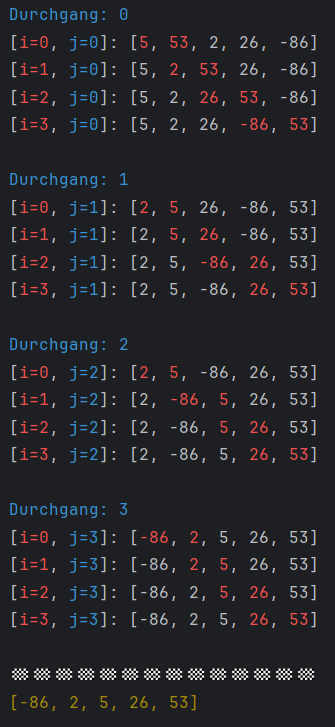

# Modultest 1 - BITEC BT02/03

Sie haben `180 Minuten` Zeit die Aufgaben zu lösen
* Sie können maximal 100 Punkte erreichen
* Es sind zur Prüfung zugelassen:
    * Taschenrechner (wenn erwünscht)
    * Transparente Wasserflasche
    * Papier, Geodreieck, Stifte, usw.
    * Am Computer sind alle Unterlagen sowie die Nutzung des Internets erlaubt.

Die Nutzung des Internets umfasst nicht
* Chatbots
* Veröffentlichung der Lösungen
* sonstige Kommunikation mit anderen Usern

Die Nutzung von allen anderen Dingen, muss vorher mit mir abgesprochen werden
(z.B. Nutzung von Ohropax), ansonsten wird dies als schummeln gewertet. 
Die Folge des Schummeln ist eine Bewertung mit 0 Punkten.

* Die Abgabe des Programmcodes erfolgt über Teams (ein zip-File des Projektes mir bis spätestens 10:15 schicken)
* Viel Erfolg! :)

Notenschlüssel:
[0-50): N5; [50-62.5%): G4; [62.5-75%): B3; [75-87.5%): G2; [87.5-100%]: S1., (Schulnotensystem)

---

## Aufgabe 1: Arrays [35 / 100 Punkte]

### Programmverständnis [10 / 25 Teilpunkte]
Gegeben ist folgender Code, welcher den ``Bubble Sort`` darstellt. 

```java
package VergangeneTests.ModulTest_2025_06.Aufgabe_1;

import java.lang.reflect.Array;
import java.util.Arrays;

public class Programmieren_02 {
    static String ANSI_RESET = "\u001B[0m";
    static String ANSI_RED = "\u001B[31m";
    static String ANSI_BLUE = "\u001B[34m";
    static String ANSI_YELLOW = "\u001B[33m";
    static String colorOfOuterLoop = ANSI_RED;
    static String colorOfInnerLoop = ANSI_BLUE;

    public static void main(String[] args) {
        int[] zahlen = {53, 5, 2, 26, -86};

        for (int j = 0; j < zahlen.length - 1; j++) {
            System.out.println(colorOfInnerLoop + "Durchgang: " + j + ANSI_RESET);

            for (int i = 0; i < zahlen.length - 1; i++) {
                if (zahlen[i] > zahlen[i+1]) {
                    int platzhalter = zahlen[i-1];
                    zahlen[i-1] = zahlen[i];
                    zahlen[i] = platzhalter;
                }
            
                // Bunte - Ausgabe
                String zahlenColored = colorAt(
                        zahlen,
                        new int[]{i+1, i},
                        new String[]{colorOfOuterLoop, colorOfOuterLoop},
                        ANSI_RESET
                );

                System.out.println(
                        "[" +
                            colorOfOuterLoop + "i=" + i + ANSI_RESET + ", " +
                            colorOfInnerLoop + "j=" + j + ANSI_RESET +
                        "]: " +
                        zahlenColored + ANSI_RESET
                );

            }
            System.out.println();
        }

        System.out.println("🏁".repeat(14));
        System.out.println(ANSI_YELLOW + Arrays.toString(zahlen) + ANSI_RESET);
    }

    static String colorAt(int[] zahlen, int[] posToColor, String[] colorOfPos, String baseColor) {
        String[] coloredZahlen = new String[zahlen.length];

        for (int i = 0; i < zahlen.length; i++) {
            coloredZahlen[i] = Integer.toString(zahlen[i]);
        }

        for (int i = 0; i < posToColor.length; i++) {
            coloredZahlen[posToColor[i]] = colorOfPos[i] + zahlen[posToColor[i]] + baseColor;
        }

        return baseColor + Arrays.toString(coloredZahlen);
    }
}
```

Dieses Programm erzeugt, wenn der Fehler behoben wurde folgenden Output:

<div style="text-align: left; ">
    
</div>

1) Finde die Fehler in diesem Code und bessere diesen aus und markiere diesen. 
2) Beantworte im ``Programmcode`` mit ``Kommentaren`` folgenden Fragen:
    * Was ist die Aufgabe der äußeren For-Schleife?
    * Was ist die Aufgabe der inneren For-Schleife?
    * Was ist die Aufgabe der If-Anweisung?
    * Was ist die Aufgabe der Variable *platzhalter*?
    * Was würde passieren, wenn wir ohne *platzhalter* arbeiten würden? Also innerhalb der ``IF-Anweisung`` folgendes schreiben würden?

```java
zahlen[i] = zahlen[i+1];
zahlen[i+1] = zahlen[i];
```

---

### Programmieren [10 / 25 Teilpunkte]
<table style="width:100%">
  <tr>
    <td style="vertical-align: top; padding-right: 10px; width: 50%;">
      Wir erinnern uns an folgende Grafik:
      <ul>
        <li>Was bedeutet wenn eine Zahl schwarz umrandet wird?</li>
        <li>Ist dieses Verhalten in unserem Code vorhanden?</li>
        <li>Wenn nein, versuche diese Optimierung in das oben angegebene Programm einzubauen.</li>
      </ul>
    </td>
    <td style="vertical-align: top; padding-left: 10px; width: 50%;">
      <div style="text-align: center;">
        
      </div>
    </td>
  </tr>
</table>

Erwarteter Output:
```
Durchgang: 0
[i=0, j=0]: [53, 5, 2, 26, -86]
[i=1, j=0]: [5, 53, 2, 26, -86]
[i=2, j=0]: [5, 2, 53, 26, -86]
[i=3, j=0]: [5, 2, 26, 53, -86]

Durchgang: 1
[i=0, j=1]: [5, 2, 26, -86, 53]
[i=1, j=1]: [2, 5, 26, -86, 53]
[i=2, j=1]: [2, 5, 26, -86, 53]

Durchgang: 2
[i=0, j=2]: [2, 5, -86, 26, 53]
[i=1, j=2]: [2, 5, -86, 26, 53]

Durchgang: 3
[i=0, j=3]: [2, -86, 5, 26, 53]

🏁🏁🏁🏁🏁🏁🏁🏁🏁🏁🏁🏁🏁🏁
[-86, 2, 5, 26, 53]
```

**Bonus:** Beschreibe den Code der *colorAt* ``Methode``. Versuche zudem die Zahlen im ``Array`` *zahlen* in *Cyan* einzufärben, aber die eckigen *Klammern* und *Beistriche* nicht einzufärben (*ANSI_RESET*).
<div style="display: flex; flex-wrap: wrap; align-items: center; gap: 5px;">
  [
  <div style="color:cyan;">53</div>,
  <div style="color:cyan;">5</div>,
  <div style="color:cyan;">2</div>,
  <div style="color:cyan;">26</div>,
  <div style="color:cyan;">-86</div>
  ]
</div>

---

### Theorie [5 / 35 Teilpunkte]
1) Was ist der ``Typ`` des erzeugten ``Werte`` in folgendem Code:
```java
String[][][][][] daten = new String[10][5][15][8][2];
daten[0][0][0][0]    // 1. erzeugter Wert hat Typ...?
daten[3][1][6][5]    // 2. erzeugter Wert hat Typ...?
daten[0][0][0]       // 3. erzeugter Wert hat Typ...?
daten[0]             // 4. erzeugter Wert hat Typ...?
daten[0][0][0][0][0] // 5. erzeugter Wert hat Typ...?
```

**Hinweis:** Falls es nicht im Kopf geht, versuche ``JAVA`` den ``Typ`` ausgeben zu lassen. Recherchiere dazu im Internet.

---

## Aufgabe 2: Userinput verarbeiten - RegEx, Schleifen und Scanner [60 Punkte]
### Programmverständnis [10 / 60 Teilpunkte]
Gegeben ist ein ``RegEx``. 
* Suche und beschreibe die ``Operatoren`` welche hier verwendet wurden.
* Beschreibe ca. was dieser darstellen soll.

```rx
^(ein-hundert|null|eins|zehn|elf|zwölf|ein|zwei|drei|vier|fünf|sechs|sieben|acht|neun)|((drei|vier|fünf|sechs|sieben|acht|neun)-zehn)|(zwanzig|dreißig|vierzig|fünfzig|sechzig|siebzig|achtzig|neunzig)|((ein|zwei|drei|vier|fünf|sechs|sieben|acht|neun)-und-(zwanzig|dreißig|vierzig|fünfzig|sechzig|siebzig|achtzig|neunzig))$
```

---

### Programmieren [40 / 60 Teilpunkte]
Der Benutzer muss eine geheime Zahl zwischen 0 und 100 erraten. Nach jeder Eingabe gibt das Programm Hinweise, ob die Zahl zu hoch oder zu klein ist. Der Benutzer hat 5 Leben. Wenn die Leben aufgebraucht sind, endet das Spiel mit einer Niederlage. **Der User wird zudem mit der Wahrscheinlichkeit von *50%* aufgefordert eine Zahl als Text einzugeben. Damit ist z.B. *"neun-und-fünfzig"* ist *59* gemeint.**

**Hinweis:** Erstelle das Programm schrittweise. Wir haben das Programm bereits programmiert, jedoch ohne die Erweiterung. Verwende dazu den Code welcher sich online befindet, als Vorlage.
Dies Programm ist ohne die *50%* Wahrscheinlichkeit der Eingabe in der Form *fünf-und-dreißig*. Danach versuche diese Form hinzuzufügen. Denke zudem pragmatisch. Was ist der einfachste, jedoch anstrengende Weg, wenn der User eine ausgeschriebene Zahl eingibt, dies gleich dem ``Wert`` *ein-und-dreißig* ist und wir dann *31* als *Integer* zurückgeben? Wie machen wir es für alle 100 Fälle? 

Weiters soll folgendes gelten:
* **Geheime Zahl:**
  Das Programm wählt zu Beginn eine zufällige Zahl zwischen 0 und 100 (einschließlich) aus.
  Verwenden Sie dazu die Klasse `Random` aus dem Paket `java.util`. Um diese Klasse verwenden zu können, schreiben Sie `import java.util.Random;` am Anfang Ihres Programms. Erstellen Sie dann ein Objekt dieser Klasse, z.B. `Random random = new Random();`, und verwenden Sie die Methode `nextInt()`, um eine Zufallszahl zu generieren.

* **Userinput:**
  Ein:e Benutzer:in wird in jeder Runde aufgefordert, eine Zahl einzugeben. Die Eingabe muss überprüft werden, ob sie der geheimen Zahl entspricht. Verwenden Sie die Klasse `Scanner` aus dem Paket `java.util` um Eingaben aus dem Terminal einzulesen. Importieren Sie dazu `import java.util.Scanner;` und erstellen Sie ein `Scanner`-Objekt, z.B. `Scanner scanner = new Scanner(System.in);`. Mit `scanner.nextInt();` können Sie dann eine Ganzzahl einlesen.
  **Wichtig!:** Es soll dem User möglich sein auch wenn **falsche** Eingaben getätigt wurde, diese ausbessern zu können. Fordere dazu den User solange auf etwas einzugeben bis dieses dem erwarteten Muster entspricht.

* **RegEx für Erkennung der Zahlen als Text**: Es kann dieser ``Regex`` verwendet werden um z.B. ``fünf-und-dreißig`` zu erkennen.
```java
String nichtKombinierbar = "null|eins|zehn|elf|zwölf";
String ersterTeilDreizehnBisNeunZehn = "drei|vier|fünf|acht|neun";
String zweiterTeilDreihzehnBisNeunzehn = "sech|sieb";
String dreizehnBisNeunzehn = ersterTeilDreizehnBisNeunZehn + "|" + zweiterTeilDreihzehnBisNeunzehn;
String basis = "ein|zwei|" + ersterTeilDreizehnBisNeunZehn + "|sechs|sieben";
String dreizehnBisNeunZehn = "(" + dreizehnBisNeunzehn + ")-zehn";
String zehnerStellen = "zwanzig|dreißig|vierzig|fünfzig|sechzig|siebzig|achtzig|neunzig";
String kombinierterRest = "(" + basis + ")-und-(" + zehnerStellen + ")";
String hundert = "ein-hundert";

String pattern = "^" +
    nichtKombinierbar + "|" +
    basis +
    "|(" + dreizehnBisNeunZehn + ")|" +
    zehnerStellen +
    "|(" + kombinierterRest + ")|" +
    hundert + "$";
```

* **Interaktion mit Benutzer:innen:**
  Wenn die Eingabe zu hoch ist, gibt das Programm die Nachricht *"Die Zahl ist zu hoch!"* aus.
  Wenn die Eingabe zu niedrig ist, gibt das Programm die Nachricht *"Die Zahl ist zu klein!"* aus.
  Bei korrekter Eingabe zeigt das Programm *"Herzlichen Glückwunsch, Sie haben die Zahl erraten!"* an und beendet das Spiel.

* **Anzahl der Versuche:**
  Ein:e Benutzer:in hat `5` Leben. Bei jeder falschen Eingabe verliert diese:r ein Leben. Wenn die Leben aufgebraucht sind, endet das Spiel mit der Nachricht: *"Game Over! Die geheime Zahl war: ``<Geheime Zahl>``"*.

#### Erwarteter Output:
```
Eine Zahl zwischen 0 und 100 wurde gewählt. Rate die Zahl!
Gib eine Zahl als WORT mit Bindestrichen ein [null bis ein-hundert] z.B. ein-und-sechzig: 50
Falscher userinput, bitte neu eingeben: warum?
Falscher userinput, bitte neu eingeben: fünfzig
Die Zahl ist kleiner. Du hast noch 4 Leben.
Gib eine Zahl ein [0-100]: 25
Die Zahl ist größer. Du hast noch 3 Leben.
Gib eine Zahl als WORT mit Bindestrichen ein [null bis ein-hundert] z.B. ein-und-sechzig: sieben-und-dreißig
Die Zahl ist größer. Du hast noch 2 Leben.
Gib eine Zahl als WORT mit Bindestrichen ein [null bis ein-hundert] z.B. ein-und-sechzig: fünf-und-vierzig
Die Zahl ist kleiner. Du hast noch 1 Leben.
Gib eine Zahl ein [0-100]: neun-und-dreißig
Falscher userinput, bitte neu eingeben: 39
Du hast keine Leben mehr. Die Zahl war 40.
Möchtest du nochmals spielen? [+/-]: -
Spiel beendet. Danke fürs Spielen!
```

---

### Theorie [10 / 60 Teilpunkte]
* a) Was ist der Unterschied zwischen einer ``If-Verzweigung`` und einer ``If-Bedingung``?
* b) Denke an eine ``If-Verzweigung``. Was ist die ``logische Formel`` des ``else`` Zweigs, wenn die ``logische Formel`` für den ``if`` Zweig ``alter > 25`` ist?
* c) Kann eine ``If-Verzweigung`` das gleiche Verhalten wie eine ``If-Bedingung`` haben? Vergleiche dazu folgenden Code.
```java
if (false) {
    System.out.println("If-Zweig")
} else {
    System.out.println("Else-Zweig")
}
```

vs.

```java
if (false) {
    System.out.println("If-Bedingung")
} 

if (true) {
    System.out.println("Auch eine IF-Bedingung")
}
```

---

## Aufgabe 3: Funktionen (Methoden) schreiben [30 Punkte]
### Programmverständnis [10 / 30 Teilpunkte]
Folgender *Code-Ausschnitt* funktionier nicht. Finde den Fehler, bessere diesen aus und erkläre warum es ein Fehler ist.
```java
...

public static void main(String[] args) {
    String[][] muster = ...
    String[][] zweiMalGedrehtesMuster = drehen(drehen(muster));
}

static void drehen(String[][] array) {
    ...
}
...
```

**Anmerkung:** Die Antwort "wegen den drei Punkten" bzw. wegen den fehlenden main usw. wäre kreativ, ist aber hier nicht gemeint.

---

### Programmieren [20 / 30 Teilpunkte]
Verwende folgende ``Funktionen`` (Methoden) um das *Zahlen Raten* Programm mit *Schnitstellen* zu versehen.
Diese sind in der Hilfestellung unten in einem Programm zu sehen.

#### **Hilfestellung:**
```java
public class Programmieren_02 {
    static final int MAX_LIVES = 5;
    static final int MIN_NUMBER = 0;
    static final int MAX_NUMBER = 100;

    public static void main(String[] args) {
        Random random = new Random();
        Scanner scanner = new Scanner(System.in);
        boolean playAgain = true;

        while (playAgain) {
            playSingleGame(scanner, random);
            playAgain = askToPlayAgain(scanner);
        }

        System.out.println("Spiel beendet. Danke fürs Spielen!");
        scanner.close();
    }

    static void playSingleGame(Scanner scanner, Random random) {
        ...
    }

    static int getUserGuess(Scanner scanner, Random random) {
        ...
        return getWordInput(...);
        ...
        return getNumericInput(...);
    }

    static int getNumericInput(Scanner scanner) {
        ...
    }

    static int getWordInput(Scanner scanner) {
        ...
    }

    static int convertWordToNumber(String wordInput) {
        ...
    }

    static void displayGameStatus(int guess, int zahlZuRaten, int livesLeft) {
        ...
    }

    static boolean askToPlayAgain(Scanner scanner) {
        ...
    }
}
```

### Theorie [05 / 30 Teilpunkte]
* Was ist der Unterschied zwischen dem ``Rückgabeparameter`` und dem ``Eingangsparameter``?
* Braucht jede ``Funktion`` (Methode) solche ``Parameter``? 
* Warum sollen wir uns mit ``Funktionen`` quälen? Was ist deren Vorteil wenn wir diese Verwenden?

---