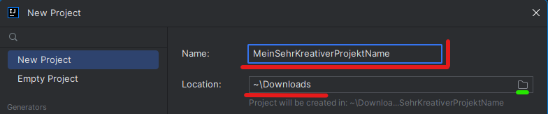
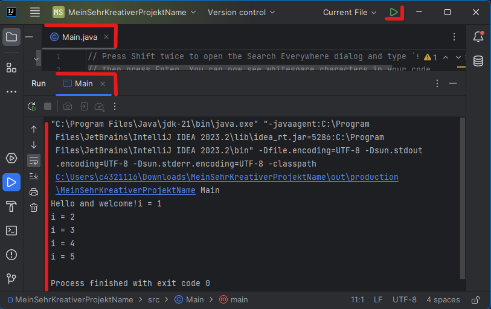
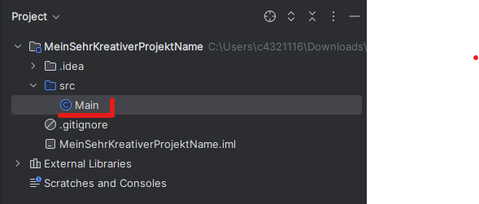
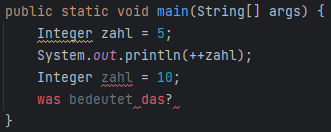
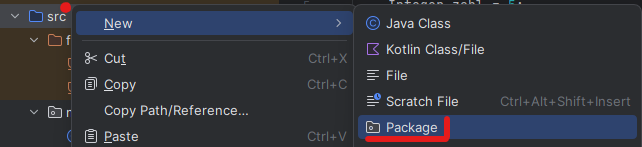
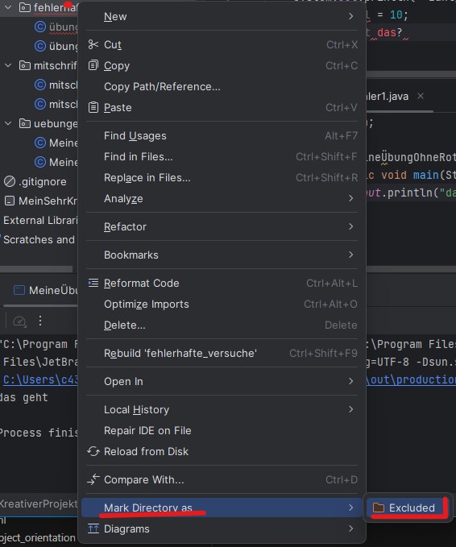
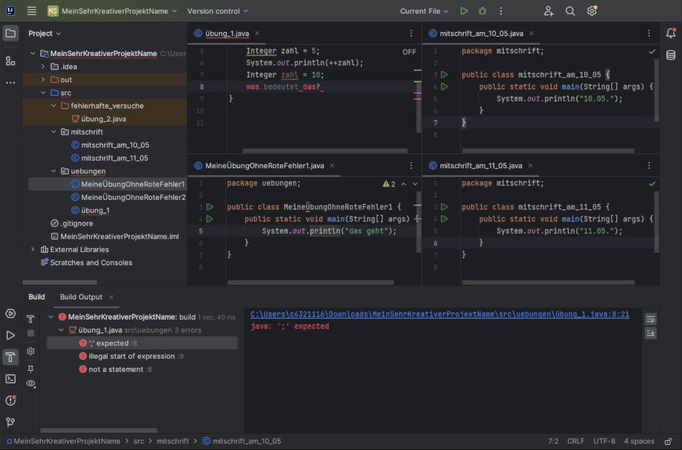

# Erste Schritte in Java und Intellij

#### Welche Begriffe werden hier verwendet?
[`Java`](../../../glossar.md#Java), [`Projekt`](../../../glossar.md#projekt), [`Programm`](../../../glossar.md#programm), [`Programmiersprache`](../../../glossar.md#programmiersprache), [`Main-Methode`](../../../glossar.md#main-methode), [`Entwicklungsumgebung`](../../../glossar.md#entwicklungsumgebung),  [`Intellij`](../../../glossar.md#intellij), [`Fehler`](../../../glossar.md#fehler), [`Warnung`](../../../glossar.md#warnung), [``Wert``](../../../glossar.md#wert), [``Variable``](../../../glossar.md#Variable), [`Typ`](../../../glossar.md#Typ), [`String`](../../../glossar.md#String), [`Integer`](../../../glossar.md#integer), [`Double`](../../../glossar.md#double), [`Boolean`](../../../glossar.md#boolean), [`deklarieren`](../../../glossar.md#deklarieren), [`initialisieren`](../../../glossar.md#initialisieren), [`definieren`](../../../glossar.md#definieren), [`Zuweisungsoperator`](../../../glossar.md#Zuweisungsoperator)

---

## Wie erstelle ich ein Programm?
Unser Ziel fürs erste ist es ein ``Dokument`` zu erstellen, in welchen wir Programmieren können. Da ``Java`` eine objektorientierte ``Programmiersprache`` ist und wir nicht sofort mit objektorientierung beginnen, werden "Dinge" verwendet welche wir vorerste "auswendig lernen" müssen. Die Anzahl dieser hält sich jedoch in Grenzen. 

Um unsere Programme zu schreiben verwenden eine ``Entwicklungsumgebung`` mit Namen ``Intellij``. Wir starten diese und legen dort ein ``Projekt`` an. Ein Projekt ist eine Ansammlung von ``Dokumenten`` in welchen wir Programmieren.

1. Nach dem Start von Intellij sollte ein Fenster geöffnet werden welches einen Button "New Project" hat. 
<p align="center" alt="Hier sollte ein Bild sein welches ein 'neues Projekt auswaehlen' beschreibt">
  
</p>

2. Wähle danach einen Namen für das Projekt und mit einem Pfad den Ort wo dieses am Computer abgelegt wird. Drücke rechts auf das Ordner-Symbol um eine von Windows erzeugte Übersicht zu bekommen.
<p align="center" alt="Hier sollte ein Bild sein welches ein 'neues Projekt anlegen' beschreibt">
  
</p>

3. Wir ignorieren den Text in dem ``Dokument`` *Main.java* und drücken das *grüne Dreieck* rechts oben (oder Shift + F10). Beachte dass daneben "Current File" ausgewählt ist. Wir führen damit ein ``Programm`` aus. Da wir von ``Intellij`` ein vorgefertigtes bekommen haben, müssen wir nicht zuerst eines schreiben um testen zu können ob ``Intellij`` mit ``Java`` funktioniert. Falls hier Fehler auftreten, ist wahrscheinlich bei der Installation des *Java Development Kits* (`JDK`) oder dem Erstellen der Files (z.B. dieses liegt nicht im `src`-Ordner) etwas schiefgelaufen. Wir nenen ein solches Testprogramm *Hello World Programm*. Nach ein paar Sekunden muss unten der im Bild rot *markierte Text* in der ``Konsole`` ausgegeben werden.
<p align="center" alt="Hier sollte ein Bild sein welches ein 'Test programm starten' beschreibt">
  
</p>

4. Wir **löschen** nun das ``Dokument`` *Main.java* in der *Projektübersicht* links. Wir legen dies nun neu an und entfernen damit den vorgefertigten Code. Markiere das ``Dokument`` Dürcke dazu die *ENTF* Taste (oder *DEL* auf englisch) auf der Tastatur.
<p align="center" alt="Hier sollte ein Bild sein welches ein 'Projekt übersicht' beschreibt">
  
</p>

5. Wir sehen den ORdner `src` was "source" also "Quelle" bedeutet. Nur innerhalb dieses `src`-Ordners können wir Files erstellen, in denen wir programmieren können.  Wir legen nun innerhalb des `src`-Ordners eine Datei mit der Endung *.java* an (siehe Bild). Dort schreiben wir in die erste Zeile *public class L01ErsteSchritte {}*. Was die orange gefärbten "Dinge" `public` und `class` machen, ist vorerst nicht wichtig. Eine Klasse ist für uns nur eine Umgebung, in der wir den Namen des ``Dokuments`` festhalten. In den *geschwungenen Klammern* wird eine neue Umgebung geschaffen, in welcher wir neues "Dinge" verwenden können.
<p align="center" alt="Hier sollte ein Bild sein welches ein 'neues Dokument anlegen' beschreibt">
  
</p> 

6. Wir erstellen innerhalb der neuen Umgebung *public class L01ErsteSchritte {}*, eine neue Umgebung *public static void main(String[] args) {}*. Nur dort werden wir programmiern. Bezeichnet wird dies eine Methode mit dem Namen `main`. Wieder, was die orange gefärbten *public static void* machen, ist nicht relevant. 

Wir sehen nun folgendes in unserem ``Dokument``.

```java
public class L01ErsteSchritte {                 // Klasse welche genau wie das Dokument heißt (ohne .java).
    public static void main(String[] args) {    // main-Methode
        // ... hier Programmieren wir. 
        // Zudem sind die zwei hintereinander geschriebene // ein Kommentar, welches keinen Programmcode darstellt.
    }
}
```

**Anmerkung:** *String[] args* bietet uns eine Möglichkeit mit "der Außenwelt" zu kommunizieren. Das bedeutet, wenn wir ein Programm ausführen fließt Information vom Aufrufer in das Programm hinein.

Wir merken uns:
> Wir erstellen nur ``Dokumente`` in denen wir *programmieren* nur innerhalb des ``src`` Ordners.

> Der Name des ``Dokuments`` und das Wort neben *public class* muss gleich sein.

> Wir *programmieren* vorerst nur innerhalb der ``main-Methode`` welche sich in einer Klasse befindet.

> Text welcher mit *//* oder */**/* startet ist ein ``Kommentar``. Dieses Text ist dadurch nicht Teil der ``Programmiersprache``. 


### Was bedeuten rote Buchstaben und rot- bzw. gelb-gezackte linien?
Wir schauen uns folgendes Bild an ohne zu wissen was dort steht:
<p align="center" alt="Hier sollte ein Bild sein welches ein 'Fehler und Warnungen' beschreibt">
  
</p> 

Der Computer will uns hier folgendes mitteilen:
> Der geschreibene Text ist nicht Teil der ``Programmiersprache`` wenn der Text **rot** geschrieben wird.

> Der geschreibene Text ist Teil der ``Programmiersprache``, aber *fehlerhaft* wenn der Text **rot-gezackt** unterwellt wird.

> Der geschreibene Text ist Teil der ``Programmiersprache``, ist korrekt, aber der Computer denk es könnte besser sein. Dann wird dieser Text **gelb-gezackt** unterwellt.


## Was mach ich in einem Programm?
Hier ist nun der Punkt, an dem wir etwas machen können. ``Programme`` werden von `oben nach unten` vom Computer gelesen. Wir schreiben dort eine Art *Befehl* in jeder Zeile hin. Damit werden die weiter unten geschriebenen "Befehle" später als jene davor ausgeführt.

Hier geben wir "Dinge" auf der ``Konsole`` aus. Das wird mit dem Befehl ``System.out.println();`` gemacht. Wenn wir diesen "Befehl" verwenden, ist immer in den runden Klammern `()` das reinzuschreiben, was wir dem an der ``Konsole`` schreiben wollen. In unserem Fall ist es der ``Wert`` "Hello World". Ein ``Wert`` ist eine von der Programmiersprache akzeptierte Kette an Symbolen, welchen wir im Speicher des ``Programmes`` finden. 
```java
public class L01ErsteSchritte {
    public static void main(String[] args) {
        System.out.println("Hello World"); // Tippe sout und Intellij wird es dir in System.out.println(); umwandeln.
    }
}
```

Um einen solchen ``Wert`` für eine spätere Verwendung "ansprechbar" zu machen, müssen wir diesen Wert in eine ``Variable`` schreiben. 

```java
public class L01ErsteSchritte {
    public static void main(String[] args) {
        String meineVariable = "Hello World"; // Variable mit dem Wert "Hello World" wurde angelegt.
        System.out.println(meineVariable); // meineVariable hier nun verwendet.
        System.out.println(meineVariable); // und nochmal.
    }
}
```

**Anmerkung:** Verwende das Snippet/Kürzel `sout`, um `System.out.println();` zu erhalten. Das erspart dir die vielen Worte jedes Mal zu tippen.

Wir wollen aber mehr als nur das machen. In Programmiersprachen gibt es, unter anderem, folgende wichtige ``Konstrollstrukturen``:

* `Variablen`, 
* `Verzweigungen`, 
* `Operatoren` und 
* `Schleifen`.

Diese vier merken wir uns, denn diese sind für uns momentan am wichtigsten. Mit diesen können wir theoretisch alles Programmieren was ihr an Software kennt. Diese werden in späteren Einheiten erklärt. Alle anderen Konzepte beschäftigen sich mit wie wir Programme verständlicher und in der Gruppe angenehmer programmieren können. Wenn wir also diese 4 Grundlegenden Konzepte erarbeitet haben und in unsere Denkweise eingebaut haben, können wir schon interessante Dinge programmieren. Bis dahin bitte ich um Geduld.

Wir gehen hier auf `Variablen` ein. Diese sind der Baustein aller weiteren ``Konstrollstrukturen``, welche wir verwenden.
Eine Variable ist ein Platzhalter für Werte. Anstatt also zu sagen "Hello World", können wir dieses Wort in einer Variable speichern.
Es ist nun zu beachten, welchen `Typ` die ``Variable`` hat.
Beispielsweise sind `Typen` von Variablen folgende:

- `String`: das sind Wörter (z.B. "Hello World").
- `Integer`: das sind ganze Zahlen (z.B. `-5` und `568`).
- `Double`: das sind Kommazahlen (z.B. `-9.6` und `7.0`).
- `Boolean`: das kann den Wert `true` oder `false` annehmen.

Wir müssen also dem `Programm` irgendwie sagen, dass wir eine Variable anlegen wollen und diese den Typ `String` hat.
Wir machen das so:

```java
public class L01ErsteSchritte {
    public static void main(String[] args) {
        String meinNeuDefinierterString; // deklariert und definiert

        // Achtung! wird eine definierte Variable verwendet, lässt dies der Computer nicht zu. 
        // Wir dürfen das Programm nicht "bauen" und bekommen Fehler wenn wir auf das grüne Dreieck drücken.

        System.out.println("Hello World"); // wir verwenden hier diese Variable, ohne dieser einen Wert zugewiesen zu haben.
    }
}
```

Hier haben wir zuerst den `Typ` hingeschrieben und danach den Namen der Variable, welchen wir frei festlegen können. Am Schluss wird in Java ein "Befehl" mit einem Strichpunkt abgeschlossen. Wir nennen die obige Zeile im Programm `eine Variable deklarieren` bzw. `definieren`. ``Deklarieren`` bedeutet für uns dem Computer den Namen der Variable mitzuteilen und ``definieren`` welcher ``Typ`` diese hat und wie diese im Speicher angelegt wird. Das alles ist jedoch ohne einen ``Wert`` festzulegen. Wir werden ``definieren + deklariern`` in JAVA einfach `definieren` nennen. 

Wenn wir nun diese Variable `initialisieren` wollen, also einen ``Wert`` festlegen wollen, machen wir das so:

```java
public class L01ErsteSchritte {
    public static void main(String[] args) {
        String meinNeuDeklarierterString;       // deklarieren + definieren
        meinNeuDeklarierterString = "Hello";    // initialisieren
    }
}
```

Hier sprechen wir die ``Variable`` mit ihrem `Namen` an und weisen ihr einen ``Wert`` zu.
Strings werden innerhalb von Anführungszeichen `""` geschrieben. Wenn diese vergessen werden, gibt es einen Fehler. Wir müssen das tun, um zwischen dem Text der ``Programmiersprache`` und dem Text welcher den Inhalt der Variable beschreibt, zu unterscheiden.

Wenn wir nun direkt eine ``Variable`` mit ``Wert`` anlegen wollen, geht das natürlich auch.
Wir nennen das "eine Variable definieren und initialisieren" und es geht folgendermaßen:

```java
public class L01ErsteSchritte {
    public static void main(String[] args) {
        String meinNeuDefinierterString = "World"; // deklarieren + definieren + initialisieren
    }
}
```

Das `=` hier wird `Zuweisungsoperator` genannt. `Operatoren` sind "Befehle", welche es erlauben, `Werte` oder `Variablen` zu kombinieren.
Wir kombinieren also die leere Variable mit Namen `meinNeuDefinierterString` mit dem Wert "World".
Weitere Operatoren sind `.`, `+`, `-`, `*`, `/`, `++`, `--`, `&&`, `||`.
Wir werden diese uns aber zu einem späteren Zeitpunkt anschauen.

Hier verbinden wir die `Variablen` miteinander und fügen dazwischen noch ein Leerzeichen ein:

```java
public class L01ErsteSchritte {
    public static void main(String[] args) {
        String meinNeuDeklarierterString;       // definieren
        meinNeuDeklarierterString = "Hello";    // initialisieren

        String meinNeuDefinierterString = "World"; // definieren + initialisieren

        String meinKombinierterString = meinNeuDefinierterString + " " + meinNeuDeklarierterString; // mit Operator verbinden

        System.out.println(meinKombinierterString);
    }
}
```

Die ``Variable`` `meinKombinierterString` können wir nun ausgeben.´

Wir merken uns:
> Ein ``Wert`` ist eine von der Programmiersprache akzeptierte Kette an Symbolen, welchen wir im *Speicher* des ``Programmes`` finden.

> Jeder ``Wert`` hat einen ``Typ``. Der ``Typ`` legt die Bedeutung des ``Wertes`` fest.

> Eine ``Varable`` ist ein *Platzhalter* von ``Werten``. ``Variablen`` haben dadurch auch ``Typen``.

> Um ``Variablen`` und ``Werte`` anschauen zu können, schreiben wir diese mit *System.out.println* auf die ``Konsole``.

> Eine ``Variable`` zu ``deklarieren`` bedeutet dem Computer dessen Namen mitzuteilen.

> Eine ``Variable`` zu ``definieren`` bedeutet dem Computer deren ``Typ`` und wie diese Variable im Speicher angelegt wird mitzuteilen.

> Eine ``Variable`` zu ``initialisieren`` bedeutet in diese einen konkreten ``Wert`` hineinzuschreiben.

## Empfehlung: Lege ich für jede Übung oder Mitschrift ein eigenes Projekt an?
Die Antwort hier ist nein. Es ist schon möglich das zu tun, jedoch ist es übersichtlicher in ``Intellij`` zwischen verschiedenen ``Dokumenten`` zu wechseln, wenn diese in einem ``Projekt`` sind und nicht in verschiedenen. Dazu ist jedoch folgendes Setup empfehlenswert.

Lege für *mitschrift*, *uebungen* und *fehlerhafte_versuche* ein *Package* (Ordner) innerhalb eines ``Projektes`` an. Starte bei ``src``.
<p align="center" alt="Hier sollte ein Bild sein welches ein 'package anlegen' beschreibt">
  
</p> 

**Exkludiere** danach das *Packet* **fehlerhafte_versuche**. Dadurch wird der Code welcher in diesem Ordner ist nicht vom Computer berücksichtigt. Gib dort Programmcode hinein welcher nicht funktioniert. Ansonsten kann das geamte Projekt, welches viele ``Dokumente`` besitzt, nicht ausgeführt werden.
<p align="center" alt="Hier sollte ein Bild sein welches ein 'Fehler und Warnungen' beschreibt">
  
</p> 

Wenn nun ein Programm ausgeführt werden soll, dann drücke das grüne Dreieck und wähle daneben *Current File*. Je nachdem welches ``Dokument`` *aktiv* ist (da wo reingeklickt wurde), wird eben dieses ausgeführt. Hier ist ein Gif welches möglicherweise hilft. Es beginnt mit einem Fehlerhaften *.java* ``Dokument`` im *Packet* *uebungen*.

<p align="center" alt="Video welches Fehler im Projekt darstellt und behebt">
  
</p> 