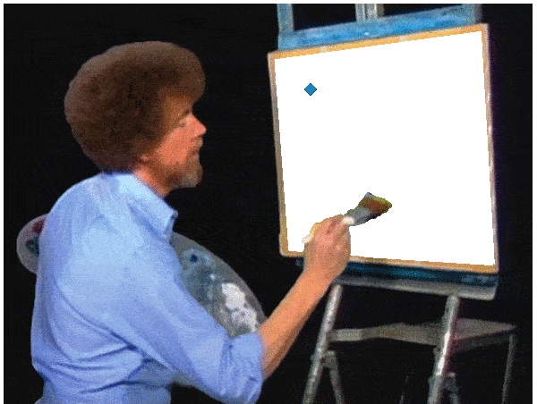

# For-Schleife

## Wie schreibe ich die For-Schleife?

1. Zahlen ausgeben  

For-Schleife, welche die Zahlen von 1 bis 10 ausgibt. Erweitere das Programm so, dass der Benutzer die bisherige Grenze von 10 beliebig anpassen kann.

2. Gerade Zahlen  

For-Schleife, welche die gerade Zahlen von 2 bis 20 ausgibt. Erweitere das Programm so, dass der Benutzer die bisherige Grenze von 20 beliebig anpassen kann.

3. Ungerade Zahlen rückwärts

For-Schleife, welche die ungerade Zahlen von **15 bis 5** ausgibt. Erweitere das Programm so, dass der Benutzer die bisherige Grenze von 15 beliebig anpassen kann.

4. Alphabet

For-Schleife, welche die Buchstaben von A bis Z ausgibt. Erweitere das Programm so, dass der Benutzer die bisherige Grenze von Z beliebig anpassen kann.

5. Quadratzahlen

For-Schleife, welche die Quadratzahlen von 20 bis 100 ausgibt. Erweitere das Programm so, dass der Benutzer die bisherige Grenze von 100 beliebig anpassen kann.

Beispiel: 
```
Quadratzahlen: 5*5=25, 6*6=36, 7*7=49, 8*8=64, 9*9=81, 10*10=100
```

6. Summe der Zahlen - spezielle arithmetische Reihe 

For-Schleife, welche bis 10 die Summe von 1 + 2 + 3 + ... + 10 ausrechnet. Erweitere das Programm so, dass der Benutzer die bisherige Grenze von 10 beliebig anpassen kann.

Optional: Wieso funktioniert hier 10 * (10 + 1) / 2 als Lösungsformel? Siehe hier [Bild]().

7. Harmonische Reihe 

For-Schleife, welche bis 10 die Harmonische Reihe ausrechnen. Diese ist (1 + 1/2 + 1/3 + ... + 1/10). Erweitere das Programm so, dass der Benutzer die bisherige Grenze von 100 beliebig anpassen kann.


8. Fakultät

For-Schleife, welche die Fakultät der Zahl 5 berechnet. Erweitere das Programm so, dass der Benutzer die bisherige Grenze von 5 beliebig anpassen kann.

Beispiel: 
```
Berechne die Fakultät von [gerade zahl]: 5
5! = 5*4*3*2*1 = 120
```

9. Multiplikationstabelle

Erstelle eine Multiplikationstabelle von 1 bis 5. Erweitere das Programm so, dass der Benutzer die bisherige Grenze von 5 beliebig anpassen kann.

Beispiel:
```
Berechne die Multiplikationstabelle von 1 bis [gerade zahl]: 5
    1   2   3   4   5
    ------------------
1 | 1   2   3   4   5
2 | 2   4   6   8   10
3 | 3   6   9   12  15
4 | 4   8   12  16  20
5 | 5   10  15  20  25
```

---

10. Fibonacci-Zahlen

For-Schleife, welche die ersten 10 Fibonacci-Zahlen ausgibt. 
Die ersten beiden Fibonacci-Zahlen sind 0 und 1, und jede weitere Zahl ist die Summe der beiden vorherigen.
Erweitere das Programm so, dass der Benutzer die bisherige Grenze von 10 beliebig anpassen kann.

Genauer:
* Die **0.** Fibonacci-Zahl ist... **``0``**, also **``fib(0) = 0``**.. 
* Die **1.** Fibonacci-Zahl ist... **``1``**, also **``fib(1) = 1``**.. 
* Die **2.** Fibonacci-Zahl ist... die Summe aus der **0.** Fibonacci-Zahl, welche ``0`` ist und der **1.** Fibonacci-Zahl, welche ``1`` ist, also **``fib(2) = 1``**.
* Die **3.** Fibonacci-Zahl ist... die Summe aus der **1.** Fibonacci-Zahl, welche ``1`` ist und der **2.** Fibonacci-Zahl, welche ``1`` ist, also **``fib(2) = 2``**.
* Die **4.** Fibonacci-Zahl ist... die Summe aus der **2.** Fibonacci-Zahl, welche ``1`` ist und der **3.** Fibonacci-Zahl, welche ``2`` ist, also **``fib(2) = 3``**.
* Die **5.** Fibonacci-Zahl ist... die Summe aus der **3.** Fibonacci-Zahl, welche ``2`` ist und der **4.** Fibonacci-Zahl, welche ``3`` ist, also **``fib(2) = 5``**.
* Die **6.** Fibonacci-Zahl ist... die Summe aus der **4.** Fibonacci-Zahl, welche ``3`` ist und der **5.** Fibonacci-Zahl, welche ``5`` ist, also **``fib(2) = 8``**.
* Die **7.** Fibonacci-Zahl ist... die Summe aus der **5.** Fibonacci-Zahl, welche ``5`` ist und der **6.** Fibonacci-Zahl, welche ``8`` ist, also **``fib(2) = 13``**.
* ...
* Die **n.** Fibonacci-Zahl ist... die Summe aus der **n-2.** Fibonacci-Zahl, welche ``fib(n-2)`` ist und der **n-1.**, welche ``fib(n-1)`` ist, also **``fib(n)``**.

Beispiel:
```
Berechne die Ficonacci-Zahlen von 1 bis [gerade zahl]: 7
fib(7) = 0 + 1 + 1 + 2 + 3 + 5 + 8 = 13

Berechne die Ficonacci-Zahlen von 1 bis [gerade zahl]: 10
fib(10) = 0 + 1 + 1 + 2 + 3 + 5 + 8 + 13 + 21 + 34 = 55

Berechne die Ficonacci-Zahlen von 1 bis [gerade zahl]: 15
fib(15) = 0 + 1 + 1 + 2 + 3 + 5 + 8 + 13 + 21 + 34 + 55 + 89 + 144 + 233 + 377 = 610
```

**Optional und für sehr fortgeschrittene:** 
Lese im Internet über Rekursion nach und versuche dieses Problem damit zu lösen. Rekursion ist seltenst relevant für moderne Programmierstile, aber als **Denkansatz** interessant und zeigt was **Methoden** und **Funktionen** können. 
Schlagwörter: Funktion/Methode, Recursion, Tail/Head - Recursion

---

11. Teiler einer Zahl ausgeben

For-Schleife, welche alle Teiler der Zahl ``z = 40`` ausgibt. Eien Zahl ``t`` teilt eine andere Zahl ``z``, wenn ``z/t keinen Rest ergibt``. Erweitere das Programm so, dass der Benutzer die bisherige Grenze von 40 beliebig anpassen kann.

Optional: färbe die Ausgabe rot wenn der User eine Primzahl eingibt. Eine Primzahl ``p`` ist eine Zahl welche nur ``1`` und ``p`` als Teiler hat.

Beispiel:
<pre>
Berechne die Zeiler der Zahl [ganze Zahl]: 40
teiler(40) = 1, 2, 4, 5, 8, 10, 20, 40

Berechne die Zeiler der Zahl [ganze Zahl]: 7
<span style="color:red">teiler(7) = 1, 7</span>
</pre>

12. Potenzen von 2 (erste 10 Werte)

For-Schleife, welche die ersten 10 Potenzen von 2 ausgibt. Erweitere das Programm so, dass der Benutzer die bisherige Grenze von 10 sowie 2 beliebig anpassen kann.

*Hinweis: Mit ``Math.Pow(x,y)``* kann x<sup>y</sup> dargestellt werden (*x* wird die *Basis* genannt und *y* der *Exponent*).

Beispiel:
```
Ich wähle die Basis [ganze Zahl]: 2
... und den Exponenten [ganze Zahl]: 10
pow(2,1)    = 2
pow(2,2)    = 4
pow(2,3)    = 8
pow(2,4)    = 16
pow(2,5)    = 32
pow(2,6)    = 64
pow(2,7)    = 128
pow(2,8)    = 256
pow(2,9)    = 512
pow(2,10)   = 1024

Ich wähle die Basis [ganze Zahl]: 3
... und den Exponenten [ganze Zahl]: 4
pow(3,1) = 3
pow(3,2) = 9
pow(3,3) = 27
pow(3,4) = 81
```

Optional: Füge einen Tabulator ``\t`` ein, falls nicht alle Zahlen in der Ausgabe untereinander stehen können.

---

## Formen ausgeben - Dreieck:
Erstelle die folgenden Formen mit der größe 5. Erweitere das Programm so, dass der Benutzer die bisherige Grenze von 5 beliebig anpassen kann.

<div align="center">
  
</div>

0. 🙂 "Canvas ausmahlen" 

```
🔹🔹🔹🔹🔹
🔹🔹🔹🔹🔹
🔹🔹🔹🔹🔹
🔹🔹🔹🔹🔹
🔹🔹🔹🔹🔹
```
*Hinweis: Versuche die erste Zeile der Form mit System.out.**print**() auszugeben. Wir **wiederholen** also den Befehl System.out.**print**() 5 mal und schreiben am Ende **\n**. Wiederhole nun den vorherigen Code 5 mal um 5 Zeilen der Form zu erstellen.*

1. 🤔 Dreieck
```
❎0️⃣1️⃣2️⃣3️⃣4️⃣
0️⃣⬜🔹🔹🔹🔹
1️⃣⬜⬜🔹🔹🔹
2️⃣⬜⬜⬜🔹🔹
3️⃣⬜⬜⬜⬜🔹
4️⃣⬜⬜⬜⬜⬜
```
*Hinweis: Schreibe dir Zahlen in die Zeilen und Spalten. Was ist die **Bedingung** für die "Trennlinie" der weißen und blauen blöcke?*

2. 🤔 Dreieck über X-Achse "spiegeln"
```
⬜⬜⬜⬜⬜
⬜⬜⬜⬜🔹
⬜⬜⬜🔹🔹
⬜⬜🔹🔹🔹
⬜🔹🔹🔹🔹
```
*Hinweis: Die **erste** Zeile dieses Dreieck ist die **letzte** Zeile des vorherigen Dreiecks. Denke an "zähle mit For von **0 bis 4** vs. von **4 bis 0**".*

3. 😢 Dreieck über y-Achse "spiegeln"
```
⬜⬜⬜⬜⬜
🔹⬜⬜⬜⬜
🔹🔹⬜⬜⬜
🔹🔹🔹⬜⬜
🔹🔹🔹🔹⬜
```
*Hinweis: **Tausche** die blauen und weißen gedanklich aus. Haben wir dieses Muster bereits erstellt?*

4. 😢 Dreieck wieder über X-Achse "spiegeln"
```
🔹🔹🔹🔹⬜
🔹🔹🔹⬜⬜
🔹🔹⬜⬜⬜
🔹⬜⬜⬜⬜
⬜⬜⬜⬜⬜
```
*Hinweis: Die **erste** Zeile dieses Dreieck ist die **letzte** Zeile des vorherigen Dreiecks. Denke an "zähle mit For von **0 bis 4** vs. von **4 bis 0**".*

5. 🙂 Langes Dreieck zusammenbauen
```
⬜🔹🔹🔹🔹
⬜⬜🔹🔹🔹
⬜⬜⬜🔹🔹
⬜⬜⬜⬜🔹
⬜⬜⬜⬜⬜
⬜⬜⬜⬜⬜
⬜⬜⬜⬜🔹
⬜⬜⬜🔹🔹
⬜⬜🔹🔹🔹
⬜🔹🔹🔹🔹
```
*Hinweis: Wir haben den Code für die beiden Einzelteile. Wie muss ich die For schleifen schreiben damit diese untereinander ausgegeben werden?*


6. 🤔 Langes Dreieck spitz zusammenbauen
```
⬜🔹🔹🔹🔹
⬜⬜🔹🔹🔹
⬜⬜⬜🔹🔹
⬜⬜⬜⬜🔹
⬜⬜⬜⬜⬜
⬜⬜⬜⬜🔹
⬜⬜⬜🔹🔹
⬜⬜🔹🔹🔹
⬜🔹🔹🔹🔹
```
*Hinweis: Wie steuern wir die Anzahl der Zeilen des unteren Dreiecks?*

7. 💀 Diamant aus Dreiecken bauen
```
🔹🔹🔹🔹⬜⬜🔹🔹🔹🔹
🔹🔹🔹⬜⬜⬜⬜🔹🔹🔹
🔹🔹⬜⬜⬜⬜⬜⬜🔹🔹
🔹⬜⬜⬜⬜⬜⬜⬜⬜🔹
⬜⬜⬜⬜⬜⬜⬜⬜⬜⬜
⬜⬜⬜⬜⬜⬜⬜⬜⬜⬜
🔹⬜⬜⬜⬜⬜⬜⬜⬜🔹
🔹🔹⬜⬜⬜⬜⬜⬜🔹🔹
🔹🔹🔹⬜⬜⬜⬜🔹🔹🔹
🔹🔹🔹🔹⬜⬜🔹🔹🔹🔹
```
*Hinweis: Wie schaffe ich es in der ersten Zeile einmal den Code für das linke Dreick und danach in der gleichen Zeile den Code für das andere Dreieck aufzurufen?*

8. 💀 Diamant spitz aus Dreiecken bauen
```
🔹🔹🔹🔹⬜🔹🔹🔹🔹
🔹🔹🔹⬜⬜⬜🔹🔹🔹
🔹🔹⬜⬜⬜⬜⬜🔹🔹
🔹⬜⬜⬜⬜⬜⬜⬜🔹
⬜⬜⬜⬜⬜⬜⬜⬜⬜
🔹⬜⬜⬜⬜⬜⬜⬜🔹
🔹🔹⬜⬜⬜⬜⬜🔹🔹
🔹🔹🔹⬜⬜⬜🔹🔹🔹
🔹🔹🔹🔹⬜🔹🔹🔹🔹
```

---

9. 💀☠️💀 Diamant spitz aus Dreiecken bauen - ohne vorherigen Code zu kopieren

Wir können den Code stark verkürzen wenn wir uns den **Abstand** der aktuellen Spalte ``int abstandZurMitteSpalte = Math.abs(groesseSpielfeld - 1 - spalte);`` und Zeile den Diagonalen ausrechnen ``int abstandZurMitteZeile = Math.abs(groesseSpielfeld - 1 - zeile);``. Hier ist ``zeile`` der Zählindex der äußeren Schleife, ``spalte`` der Zählindex der inneren Schleife und ``Math.abs()`` der absolute Wert einer Zahl (heißt Vorzeichen weg). Siehe Bild unten. Dieser **Abstand** von z.B. dem **<span style="color:green">grünen</span>** Viereck zu den **<span style="color:red">roten</span>** Diagonalen ist jeweils 2. Es ist auch der **Abstand** des **<span style="color:violet">violetten</span>** Vierecks 2. Wenn wir diese Abstände ausrechnen können, schaffen wir eine ähnliche **Bedingung** wie ``zeile >= spalte`` für die "Trennlinie" der Dreiecke zu finden?

* Überlege nun für die **<span style="color:orange">orangen</span>** Vierecke was ist der summierte Abstand von ``abstandZurMitteSpalte + abstandZurMitteZeile`` zu der **<span style="color:red">roten</span>** Diagonale?* Dieser ist hier immer 4.
* Wie rechne ich jedoch aus dass **4** so eine spezielle zahl hier ist? Es scheint die ``groesseSpielfeld - 1`` zu sein.
* Was ist nun die Bedingung dass wir **auf** dieser **<span style="color:orange">orangen</span>** linie sind? 
* Was ist nun die Bedingung dass wir **innerhalb** dieser **<span style="color:orange">orangen</span>** linie sind? 
* Was ist nun die Bedingung dass wir **innerhalb** udn **auf** dieser **<span style="color:orange">orangen</span>** linie sind?
```
🔹🔹🔹🔹🟥🔹🔹🔹🔹
🔹🔹🔹🟨🟥🟨🔹🔹🔹
🔹🔹🟨⬜🟥⬜🟩🔹🔹
🔹🟨⬜⬜🟥⬜⬜🟨🔹
🟥🟥🟥🟥🟥🟥🟥🟥🟥
🔹🟨⬜⬜🟥⬜⬜🟨🔹
🔹🔹🟪⬜🟥⬜🟨🔹🔹
🔹🔹🔹🟨🟥🟨🔹🔹🔹
🔹🔹🔹🔹🟥🔹🔹🔹🔹
```

**Anmerkung:** Wir werden in L12 nochmals diese Form uns anschauen, denn wir können allgmein durch Spiegeln und zusammenfügen von Dreiecken diese Formen erzeugen. Warum schreiben wir nicht einen allgemeinen Code der uns einfach spiegeln lässt und einen der uns zusammenfügen lässt? Wir brauchen dazu noch ``Arrays`` und ``Funktionen`` als Werkzeug.

---

## Formen mit Zahlen - ausgefüllt:
```
1
12
123
1234
12345
```
Erweitere das Programm so, dass der Benutzer die bisherige Grenze von 5 beliebig anpassen kann.

## Formen mit Zahlen - nur am Rand:
```
5
-4
--3
---2
----1
```
Erweitere das Programm so, dass der Benutzer die bisherige Grenze von 5 beliebig anpassen kann.

## Formen mit Zahlen - Diagonale bis zur mitte Zählen
```
5----
-4---
--3--
---4-
----5
```
Erweitere das Programm so, dass der Benutzer die bisherige Grenze von 5 beliebig anpassen kann.

## Formen mit Zahlen - Beide Diagonalen bis zur mitte Zählen
```
5---1
-4-2-
--3--
-2-4-
1---5
```
Erweitere das Programm so, dass der Benutzer die bisherige Grenze von 5 beliebig anpassen kann.

## Formen mit Zahlen - Kreuz bis zur mitte Zählen
```
--5--
--4--
12321
--4--
--5--
```

Erweitere das Programm so, dass der Benutzer die bisherige Grenze von 5 beliebig anpassen kann.

## Formen mit Zahlen - Ziffernquadrat
```
0 1 2 3 4 5 6 7 8 9
1                 8
2                 7
3                 6
4                 5
5                 4
6                 3
7                 2
8                 1
9 8 7 6 5 4 3 2 1 0
```
Erweitere das Programm so, dass der Benutzer die bisherige Grenze von 10 beliebig anpassen kann.

*Hinmweis:* Die "Leere" inder Mitte sind Leerzeichen.

## Matrix
Schreiben Sie ein Programm, das die Zahlen 0 bis 99 in einer 10x10 Matrix ausgibt. Erweitere das Programm so, dass der Benutzer die bisherige Grenze von 10 beliebig anpassen kann.

Beispiel:
```
 0  1    2   3   4   5   6   7   8   9 
10  11  12  13  14  15  16  17  18  19
20  21  22  23  24  25  26  27  28  29
30  31  32  33  34  35  36  37  38  39
40  41  42  43  44  45  46  47  48  49
50  51  52  53  54  55  56  57  58  59
60  61  62  63  64  65  66  67  68  69
70  71  72  73  74  75  76  77  78  79
80  81  82  83  84  85  86  87  88  89
90  91  92  93  94  95  96  97  98  99
```
Verwenden Sie `%2d` zur Formatierung der Zahlen.

## Die halbe Matrix
Schreiben Sie ein Programm, das die Zahlen 0 bis *15 = (5 * (5 + 1)) / 2* in einer 5x5 Matrix ausgibt. Erweitere das Programm so, dass der Benutzer die bisherige Grenze von 5 beliebig anpassen kann.

Beispiel:
```
.  .  .  .  1
.  .  .  2  3
.  .  4  5  6
.  7  8  9  10
11 12 13 14 15
```

---

# For und While Schleife gemischt

## Pakete einlagern
Erstellen Sie einen String mit dem Inhalt ``"📦📦📦📦📦"``. Es sollen nun nach Benutzereingaben in leere Pakete Produkte eingelagert und entnommen werden können. Die Identifikation passiert über eine **Paketnummer**. Der String hat 5 leere Plätze mit den Indizes ``0, 1, 2, 3, 4``. (📦 bedeutet, dass der Platz leer ist.)
* Legen Sie den ``String storage`` mit ``"📦📦📦📦📦"`` an.
* Fragen Sie den Benutzer, welche Aktion er ausführen möchte. Geben Sie hierzu folgende Optionen:
    * einlagern, auslagern, beenden

* Nach der Wahl der Option, soll die **Paketnummer** angegeben werden. Es soll dieser **Paketnummer** eines einer der 10 verschiedene **Produkte** (``{0:"🌂", 1:"🧯", 2:"🧺", 3:"🧹", 4:"🪒", 5:"🧼", 6:"🪞", 7:"🚽", 8:"🪠", 9:"💍"}``) zugewisen werden. Die Zahlen in der Auflistung sind die **Produktnummern**. Diese ändern sich nicht.
* Überschreiben den nächsten freien Platz mit dem Produkte anhand folgender Logik:
    * einlagern: das erste 📦 wird durch die **Paketnummer** identifiziert und der user wird gefragt welches Produkt er will. Dazu gibt dieser die **Produktnummer** an. Gibt es keinen freien Platz mehr, so wird eine Meldung ausgegeben.
    * auslagern: das Produkt welches über die Produktnummer identifiziert wird, wird durch 📦 ersetzt.
    * beenden: beendet das Programm.
    
* Geben Sie in jedem Schleifendurchlauf die Variable storage aus.

Erweitere das Programm so, dass der Benutzer die bisherige Grenze von 5 beliebig anpassen kann.

*Hinweis: Lege folgenden String an ``String produkte = "🌂🧯🧺🧹🪒🧼🪞🚽🪠💍"`` und lass die Benutzer die Position des Strings eingeben. Nehen wir an die Postion ist 4, wir schreiben ``int wahlDesUsersAlsUnicode = produkte.codePointAt(4)`` um den Unicode davon zu bekommen. Dieser ist im Dezimalsystem. Wir können mit``String produkt = new String(Character.toChars(wahlDesUsersAlsUnicode))`` einen String machen welchen wir direkt verwenden können.*.

**Frage:** Warum funktioniert hier nicht ``produkte.charAt(4)``? (Siehe [L02](../../L02VariablenErstellen/skripten/L02VariablenErstellen.md)) 
* Was gibt von charAt() für einen Typ zurück? 
* Wie viele Bits bzw. Hex-Bits hat ein Character zur Verfügung?
* Was ist der Unicode von 🌂 ``int unicode = produkte.codePointAt(0)`` ?
* Wandle diese Zahl in eine Hexadezimalzahl um. (``String hexNumber = Integer.toHexString(unicode))``) 
* Wie viele ist Hex-Bits hat ``hexNumber``? 

Beispiel:
```
Willkommen: Wie groß ist das Lager [ganze Zahl]? 5 
Wählen Sie eine Aktion (einlagern, auslagern, beenden): einlagern 
Geben Sie die Paketnummer sowie Produktnummer an [Paketnummer Produktnummer]: 2425 2 
🧯📦📦📦📦 
 
Wählen Sie eine Aktion (einlagern, auslagern, beenden): einlagern 
Geben Sie die Paketnummer sowie Produktnummer an [Paketnummer Produktnummer]: 6472115482 6 
🧯🧼📦📦📦 
 
Wählen Sie eine Aktion (einlagern, auslagern, beenden): einlagern 
Geben Sie die Paketnummer sowie Produktnummer an [Paketnummer Produktnummer]: 1 6 
🧯🧼💍📦📦 
 
Wählen Sie eine Aktion (einlagern, auslagern, beenden): auslagern 
Geben Sie die Paketnummer ein: 2425
📦🧼💍📦📦 
 
Wählen Sie eine Aktion (einlagern, auslagern, beenden): einlagern 
Geben Sie die Paketnummer sowie Produktnummer an [Paketnummer Produktnummer]: 1 8 
Paketnummer bereits vergeben!
📦🧼💍📦📦

Wählen Sie eine Aktion (einlagern, auslagern, beenden): einlagern 
Geben Sie die Paketnummer sowie Produktnummer an [Paketnummer Produktnummer]: 13884 8 
🪠🧼💍📦📦 

Wählen Sie eine Aktion (einlagern, auslagern, beenden): einlagern 
Geben Sie die Paketnummer sowie Produktnummer an [Paketnummer Produktnummer]: 1388451 8 
🪠🧼💍🪠📦 

Wählen Sie eine Aktion (einlagern, auslagern, beenden): einlagern 
Geben Sie die Paketnummer sowie Produktnummer an [Paketnummer Produktnummer]: 16 8 
🪠🧼💍🪠🪠

Wählen Sie eine Aktion (einlagern, auslagern, beenden): einlagern 
Geben Sie die Paketnummer sowie Produktnummer an [Paketnummer Produktnummer]: 999 8 
Lager ist Voll. Wir melden uns wenn dieses frei ist.
🪠🧼💍🪠🪠
```
 
Passwort Generator
Schreiben Sie ein Programm, zufällige Passwörter generiert.
. Fragen Sie hierzu den Benutzer folgende Fragen:
Soll das Passwort Großbuchstaben beinhalten?
Soll das Passwort Ziffern beinhalten?
Soll das Passwort Sonderzeichen beinhalten?
Wie lang soll das Passwort sein?
. Fragen Sie den Benutzer wie viele Passwörter generiert werden sollen
. Überlegen Sie sich einen passenden Algorithmus um die eingegebene Anzahl an Passwörter zu
generieren.
. Geben Sie die Passwörter aus.
Hangman
Entwickeln Sie das Spiel "Hangman" in Java. Das Spiel sollte folgende Funktionen haben:
. Fragen Sie den Benutzer nach einen Wort mit 3 Buchstaben. Die Zahl 3 soll in der Konstante Länge
gespeichert werden und somit einfach veränderbar sein.
. Ist das Wort zu lang oder leer, soll eine Fehlermeldung ausgegeben werden und erneut angefragt
werden.
. Anzeige des Status des Wortes, das der Spieler erraten muss (zum Beispiel als Striche (_), die die
Buchstaben repräsentieren).
. Eine Schleife, die dem Spieler erlaubt, Buchstaben zu raten, bis das Wort vollständig erraten oder der
Galgenmann "vollständig gehängt" ist. (Groß-/Kleinschreibung soll egal sein)
. Begrenzung der Anzahl der Fehlversuche des Spielers (zum Beispiel sechs Fehlversuche, bevor das
Spiel endet).
. Überprüfung der Eingaben des Spielers und Aktualisierung des Spielstands entsprechend der
geratenen Buchstaben.
. Anzeige des Gewinns oder Verlusts des Spiels nach dem Ende der Spielrunde.
Nach jeder Runde soll ein Galgenmann angezeigt werden:
08_forloop.md 2023-12-10
4 / 5
1 Fehler:
    ____ 
   |    | 
   |     
   |     
   |    
  _|___  
2 Fehler:
    ____ 
   |    | 
   |    O 
   |     
   |    
  _|___  
 
3 Fehler:
    ____ 
   |    | 
   |    O 
   |   /|  
   |    
  _|___  
 
4 Fehler:
    ____ 
   |    | 
   |    O 
   |   /|\ 
   |     
  _|___  
 
5 Fehler:
    ____ 
   |    | 
   |    O 
08_forloop.md 2023-12-10
5 / 5
   |   /|\  
   |   /  
  _|___  
 
6 Fehler:
    ____ 
   |    | 
   |    O 
   |   /|\  
   |   / \ 
  _|___  
 
Beispielwörter mit 3 Buchstaben: Bau, Hut, Arm, Tag, Eis, Zoo, See
Beispielwörter mit 4 Buchstaben: Haus, Bahn, Tier, Buch, Fest

## Hangman (Erweiterte Version)

### Grundfunktionen

- Eingabe eines Wortes mit fester Länge (z.B. 3 Buchstaben, in Konstante `LÄNGE` gespeichert)
- Wort darf nicht leer oder zu lang sein
- Anzeige des erratenen Status (z.B. `_ _ _`)
- Schleife: Buchstabenraten bis Wort erraten oder max. Fehlversuche (z.B. 6)
- Groß-/Kleinschreibung egal
- Anzeige von Gewinn oder Verlust

### Grafische Ausgabe

Beispiel: Galgenmann mit 6 Fehlerstufen

### Neue grafische Varianten:

#### 1. Shark Fin - "Bring the shark fin nearer"

- Grafik zeigt eine Hai-Flosse, die bei jedem Fehler näher kommt
- Beispiel:
```
Fehler 1:         ~~~~~~~
Fehler 2:       ~~~~~~~
Fehler 3:     ~~~~~~~
Fehler 4:   ~~~~~~~
Fehler 5: ~~~~~~~
Fehler 6: JAWS!!!
```

#### 2. Disappearing Sunday Ice Cream

- Eis mit Kugeln (O O O) verschwindet mit jedem Fehler
- Beispiel:
```
Fehler 0:  (O O O)
Fehler 1:  (O O)
Fehler 2:  (O)
Fehler 3:  ()
Fehler 4:  
Fehler 5:  (geschmolzen)
Fehler 6:  (Trauriges Gesicht)
```

Beispielwörter: Bau, Hut, Arm, Tag, Eis, Zoo, See  
Alternative mit 4 Buchstaben: Haus, Bahn, Tier, Buch, Fest

