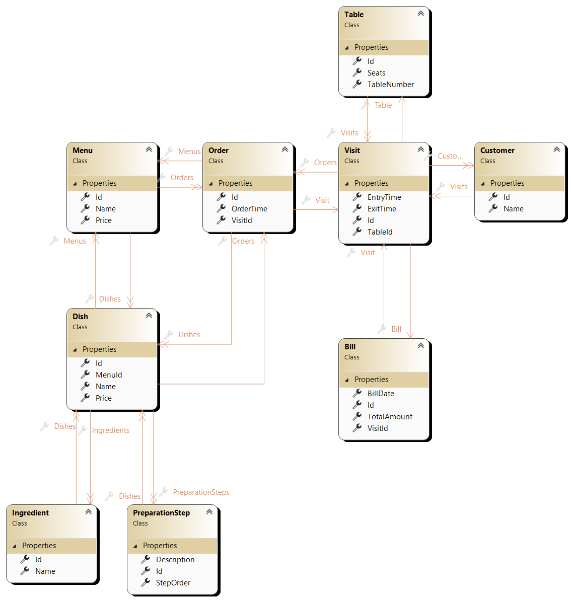
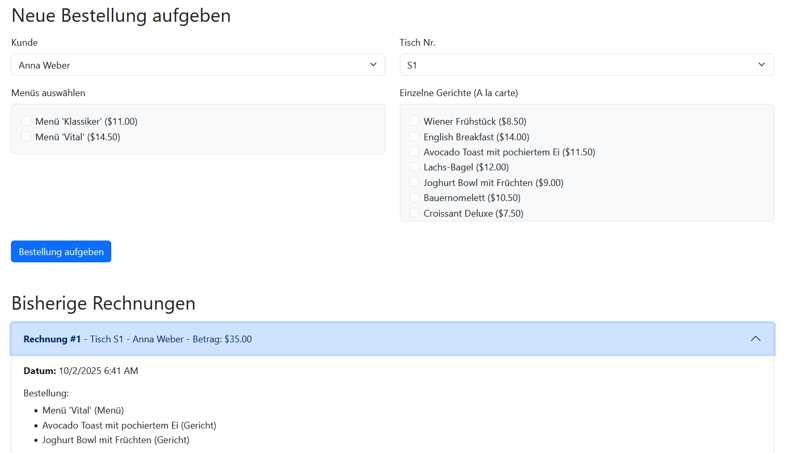

# Angabe: Frühstücksrestaurant Webanwendung - Minimal API als erster Kontakt

**Hinweis zur Anwendungs-Struktur**: In diesem Projekt wird bewusst die gesamte Anwendungslogik in einer einzigen Datei (`Program.cs`) implementiert. Dieser Ansatz, der bei **Minimal APIs** häufig für kleine Dienste verwendet wird, ermöglicht es, die Grundlagen von Web-Requests und -Responses zu verstehen, ohne die zusätzliche Komplexität einer größeren Ordnerstruktur, ``Frameworks`` wie *ASP.NET* mit *MVC* für die ``Webprogrammierung`` und *EF-Core* für die Anbindugn der ``Datenbanken``.

## Übersicht

Dieses Projekt ist eine Webanwendung, die auf dem **ASP.NET Core Minimal API**-Framework basiert und die Funktionalität eines einfachen Bestellsystems für ein Frühstücksrestaurant abbildet. Die Anwendung ermöglicht es, über eine Weboberfläche Bestellungen für verschiedene Tische aufzugeben und eine laufend aktualisierte Liste aller bisherigen Rechnungen einzusehen.

## Anforderungen

* **ASP.NET Core Minimal APIs**: Die gesamte Anwendung wird in der `Program.cs` mithilfe von Endpunkten (`app.MapGet`, `app.MapPost`) aufgebaut.
* **In-Memory "Datenbank"**: Die ``Entities`` (Rechnungen, Menüs etc.) werden **nicht** in einer Datenbank, sondern direkt im Arbeitsspeicher der Anwendung gehalten. Wir verwenden dazu eine ``statische`` ``Klasse`` *RestaurantDbContext*, um eine Datenbank zu simulieren. **Für diese Übung ist das ``Repository`` *RestaurantDbContext* bereits implementiert und in der [Vorlage](#vorlage-programcs) ersichtlich. Es soll nur im *Program.cs* File gearbeitet werden, d.h. auch alle ``Entities`` dort angelegt werden.**
* **Asynchrone Endpunkte**: Alle Operationen, die potenziell blockieren könnten (obwohl wir hier keine echten I/O-Operationen haben), werden als **async** deklariert, um Best Practices zu folgen.
* **Dynamische HTML-Generierung**: Die HTML-Oberfläche wird nicht mit Razor-Dateien, sondern dynamisch zur Laufzeit mit einem **`StringBuilder`** erstellt. So verstehen wir, dass ein Webserver im Kern nur einen Text (HTML) an den Browser zurücksendet.

## Architektur der Anwendung

### Übersicht der Dateien

Die gesamte Logik befinden sich in einer Datei ``Program.cs``. Die aus Programmieren und Datenbanken bekannten ``Entities`` und ``Repositories`` legen wir auch innerhalb dieser Klasse an. **Für diese Übung ist das ``Repository`` *RestaurantDbContext* bereits implementiert und in der [Vorlage](#vorlage-programcs) ersichtlich. Es soll nur im *Program.cs* File gearbeitet werden, d.h. auch alle ``Entities`` dort angelegt werden.**
```
|-- Program.cs
```

### 1. In-Memory
Verwende die Vorlage für die Datei ``Programs.cs`` welcher [hier](#vorlage-programcs) zu finden ist. Das folgende ``UML-Kalssendiagramm`` zeigt an wie die ``Entities`` miteinander verbunden sind. Dies erinnert stark an ein ``ER-Diagramm`` aus dem Datenbankkurs.


**Anmerkung:** Wir gehen hier von einem *Katalog* (Klasse) von *Ingredients*, *Dishes*, *Menus*, etc. aus. Also alles was unterhalb von der ""Entity"" *Order* steht. Wir tracken (noch) nicht einzelne *Ingredients* wie in einem Warenwirtschaftssystem. Der Unterschied ist also

| id (PK) | zutat |
|:--- |:---|
| 1 | lauch |
| 2 | zwiebel|
| 3 | salz |
* **Jedes** Gericht verwendet die Zutat *lauch* mit id 2.

vs.

| id (PK) | zutat | lieferung |
|:--- |:--- |:---|
| 1 | lauch | 10.03.2017 |
| 2 | lauch | 10.03.2017 |
| 3 | lauch | 11.03.2017 |
* **Ein** Gericht verwendte die Zutat *lauch* mit id 1, ein anderes Gericht verwendet diese nicht mehr, da sie "gegessen" wurde. Es kann nun die der *lauch* mit id 2 verwendet werden.
* Die Tabelle verstößt gegen die "3." Normalform, jedoch kompakter für die Darstellung des Unterschieds.

* **In-Memory "Datenbank"**: Wir erstellen eine statische Klasse, die als unsere In-Memory-Datenbank dient. Diese Klasse enthält `List<T>`-Eigenschaften für jede Entität und eine Methode *Initialize*, um die Anwendung mit initialen Testdaten zu befüllen.

### 2. Endpunkte (`Program.cs`)
Die `Program.cs` ist der zentrale Einstiegspunkt und enthält die Logik zur Verarbeitung von Benutzeranfragen. Wir definieren zwei zentrale **Endpunkte**:

* #### `GET /Restaurant/Index`
    * **Funktion**: Dies ist der Haupt-Endpunkt, der die Startseite der Anwendung mit dem Bestellformular und der Rechnungsliste generiert und zurückgibt.
    * **Ablauf**:
        1.  Der Endpunkt wird mit `app.MapGet("/", ...)` deklariert.
        2.  Innerhalb der Lambda-Funktion des Endpunkts werden alle benötigten Daten (Bills, Customers, Tables, Menus, Dishes) aus der In-Memory-Datenbank geladen.
        3.  Ein `StringBuilder`-Objekt wird verwendet, um den gesamten HTML-Code für die Webseite zu erstellen.
        4.  Die Daten werden in Schleifen durchlaufen, um dynamisch HTML-Elemente zu generieren (z.B. `<option>`-Tags für die Dropdowns oder `<li>`-Tags für die Rechnungsliste).
        5.  Der fertige HTML-String aus dem `StringBuilder` wird als `ContentResult` mit dem `Content-Type` "text/html" an den Browser gesendet.

* #### `POST /Restaurant/Index`
    * **Funktion**: Dieser Endpunkt verarbeitet die Formulardaten, die beim Aufgeben einer neuen Bestellung gesendet werden.
    * **Ablauf (asynchron)**:
        1.  Der Endpunkt wird mit `app.MapPost("/", ...)` deklariert. Er nimmt den `HttpContext` als Parameter entgegen, um auf die Formulardaten zugreifen zu können.
        2.  Aus dem `HttpContext.Request.Form` werden die übermittelten IDs für Kunde, Tisch, Menüs und Gerichte ausgelesen.
        3.  Die Logik zur Erstellung der Bestellung wird direkt hier implementiert:
            * Finde den gewählten Kunden, Tisch, die Menüs und Gerichte in dem *Dictionary*.
            * Erstelle einen neuen *Visit* und füge ihn dem *Dictionary* hinzu.
            * Erstelle eine neue *Order* und füge sie der *Dictionary* hinzu.
            * Berechne die Summe der bestellten *Menüs* und *Dishes*.
            * Erstelle eine neue *Bill* und füge sie dem *Dictionary* hinzu.
        4. Verwende ``Results.Redirect("/Restaurant/Index");`` um *quasi* einen GET-Request auf */Restaurant/Index* zu erstellen. Das lässt erlaubt uns die ursprüngliche Seite zu sehen, jedoch mit den neu angegebenen Daten.

### 3. HTML-Generierung mit `StringBuilder`

Die Benutzeroberfläche wird direkt im C#-Code als String generiert.

* **Bestellformular**:
    * Das `<form>`-Tag wird so erstellt, dass es seine Daten per `POST`-Methode an unseren `/bestellen`-Endpunkt sendet.
    * Wir erstellen manuell:
        * zwei `<select>`-Elemente für Kunden und Tische. Die `<option>`-Tags darin werden dynamisch aus unseren Daten generiert.
        * Checkboxen (`<input type="checkbox">`) für jedes verfügbare Menü und Gericht.
        * Einen Sende-Button (`<button type="submit">`).
    * Der Code zur Generierung des Formulars könnte so aussehen (Beispiel für Kunden-Dropdown):

    ```csharp
    sb.AppendLine("<form action="/bestellen" method="post">");
    // ...
    sb.AppendLine("<label for="customerId">Kunde</label>");
    sb.AppendLine("<select name="customerId" class="form-select">");
    foreach (var customer in allCustomers)
    {
        sb.AppendLine($"<option value="{customer.Id}">{customer.Name}</option>");
    }
    sb.AppendLine("</select>");
    // ...
    sb.AppendLine("<button type="submit">Bestellung aufgeben</button>");
    sb.AppendLine("</form>");
    ```

* **Rechnungsübersicht**:
    * Die Liste der Rechnungen wird in einer Schleife durchlaufen und als HTML-Struktur (z.B. eine Liste oder aufklappbare Elemente) dargestellt.
    * Wenn keine Rechnungen vorhanden sind, wird eine entsprechende Meldung ausgegeben.
    * Beispiel für die Schleife:

    ```csharp
    if (allBills.Any())
    {
        foreach (var bill in allBills)
        {
            // ... HTML-Code für eine einzelne Rechnung generieren ...
            sb.AppendLine($"<li>Rechnung #{bill.Id} - Betrag: {bill.TotalAmount:C}</li>");
        }
    }
    else
    {
        sb.AppendLine("<p>Noch keine Rechnungen vorhanden.</p>");
    }
    ```

* **Übersicht UserInterface**:
    

## Starten der Anwendung

1.  **Anwendung ausführen**:
    Da wir keine Datenbank verwenden, sind keine Migrationsschritte notwendig.
    Öffne ein Terminal im Projektverzeichnis und führe den Befehl aus:

    ```bash
    dotnet run
    ```

Öffnen Sie anschließend einen Webbrowser und navigieren Sie zu der im Terminal angezeigten URL (z.B. `http://localhost:5000`).

## Vorlage Program.cs

```csharp
using Microsoft.AspNetCore.Mvc;
using System.Globalization;
using System.Text;

var builder = WebApplication.CreateBuilder(args);
var app = builder.Build();

// Initialisiert unserer Dictionary mit Testdaten beim Start.
RestaurantDbContext.Initialize();

// http-methode: GET mit Ressource /Restaurant/Index
// Generiert und liefert die Haupt-HTML-Seite mit dem Formular und der Rechnungsliste.
app.MapGet(
    "/Restaurant/Index", 
    () =>
    {
        // Wir übergeben der View, Models.
        var view = View(
            title: "Restaurant - das ist eine Zusatzinfo welche nicht in ein Modle passt...",
            RestaurantDbContext.Customers,
            RestaurantDbContext.Menus,
            RestaurantDbContext.Tables,
            RestaurantDbContext.Dishes,
            RestaurantDbContext.Bills
        );

        return Results.Content(view, "text/html", Encoding.UTF8);
    }
);


// POST /Restaurant/Index
// Verarbeitet die Formulardaten und erstellt eine neue Bestellung.
app.MapPost(
    "/Restaurant/Index",
    async (HttpContext context) =>
    {
        // Wir schauen uns den request body des http-post an.
        var form = await context.Request.ReadFormAsync();

        // Formulardaten auslesen
        int.TryParse(form["customerId"], out var customerId);
        int.TryParse(form["tableId"], out var tableId);
        var selectedMenuIds = form["selectedMenuIds"].Select(int.Parse).ToList();
        var selectedDishIds = form["selectedDishIds"].Select(int.Parse).ToList();
        
        // Daten aus dem dbContext holen
        // TODO
        
        // Neue Entitäten erstellen
        // TODO

        // Neue Entitäten in der In-Memory-dbContext "speichern"
        // TODO

        return Results.Redirect("/Restaurant/Index");
    }
).DisableAntiforgery();

// Baue das dynamische html-file, wir nennen es View.
// Wir werden es aber nie wieder so machen. Es ist nur einfacher die Idee zu kommunizieren.
// Diese Arbeit wird in Zukunft von Frameworks wie ASP.NETs MVC übernommen.
// Es wird absichtlich hier die Listen übergeben und nicht direkt der statische RestaurantDbContext aufgefuren.
// Wir werden es in MVC ASP.NET nämlich auch so machen.
// Hier kommen die Models rein die wir verwenden (und später die ViewModels).
string View(
    string title,
    List<Customer> customers,
    List<Menu> menus,
    List<Table> tables,
    List<Dish> dishes,
    List<Bill> bills
)
{
    var sb = new StringBuilder();
    var deCulture = new CultureInfo("de-DE");

    // HTML-Header
    sb.AppendLine("<!DOCTYPE html>");
    sb.AppendLine("<html lang=\"de\">");
    sb.AppendLine("<head>");
    sb.AppendLine("    <meta charset=\"utf-8\">");
    sb.AppendLine("    <meta name=\"viewport\" content=\"width=device-width, initial-scale=1.0\">");
    sb.AppendLine($"    <title>{title}</title>");
    sb.AppendLine("    <link href=\"https://cdn.jsdelivr.net/npm/bootstrap@5.3.2/dist/css/bootstrap.min.css\" rel=\"stylesheet\">");
    sb.AppendLine("</head>");
    sb.AppendLine("<body>");
    sb.AppendLine("<div class=\"container mt-5\">");
    sb.AppendLine($"    <h1 class=\"mb-4\">{title}</h1>");

    // Bestellformular-Sektion
    // TODO

    // -- Dropdowns für Kunden und Tische --
    // TODO
    
    // mache das html-dynamisch, heißt wir haben hier Code, welcher unser html so baut wie es in unserer Datenbank ist.
    foreach (var customer in customers)
    {
        sb.AppendLine($"                        <option value=\"{customer.Id}\">{customer.Name}</option>");
    }
    // TODO

    // -- Checkbox-Listen für Menüs und Gerichte --
    // TODO

    // Rechnungsübersicht-Sektion
    // TODO

    // -- Akkordeon (Button was auf- und zuklappbar ist) für Rechnungen --
    // TODO

    // HTML-Footer
    sb.AppendLine("</div>");
    sb.AppendLine("<script src=\"https://cdn.jsdelivr.net/npm/bootstrap@5.3.2/dist/js/bootstrap.bundle.min.js\"></script>");
    sb.AppendLine("</body>");
    sb.AppendLine("</html>");

    return sb.ToString();
}


app.Run();

// ############################### DbContext (ist die Schnittstelle zur "Datenbakn") ###############################
// In Programmieren nannten wir es ein Unit of Work Pattern von vielen Repositories.
// Wir hatten je Entitiy (Customer, Ingredient, ...) ein Repository. Hier ist es nun eine Zusammenfassung von Repositories.
// Hier wird kein echtes Unit of Work Pattern implementiert - Aufrufe mehrerer Repositoreis mit Transaktionen versehen -> commit und rollback ist möglich.
// Es ist einfach eine Klasse mit Listen.
// In Zukunft verwenden wir hier EF-Core -> was aus Programmieren zumindest vom Namen her bekannt sein sollte.
public static class RestaurantDbContext
{
    public static List<Customer> Customers { get; private set; } = new();
    public static List<Ingredient> Ingredients { get; private set; } = new();
    public static List<PreparationStep> PreparationSteps { get; private set; } = new();
    public static List<Table> Tables { get; private set; } = new();
    public static List<Dish> Dishes { get; private set; } = new();
    public static List<Menu> Menus { get; private set; } = new();
    public static List<Visit> Visits { get; private set; } = new();
    public static List<Order> Orders { get; private set; } = new();
    public static List<Bill> Bills { get; private set; } = new();

    // kurze Schreibweise für einen Aufruf der Methode Seed in der Methode Initialze.
    // Könnte auch direkt der Code con Seed hier in Initialize stehen.
    // Es passiert oft mehr als nur Seed in dem Initialize. Deshalb hier die Unterscheidung.
    // Ist aber ein unnötiges Detail.
    public static void Initialize() => Seed();

    // Hilfsmethode zur Vergabe fortlaufender IDs
    // Verwendet noch nicht bekannte Syntax und Generizität.
    // Ist nicht Testrelevant, jedoch für besonders interessierte hier der Code.
    public static int GetNextId(string nameOfEntity)
    {
        return nameOfEntity switch
        {
            "Customers" => CalculateNextId(Customers),
            "Bills" => CalculateNextId(Bills),
            "Dishes" => CalculateNextId(Dishes),
            "Ingredients" => CalculateNextId(Ingredients),
            "Menus" => CalculateNextId(Menus),
            "Orders" => CalculateNextId(Orders),
            "PreparationSteps" => CalculateNextId(PreparationSteps),
            "Tables" => CalculateNextId(Tables),
            "Visits" => CalculateNextId(Visits),

            // default case:
            _ => throw new ArgumentException($"Der Schlüssel '{nameOfEntity}' ist keine valide Entität.", nameof(nameOfEntity))
        };
    }

    private static int CalculateNextId<T>(IEnumerable<T> collection) where T : IEntity
    {
        var maxId = collection.Select(item => item.Id).DefaultIfEmpty(0).Max();
        return maxId + 1;
    }

    // Befüllt die Datenbank mit den Daten aus der SeedData-Vorlage
    private static void Seed()
    {
        // -- Customers --
        Customers.AddRange(new Customer[]
        {
            new Customer { Id = 1, Name = "Anna Weber" },
            new Customer { Id = 2, Name = "Markus Huber" }
        });

        // -- Ingredients --
        var ingredientList = new List<Ingredient>
        {
            new Ingredient { Id = 1, Name = "Salz" }, new Ingredient { Id = 2, Name = "Pfeffer" }, new Ingredient { Id = 3, Name = "Olivenöl" },
            new Ingredient { Id = 4, Name = "Butter" }, new Ingredient { Id = 5, Name = "Ei" }, new Ingredient { Id = 6, Name = "Milch" },
            new Ingredient { Id = 7, Name = "Mehl" }, new Ingredient { Id = 8, Name = "Zucker" }, new Ingredient { Id = 9, Name = "Brot" },
            new Ingredient { Id = 10, Name = "Semmel" }, new Ingredient { Id = 11, Name = "Toast" }, new Ingredient { Id = 12, Name = "Croissant" },
            new Ingredient { Id = 13, Name = "Bagel" }, new Ingredient { Id = 14, Name = "Schinken" }, new Ingredient { Id = 15, Name = "Speck (Bacon)" },
            new Ingredient { Id = 16, Name = "Wurst (Sausage)" }, new Ingredient { Id = 17, Name = "Käse (Gouda)" }, new Ingredient { Id = 18, Name = "Frischkäse" },
            new Ingredient { Id = 19, Name = "Mozzarella" }, new Ingredient { Id = 20, Name = "Feta" }, new Ingredient { Id = 21, Name = "Räucherlachs" },
            new Ingredient { Id = 22, Name = "Tomate" }, new Ingredient { Id = 23, Name = "Gurke" }, new Ingredient { Id = 24, Name = "Zwiebel" },
            new Ingredient { Id = 25, Name = "Paprika" }, new Ingredient { Id = 26, Name = "Avocado" }, new Ingredient { Id = 27, Name = "Spinat" },
            new Ingredient { Id = 28, Name = "Champignons" }, new Ingredient { Id = 29, Name = "Kartoffel" }, new Ingredient { Id = 30, Name = "Blattsalat" },
            new Ingredient { Id = 31, Name = "Rucola" }, new Ingredient { Id = 32, Name = "Orange" }, new Ingredient { Id = 33, Name = "Zitrone" },
            new Ingredient { Id = 34, Name = "ErdbContexteere" }, new Ingredient { Id = 35, Name = "Heidelbeere" }, new Ingredient { Id = 36, Name = "Banane" },
            new Ingredient { Id = 37, Name = "Apfel" }, new Ingredient { Id = 38, Name = "Naturjoghurt" }, new Ingredient { Id = 39, Name = "Honig" },
            new Ingredient { Id = 40, Name = "Kaffeebohnen" }
        };

        Ingredients.AddRange(ingredientList);

        // -- PreparationSteps --
        var stepList = new List<PreparationStep>
        {
            new PreparationStep { Id = 1, Description = "Gemüse waschen und trocknen", StepOrder = 1 }, new PreparationStep { Id = 2, Description = "In Scheiben schneiden", StepOrder = 2 },
            new PreparationStep { Id = 3, Description = "In kleine Würfel schneiden", StepOrder = 2 }, new PreparationStep { Id = 4, Description = "Eier in einer Schüssel verquirlen", StepOrder = 1 },
            new PreparationStep { Id = 5, Description = "Speck in der Pfanne knusprig anbraten", StepOrder = 1 }, new PreparationStep { Id = 6, Description = "Brot goldbContextraun toasten", StepOrder = 1 },
            new PreparationStep { Id = 7, Description = "Kaffeebohnen frisch mahlen", StepOrder = 1 }, new PreparationStep { Id = 8, Description = "Kaffee aufbrühen", StepOrder = 2 },
            new PreparationStep { Id = 9, Description = "Früchte auspressen", StepOrder = 1 }, new PreparationStep { Id = 10, Description = "Butter in einer Pfanne schmelzen", StepOrder = 1 },
            new PreparationStep { Id = 11, Description = "Auf einem Teller anrichten", StepOrder = 10 }, new PreparationStep { Id = 12, Description = "Mit frischen Kräutern garnieren", StepOrder = 11 },
            new PreparationStep { Id = 13, Description = "Mit Salz und Pfeffer würzen", StepOrder = 9 }, new PreparationStep { Id = 14, Description = "Aufstrich gleichmäßig verteilen", StepOrder = 3 },
            new PreparationStep { Id = 15, Description = "Zutaten schichten", StepOrder = 4 }, new PreparationStep { Id = 16, Description = "Im Ofen bei 180°C backen", StepOrder = 5 },
            new PreparationStep { Id = 17, Description = "Ei für 3 Minuten pochieren", StepOrder = 3 }, new PreparationStep { Id = 18, Description = "Gemüse in der Pfanne sautieren", StepOrder = 3 },
            new PreparationStep { Id = 19, Description = "Früchte in mundgerechte Stücke schneiden", StepOrder = 1 }, new PreparationStep { Id = 20, Description = "Alle Zutaten in einer Schüssel vermengen", StepOrder = 4 }
        };

        PreparationSteps.AddRange(stepList);

        // -- Tables --
        Tables.AddRange(new Table[]
        {
            new Table { Id = 1, TableNumber = "S1", Seats = 8 }, new Table { Id = 2, TableNumber = "S2", Seats = 4 },
            new Table { Id = 3, TableNumber = "G1", Seats = 4 }, new Table { Id = 4, TableNumber = "G2", Seats = 4 },
            new Table { Id = 5, TableNumber = "B1", Seats = 6 }
        });

        // -- Dishes --
        var wienerFruehstueck = new Dish { Id = 1, Name = "Wiener Frühstück", Price = 8.50m, Ingredients = { ingredientList[9], ingredientList[3], ingredientList[13], ingredientList[16] }, PreparationSteps = { stepList[10] } };
        var englishBreakfast = new Dish { Id = 2, Name = "English Breakfast", Price = 14.00m, Ingredients = { ingredientList[4], ingredientList[14], ingredientList[15], ingredientList[10], ingredientList[27] }, PreparationSteps = { stepList[4], stepList[5], stepList[17], stepList[10] } };
        var avocadoToast = new Dish { Id = 3, Name = "Avocado Toast mit pochiertem Ei", Price = 11.50m, Ingredients = { ingredientList[10], ingredientList[25], ingredientList[4], ingredientList[32], ingredientList[0], ingredientList[1] }, PreparationSteps = { stepList[5], stepList[16], stepList[12], stepList[10], stepList[11] } };
        var lachsBagel = new Dish { Id = 4, Name = "Lachs-Bagel", Price = 12.00m, Ingredients = { ingredientList[12], ingredientList[20], ingredientList[17], ingredientList[23] }, PreparationSteps = { stepList[5], stepList[1], stepList[13], stepList[14], stepList[10] } };
        var joghurtBowl = new Dish { Id = 5, Name = "Joghurt Bowl mit Früchten", Price = 9.00m, Ingredients = { ingredientList[37], ingredientList[38], ingredientList[33], ingredientList[34], ingredientList[35] }, PreparationSteps = { stepList[18], stepList[19], stepList[10] } };
        var bauernomelett = new Dish { Id = 6, Name = "Bauernomelett", Price = 10.50m, Ingredients = { ingredientList[4], ingredientList[28], ingredientList[23], ingredientList[14], ingredientList[0], ingredientList[1] }, PreparationSteps = { stepList[2], stepList[4], stepList[3], stepList[17], stepList[12], stepList[10] } };
        var croissantDeluxe = new Dish { Id = 7, Name = "Croissant Deluxe", Price = 7.50m, Ingredients = { ingredientList[11], ingredientList[13], ingredientList[16], ingredientList[21] }, PreparationSteps = { stepList[1], stepList[14], stepList[15], stepList[10] } };
        var caprese = new Dish { Id = 8, Name = "Caprese-Sticks", Price = 6.00m, Ingredients = { ingredientList[21], ingredientList[18], ingredientList[2], ingredientList[1] }, PreparationSteps = { stepList[0], stepList[1], stepList[14], stepList[10], stepList[11] } };
        var kaffeeCrema = new Dish { Id = 9, Name = "Kaffee Crema", Price = 3.50m, Ingredients = { ingredientList[39] }, PreparationSteps = { stepList[6], stepList[7] } };
        var frischGepressterOJ = new Dish { Id = 10, Name = "Frisch gepresster Orangensaft", Price = 4.50m, Ingredients = { ingredientList[31] }, PreparationSteps = { stepList[8] } };

        Dishes.AddRange(new[] { wienerFruehstueck, englishBreakfast, avocadoToast, lachsBagel, joghurtBowl, bauernomelett, croissantDeluxe, caprese, kaffeeCrema, frischGepressterOJ });

        // -- Menus --
        Menus.AddRange(new Menu[]
        {
            new Menu { Id = 1, Name = "Menü 'Klassiker'", Price = 11.00m, Dishes = { wienerFruehstueck, kaffeeCrema } },
            new Menu { Id = 2, Name = "Menü 'Vital'", Price = 14.50m, Dishes = { joghurtBowl, frischGepressterOJ } }
        });
    }
}

// ############################### Models (beinhaltet vorerst die Entities) ###############################
public interface IEntity
{
    int Id { get; set; }
}

public class Bill : IEntity
{
    // TODO:
}

public class Customer : IEntity
{
    // TODO:
}

public class Dish : IEntity
{
    // TODO:
}

public class Ingredient : IEntity
{
    // TODO:
}

public class Menu : IEntity
{
    // TODO:
}

public class Order : IEntity
{
    // TODO:
}

public class PreparationStep : IEntity
{
    // TODO:
}

public class Table : IEntity
{
    // TODO:
}

public class Visit : IEntity
{
    // TODO:
}

```