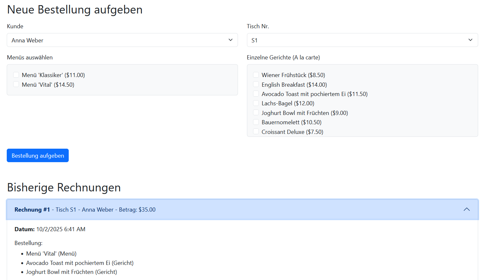

# Angabe: Frühstücksrestaurant Webanwendung (MVC-Variante)

**Hinweis zur Controller-Struktur**: In diesem Projekt wird bewusst nur ein einziger Controller (`FruehstueckController`) für die Verwaltung aller Datenmodelle verwendet. Aufgrund des begrenzten Funktionsumfangs wäre die Aufteilung in separate Controller für jedes Model nicht zweckmäßig und würde die Struktur unnötig verkomplizieren.

## Projektübersicht

Dieses Projekt ist eine Webanwendung, die auf dem **ASP.NET Core MVC**-Framework basiert und die Funktionalität eines einfachen Bestellsystems für ein Frühstücksrestaurant abbildet. Im Gegensatz zur schlanken Minimal API-Variante wird hier der traditionelle und strukturierte **MVC-Ansatz (Model-View-Controller)** verwendet, um eine klare Trennung der Verantwortlichkeiten zu gewährleisten.

Die Anwendung ermöglicht es, über eine Weboberfläche Bestellungen für verschiedene Tische aufzugeben und eine laufend aktualisierte Liste aller bisherigen Rechnungen einzusehen. Dabei werden moderne .NET-Technologien wie **Entity Framework Core** für die Datenbankanbindung und **asynchrone Programmierung** für eine performante Ausführung genutzt.

## Kerntechnologien und Anforderungen

* **ASP.NET Core MVC**: Die Anwendungsarchitektur folgt dem MVC-Muster mit Controllern, Views und Models.
* **Entity Framework Core (EF Core)**: Die Daten (Rechnungen, Menüs etc.) werden nicht mehr in JSON-Dateien, sondern in einer relationalen Datenbank mithilfe von EF Core gespeichert.
* **Asynchrone Controller-Actions**: Alle Operationen werden **async** ausgeführt, um die Anwendung reaktionsfähig zu halten.
* **Razor Views mit Tag Helpern**: Die HTML-Oberfläche wird mithilfe von Razor-Views und **Tag Helpern** erstellt, was zu sauberem und besser wartbarem Code führt.
* **ViewBag**: Zur Übergabe von Daten ohne Model (z. B. Titel oder Statusmeldungen) vom Controller an die View wird das **ViewBag**-Objekt verwendet.

## Architektur der Anwendung

### Übersicht der Dateien
Die Services sind von [dieser](https://github.com/MrStrelow/BBRZ/tree/main/C%23/C%23.ASP.NET/modul_1_grundlagen/L01Minimal%20APIs/exercise1-fruehstueck/Services) Übung zu übernehmen und auf die neuen Models mit EF-Core anzupassen.
```
/FruehstuecksBestellungMVC
|-- /Controllers
|   |-- FruehstueckController.cs
|-- /Data
|   |-- ApplicationDbContext.cs
|-- /Migrations
|-- /Models
|   |-- Bill.cs
|   |-- Customer.cs
|   |-- Dish.cs
|   |-- Menu.cs
|   |-- PreperationStep.cs
|   |-- Ingredient.cs
|   |-- SeedData.cs
|   |-- Table.cs
|   |-- Visit.cs
|-- /Services
|   |-- CustomerService.cs
|-- /Views
|   |-- /Fruehstueck
|   |   |-- Index.cshtml
|   |-- /Shared
|       |-- _Layout.cshtml
|       |-- _ValidationScriptsPartial.cshtml
|-- appsettings.json
|-- Program.cs
|-- FruehstuecksBestellungMVC.csproj
```

### 1. Models und EF Core DbContext


**Anmerkung:** Wir gehen hier von einem *Katalog* (Klasse) von *Ingredients*, *Dishes*, *Menus*, etc. aus. Also alles was unterhalb von der ``Entity`` *Order* steht. Wir tracken (noch) nicht einzelne *Ingredients* wie in einem Warenwirtschaftssystem. Der Unterschied ist also

| id (PK) | zutat  |
|:--------|:-------|
| 1       | lauch  |
| 2       | zwiebel| 
| 3       | salz   |
* **Jedes** Gericht verwendet die Zutat *lauch* mit id 2.

vs.

| id (PK) | zutat | lieferung  |
|:--------|:------|:-----------|
| 1       | lauch | 10.03.2017 |
| 2       | lauch | 10.03.2017 |
| 3       | lauch  | 11.03.2017 |
* **Ein** Gericht verwendte die Zutat *lauch* mit id 1, ein anderes Gericht verwendet diese nicht mehr, da sie "gegessen" wurde. Es kann nun die der *lauch* mit id 2 verwendet werden.
* Die Tabelle verstößt gegen die "3." Normalform, jedoch kompakter für die Darstellung des Unterschieds. 

* **Entities**: Klassen wie `Bill`, `Customer`, `Menu`, und `Dish` repräsentieren die Datenmodelle. Diese werden von EF Core als Tabellen in der Datenbank abgebildet. Die Beziehungen sind *optional* mit *IEntityTypeConfiguration* zu spezifizieren.
* **ApplicationDbContext**: Eine von `DbContext` abgeleitete Klasse, die als Brücke zwischen den Models und der Datenbank dient. Sie enthält `DbSet<>`-Eigenschaften für jede Entität.

Wir legen die *Entities* in den *Models* Ordner und den *ApplicationDbContext* in den *Data* Ordner.

### 2. Controller (`FruehstueckController.cs`)
Der `FruehstueckController` ist der zentrale Einstiegspunkt und enthält die Logik zur Verarbeitung von Benutzeranfragen. Er definiert zwei zentrale **Actions**:

* #### `GET /Fruehstueck/Index`
    * **Funktion**: Dies ist die Haupt-Action, die die Startseite der Anwendung lädt und darstellt.
    * **Ablauf (asynchron)**:
        1.  Die Action wird als `public async Task<IActionResult> Index()` deklariert.
        2.  Mithilfe von EF Core werden alle bisherigen Rechnungen asynchron aus der Datenbank geladen: `await _context.Bills.ToListAsync()`.
        3.  Die Liste der Rechnungen wird an die View übergeben.
        4.  Zusätzlich wird ein Titel über das **ViewBag** gesetzt: `ViewBag.Title = "Frühstücksbestellung";`.
    * **Rückgabe**: Die Action gibt ein `ViewResult` zurück, das die `Index.cshtml`-Seite rendert.

* #### `POST /Fruehstueck/Bestellen`
    * **Funktion**: Diese Action verarbeitet die Formulardaten, die beim Aufgeben einer neuen Bestellung gesendet werden.
    * **Ablauf (asynchron)**:
        1.  Die Action wird als `public async Task<IActionResult> Bestellen(Order order)` deklariert und nimmt ein Model mit den Formulardaten entgegen (wir haben ViewModels noch nicht besprochen).
        2.  Der `CustomerService` wird aufgerufen, um die Bestellung zu verarbeiten. Dieser erstellt eine neue Rechnung, einen Visit, weist einen Tisch zu, gibt die gewünschten Orders auf und speichert sie asynchron in der Datenbank: `await _context.SaveChangesAsync()`. Der CustomerService verwendet andere Services nach bedarf.
        3.  Nach erfolgreicher Verarbeitung wird der Benutzer wieder auf die `Index`-Action umgeleitet, wo die neue Rechnung in der Liste erscheint.

### 3. Views (`Index.cshtml`)

Die Benutzeroberfläche wird in einer Razor-View definiert und nutzt **Tag Helper**, um HTML-Elemente serverseitig zu generieren.

* **Bestellformular**:
    * Das Formular wird mit dem **Form Tag Helper** erstellt, was die Verknüpfung zum Controller vereinfacht:
        ```html
        <form asp-controller="Fruehstueck" asp-action="Bestellen" method="post">
        ```

* **Rechnungsübersicht**:
    * Die Liste der Rechnungen, die vom Controller übergeben wurde, wird in einer Schleife durchlaufen und übersichtlich dargestellt.
    * Die Anzeige ist bedingt: Wenn keine Rechnungen vorhanden sind, wird eine entsprechende Meldung angezeigt.

* **Übersicht UserInterface**:


## Starten der Anwendung
1.  **Datenbank-Migration erstellen**: Da EF Core verwendet wird, muss zunächst eine Migration erstellt werden, um das Datenbankschema zu generieren.
    ```bash
    dotnet ef migrations add InitialCreate
    ```

2.  **Datenbank aktualisieren**: Die Migration wird auf die Datenbank angewendet.
    ```bash
    dotnet ef database update
    ```

3.  **Anwendung ausführen**:
    ```bash
    dotnet run
    ```

Öffnen Sie anschließend einen Webbrowser und navigieren Sie zu der im Terminal angezeigten URL (z.B. `http://localhost:5000`).