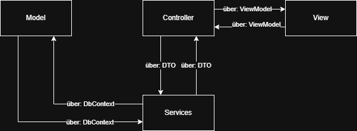

# Refactoring von Controller-Validierung zu ViewModels & DTOs

Wir gehen von der [Exercise 2](../exercise2-fruehstuecksrestaurant-mit-validation/Angabe.md) aus und verwenden die [Lösung](../exercise2-fruehstuecksrestaurant-mit-validation/) dieser. Falls das eigene Projekt fehlerfrei ist, kann auch dieses verwendet werden.

## Übersicht der Änderungen

### Probleme des Codes aus [Exercise 2](../exercise2-fruehstuecksrestaurant-mit-validation/Angabe.md)

1.  **"Fetter" Controller:** Der ``Controller`` *FruehstueckController* ist überladen mit manuellen `Bedingten Anweisungen`, um die Eingaben zu prüfen (z.B. *customerId <= 0*).
2.  **Kein DRY (Don't Repeat Yourself):** Der Code zum Abrufen aller Listen (Menüs, Tische etc.) wird zweimal geschrieben – einmal für die ``Methode`` *Index* welche für `Http-Methode` *GET* zuständig ist und einmal im Fehlerfall der ``Methode`` Bestellen*, welche für die `Http-Methode` *POST* zuständig ist **(Die Methoden im Controller werden auch ``Action`` genannt)**.
3.  **"Stilles Versagen":** Der ``Service`` *CustomerService* bricht bei einem Fehler (z.B. Kunde nicht gefunden) einfach mit *return;* ab. Der Benutzer erhält keine Rückmeldung über diese ``Exception``.
4.  **Schwache Modelle:** Die ``Action`` (``Methode``) *Index* übergibt ein unstrukturiertes `Tuple` an die ``View``. Die ``Action`` (``Methode``) *Bestellen* empfängt *viele einzelne* ``Parameter``.
5.  **Schlechte User Experience (UX):** Wenn die ``Validierung`` (bis jetzt die ``Guard Clauses`` im ``Controller`` *FruehstueckController*) fehlschlägt, werden die zuvor ausgewählten ``Dropdowns`` und ``Checkboxen`` des Benutzers nicht wiederhergestellt.

### Kommunikation


 
1. **`CustomerService.cs` (Service):** ``Service`` kommuniziert mit dem ``Model`` über ``Ef-Core`` mit dem *DbContext*. 
2. **`FruehstueckController.cs` (Controller):** 
    * ``Controller`` kommuniziert mit ``Service`` über ``DTO``, und
    * ``Controller`` kommuniziert mit ``View`` über ``ViewModels``.
3. **`Index.cshtml` (View):** ``View`` kommuniziert mit ``Controller`` über ``ViewModels``.
4. **`OrderViewModel.cs` (ViewModel):** ``View`` kommuniziert mit ``Controller`` über ``ViewModel`` *OrderViewModel*. 
5. **`FruehstueckViewModel.cs` (ViewModel):** ``Controller`` kommuniziert mit ``View`` über ``ViewModel`` *FruehstueckViewModel*.
6. **``OrderDto.cs`` (DTO):** ``Controller`` kommuniziert mit ``Service`` über ``DTO`` *OrderDto*. 

### Lösungsvorschläge
Erstelle für ``ViewModel`` und ``DTO`` einen eigenen Ornder auf der Ebene des ``Controllers``, ``Views``, ``Models``, ``Data``, etc.

1. **`OrderViewModel.cs` (ViewModel):** Eine ``Klasse``, die *nur* die Formulardaten der Bestellung empfängt. Sie ist der **einzige Ort** für die **Validierungslogik** (unsere ``Guards``).
2. **`FruehstueckViewModel.cs` (ViewModel):** Eine ``Klasse``, die *alle* Daten enthält, die die `Index.cshtml`-View benötigt (alle Listen zur Anzeige + das ``OrderViewModel`` für das Formular. Im Fall eines **ungültigen** ``http-Requests`` enthält das ``ViewModel`` *FruehstueckViewModel*, das *OrderViewModel*  als ``Eigenschaft``. wir verlieren dadurch die Auswahl der *Order* des Users nicht.
3. **`CustomerService.cs`:** Wirft `Exceptions` bei *Systemfehlern*, die vom globalen Error-Handler (z.B. ``Controller`` *ErrorController*) gefangen werden. Erstelle dazu einen `neuen ``Controller`` *ErrorController* und eine ``ViewModel`` *ErrorViewModel*. Die Parameter der ``Methoden`` im ``Service`` werden durch ein ``DTO`` gekapselt. Das enhält die 4 ``Parameter`` aus [Exercise 2](../exercise2-fruehstuecksrestaurant-mit-validation/Angabe.md).
4. **`FruehstueckController.cs`:** Wird "dünn". Er kümmert sich nur noch um den Workflow (Daten holen, ``Service`` aufrufen) und prüft `ModelState.IsValid`.
5. **`Index.cshtml`:** Wird mit **Tag Helpern** (`asp-for`, `asp-items`, `asp-validation-for`) an das ``ViewModel`` gebunden.
6. **``OrderDto.cs``:** Eine Kapsel welche die notwendigen Daten für den ``Service`` bereistellt. Er ist der ``Parameter`` der ``Methode`` in dem ``Service``. 

---

## Schritt 1: Das ``ViewModel`` *OrderViewModel* erstellen

Erstellen Sie einen neuen Ordner `ViewModels` und fügen Sie diese ``Klasse`` hinzu.

* **`int?` (Nullable Int):** Wird verwendet, damit der Model Binder einen leeren String (`""`) von einem leeren Dropdown als `null` binden kann, anstatt einen Typ-Konvertierungsfehler ("The value '' is invalid") zu werfen.
* **`[Required]`:** Fängt das `null` ab und zeigt unsere benutzerdefinierte Fehlermeldung.
* **`[Range]`:** Fängt ungültige Zahlen (z.B. `0`) ab, falls `[Required]` passiert wurde.
* **`const`:** Verhindert doppelte Fehlermeldungen (DRY-Prinzip).
* **`IValidatableObject`:** Implementiert die `Validate`-Methode für komplexe "Guards", die mehrere Eigenschaften prüfen (z.B. "mindestens ein Menü ODER ein Gericht").

---

## Schritt 2: Das ``ViewModel`` *FruehstueckViewModel* erstellen

Fügen Sie diese Klasse ebenfalls zum Ordner `ViewModels` hinzu. Sie ersetzt das `Tuple`.

* **Zweck:** Sie bündelt *alle* Daten für die `Index.cshtml`-View.
* **`OrderForm { get; set; } = new();`:** Wir initialisieren das DTO immer. Dies ist wichtig, damit die `asp-for`-Tag-Helper in der View bei einem GET-Request (wenn das Formular leer ist) keine `NullReferenceException` werfen.

---

## Schritt 3: Das ``DTO`` *OrderDto* erstellen

Fügen Sie diese ``Klasse`` im Ordner ``DTOs`` hinzu. Sie ersetzt den ``Parameter`` im ``Service`` der `Methode` *CreateOrderAsync*.

* **Zweck:** Sie bündelt *alle* ``Parameter`` für eine ``Methode`` im ``Service``.
* Verwende dort einen ``Copy-Construktor`` welcher ein ``ViewModel`` *OrderViewModel* entgegen nimmt und die benötigten Daten im ``DTO`` als ``Eigenschaft`` speichert. **Verwende hier keinen ``nullable`` ``Operator``! Unser ``DTO`` muss diese nach der ``Validierung`` übertragen und hat deshalb gesichter keine ``null`` werte.**

---

## Schritt 3: Den `CustomerService` anpassen

Wir ändern den `Service` *CustomerService* so, dass er bei *Systemfehlern* (Daten-Integritätsfehler, z.B. eine ID existiert nicht) eine `Exception` wirft. Diese Fehler sind keine *Validierungsfehler*, die der Benutzer korrigieren kann, sondern *unerwartete* Probleme. Ändere den ``Parameter`` der ``Methode`` *CreateOrderAsync* auf ein ``DTO``.

---

## Schritt 4: Den `FruehstueckController` refaktorisieren

Der Controller wird jetzt "dünn" und sauber.

* **`PopulateViewModelAsync`:** Eine neue private Methode, um das Laden der Listen zu zentralisieren (DRY).
* **`[GET] Index`:** Erstellt nur noch das `FruehstueckViewModel` und füllt es.
* **`[POST] Bestellen`:**
    * Akzeptiert **nur** das `OrderViewModel`.
    * **`[Bind(Prefix = "OrderForm")]`:** Weist den Model Binder an, die Formulardaten (z.B. `OrderForm.CustomerId`) korrekt auf das `orderDto` zu mappen.
    * **Keine manuelle Validierung:** Alle `if (customerId <= 0)` sind verschwunden.
    * **`if (!ModelState.IsValid)`:** Dieser Block wird jetzt *automatisch* durch die Attribute und die `Validate`-Methode im DTO ausgelöst.
    * **Fehlerfall:** Im Fehlerfall erstellen wir das volle `FruehstueckViewModel` neu, füllen die Listen (`PopulateViewModelAsync`) und **weisen das fehlerhafte `orderDto` wieder zu** (`viewModel.OrderForm = orderDto`). Dies stellt sicher, dass die Benutzereingaben erhalten bleiben.
    * **`.Value`:** Beim Aufruf des Service verwenden wir `orderDto.CustomerId.Value`, da der Service `int` und nicht `int?` erwartet (wir wissen, dass es sicher ist, da `ModelState.IsValid` ist).

---

## Schritt 5: Die `Index.cshtml` View anpassen

Die View wird auf das neue `FruehstueckViewModel` umgestellt und nutzt Tag Helper für die Bindung.

* **`@model`:** Wird auf `FruehstueckViewModel` geändert.
* **`asp-validation-summary="All"`:** Zeigt alle Fehler (aus `[Required]`, `[Range]` und `IValidatableObject`) oben auf der Seite an.
* **`asp-for`:** Bindet das `<select>`-Tag an die ``Eigenschaft`` *Order* im *FruehstueckViewModel* vom ``Typ`` *OrderViewModel* (mit z.B. `Order.CustomerId`). Dies stellt sicher, dass der Wert gesendet *und* im Fehlerfall wiederhergestellt wird.
* **`asp-items`:** Füllt die `<option>`-Tags der Dropdown-Liste.
* **`asp-validation-for`:** Zeigt die spezifische Fehlermeldung (z.B. "Bitte wählen Sie einen Kunden aus") direkt unter dem Feld an.
* **Manuelles `checked`:** Bei Checkboxen in einer Schleife müssen wir manuell prüfen, ob die ID in der DTO-Liste enthalten ist, um die Auswahl im Fehlerfall wiederherzustellen (`.Contains(...)`).
```