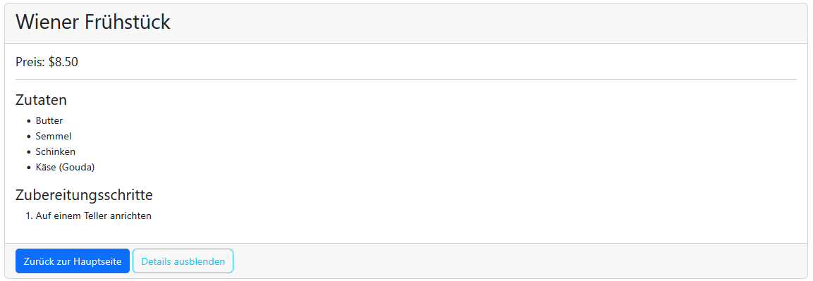
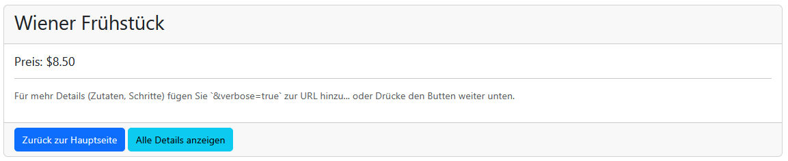
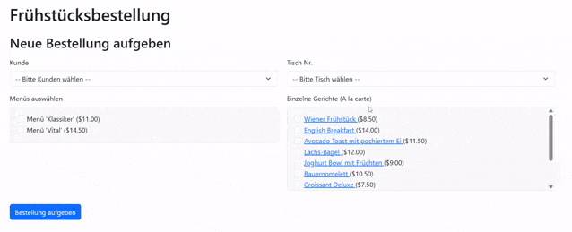

# Modultest 1

Sie haben `180 Minuten` Zeit die Aufgaben zu lösen
* Sie können maximal 100 Punkte erreichen
* Es sind zur Prüfung zugelassen:
    * Taschenrechner (wenn erwünscht)
    * Transparente Wasserflasche
    * Papier, Geodreieck, Stifte, usw.
    * Am Computer sind alle Unterlagen sowie die Nutzung des Internets erlaubt.

Die Nutzung des Internets umfasst nicht
* Chatbots
* Veröffentlichung der Lösungen
* sonstige Kommunikation mit anderen Usern

Die Nutzung von allen anderen Dingen, muss vorher mit mir abgesprochen werden
(z.B. Nutzung von Ohropax), ansonsten wird dies als schummeln gewertet. 
Die Folge des Schummeln ist eine Bewertung mit 0 Punkten.

* Die Abgabe des Programmcodes erfolgt über Teams (ein zip-File des Projektes mir bis spätestens 15 minuten nach Ende des Tests zu schicken)
* Viel Erfolg! :)

Notenschlüssel:
[0-50): N5; [50-62.5%): G4; [62.5-75%): B3; [75-87.5%): G2; [87.5-100%]: S1., (Schulnotensystem)

---

## Vorbereitung (bevor die Prüfung startet)
* **Wie öffne ich die Vorlage?**
    1) Entpacke das [Zib-Archiv](Vorlage_WebProgModulTest1_112025.zip). Dieses beinhaltet eine Vorlage für die Geamte Prüfung.
    2) Drücke doppelt auf die **.sln** oder **.slnx** Datei. Diese wird dadurch mit ``Visual Studio`` geöffnet. Falls nicht siehe dem README File innerhalb von [Zib-Archivs](Vorlage_WebProgModulTest1_112025.zip)
    3) Damit das ``Projekt`` *Aufgabe_2* fehlerfrei startet, muss eine ``Datenbank`` mit Namen *TemporaryExamDb* erstellt werden. Das ist mit dem *View->SQL-Server-Object-Explorer* in ``Visual Studio`` (oder mit dem ``SQL Server Management Studio``) möglich. Falls keine Rechte dazu besessen werden, siehe weiter unten. 
    (Es kann jeder Name verwendet werden, jedoch muss die ``Datenbank`` welche in *appsettings.json* verwendet wird, am ``SQL-Server`` existieren.) 
    4) Führe folgende Schritte aus:
        * Gib in der ``Developer PowerShell`` *cd Aufgabe_2* ein. Wir wechseln den Ordner in den Ordner des Projekts.
        * Gib in der ``Developer PowerShell`` *dotnet clean* und dann *dotnet build Aufgabe_2* ein. Es dürfen keine Fehler entstanden sein.
        * Gib in der ``Developer PowerShell`` *dotnet tool install --global dotnet-ef* ein.
        * Gib in der ``Developer PowerShell`` *dotnet ef database update* ein.
        * Überprüfe im ``SQL-Object-Explorer``, ob folgendes vorhanden ist: 
        
            
    5) Führe das ``Projekt`` *Aufgabe_2* aus. Es soll eine Website sichtbar sein, welche vom Benutzer ohne Fehler bedient werden kann.

* **Die Verbindung zur ``Datenbank`` mit  ``EF-Core`` funktioniert nicht.**
    Es muss folgendes Installiert sein:
    1) Öffne den ``Task Manager``, gehe zu ``Dienste`` und suche nach ``SQL Server Agent (SQLExpress)``. Sollte das nicht der Fall sein, dann rufe [diesen](https://go.microsoft.com/fwlink/p/?linkid=2216019&clcid=0x409&culture=en-us&country=us) Installer auf (Falls nicht möglich suche nach SQL Server Express in Google).
    2) Installiere den SQL Server und verwende folgenden Connection String ``"Server=localhost\\SQLEXPRESS; Database=TemporaryExamDb; Trusted_Connection=True; TrustServerCertificate=True;"``

    Falls dein User keine Rechte hat um eine ``Datenbank`` anzulegen, rufe folgende Befehle auf:
    1) Öffne nach Abschluss der Installation den ``Terminal`` und gib ``sqlcmd -S localhost\SQLEXPRESS`` ein.
    2) Gib dort 
        ```sql
        CREATE LOGIN [DOMAIN\USERNAME] FROM WINDOWS;
        GO
        ``` 
        ein
    3) Danach gib 
        ```sql
        ALTER SERVER ROLE sysadmin ADD MEMBER [DOMAIN\USERNAME];
        GO
        ```
        ein.
    4) Es soll nun möglich sein eine Datenbank anzulegen (Adminrechte) und sich mit dem oben agegebene Connection string ohne passwort zu verbinden.
    
---

## http und html [20 / 100 Punkte]

### Theorie [20 / 20 Teilpunkte]
1) Wann soll die ``http-Methode`` *get* und wann ``http-Methode`` *post* verwendet werden?
2) Wie kann die ``http-Methode`` *delete* als ``Request`` an einen ``Server`` gesendet werden? 
3) Ist der **standardmäßige** Anwendugnsfall von javascript ``client-seitig`` oder ``server-seitig``?
4) Ist der **standardmäßige** Anwendugnsfall von ``asp.net`` ``client-seitig`` oder ``server-seitig``?
5) Wo werden bei einem ``Request`` der ``http-Methode`` *post* die ``Parameter`` übermittelt?
6) Wo werden bei einem ``Request`` der ``http-Methode`` *get* die ``Parameter`` übermittelt?
7) Was bedeutet der ``Serverstatus`` *200*, *300*, *400* und *500*? Wo kann ich diese finden?

---

## Model, View, Control, Services, ViewModels und DTOs [60 Punkte]
### Programmverständnis [15 / 80 Teilpunkte]
In folgendem ``Controller`` und ``View`` haben sich ein Fehler eingeschlichen. Finde und behebe diese. Erkläre warum es ein Fehler oder ein konzeptionell falscher Ansatz ist.

1) ``View``
```csharp
@model FruehstueckController

<div class="border rounded p-3 bg-light" style="max-height: 200px; overflow-y: auto;">
    <ul>
        @foreach (var order in DbContext.Orders.ToList())
        {
            foreach (var menu in order.Menus)
            {
                <li>@menu.Name (Menü)</li>
            }
            foreach (var dish in order.Dishes)
            {
                <li>@dish.Name (Gericht)</li>
            }
        }
    </ul>
</div>
```

2) ``Controller``
```csharp
[HttpPost]
public async IActionResult Index()
{
    ViewBag.Title = "Frühstücksbestellung";
    var view = new FruehstueckView();
    view.Menus = await _context.Menus.ToList();

    return View("Index", view);
}
```

---

### Programmieren [55 / 80 Teilpunkte]
Im ``Projekt`` *Aufgabe_2* befindet sich funktionierender ``Code``. Damit dieses fehlerfrei startet muss eine ``Datenbank`` mit Namen *TemporaryExamDb* erstellt und befüllt werden. Siehe [Vorbereitung](#vorbereitung-bevor-die-prüfung-startet). (Es kann jeder Name verwendet werden, jedoch muss die ``Datenbank`` welche in *appsettings.json* verwendet wird, am ``SQL-Server`` existieren.)

Vervollständige das Programm in den angegebenen Ebenen durch folgende ``Klassen``:
* ``DishController``: Dieser beinhaltet eine ``Methode`` *Index* und eine ``Methode`` *Create*. 
    * *Index*: 
        1) Diese nimmt die ``http-Methode`` *get* für einen spezielles ``Model`` *Dish* entgegen. Diese ``Action`` gibt ein ``ViewModel`` *DishViewModel* mit der ``Eigenschaft`` *Id* des ``Model`` *Dish* von der ``View`` an den ``Controller`` weiter. Das passiert durch einen Klick auf ein *Dish* in der List aller *Dishes* auf der "Hauptseite. Das Verhalten der Hauptseite ist bereits in der Vorlage implementiert. Es muss dort nichts verändert werden.
        2) Dieser nimmt einen ``request-Parameter`` *verbose* entgegen, welcher *true* oder *false* sein kann. 
            * Wenn *false*, wird ein ``ViewModel`` *DishViewModel* der ``View`` gegeben welches die ``Eigenschaften`` *Name* und *Price* eines ``Models`` *Dish* beinhaltet. 
            * Wenn *true*, wird ein ``ViewModel`` *DishViewModel der ``View`` gegeben welches die ``Eigenschaften`` *Name*, *Price*, *Preperationstep* und *Ingredients* eines ``Models`` *Dish* beinhaltet. Entsprechende Fehlermeldungen sollen mit den ``Attributen`` an die ``View`` mithilfe des *ModelStates* weitergegeben werden.
    * *Create*: 
        2) Diese nimmt die ``http-Methode`` *post* entgegen. Als ``Parameter`` wird ein ``ViewModel`` *DishViewModel* empfangen. Wandle dieses mithilfe von der ``Methode`` *ToDto* zu einem ``DTO`` *DishDto* um. Verwende den ``Service`` *DishService* mit der ``Methode`` *CreateDish* welches ein ``DTO`` *DishDto* als ``Parameter`` entgegenimmt. Leite dann mit einem *Redirect()* an die ``Action`` *Index* weiter. 
* ``DishViewModel``: Die im *DishController* implementierte ``Action`` *Index* bekommt das *DishViewModel* als ``Parameter`` übermittelt. Innerhlab des ``ViewModel`` *DishViewModel* soll ein ``Attribut`` verwendet werden um die Gültigkeit der ``Eigenschaft`` *Id* sicherzustellen. Prüfe hier auf *Range(1, int.MaxValue, ...)* und verwende *Required(...)*. Implementiere zudem eine ``Methode`` *ToDto* welche aus einem ``ViewModel`` *DishViewModel* ein ``DTO`` *DishDto* macht.
* ``DishDto``: Dieses soll die ``Eigenschaften`` *Name* und *Price* besitzen. Es wird für die Kommunikation mit dem ``Service`` *DishService* verwendet.
* ``DishService``: Der ``Parameter`` der ``Methode`` *CreateDish* ist ein ``DTO`` *DishDto*. Erstelle ein neues ``Model`` *Dish* und belege die ``Eigenschaften`` *Ingredients* und *PreparationStep*. Wähle einfachheitshalber die ersten aus der Datenbank mit *await _dbContext.Ingredients.FirstOrDefaultAsync();* aus. Übernimm aus dem ``DTO`` *DishDto* die ``Eigenschaft`` *Name* und verwende den ``Datenbank-Context`` um ein neues ``Model`` in der Datenbank anzulegen.
* ``View``: Verwende aus der **Vorlage** das ``cshtml`` mit Namen *Details* welches im Ordner *Dish* liegt. Dieser Code ist auskommentiert, kommentiere diesen ein um fortzufahren. Es muss nur mit ``Razor-Syntax`` *@* adaptiert werden. Es muss **kein** neuer html-code erstellt werden. Implementiere dort folgendes Verhalten: 
    1) Lies aus dem vom ``Controller`` *DishController* übermittelten ``ViewModel`` *DishViewModel* die benötigten ``Eigenschaften`` für die Darstellung des ``cshtml`` *Details* aus. Verwende dazu *@model DishViewModel*.  
    2) Es soll der ``ModelState`` verwendet werden um bei fehlerhaften ``http-Requests`` den User darüber zu informieren. Wir brauchen das wenn wir einen ``http-request`` mit der ``http-methode`` *post* verwenden. Wir schreiben diesen Code nur hin, ohne *post* in der ``View`` zu implementieren. Verwende dazu die ``Tag-helper`` *asp-validation-summary* oder *asp-validation-for*. 
    3) Die Logik der ``Server-Seitigen`` ``Validierung`` ist im ``DishViewModel`` durch ``Attribute`` und/oder der ``Methode`` *Validate* umzusetzen. Die ``Methode`` *Validate* ist von dem ``Interface`` *IValidatableObject* zu implementieren. 
    5) In der ``View`` soll durch einen Mausklick auf ein ``html-Element`` *Selection* (mit Dishes befüllt) die ``Action`` *Index* mit der ``http-Methode`` *get* aufgerufen werden.
    6) In der ``View`` soll es **nicht möglich sein ein Dish anzulegen**. 

    

    

>**Amerkung:** Die ``Klassen`` für ``Models`` und ``Data`` (Datenbank) sind bereits fertig implementiert. Diese sind nicht zu verändern.

>**Hinweis:** Nutze die Implementierungen in den bereits getätigten Klassen als Vorlage. Die Startklasse ist nicht zu ändern!

#### Erwarteter Output:


---

### Theorie [10 / 80 Teilpunkte]
1) Wie schaffen wir es im ``Controller`` und ``Services`` einen Zugriff auf den ``DbContext`` zu bekommen?
2) Was beschreibt ein ``ViewModel`` und was ein ``Model``? **Hinweis:** Was verwendet die ``Datenbank`` und was die ``View``?
3) Was sind ``Tag-Helper``? Ein Benutzer geht ins Kontextmenü (Rechtsklick) und navigiert auf der Websitezu zu *Quellcode anzeigen* (CTRL+u). Finden wir in dem angezeigten ``html-file`` ``Tag-Helper`` wie z.B. *asp-controller* und *asp-action*? 
4) Was ist eine ``Action`` in einem ``Controller``? Was hat diese mit ``http-Methoden`` wie z.B. *Post* zu tun?
5) Was erlaubt uns die ``Razor``-``Syntax`` *@* in einem ``cshtml``-file? Ein Benutzer geht ins Kontextmenü (Rechtsklick) und navigiert auf der Websitezu zu *Quellcode anzeigen* (CTRL+u). Finden wir in dem angezeigten ``html-file`` die ``Razor``-``Syntax`` *@* wie z.B. *@model*, *@for* und *@if*? 