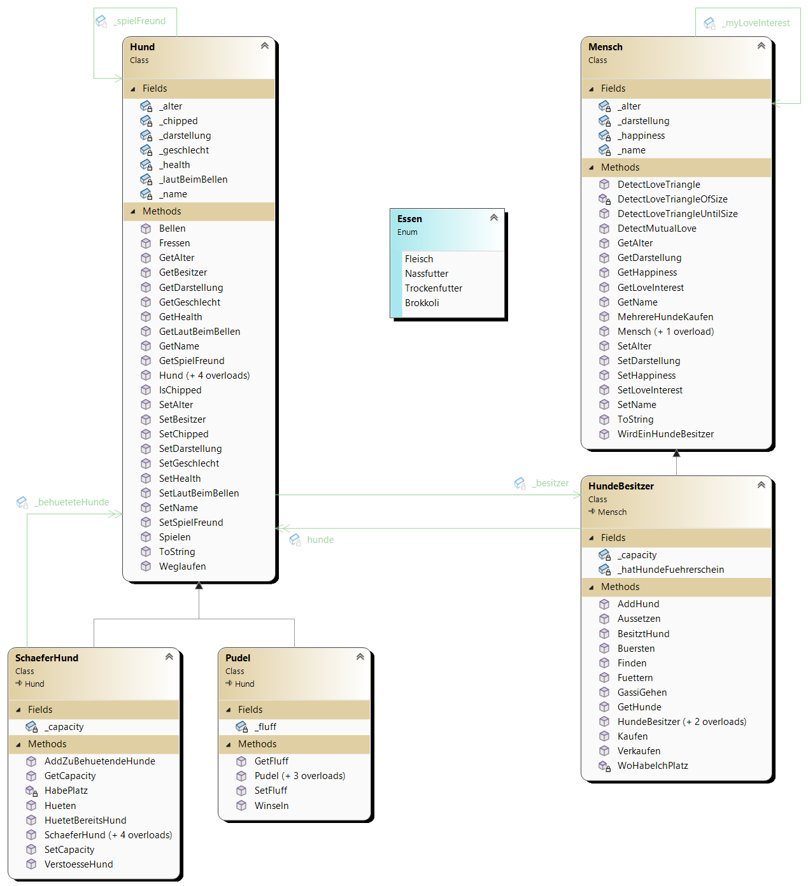
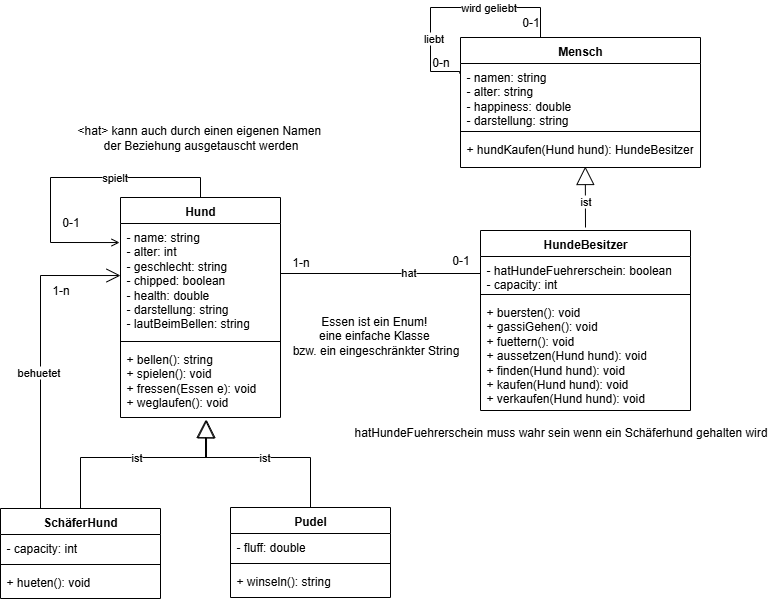

# Hunde und dessen Besitzer:innen

## Zu verwendende Konzepte
| Konzept | Beschreibung | Implementierung |
| :--- | :--- | :--- |
| **Vererbung (Ist-Beziehung)** | `HundeBesitzer` ist ein `Mensch`. `SchaeferHund` und `Pudel` sind ein `Hund`. | C# `class Subklasse : Basisklasse` |
| **Assoziationen (Hat-Beziehung)** | Beschreibt die Beziehungen zwischen Objekten (z.B. ein Mensch hat einen Love Interest). | Private Felder vom Typ der assoziierten Klasse (z.B. `private Mensch _myLoveInterest;`). |
| **Bidrektionale und Unidirektionale Hat-Beziehungen** | Eine Beziehung, die in beide Richtungen konsistent sein muss (z.B. SpielFreund) ist ``bidirektional``. Beide ``Objekte`` wissen voneinander. Wenn nur ein ``Objekt`` von der ``Hat-Beziehung`` weiß, ist diese ``unidirektional`` | Die Methode `SetSpielFreund()` in `Hund` stellt sicher, dass wenn A, B als Spielfreund hat, B auch A als Spielfreund hat. |
| **Guard Clauses** | Code-Blöcke am Anfang von ``Methoden``, die ``unerwünschte Zustände`` (z.B. `null`-Referenzen, Kapazitätsüberschreitung, logische Fehler) abfangen. | *if (condition) return;* oder *if (condition) throw new Exception("¯\_(ツ)_/¯");* (hier keine ``Exceptions``, sondern *Console.WriteLine* mit einem `return` darunter). |
| **Downcasting** | Ein ``Objekt`` der ``Basisklasse`` z.B. *Hund* wird temporär in einen ``abgeleiteten Typ`` umgewandelt. | In `HundeBesitzer.Buersten()` wird geprüft, ob ein `Hund` ein `Pudel` ist, um auf `Pudel`-spezifische Methoden (`SetFluff()`) zuzugreifen. Wir tun das mit dem ``Mustervergleich`` *if (hund is Pudel pudel) { ... }*. Innerhalb der geschwungenen Klammern kann auf die ``Variable`` *pudel* zugegriffen werden, welche die ``Variable`` *hund* als ``Pudel`` darstellt. **Achtung!** Dafür muss der *hund* aber auch den ``Typ`` *Pudel* von anfang an haben! sonst ist das if flasch und wir gehen weiter.|
| **Kopierkonstruktor** | Ein Konstruktor wird ``Kopierkonstruktor`` genannt, wenn dieser die ``Felder`` und dessen ``Werte`` bzw. ``Referenzen`` übernimmt und ein neues Objekt daraus erstellt. Wir "klonen" quasi das alte Objekt. Wir werden es verwenden um einen *HundeBesitzer* aus einem *Mensch* zu machen (das ist kein ``up-`` oder ``downcasting``!). Dazu verwendne wir *new Hundebesitzer(this, hatHundeFührerschein, capacity)*. |
| **override** anwenden bei *ToString()* | Wir überschreiben mit dem ``Keyword`` ``override`` die ``Implementierung`` einer ``Methode`` aus einer ``Basisklasse``. Jedes ``Klasse`` kann *public virtual string ToString* aus der ``Klasse`` *Object* überschreiben um *Console.WriteLine(einHundeObjekt);* sinnvoll ausgeben zu können. Ansonsten wird der sogenannte ``HashCode`` ausgegeben. Wir tun das in unserer ``Klasse`` z.B. *Hund* und *Mensch* mit z.B. *public override string ToString() { return $"{_name}:{_alter}:{_darstellung}" }*|

---

## Klassen und Methoden ``definieren`` und ``implementieren``
Halte dich an folgendes ``Klassendiagramm`` welches [IST](Klassendiagramm/IST_generiert.png) genannt ist



Dieses ist aus der Lösung generiert und stellt alle Methoden und Felder dar, welche zu implementieren sind. Die Konstruktoren werden jedoch nicht einzeln angezeigt. In der Angabe wird erwähnt welche ``Parameter`` die jeweiligen ``Konstruktoren`` haben sollen. Verwende zudem *Program.cs* aus der [Lösung](Program.cs). Diese zeigt Fehler an, falls ``Konstruktoren``, oder andere ``Methoden`` vergessen wurden. Die ausprogrammierte *Program.cs* ist in der [hier in der Lösung](Program.cs) zu finden.

**Anmerkung:** 
1) Die ``ToString`` sowie ``Get-`` und ``Set-Methoden`` sind nicht in folgenden Auflistungen enthalten. Außnhamen sind jene ``Set-Methoden`` welche komplizierteres Verhalten haben (``Guard-Clauses`` , ``bidriektionale`` Beziehungen sicherstellen, etc.). 
2) Beim Implmentieren der Klasse führe lafuend das Programm aus! Ansonsten ist es schwer zu erkennen wo Fehler gemacht wurden.

### UML-Klassendiagramm
Vergleiche [IST](Klassendiagramm/IST_generiert.png) mit [SOLL](Klassendiagramm/SOLL.bright.png). Folgendes Diagramm in der Angabe ist [SOLL](Klassendiagramm/SOLL.bright.png).

 und beantworte folgende Fragen.

* Wie sind die ```Kardinalitäten`` in beiden Diagrammen dargestellt? 
* Sind alle Beziehungen in [SOLL](Klassendiagramm/SOLL.bright.png) so abgebildet wie in [IST](Klassendiagramm/IST_generiert.png)?
* Warum sind in [SOLL](Klassendiagramm/IST_generiert.png) viel weniger ``Methoden`` vorhanden als in [IST](Klassendiagramm/IST_generiert.png)?

### Klasse: Mensch.cs

| Methode / Konstruktor | Hintergrund & Implementierung |
| :--- | :--- |
| 🤗 `Mensch(...)` | Überladene Konstruktoren zur Initialisierung aller Felder, inklusive optionalem `_myLoveInterest`. Wir benötigen folgende Konstruktoren: **``1)``** *public Mensch(string name, double happiness, int alter)* und **``2)``** *Mensch(string name, double happiness, int alter, Mensch loveInterest) : this(name, happiness, alter)*. Nutzt `this()` um bereits bestehende Konstruktoren zu verwenden. Das geht nur bei ``Konstruktoren`` und nicht bei *normalen* ``Methoden``|
| 🤔 `WirdEinHundeBesitzer()` | Ermöglicht die **Konvertierung** zu einem `HundeBesitzer`. Erstellt ein **neues** ``Objekt`` *HundeBesitzer* aus dem aktuellen ``Objekt`` *Mensch*. Danach kauft diese:r einen ersten *Hund* und gibt das **neue** ``Objekt`` vom ``Typ`` *HundeBesitzer* zurück. Es wird ein ``Kopierkonstruktor`` von *HundeBesitzer* verwendet. |
| 🤔 `MehrereHundeKaufen()` | Kauft ein ``Array`` von Hunden. **Guard Clause**: Prüft, ob die Kapazität (*capacity*) groß genug für alle Hunde ist. |
| 🙂 `DetectMutualLove()` | Prüft die bidirektionale Love-Interest-Beziehung: `this == _myLoveInterest._myLoveInterest`. **Guard Clause**: Prüft, ob *_myLoveInterest* ``null`` ist und *_myLoveInterest._myLoveInterest* ``null`` ist. |
| 🤔 `DetectLoveTriangle()` | Prüft, ob ein Dreiecksverhältnis der Größe 3 vorliegt (`A._myLoveInterest._myLoveInterest._myLoveInterest == A`) **Guard Clause**: Prüft, ob *_myLoveInterest* ``null`` ist, *_myLoveInterest._myLoveInterest* ``null`` ist und *_myLoveInterest._myLoveInteres._myLoveInterest* ``null`` ist. |
| 💀 `DetectLoveTriangleUntilSize()` | Sucht iterativ nach Love Triangles bis zur Größe `n`. **Guard Clause**: Prüft in jedem Schritt, ob *_myLoveInterest* ``null`` ist. In der Lösung ist es so einfach gehalten wie möglich.|
| 🙂 `ToString()` | **override**: Überschreibe die ``Methode`` *ToString* und schreibe dort *public override string ToString() { return $"{_name}:{_alter}:{_darstellung}" }*. Drücke auf das in VS links stehende *blaue o*. Zu welcher Klasse kommst du? Diese ``Klasse`` ist der ``Basetype`` der ``Klasse`` *Hund* (obwohl wir gar keine ``Ist-Beziehung`` angegeben haben!). |

### Klasse: Hund.cs
| Methode / Konstruktor | Hintergrund & Implementierung |
| :--- | :--- |
| 🙂 `Hund(...)` | Es werden folgende ``Konstruktoren`` benötigt: **``1)``** ``Copy-Konstruktor`` *Hund(Hund toCopy)*: Erstellt eine neue `Hund`-Instanz mit denselben Werten (ohne *_besitzer* und *_spielFreund*), **``2)``** *public Hund(string name, int alter, string geschlecht, double health, bool chipped)*, **``3)``** *public Hund(string name, int alter, string geschlecht, double health, bool chipped, HundeBesitzer besitzer) : this(name, alter, geschlecht, health, chipped)*, **``4)``** *public Hund(string name, int alter, string geschlecht, double health, bool chipped, Hund spielFreund) : this(name, alter, geschlecht, health, chipped)* und **``5)``** *public Hund(string name, int alter, string geschlecht, double health, bool chipped, HundeBesitzer besitzer, Hund spielFreund) : this(name, alter, geschlecht, health, chipped)* |
| 🤗 `Fressen(Essen essen)` | Gibt auf die ``Console`` aus welcher *Hund* welches *Essen* gefressen wird. |
| 🤗 `Spielen()` | Gibt auf die ``Console`` das ``Feld`` *_spielFreund*, *das eigene ``Objekt``* und den *_besitzer* aus. |
| 🤗 `Bellen()` | Gibt auf die ``Console`` das ``Feld`` *_lautBeimBellen* aus. |
| 🙂 `Weglaufen()` | Simuliert das Weglaufen. Ruft `_besitzer.Aussetzen(this)` auf, um den Hund aus der Liste des Besitzers zu entfernen. |
| 🤔 `SetSpielFreund()` | Stellt die **bidirektionale Beziehung (1:1)** her. Stellt sicher, dass wenn `this` den `spielFreund` setzt, der `spielFreund` auch `this` als `_spielFreund` setzt. **Guard Clauses**: Frage ab ob der ``Parameter`` *Hund spielFreund* ``null`` ist. Frage auch ab ob der ``Parameter`` *Hund spielFreund* "ich selbst bin". Beides soll zu einem Abbruch führen.|
| 🤔 `SetBesitzer()` | **Guard Clauses**: Verhindert die Zuweisung von `null`. Prüft mit `BesitztHund()` in `HundeBesitzer.cs`, ob der Hund bereits besessen wird. Ruft bei Zuweisung `besitzer.AddHund(this)` auf. |
| 🙂 `ToString()` | **override**: Überschreibe die ``Methode`` *ToString* und schreibe dort *public override string ToString() { return $"{_name}:{_alter}:{_darstellung}" }*. Drücke auf das in VS links stehende *blaue o*. Zu welcher Klasse kommst du? Diese ``Klasse`` ist der ``Basetype`` der ``Klasse`` *Hund* (obwohl wir gar keine ``Ist-Beziehung`` angegeben haben!). |

### Klasse: HundeBesitzer.cs
| Methode / Konstruktor | Hintergrund & Implementierung |
| :--- | :--- |
| 🙂 `HundeBesitzer(...)` | Drei überladene ``Konstruktoren``. Nutzen *base()* (zum Aufruf des *Mensch*-Konstruktors) und *this()* (für andere ``Konstruktoren`` in der ``Klasse`` *HundeBesitzer*). Rufe im ``Konstruktor`` welcher *base()* verwendet auch *SetDarstellung("😁")* auf. Die Konstruktoren sind **``1)``** *public HundeBesitzer (string name, double happiness, int age, bool hatHundeFuehrerschein, int capacity) : base (name, happiness, age)*, **``2)``** *public HundeBesitzer(Mensch istBaldHundebesitzer, bool hatHundeFuehrerschein, Hund[] hunde, int capacity) : this (istBaldHundebesitzer.GetName(), istBaldHundebesitzer.GetHappiness(), istBaldHundebesitzer.GetAlter(), hatHundeFuehrerschein, capacity)* und **``3)``** *public HundeBesitzer(Mensch istBaldHundebesitzer, bool hatHundeFuehrerschein, int capacity) : this (istBaldHundebesitzer.GetName(), istBaldHundebesitzer.GetHappiness(), istBaldHundebesitzer.GetAlter(), hatHundeFuehrerschein, capacity)*| 
| 🤗 `GassiGehen()` | Gib für alle *Hunde* die vom *HundeBesitzer* besessen werden eine Nachricht auf die ``Console`` aus. |
| 🤗 `Fuettern(Essen essen)` | Rufe für alle *Hunde* die vom *HundeBesitzer* besessen werden die Methode ``Fressen(Essen essen)`` auf. |
| 🙂 `Buersten()` | **Downcasting-Demonstration**: Unterscheidet zwischen *Pudel* und anderen *Hunden*. *Pudel* erhält eine höhere Health-Erhöhung und der `_fluff` wird verdoppelt. Verwende dazu *if (hund is Pudel pudel)* **Anmerkung!** Kann ich direkt auf die ``Felder`` zugreifen oder muss ich die ``Get-`` und ``Set-Methoden`` verwenden?|
| 🤔 `Aussetzen(Hund hund)` | Entferne den Hund aus der internen `hunde`-Liste des *HundeBesitzers* und setzt dessen `_besitzer`-Feld auf `null`. **Guard Clause**: Prüfe ob der Hund überhaupt von mir besessen wird. Schreibe dazu eine ``private`` ``Hilfsmethode`` *bool BesitztHund(Hund hund)*. |
| 🤔 `Finden(Hund hund)` | Rufe die *SetBesitzer* ``Methode`` auf um den ``Parameter`` *Hund hund* in Besitz zu nehmen. **Guard Clause**: Prüft, ob es sich um einen *Schäferhund* handelt, da dann der *Besitzer* einen `_hatHundeFuehrerschein` besitzen muss.|
| 🤔 `Kaufen(Hund hund)` | Rufe die *SetBesitzer* ``Methode`` auf um den ``Parameter`` *Hund hund* in Besitz zu nehmen. **Guard Clause**: Prüft, ob es sich um einen *Schäferhund* handelt, da dann der *Besitzer* einen `_hatHundeFuehrerschein` besitzen muss. |
| 🤔 `Verkaufen(Hund hund, HundeBesitzer neuerBeistzer)` | Rufe die ``Methode`` *Aussetzen* auf und danach die ``Methode`` *Kaufen* des ``Parameters`` *Besitzer neuerBesitzer* und übergebe dort den ``Parameter`` *Hund hund*. |
| 🤔 `AddHund()` | Fügt einen Hund zum `hunde`-Array hinzu. **Guard Clauses**: Verhindert `null`, Duplikate (`BesitztHund()`) und Kapazitätsüberschreitung (`WoHabeIchPlatz()`). Implementiere dazu eine ``private`` ``Hilfsmethode`` *int WoHabeIchPlatz()* welche einen freien Ort im ``Array`` *_hunde* zurückgibt. Wenn es keinen gibt, gib *-1* zurück. |

### Klasse: SchaeferHund.cs
| Methode / Konstruktor | Hintergrund & Implementierung |
| :--- | :--- |
| 🤗 `SchaeferHund(...)` | Mehrere überladene Konstruktoren. Initialisiert das `_behueteteHunde`-Array und setzt die Darstellung auf `🐕‍🦺`. Die ``Konstruktoren`` sind **``1)``** *public SchaeferHund(string name, int alter, string geschlecht, double health, bool chipped, int capacity, Hund[] behuetendeHunde) : base(name, alter, geschlecht, health, chipped)*, **``2)``** *public SchaeferHund(string name, int alter, string geschlecht, double health, bool chipped, int capacity, Hund[] behuetendeHunde, HundeBesitzer besitzer, Hund spielFreund) : this(name, alter, geschlecht, health, chipped, capacity, behuetendeHunde)*, **``3)``** *public SchaeferHund(string name, int alter, string geschlecht, double health, bool chipped,int capacity, Hund[] behuetendeHunde, HundeBesitzer besitzer) : this(name, alter, geschlecht, health, chipped, capacity, behuetendeHunde)* und **``4)``** *public SchaeferHund(string name, int alter, string geschlecht, double health, bool chipped, int capacity, Hund[] behuetendeHunde, Hund spielFreund) : this(name, alter, geschlecht, health, chipped, capacity, behuetendeHunde)* |
| 🤗 `Hueten()` | Ausgabe aller *Hunde* im ``Feld`` *_behueteteHunde* in der ``Konsole``. |
| 🤔 `AddZuBehuetendeHunde(Hund hund)` | Fügt einen Hund zur Hüteliste hinzu. **Guard Clauses** gegen ``Parameter`` *Hund hund* ist ``null``, wird bereits von "mir" behütet und führt zu einer Kapazitätsüberschreitung. Implementiere dazu zwei ``Hilfsmethoden``. **``1)``** Die ``private`` ``Hilfsmethode`` *int WoHabeIchPlatz()*. Diese gibt den index eines freien (null) Platzes im ``Feld`` *_behueteteHunde* an. **``2)``** die ``public`` ``Hilfsmethode`` *bool HuetetBereitsHund(Hund hund)*. Diese gibt den ``Wert`` *true* zurück der ``Parameter`` *Hund hund* im ``Feld`` *_behueteteHunde* vorkommt.|
| 🙂 `VerstoesseHund(Hund hund)` | suche den ``Parameter`` *Hund hund* im ``Feld`` *_behueteteHunde* und entferne diesen. |

### Klasse: Pudel.cs
| Methode / Konstruktor | Hintergrund & Implementierung |
| :--- | :--- |
| 🤗 `Pudel(...)` | Mehrere überladene Konstruktoren zur Initialisierung aller Felder inkl. `_fluff`. Setzt die Darstellung auf `🐩`. Diese sind **``1``** * public Pudel(string name, int alter, string geschlecht, double health, bool chipped, double fluff) : base(name, alter, geschlecht, health, chipped)*, **``2)``** *public Pudel(string name, int alter, string geschlecht, double health, bool chipped, double fluff, HundeBesitzer besitzer, Hund spielFreund) : this(name, alter, geschlecht, health, chipped, fluff)*, **``3)``** *public Pudel(string name, int alter, string geschlecht, double health, bool chipped, double fluff, HundeBesitzer besitzer) : this(name, alter, geschlecht, health, chipped, fluff)* und **``4)``** *public Pudel(string name, int alter, string geschlecht, double health, bool chipped, double fluff, Hund spielFreund) : this(name, alter, geschlecht, health, chipped, fluff)* |
| 🤗 `Winseln()` | Simuliert das Winseln *Console.WriteLine(".winsel.")*. Zudem wird die Health des *Pudels* um 1 verringert. |

---

## Erwarteter Output:
Die in der [Lösung](Program.cs) angegebenen ``Main-Klasse`` *Program.cs* führt mit der Lösung zu folgendem Ergebnis.
```
--- Vorbereitungen: Objekte erstellen ---

--- Test 1: Reziproke SpielFreund-Beziehung (Hund.SetSpielFreund) ---
ist frido.GetSpielFreund() null? True
Gilbert's Spielfreund: Frido:2:🐶
Frido's Spielfreund: Gilbert:1:🐶

--- Test 2: HundeBesitzer Aktionen (Kaufen, Fuettern) ---
Der Hund Frido:2:🐶 wurde von Karo:25:😁 erworben.
Zuweisung verboten! Frido:2:🐶 ist bereits besessen 👻.
Der Hund Gilbert:1:🐶 wurde von Karo:25:😁 erworben.
Zuweisung verboten! Gilbert:1:🐶 ist bereits besessen 👻.
Frido:2:🐶 frisst Fleisch
Gilbert:1:🐶 frisst Fleisch
Mein Spielfreund: Frido:2:🐶 spielt mit mir!: Gilbert:1:🐶 unter der strengen aufsicht von: Karo:25:😁
Mein Spielfreund: Gilbert:1:🐶 spielt mit mir!: Frido:2:🐶 unter der strengen aufsicht von: Karo:25:😁

--- Test 3: Mensch -> HundeBesitzer (Upcasting/Method Redefinition) ---
Vor Umwandlung - Typ: Hunde.Mensch - Hash: 27252167 - Darstellung Walo:51:😐
Der Hund InitialHund:1:🐶 wurde von Walo:51:😁 erworben.
Zuweisung verboten! InitialHund:1:🐶 ist bereits besessen 👻.
Nach Umwandlung - Typ: Hunde.HundeBesitzer - Hash: 43942917 - Darstellung Walo:51:😁
Darstellung (Redefiniert): 😁
HatNieHunde Darstellung: Raldira:55:😐

==============================================
--- ERWEITERTE TESTS FÜR ALLE KLASSENMETHODEN ---
==============================================

--- A. Mensch.cs Tests ---
A.1: Julia und Tom haben Mutual Love: True
Der Hund Bello:3:🐶 wurde von Julia:30:😁 erworben.
Zuweisung verboten! Bello:3:🐶 ist bereits besessen 👻.
Der Hund Lana:4:🐶 wurde von Julia:30:😁 erworben.
Zuweisung verboten! Lana:4:🐶 ist bereits besessen 👻.
Der Hund Max:1:🐶 wurde von Julia:30:😁 erworben.
Zuweisung verboten! Max:1:🐶 ist bereits besessen 👻.
A.2: Lisa ist jetzt HundeBesitzer (Julia) und hat 3 Hunde gekauft.
A.3: Fehler! Wir haben zu viele -2- Hunde als wir betreuen können.
A.3: Lisa versucht 3 Hunde mit Kapazität 2 zu kaufen (sollte null sein): True
A.4: Tom's Happiness aktualisiert: 0.95
A.4: Julia's Love Interest: Tom
A.4: Julia's ToString(): Julia:30:😐

--- B. Hund.cs Tests ---
Zuweisung verboten! Luna:2:🐩 ist bereits besessen 👻.
B.1: Luna's Besitzer: Karo
B.1: Rex's Spielfreund: Hansi
B.2: Rex Kopie erstellt: Rex. Gechippt? False. Hat sie einen Besitzer? False
Rex:4:🐶 bellt!
B.3: Rex bellt (Geräusch): Geräusch eines Hundes.
B.3: Rex Laut: Wauwau
Mein Spielfreund: Hansi:3:🐶 spielt mit mir!: Luna:2:🐩 unter der strengen aufsicht von: Karo:25:😁
B.5: Luna ist bei Hansi: True
Luna ist von Karo:25:😁 weggelaufen...
Parameter besitzer von SetBesitzer in Hund ist null.
B.5: Luna ist bei Hansi nach Weglaufen: False
B.5: Luna hat keinen Besitzer mehr: False
B.6a: Tobi
B.6b: Otto
B.7: Rex Health: 25
B.7: Rex Geschlecht: w

--- C. HundeBesitzer.cs Tests ---
Zuweisung verboten! Dackel:3:🐶 ist bereits besessen 👻.
C.1: Marie's Name aus Mensch übernommen: Tina
C.1: Marie besitzt den Dackel: True
C.1: Marie's Darstellung (Redefiniert): 👩‍🦰
Zuweisung verboten! H1:1:🐶 ist bereits besessen 👻.
Zuweisung verboten! H2:2:🐶 ist bereits besessen 👻.
C.2a: Karl
C.2b: Erika
Zuweisung verboten! H2:2:🐶 ist bereits besessen 👻.
C.2: Max's Besitzer (Erika): Erika
Zuweisung verboten! L1:1:🐶 ist bereits besessen 👻.
Zuweisung verboten! L2:1:🐶 ist bereits besessen 👻.
Hundebesitzer Small:30:😁 hat seine seine Kapazität-2- an Hunden überschritten.
C.3: 2
Ich: Tina:28:👩‍🦰 geh mit...
Dackel:3:🐶
 gassi.
Dackel:3:🐶 frisst Trockenfutter
Zuweisung verboten! Lili:2:🐩 ist bereits besessen 👻.
Zuweisung verboten! Normal:1:🐶 ist bereits besessen 👻.
C.6: Lili Health und Fluff - Vorher: Health 10 - Fluff 5 ...
C.6: Lili Health und Fluff - Nachher: Health 20 - Fluff 10 ...
C.6: Normal Health - Vorher: Health 11 ...
C.6: Normal Health - Nachher: Health 12 ...
Parameter besitzer von SetBesitzer in Hund ist null.
Der Hund Lili:2:🐩 wurde von Otto:35:😁 erworben.
Zuweisung verboten! Lili:2:🐩 ist bereits besessen 👻.
Der Hund Lili:2:🐩 wurde von Tina:28:👩‍🦰 verkauft und von Otto:35:😁 erworben.
C.7: Lili's neuer Besitzer: Otto
C.7: Tina besitzt Lili: False
C.7: Otto besitzt Lili: True
Der Hund Streuner:4:🐶 wurde von Otto:35:😁 gefunden.
Zuweisung verboten! Streuner:4:🐶 ist bereits besessen 👻.
C.8: Otto
C.8: Streuner's Besitzer: Otto
C.8: Otto besitzt Streuner: True

--- D. SchaeferHund.cs Tests ---
Ich: Sally:3:🐕‍🦺 behüte
Ich: Sally:3:🐕‍🦺 behüte
D.2: Bello hütet Frido: False
D.2: Bello hütet Fremd: True
D.3: Bello hütet Fremd nach Add: True
Sally:3:🐕‍🦺 ist am limit seiner Hütfähigkeit-2-.
Sally:3:🐕‍🦺 ist am limit seiner Hütfähigkeit-2-.
D.5: Bello hütet Gilbert nach Verstoesse: True
D.6: Bello neue Kapazität: 5
D.7: Bello Darstellung (Redefiniert): 🐕‍🦺
D.7: Bello Laut (Redefiniert): WUFF!

--- E. Pudel.cs Tests ---
E.1: Winseln
.winsel.
E.1: Fiffi Health: Vorher 12, Nachher 11 (Winseln -1)
E.2: Fiffi Fluff: 12
E.3: Fiffi Darstellung (Redefiniert): 🐩
E.3: Fiffi Laut (Redefiniert): ieek

--- F. Relationships (Love) Tests ---
F.2: Love Triangle Größe 3: True
F.3: Love Triangle bis Größe 5 gefunden: True, bis größe: 3 gefunden.
F.3: Love Triangle bis Größe 2 gefunden: False, bis größe: -1 gefunden.
F.3: Love Triangle bis Größe 3 gefunden: True, bis größe: 3 gefunden.

--- Tests beendet ---
```