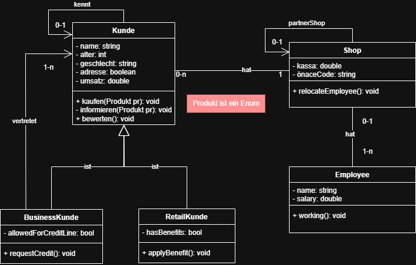

Gehe auf folgende Fragen zu dem im Klassendiagramm angegebenen Inhalten.
* Ist die ``Beziehung`` zwischen ``Shop`` und ``Employee`` eine ``Hat-Beziehung`` oder ``Ist-Beziehung``?
> Hat

* Was bedeutet das neben der ``Methode`` *relocateEmployee* eingezeichnete **+**? Ist es sinnvoll die ``Methode`` mit **+** zu modellieren? Wenn ja, warum, wenn nein, was soll geändert werden?
> Es bedeutet dass diese ``public`` ist. Das macht Sinn wenn wir diese in der ``Main-Klasse`` aufrufen sollen. 

* Ist die ``Beziehung`` *partnerShop* eine Hat- oder Ist-Beziehung? Was bedeutet *0-1*?
> Hat
> Die ``Multiplizität`` /``Kardinalität``. Es zeigt nicht nur *qualitativ* (es *gibt* die Beziehung), sondern stellt diese *quantitativ* (es *gibt* die Beziehung und sie ist *so viel*, z.B. 1 Shop hat *0* bis *1* Shops) dar.

* Hat ein ``RetailKunde`` die Möglichkeit ``Produkte`` mithilfe der ``Methode``  zu kaufen?
> Ja, durch die ``Ist-Beziehung`` erweitert der ``RetailKunde`` den ``Kunden``. Dadurch hat der ``RetailKunde`` zumindest die gleichen Mitglieder wie ein ``Kunde``, nur kann der ``RetailKunde`` diese Mitglieder erweitern. 

