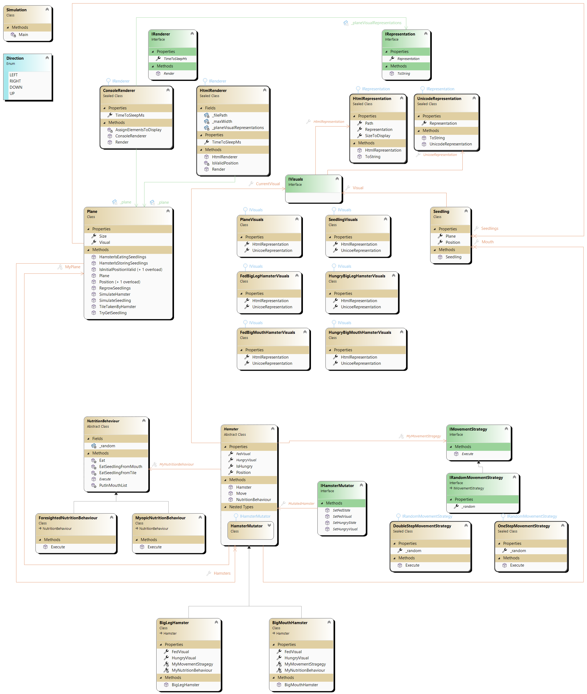

# Modultest 2 - JET

Sie haben `180 Minuten` Zeit die Aufgaben zu lösen
* Sie können maximal 100 Punkte erreichen
* Es sind zur Prüfung zugelassen:
    * Taschenrechner (wenn erwünscht)
    * Transparente Wasserflasche
    * Papier, Geodreieck, Stifte, usw.
    * Am Computer sind alle Unterlagen sowie die Nutzung des Internets erlaubt.

Die Nutzung des Internets umfasst nicht
* Chatbots
* Veröffentlichung der Lösungen
* sonstige Kommunikation mit anderen Usern

Die Nutzung von allen anderen Dingen, muss vorher mit mir abgesprochen werden
(z.B. Nutzung von Ohropax), ansonsten wird dies als schummeln gewertet. 
Die Folge des Schummeln ist eine Bewertung mit 0 Punkten.

* Die Abgabe des Programmcodes erfolgt über Teams (ein zip-File des Projektes mir bis spätestens 15 nach dem Ende der Prüfung schicken)
* Viel Erfolg! :)

Notenschlüssel:
[0-50): N5; [50-62.5%): G4; [62.5-75%): B3; [75-87.5%): G2; [87.5-100%]: S1., (Schulnotensystem)

---

## Aufgabe 1: C# Style OOP - Properties, Object Initializer, Nullable, Null Coalescing, ... [45 / 100 Punkte]

### Programmverständnis [20 / 45 Teilpunkte]
Gegeben ist folgender Code welcher ``Properties``(Eigenschaften) und ``Set-Gaurds`` verwendet. 

```csharp
private string Name { get; protected set; }

public string Name { protected get; private set; }

public int AnzahlKoffer
{
    get;
    set
    {
        if (value <= 2_000)
        {
            throw new ArgumentException("Anzahl der Koffer muss größer als 2000 sein.");
            value = AnzahlKoffer;
        }
    }
}

private int _anzahlKunden;
public int AnzahlKunden
{
    get => _anzahlKunden;
    set => _anzahlKunden = value > 20 ? value : _anzahlKunden; // Wird hier das System benachtichtigt wenn etwas schief geht?
}
```

* Finde die Fehler in diesem Code und markiere diese. 
* Erkläre wieso diese Fehler zu einer nicht gültigen bzw. konzeptionell falschen ``Property``(Eigenschaft) führen. Falls dir konzeptionelle Probleme auffallen, merke diese an.  

**Hinweis:**
* es kann nicht 2 mal ein ``visibility modifier`` neben ``get`` und ``set`` stehen. Wenn so etwas gewünscht ist, schreiben wir den weniger restritiven ``visiblity modifier`` neben der ``Property`` (Eigenschaft) selbst. ``public string Name { proteced get; private set; }`` vs. ``protected string Name { get; private set; }``

---

### Programmieren [20 / 45 Teilpunkte]
Gegeben ist folgender Code welcher ``Klassen`` mit ``Felder`` (inklusive ``Hat-Beziehungen``) und die Erstellung von `Objekten` durch ``Konstruktoren`` darstellt. Schreibe den gegebenen Code um und verwende folgenden Werkzeuge von ``C#``:
* Diese **müssen** verwendet werden:
    * ``Properties``(Eigenschaften) *Name { get; set; }* 
    * ``Object-Initializer`` *new Hamster { Name = "hello" };*
    * ``Nullable-Operator`` *?* z.B. bei einem  ``Feld`` *private int _name?;* oder *private Hamster _hempter?;* 
* wähle **mindestens eines** aus den folgenden:
    * ``Null-Coalescing-Operator`` *??*  z.B. *_hempter ?? new Hamster();* oder *_hempter = hempter ?? throw new ArgumentNullException();* in einer ``Property``.
    * ``Lambda-Operator`` *=>* z.B. bei *string Name { get => _name; set => value = _name; }
    * ``var`` *var hempter = new Hamster(plane);* 
    * ``Target-Typing`` *new ()* z.B. in einem ``Feld`` *class Hamster { private List<Seedling> _mouth = new (); }
    * ``named-arguments`` *:* z.B. *new Hamster(plane: wateryAndMountainyHabitat) { Name = "hemptos" };*
    * ``optional-arguments`` *int age = 25* z.B. *public Hamster(string name, int age = 25)*. Es kann also *var Herbert = new Hamster("Herbert");* aufgerufen werden wo nun *herbert* *age=25* besitzt.
    * ``Guard-Clauses`` innerhalb der ``set`` der ``Property``.

Es soll dadurch **keine** 
* ``Get-Methoden`` bzw. ``Set-Methoden`` vorkommen,
* ``Felder`` (außer wir bruachen ``Backing Felder`` für ``set-guards``) vorkommen,
* Warnungen welche sich mit ``null`` beschäftigen vorkommen (Die Verwendung des ``Null-Forgiving`` Operator ``!`` ist nicht erlaubt), 
im Code vorhanden sein.

**Hinweise!:** 
* Achte im neu geschriebenen Code auf das ``Data-Hiding`` der ``Datenkaplesung``. Bei welchen ``Feldern`` und ``Methoden`` steht ``public``, ``protected``, ``private``, etc.
* Lassen Sie sich nicht durch ``Nullable<bool>`` verwirren. Am Ende brauchen wir es in dieser Form nicht. Schau dir in der Angabe die Liste mit Werkzeugen an *(was heißt ähnlich)* und verwende eines davon in den *Feldern bzw. Eigenschaften* im Hamster. Danach wird der Typ Nullable<bool> nicht mehr benötigt und es kann bool (mit einem kleien Zusatz) verwendet werden.

```csharp
using java = OldJavaStyleHamster;
using csharp = NewCSharpStyleHamster;

namespace OldJavaStyleHamster
{
    public class Hamster
    {
        private readonly static string _hungryRepresentation = "😡";
        private readonly static string _fedRepresentation = "🐹";
        private const int _MAX_MOUTH_CAPACITY = 10;
        private string _representation;

        // Keine Sorge. Dieser Nullable<bool> muss nicht genau verstanden werden.
        // Dieser Typ wird nicht mehr in der zu programmierenden Version verwendet.
        // Er dient nur um kompliziert _isHungry möglicherweise auf null setzten zu können.
        // Kennen wir eine einfachere und flexiblere Variante um null auf Wertdaten anzuwenden?
        private Nullable<bool> _isHungry;

        private (int x, int y) _position;
        private List<Seedling> _mouth = new List<Seedling>();
        private Plane _plane;

        public Hamster(Plane plane, Nullable<bool> isHungry = null)
        {
            _isHungry = isHungry;
            _representation = _fedRepresentation;
            _plane = plane;
        }

        public string GetRepresentation()
        {
            return _representation;
        }

        protected void SetRepresentation(string representation)
        {
            _representation = representation;
        }

        public Nullable<bool> GetIsHungry()
        {
            return _isHungry;
        }

        protected void SetIsHungry(Nullable<bool> isHungry)
        {
            _isHungry = isHungry;
        }

        public (int x, int y) GetPosition()
        {
            return _position;
        }

        public Plane GetPlane()
        {
            return _plane;
        }

        public List<Seedling> GetMouth()
        {
            var deepCopyOfMouth = new List<Seedling>(_mouth.Count);
            foreach (var originalSeedling in _mouth)
            {
                var copiedSeedling = new Seedling(originalSeedling);
                deepCopyOfMouth.Add(copiedSeedling);
            }
            return deepCopyOfMouth;
        }

        public void SetMouth(List<Seedling> someExternalMouth)
        {
            if (someExternalMouth != null)
            {
                if (someExternalMouth.Count <= _MAX_MOUTH_CAPACITY)
                {
                    bool foundNull = false;
                    foreach (var seedling in someExternalMouth)
                    {
                        if (seedling == null)
                        {
                            foundNull = true;
                            break;
                        }
                    }

                    if (!foundNull)
                    {
                        var deepCopyOfMouth = new List<Seedling>(someExternalMouth.Count);
                        foreach (var originalSeedling in someExternalMouth)
                        {
                            deepCopyOfMouth.Add(new Seedling(originalSeedling));
                        }

                        _mouth = deepCopyOfMouth;
                    }
                    else
                    {
                        throw new ArgumentException("Die Liste der Setzlinge darf keine null-Referenzen enthalten.", nameof(someExternalMouth));
                    }
                }
                else
                {
                    throw new ArgumentException($"Ein Hamster kann nicht mehr als {_MAX_MOUTH_CAPACITY} Setzlinge im Maul halten.", nameof(someExternalMouth));
                }
            }
            else
            {
                throw new ArgumentNullException(nameof(someExternalMouth), "Die 'mouth'-Liste darf nicht null sein.");
            }
        }
    }

    public class Plane;

    public class Seedling
    {
        public Seedling(Seedling seedling)
        {
            // Da wäre ein copy Konstruktor. Diese muss hier nicht implementiert werden!
        }

        public Seedling() { }
    }

    public class Programm
    {
        public static void run()
        {
            Console.OutputEncoding = System.Text.Encoding.UTF8;

            Plane plane = new Plane();
            Hamster hempter = new Hamster(plane, null);
            
            Seedling seedling = new Seedling();
            Seedling anotherSeedling = new Seedling();
            Seedling yetAnotherSeedling = new Seedling();
            
            List<Seedling> seedlings = new List<Seedling>();
            seedlings.Add(seedling);
            seedlings.Add(anotherSeedling);
            seedlings.Add(yetAnotherSeedling);

            hempter.SetMouth(seedlings);

            Console.WriteLine("Die seedlings sind diese...");
            Console.Write("[");
            foreach (var seed in seedlings)
            {
                Console.Write(seed.GetHashCode() + " ");
            }
            Console.Write("]");
            Console.WriteLine();
            Console.WriteLine();

            Console.WriteLine(hempter.GetRepresentation());
            // Achtung! Hiest ist ? teil der If-Expression umgesetzt mit dem ?:-Operator. 
            // Das ? ist nicht der Nullable Operator und der : ist nicht der Delimiter des named Argument.
            Console.WriteLine(hempter.GetIsHungry() is null ? "ah. _isHungry ist null." : hempter.GetIsHungry());

            Console.WriteLine("Die seedlings im Hamster sind kopien davon, deshalb ein anderer HashCode.");
            Console.Write("[");
            foreach (var seed in hempter.GetMouth())
            {
                Console.Write(seed.GetHashCode() + " ");
            }
            Console.Write("]");
            Console.WriteLine();
            Console.WriteLine();
        }
    }
}

namespace NewCSharpStyleHamster
{
    public class Hamster
    {
        // TODO: implemente me.
    }
    public class Plane;
    public class Seedling
    {
        public Seedling(Seedling seedling)
        {
            // Da wäre ein copy Konstruktor. Diese muss hier nicht implementiert werden!
        }

        public Seedling() { }
    }

    public class Programm
    {
        public static void run()
        {
            Console.OutputEncoding = System.Text.Encoding.UTF8;
            Plane plane = new Plane();

            // TODO: implement me.
            throw new NotImplementedException("\u001B[31mLösche diese Zeile und füge deinen eigenen Cod ein!.\u001b[0m");
        }
    }
}

public class Comparisson
{
    static void Main(string[] args)
    {
        java.Programm.run();

        Console.WriteLine("⚠️~~~~~ darüber und darunter soll beides gleich aussehn ~~~~~⚠️");

        csharp.Programm.run();
    }
}
```

Erwarteter Output:
```
Die seedlings sind diese...
[54267293 18643596 33574638 ]

🐹
ah. _isHungry ist null.
Die seedlings im Hamster sind kopien davon, deshalb ein anderer HashCode.
[33736294 35191196 48285313 ]

⚠️~~~~~ darüber und darunter soll beides gleich aussehn ~~~~~⚠️
Die seedlings sind diese...
[31914638 18796293 34948909 ]

🐹
ah. _isHungry ist null.
Die seedlings im Hamster sind kopien davon, deshalb ein anderer HashCode.
[46104728 12289376 43495525 ]
```

---

### Theorie [5 / 45 Teilpunkte]
* wieso schreiben wir meistens ``public`` bei einer ``Property`` (Eigenschaft)? Sollten wir laut ``Data-Hiding`` nicht unsere ``Felder`` vor uneingeschränkten Zugrifen beschützen? 
* Was bedeutet der ``Nullable Operator`` *?* bei einem ``Referenzdatentyp`` und was *?* bei einem ``Wertdatentyp``?
* Ist ``int? a = 5;`` und ``int a = true ? 5 : 3;`` konzeptionell verwandt? Begründe.
* Wann ist es **notwendig** ``new ()`` anstatt ``var`` zu schreiben? Es scheint, dass ``var`` die flexiblere Variante ist. Schau dazu folgenden Code an und probiere diesen aus.

```csharp
public class Plane;

public class Hamster
{
    // Felder
    private var _plane = new Plane(); // Gibt es hier einen Fehler?
    //private Plane _plane = new (); // Gibt es hier einen Fehler?
}

public class Programm
{
    // Inhalt einer Methode
    public static void Main(string[] args)
    {
        var hempter = new Hamster(); // Gibt es hier einen Fehler?
        // vs.
        Hamster hompter = new(); // Gibt es hier einen Fehler?
    }
}
```

---

## Aufgabe 2: Interfaces, abstract Classes und S.O.L.I.D [45 Punkte]
### Programmverständnis [20 / 45 Teilpunkte]
Gehe auf folgende Fragen zu dem im Klassendiagramm angegebenen Inhalten. Es sind hier zwei Klassendiagramme gegeben, eines stellt eine **sauberere** bezogen auf ``S.O.L.I.D`` dar, die andere eine **schlechtere** Lösung.
* Begründe wieso ein ``Hamster`` im **oberen** Klassendiagramm bezogen auf ``The Dependency Inversion Principle``, welches das *Dd* in ``S.O.L.I.D`` ist, besser abgebildet ist.
* Begründe wieso ein ``Plane`` im **oberen** Klassendiagramm bezogen auf ``The Dependency Inversion Principle``, welches das *Dd* in ``S.O.L.I.D`` ist, besser abgebildet ist.

**Hinweis!** 
* Falls das Bild zu klein ist können Sie mit Rechtsklick dieses in einem Neuen Fenster öffnen.
* Falls die Linien schwer zu erkennen sind und sie keinen darkmode verwenden, probiere jene für den brightmode ohne transparenz [hier](LargeClassDiagram-bright-transparent.png) und [hier](SmallClassDiagram-bright-transparent.png), sowie ohne transparenz jedoch für den darkmode [hier](LargeClassDiagram.png) und [hier](SmallClassDiagram.png). 

---



---


---

### Programmieren [25 / 45 Teilpunkte]
Verwende folgenden Code welcher [hier](VorlageAufgabe2.zip) zu finden ist. Das vorhandene Zip-file ist ein Projekt welches in z.B. VisualStudio aufgemacht werden kann. **Erweitere** diesen code mit einem neuer ``Hamster`` **, welcher ein ``SmokingHamster`` ist.
* anderes ``INutritionBehaviour`` mit Namen ``SmokingNutritionBehaviour``:
    * Diese werden mit einer chance von *80%* pro Spielzug *hungrig*.
    * Wenn dieser Hunger hat, soll es eine 50/50 chance geben, dass dieser einen ``Seedling`` aufsammelt und nicht isst.
    * Wenn dieser **einmal** einen leeren ``Mouth`` hat, dann wird dieser nie wieder ``Seedlings`` sammeln und auch nicht essen. Er wird in Zukunft nur noch Rauchen. (Der letzte Satz ist nur für die "Story" und hat keinen Effekt für die Implementierung.)
* andere ``IRandomMovementStrategy`` mit Namen ``SmokingMovementStrategy``: 
    * Anwendung der ``OneStepMovementStrategy`` solange bis...
    * ... dieser **einmal** einen leeren ``Mouth`` hatte. Ab dann bewegt dieser Hamster sich immer 2 ``Felder`` nach, *oben* *rechts*. Dies ist ähnlich wie die ``DoubleStepMovementStrategy``, jedoch ist eingeschränkt auf die Richtungen *oben* und *rechts*. Dadruch sammeln sich sich die rauchenden Hamster alle irgendwann oben rechts in der Ecke der *Plane*.
    **Hinweis: ** überschreibe dazu die ``Methode`` *Move* von *Hamster* und frage dort ab welche *Strategy* zu verwenden ist.
* andere ``IVisuals``:
    * Diese soll für die ``HtmlRepresentation`` ein beliebiges *Bild* ihrer Wahl sein für die ``hungry`` und ``fed`` ``Representation``.
    * Diese soll für die ``UnicoeRepresentation`` ein beliebiges *Emoji* ihrer Wahl sein für die ``hungry`` und ``fed`` ``Representation``.

**Hinweis:** 
* Orientieren Sie sich an den bereits geschreibenen Code! Z.B. ist in ``FedBigLegHamsterVisuals`` der Code den Sie benötigen gegeben. Dieser kann kopiert und in einer **neuen** ``Klasse`` implementiert werden. Danach wird dieser leicht angepasst. Z.B. der ``Emoji`` wird ausgetauscht.
* Um besser *Testen* zu können ob die ``SmokingHamster`` nach rechts oben gehen, schalte die ``Methode`` *regrowRegrowSeedlings*.

---

## Aufgabe 3: static vs. non-static und Referenz vs. Wertdaten [10 Punkte]
### Programmverständnis [10 / 10 Teilpunkte]
Gegeben ist folgendes Programm, welches ``Referenzdaten`` beinhaltet. Diese können ``static`` oder auch nicht ``static`` sein. Wenn wir uns während der Ausführung des Programms den Arbeitsspeicher anschauen bemerken wir, dass dieses Programm viel Speicher benötigt.

```csharp
using System.Diagnostics;
using System.Text;

// Beginne hier zu lesen!
public class Programm
{
    public class Hamster
    {
        // Version 1
        // static string darstellung_static = "🐹"; 
        // Version 2
        // string darstellung_instance_interned = "🐹"; 
        // Version 3
        // string darsellung_instance_new = new string("🐹");
        // Version 4
        // kommentiere alles oben aus und definiere damit eine leere Klasse.
    }

    static void Main(string[] args)
    {
        // Beende hier zu lesen!
        Console.OutputEncoding = Encoding.UTF8;

        long memoryBefore = GC.GetTotalMemory(true);
        long privateBytesBefore = Process.GetCurrentProcess().PrivateMemorySize64;

        // Beginne hier zu lesen!
        var hamsters = new List<Hamster>()+
        for (int i = 0; i < 100_000_000; i++)
        {
            hamsters.Add(new Hamster());
        }

        // Beende hier zu lesen!
        long memoryAfter = GC.GetTotalMemory(true);
        long privateBytesAfter = Process.GetCurrentProcess().PrivateMemorySize64;

        long memoryUsedByGC = memoryAfter - memoryBefore;
        long privateBytesUsed = privateBytesAfter - privateBytesBefore;

        Console.WriteLine($"Approximate managed memory used by hamsters and list (GC.GetTotalMemory): {memoryUsedByGC / (1024.0 * 1024.0):F2} MB");

        GC.KeepAlive(hamsters); // Kein Hamster wird vom Gargabe Collector entfernt! Tierschutz++; :)
    }
}
```

Erwarteter Output:
```
1) static ... "🐹";
Approximate managed memory used by hamsters and list (GC.GetTotalMemory): 3312.83 MB

2) "🐹";
Approximate managed memory used by hamsters and list (GC.GetTotalMemory): 4075.76 MB

3) new string("🐹");
Approximate managed memory used by hamsters and list (GC.GetTotalMemory): 10179.27 MB

4) leere Klasse ohne Felder
Approximate managed memory used by hamsters and list (GC.GetTotalMemory): 3312.83 MB
```

* Begründe warum die Anwendung von ``Referenzdaten`` wie hier mit *string* in den 4 Fällen ein verschiedenes Verhalten hat. Gehe dazu 
    * auf die Idee von ``Referenzdaten`` ein (was liegt meistens im ``Stack``, was liegt im ``Heap``) und 
    * wie werden ``Referenzen`` grafisch dargstellt? 
    * Sparen wir uns Speicher wenn alle ``Referenzen`` auf ein Ziel zeigen? 
    * Ist *string* ein ``Wertdatentyp`` oder ein ``Referenzdatentyp``? 
    * Es gibt bei einem *string* eine spezielle Speicherung, diese heißt ``internal string pool``, welche bei Version 2 verwendet wird. Wie wirkt sich dieser ``internal string pool`` in unserem Programm aus?
---