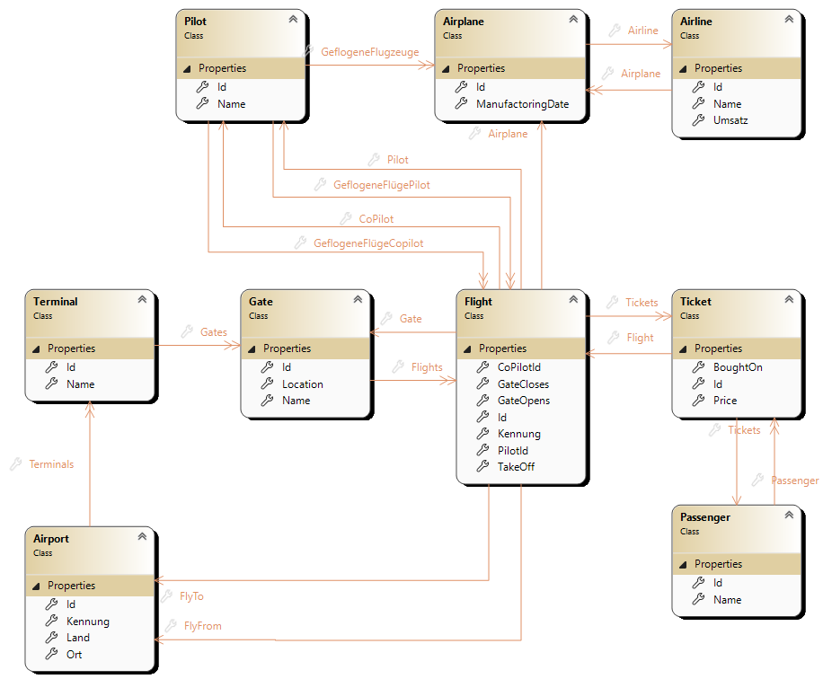

# Modultest 4

Sie haben `180 Minuten` Zeit die Aufgaben zu lösen
* Sie können maximal 100 Punkte erreichen
* Es sind zur Prüfung zugelassen:
    * Taschenrechner (wenn erwünscht)
    * Transparente Wasserflasche
    * Papier, Geodreieck, Stifte, usw.
    * Am Computer sind alle Unterlagen sowie die Nutzung des Internets erlaubt.

Die Nutzung des Internets umfasst nicht
* Chatbots
* Veröffentlichung der Lösungen
* sonstige Kommunikation mit anderen Usern

Die Nutzung von allen anderen Dingen, muss vorher mit mir abgesprochen werden
(z.B. Nutzung von Ohropax), ansonsten wird dies als schummeln gewertet. 
Die Folge des Schummeln ist eine Bewertung mit 0 Punkten.

* Die Abgabe des Programmcodes erfolgt über Teams (ein zip-File des Projektes mir bis spätestens 15 minuten nach Ende des Tests zu schicken)
* Viel Erfolg! :)

Notenschlüssel:
[0-50): N5; [50-62.5%): G4; [62.5-75%): B3; [75-87.5%): G2; [87.5-100%]: S1., (Schulnotensystem)

---

## Vorbereitung
* **Wie öffne ich die Vorlage?**
    1) Entpacke das [Zib-Archiv](Vorlage_WebProgModulTest1_112025.zip). Dieses beinhaltet eine Vorlage für die Geamte Prüfung.
    2) Drücke doppelt auf die **.sln** oder **.slnx** Datei. Diese wird dadurch mit ``Visual Studio`` geöffnet. Falls nicht siehe dem README File innerhalb von [Zib-Archivs](Vorlage_WebProgModulTest1_112025.zip)

* **Die Verbindung zur ``Datenbank`` mit  ``EF-Core`` funktioniert nicht.**
    Es muss folgendes Installiert sein:
    1) Öffne den ``Task Manager``, gehe zu ``Dienste`` und suche nach ``SQL Server Agent (SQLExpress)``. Sollte das nicht der Fall sein, dann rufe [diesen](https://go.microsoft.com/fwlink/p/?linkid=2216019&clcid=0x409&culture=en-us&country=us) Installer auf (Falls nicht möglich suche nach SQL Server Express in Google).
    2) Installiere den SQL Server und verwende folgenden Connection String ``"Server=localhost\\SQLEXPRESS; Database=TemporaryExamDb; Trusted_Connection=True; TrustServerCertificate=True;"``
    3) Damit die folgenden Aufgaben gelöst werden können, muss eine ``Datenbank`` mit Namen *TemporaryExamDb* erstellt werden. Das ist mit dem *View->SQL-Server-Object-Explorer* in ``Visual Studio`` (oder mit dem ``SQL Server Management Studio``) möglich. Falls keine Rechte dazu besessen werden, siehe weiter unten. 
    (Es kann jeder Name verwendet werden, jedoch muss die ``Datenbank`` welche in *MyDbContext.cs* verwendet wird, am ``SQL-Server`` existieren.) 

    Falls dein User keine Rechte hat um eine ``Datenbank`` anzulegen, rufe folgende Befehle auf:
    1) Öffne nach Abschluss der Installation den ``Terminal`` und gib ``sqlcmd -S localhost\SQLEXPRESS`` ein.
    2) Gib dort 
        ```sql
        CREATE LOGIN [DOMAIN\USERNAME] FROM WINDOWS;
        GO
        ``` 
        ein
    3) Danach gib 
        ```sql
        ALTER SERVER ROLE sysadmin ADD MEMBER [DOMAIN\USERNAME];
        GO
        ```
        ein.
    4) Es soll nun möglich sein eine Datenbank anzulegen (Adminrechte) und sich mit dem oben agegebene Connection string ohne passwort zu verbinden.

---

## Data Definition Language (DDL) mit EF-Core Model First umsetzen [40 / 100 Punkte]

Folgendes [``UML-Diagramm``](AirportClassDia.png) ist für die **alle** folgenden Aufgaben heranzuziehen.



### Programmverständnis [15 / 50 Teilpunkte]
Folgende ``Models`` versuchen das [UML-Diagramm](AirportClassDia.png) zu implementieren. Dabei haben sich Fehler eingeschlichen. Finde und behebe diese. Erkläre warum es ein Fehler oder ein konzeptionell falscher Ansatz ist.

```csharp
public class Airport
{
    public int MeinSuperSchlüssel { get; set; }
    public string Kennung { get; }
    public string Land { get; }
    public string Ort { get; }
    private IEnumerable<Terminal> Terminals = new List<Terminal>();
}
```

```csharp
public class Flight
{
    public int Id { get; set; }
    public Gate GateCloses { get; set; }
    public Gate GateOpens { get; set; }
    public string Kennung { get; set; }
    public string TakesOff { get; set; }
    public Ticket Tickets { get; set; }
}
```
---

### Programmiern [25 / 50 Teilpunkte]

Implementiere das gegebene [``UML-Diagramm``](AirportClassDia.png) innerhalb eines Ordners ``Models``.
1) Erstelle die ``Klassen`` und implementiere die ``Beziehungen`` als ``Eigenschaften``. Implementiere auch ``Eigenschaften`` wie z.B. ``Primärschlüssel`` und ``Fremdschlüssel``, wenn diese im [``UML-Diagramm``](AirportClassDia.png) angegeben sind.
2) Erstelle einen ``Migrations`` Ordner mithilfe der ensprechenden ``Commandozeilenbefehle`` von ``Ef-Core``.
3) Führe den ``Code`` innerhlab der ```Migrations`` mithilfe der ensprechenden ``Commandozeilenbefehle`` von ``Ef-Core`` aus. Ziel ist es ``Tabellen`` in der ``Datenbank`` anzulegen, welche über die ``Models`` definiert werden (``Model-First``). 
3) Befülle die Datenbank mit ``Dummy-Daten``. Diese sind in der **bereits** ``Klasse`` *SeedData* **implementiert** und muss nur in der ``Main-Methode``bzw. im ``Top-Level Statement`` aufgerufen werden. Führe diese aus und stelle sicher dass diese in der Datenbank vorhanden sind. Erstelle einen **``Screenshot``** welcher die Daten in der ``Datenbank`` darstellt.
5) Ändere nun die ``Klasse`` *Passenger*. Dort ist nun eine zusätzliche ``Eigenschaft`` *PassPhoto* einfachheitshalber vom ``Typ`` *Byte* vorhanden. Übernimm die Änderungen zuerst in dem ``Migrations`` und danach in die ``Datenbank`` mithilfe der ensprechenden ``Commandozeilenbefehle`` von ``Ef-Core``. **Führe das Programm nicht neu aus! Sind die bereits eingefügten Daten in der ``Datenbank`` noch vorhanden?**

---

### Theorie [10 / 50 Teilpunkte]
1) Was sind ``shadow properties`` vs. ``real properties``? Erkläre anhand eines ``Fremdschlüssels``. 
2) Was erleichtert uns ``Ef-core`` im Vergleich zu ``ado.net``?
4) Es existieren *fünf* ``Migrations``. Die letzte ``Migration`` wurde unabsichtlich erstellt. Wie entfernen wir diese?
5) Es soll die Datenbank auf eine ältere ``Migration`` umgestellt werden. Wie führen wir das durch?
6) Was macht die ``up`` und ``down`` ``Methode`` in den den generierten Files in den ``Migrations``?

---

## Async Data Manipulation Language (DML) mit EF Core umsetzen [60 Punkte]

### Programmverständnis [20 / 60 Teilpunkte]
Folgende ``Models`` versuchen basierend auf [UML-Diagramm](AirportClassDia.png) Abfragen durchzuführen. Dabei haben sich Fehler eingeschlichen. Finde und behebe diese. Erkläre warum es ein Fehler oder ein konzeptionell falscher Ansatz ist.

1)  ```csharp
    var passenger = await _context.Passenger.Find(1);
    var anotherPassenger = _context.Passenger.FindAsync(1);
    ```

2) ```csharp
    var passenger = new Passenger(...); // wird id = 15 haben
    _context.Passenger.Add(passenger); 

    var passengerAusDbGeholt = await _context.Passenger.Find(15);
    ``` 
    
3) ```csharp
    var passenger = await _context.Passengers
        .Where(p => p.Name == "Müller")
        .ThenInclude(p => p.Tickets) 
        .FirstOrDefaultAsync();
    ``` 

---

### Programmieren [30 / 60 Teilpunkte]
1) Gib alle *Flights* in der ``Datenbank`` aus. Dies soll ``asynchron`` umgesetzt werden.
2) Welche *Flights* haben *DepartureCity == "Vienna"*? Im Ergebnis soll nur die *Flightnumber* und der *DestinationCity* vorhanden sein.
3) Welche *Flights* haben *DepartureCity == "Vienna"* und zumindest 3 Tickets gekauft? Im Ergebnis soll nur die *Flightnumber* und der *DestinationCity* vorhanden sein.
3) Welche drei *Passengers* pro *Airline* haben den meisten *Umsatz* erzeugt?

#### Erwarteter Output:
resultate der datenbank

---

### Theorie [10 / 60 Teilpunkte]
1) Ist das ``Keyword`` *Select* in ``LINQ`` und ``SQL`` beides als erstes in einem ``Select-Statement`` üssen wir sql queries in efcore schreiben? was schreiben wir wirklich?
2) include vs theninclude
3) was muss bei async und dbset bearchtet werden? es muss immer ein task zurückgegeben werden.
```