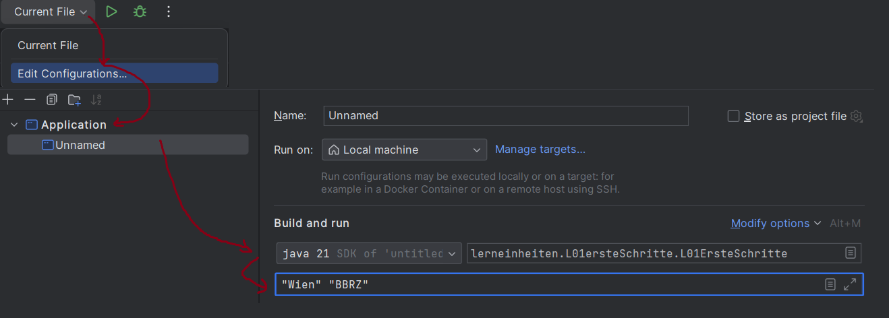

## Ue 1 - Erste Schritte

### Hinweise

Als Voraussetzung für diese Übungen muss zuerst eine Entwicklungsumgebung (IntelliJ oder Eclipse) aufgesetzt werden.

### Formatierung des Dokuments:
- Java-Code
- Beispiel-Konsolenausgaben

### Farbcodes für Java:
```java
String ANSI_RESET = "\u001B[0m";
String ANSI_BLACK = "\u001B[30m";
String ANSI_RED = "\u001B[31m";
String ANSI_GREEN = "\u001B[32m";
String ANSI_YELLOW = "\u001B[33m";
String ANSI_BLUE = "\u001B[34m";
String ANSI_PURPLE = "\u001B[35m";
String ANSI_CYAN = "\u001B[36m";
String ANSI_WHITE = "\u001B[37m";
```

### Beispiel:
```java
System.out.println("Hello " + ANSI_RED + "World" + ANSI_RESET + "!");
```

## Erste Konsolenausgaben

1. Erstellen einer `HelloWorld`-Anwendung, die "Hello World" auf die Konsole ausgibt.
2. Adaptieren Sie das Programm durch folgende Schritte:
   - Geben Sie als erste Zeile Ihren Vornamen mittels `System.out.println()` aus.
   - Geben Sie in der zweiten Zeile Ihren Nachnamen mit `System.out.println()` aus.
   - Geben Sie in einer separaten Zeile folgenden Text aus: *Heute ist Mittwoch, der 04. Oktober 2023.*
     - Jedes Wort soll hierbei separat ausgegeben werden, z.B.: `System.out.print("Heute")`
   - Geben Sie denselben Satz jetzt mit Tabulatoren als Abstände aus. **Tipp:** `\t` erzeugt einen Tabulator.
   - Geben Sie die einzelnen Strings `"3"`, `"+"`, `"7"`, `"="`, `"10"` in einer Zeile auf die Konsole aus.
     - In Java können Strings mit `+` verkettet werden.

```java
System.out.println("Hello" + " " + "World");
```

3. Geben Sie die Zahl `3` auf die Konsole aus.
4. Geben Sie die Zahlen `1` bis `5` mit Tabulatoren getrennt auf die Konsole aus. Jede Zahl soll durch eine andere Farbe dargestellt werden.
5. Geben Sie das Ergebnis der Berechnung `3+7` auf die Konsole aus. **Tipp:**

```java
System.out.println("10"); // ist falsch
```

## Arbeiten mit Programm-Argumenten

1. Erstellen Sie ein neues Programmargument mit dem Wert `"Wien"` an Stelle `0` und `"BBRZ"` an der Stelle `1`.
   **Tipp:** *Edit Configurations* => *Program Arguments*



2. Geben Sie in der `HelloWorld`-Applikation 3 Leerzeilen und folgende Titelzeile aus:
   ```
   === Arbeiten mit Argumenten ===
   ```
3. Geben Sie darunter das erste Argument aus. **Tipp:** Dieses ist über `args[0]` zugreifbar.
4. Geben Sie folgendes auf die Konsole aus:
   ```
   Das erste Argument ist Wien und das zweite Argument ist BBRZ.
   ```
   Die Werte `Wien` und `BBRZ` sollen aus den Argumenten kommen.

In Java können Strings mit `+` verkettet werden:

```java
System.out.println("Hello" + " " + "World");
```

