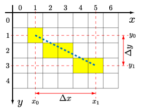

Welche ``Konzepte`` der Programmiersprache üben wir hier?
* Schleifen
* Verzweigungen
* Listen (multidimensional)
* User-Input
* Operatoren (besonders logische)

Welche ``Denkweisen`` üben wir hier?
* Wie gehe ich mit einer Mathematischen Funktion um (lineare Funktion, Steigung)?

Bei Unklarheiten hier nachlesen:
* [Kontrollstrukturen](https://github.com/MrStrelow/BBRZ/blob/main/JET/modul_1_c%23_basics/L02BasicProgrammingConcepts/Skripten/L02.0Kontrollstrukturen.md)

## Schachbrett und Linien.
* Erstelle ein Schachbrett mit den Dimensionen welche der User eingibt. Verwende dazu `Console.ReadLine` und wandle diesen String in eine Zahl um. Ein Schachbrett soll als 2D-Array auf der Console dargestellt werden. Die 16-bit (4-hexbit) Uni-Codes für schwarze ⬛ und weiße ⬜ Symbole sind `\u21B1` und `\u21B2`. Falls diese nicht schön ausgefüllt dargestellt werden (die verwendete Font im Terminal unterstützt diese Symbole nicht als "emoji") verwende die 24-bit (5-hexbit) emojis 🟩 `\u1F7E9` und 🟦 `\u1F7E6`. (windows + . öffnet dir einen preview einiger Emojis auf Windows. Füge diese dann in den Code ``blackSquare = "⬛"`` ein)
* Der User soll nun 2 Paare von `y` und `x` Koordinaten wählen, welche miteinander verbunden werden sollen. Markiere die Start- und Endpunkte mit einem 🟡 und ❌. Verwende für die Verbindung dieser Punkte den Zusammenhang $y=k\cdot x+d$ und $\frac{\Delta y}{\Delta x}=k$. Verwende für jede Zelle, welche als Teil der Linie von den oben genannten Zusammenhängen ausgewählt wird, das Symbol 🔸.

Der Zusammenhang ist bildlich hier dargestellt:



Beginne mit folgenden Fall:
* 🙂 Start 0 0 zu 3 5: hier ist die längere Seite die horizontale Seite (x). Bedeutet wir wollen diese mit einer Schleife abtasten. Die Koordinaten der längeren (y) Richtung wird dann verwendet um die Koordinaten der kürzeren (x) Richtung auszurechnen ($y=k\cdot x+d$)
* 🙂 Stelle sicher, dass horizontale und vertikale Linien funktionieren.
* 🤔 Start 0 0 zu 5 3: hier ist die längere Seite die vertikale Seite (y). ``Achtung!`` Was dreht sich nun alles um? ($y=k\cdot x+d$ oder $x=k\cdot y+d$? bzw. $\frac{\Delta y}{\Delta x}=k$ oder $\frac{\Delta x}{\Delta y}=k$?)
* 💀 Start 3 5 zu 0 0 bzw. 5 3 zu 0 0: Hier ist nun das Problem, dass wir in der For-Schleife von *rechts-nach-links* gehen. Bis jetzt war es *links-nach-rechts*. Passe den Code dementsprechend an. Um die richtigen Vorzeichen der Steigung zu erhalten, müssen wir also anschauen, welches $\Delta$ größer ist *und* ob wir von *rechts-nach-links* oder *links-nach-rechts* fahren. Wir haben hier also **4 Fälle**.  `Tipp:` Schreibe nicht gleich eine 2. For Schleife welche mit `i--` arbeitet. Bleibe bei jener mit `i++` und ziehe diesen Index von der Zielposition ab. Verwende innerhalb der Schleife 4-Verzweigungen.
* ``Optional``: Versuche wenn die Linie nach rechts oben bzw. links unten geht das Symbol `↗️`, links oben bzw. rechts unten, `↘️`, wenn diese "sehr steil" ist ``⬇️`` bzw. ``⬆️`` und "sehr flach" ``➡️`` bzw. ``⬅️``. 

### Testfälle
- 0 5 und 7 7
- 5 0 und 7 7
- 5 7 und 7 0
- 0 7 und 7 5
- 7 7 und 0 5
- 7 7 und 5 0
- 5 7 und 0 7
- 0 7 und 5 7
- 0 5 und 7 7
- 0 0 und 0 7
- 0 7 und 0 0

### Erwartete Ausgabe für den Input 1 2 zu 5 5:
```Größe des Spielbretts eingeben: 6
Größe des Spielbretts eingeben: 6
Wähle die Figur... [x y]: 1 2
... und wähle das Ziel [x y]: 5 5
⬜⬛⬜⬛⬜⬛
⬛⬜⬛⬜⬛⬜
⬜🟡⬜⬛⬜⬛
⬛⬜🔸⬜⬛⬜
⬜⬛⬜🔸🔸⬛
⬛⬜⬛⬜⬛❌
```