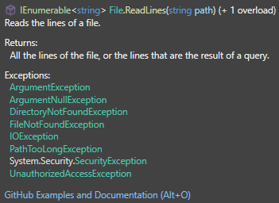

# Exceptions in C#

Exceptions (Ausnahmen) sind spezielle Objekte in C#, die bei Fehlern oder unerwartetem Verhalten zur Laufzeit auftreten und den normalen Programmfluss unterbrechen. Durch das Verwenden von Exceptions können Programme Fehler behandeln und eine kontrollierte Reaktion auslösen, anstatt das Programm abrupt zu beenden.

## Übersicht über existierende Exceptions
In C# ist ``Exception`` die Basisklasse für alle Ausnahmearten. Wir haben bereits Exceptions gesehen wenn diese nicht behandelt werden. Wir haben in einem ``Array`` ein Element auf die Position 5 gesetzt, das ``Array`` ist aber nur 2 groß. Es tritt eine *IndexOutOfRangeException* auf und unser Programm stürzt ab. Andere bereits existierende ``Exceptions`` sind:

- **SystemException**: Die Basisklasse für systembezogene Fehler.
- **ArgumentException**: Wird ausgelöst, wenn ein ungültiges Argument an eine Methode übergeben wird.
- **NullReferenceException**: Tritt auf, wenn auf eine nicht zugewiesene Objektreferenz zugegriffen wird.
- **InvalidOperationException**: Signalisiert einen ungültigen Aufruf von Methoden bei einem Objektzustand, der die Methode nicht zulässt.
- **IndexOutOfRangeException**: Tritt auf, wenn ein Array-Index außerhalb des gültigen Bereichs verwendet wird.
- **FileNotFoundException**: Wird ausgelöst, wenn versucht wird, auf eine Datei zuzugreifen, die nicht gefunden wurde.

## Ein kurzer Teaser... Wann verwende ich Exceptions?
Die Folgende Aussage ist wahrscheinlich zuerst etwas abstrakt. Wir merken uns jedoch folgenes:
> Wir verwenden Exceptions **``auschließlich``** für den folgenden Fall: 
> * *Ich kann mit der aktuellen Situation nicht umgehen. Hier sind detailierte Informationen zum Fehler. Diese Speichere ich und merke mir den Zustand unter dem dieser Fehler entstanden ist.*

Wir versuchen nicht...
> mit Exceptions **``Kontrollstrukturen``** zu implementieren. Ein Beispiel dafür wäre:
> * *Wenn der Fehler auftritt, versuche ihn zu beheben und zwar mit Aufruf von X. Wenn der Fehler danach nochmal passiert, versuche einen anderen Weg diesen zu beheben, wenn das nicht geht versuche es in 5 minuten nocheinmal.*

Warum, sehen wir später. Es ist jedoch wichtig diese Zentrale Idee sofort zu kommunizieren. Wenn wir ``Konstrollstrukturen`` brauchen sollen wir auch die uns bekannten verwenden. Nicht mit *Try-Catch* diese simulieren. *Try-Catch* ist nämlich eine sehr teuere und schwer für den Compiler optimierbare Anweisung. Für die ungeduldigen und/oder erfahrenen-try-catch-user ist [hier](#exception-handling-und-behebung-des-fehlers-gut-oder-schlecht) ein Link zum Kapitel.

Wir beginnen jedoch am Anfang. Wie werfe ich Exceptions und wie fange ich diese wieder?

## Grundlegende Syntax
### Exceptions werfen
In C# verwenden wir das ``keyword`` *throw*, um einen Ausnahmezustand auszulösen. Danach kann ein ``Objekt`` des ``Typs`` *Exception* verwendet werden um die Art des Fehlers zu kommunizieren. Wir nennen dies eine *Excpetion werfen*.

```csharp
if (command is null)
{
    throw new InvalidOperationException("Invalid operation!");
}
else
{
    commandCenter.ApplyCommand(command);
}
```

### Exceptions fangen

In C# wird der `try-catch-finally`-Block verwendet, um die *geworfenen Exceptions* zu Fangen und den Ausnahmezustand zu behandeln. Achtung! Meistens können wir nicht den Fehler beheben wenn eine Exception aufgerufen wird. Es geht meistens darum sicherzustellen, dass 
* Variablen zurückgesetzt werden, 
* Verbindungen geschlossen, 
* Fehler dokumentiert - zB. der Zustand des Programmes, das Betriebssysstem des Users, usw. gespeichert wird. 

Wir müssen nur den ``try`` und den ``catch`` block schreiben. Der mehrere ``catch``Blöcke sowie der ``finally`` Block sind *optional*.

```csharp
try
{
    // Code, der eine Exception auslösen könnte
}
catch (ExceptionType ex)
{
    // Code zur Behandlung der Exception
}
catch (AnotherExceptionType ex)
{
    // Code zur Behandlung einer anderen Exception
}
finally
{
    // Code der immer ausgeführt wird, unabhängig davon ob eine Exception auftritt (Catch), oder nicht (Try).
    // Das wichtigste aber ist auch wenn eine nicht gecatchte Exception auftritt, wird dieser Code ausgeführt!
}
```

### Warum existiert der finally block?
Wir wollen hier den Inhalt eines Files lesen, auf der Console ausgeben und mitzählen wie oft diese Ausgeführt wurde. Beispielsweise wollen wir Kosten verrechnen und dies abhängig machen wie oft eine Funktion aufgerufen wurde. Das passiert unabhängig ob diese funktioniert oder nicht.

Gehen wir von folgendem Code aus:
```csharp
static int usageCounter = 0;

...

try
{
    foreach (string line in File.ReadLines(path: "example.txt"))
    {
        Console.WriteLine(line);
    }

    usageCounter++;
}
catch (IOException e)
{
    Console.WriteLine("Error: " + e.Message);
    usageCounter++;
}

...

```

Um die Eigenschaft, egal ob diese Funktion ausgeführt wird oder nicht, umzusetzen müssen wir in ``try`` sowie ``catch`` Block die Operation ``usageCounter++`` aufrufen. Wenn wir darüber nachdenken, könnten wir diesen doppelten Aufruf vermeiden indem wir diese Erhöhung nach dem ``try`` und ``catch`` ausführen. Dieser sollte sicherstellen, dass egal ob ``try`` oder ``catch`` ausgeführt wurde, ``usageCounter`` um eins erhöht wird.

```csharp
static int usageCounter = 0;

...

try
{
    foreach (string line in File.ReadLines(path: "example.txt"))
    {
        Console.WriteLine(line);
    }
}
catch (IOException e)
{
    Console.WriteLine("Error: " + e.Message);
}

usageCounter++; // wird nicht ausgeführt wenn eine PathTooLongException geworfen wird.

...

```

Das Problem an diesem Beispiel ist, dass wir die eigentlich eine ``if-Verzweigung`` im Kopf haben (was gehoben ausgedrückt, *die gleiche ``operational Semantics`` beider Operationen annehmen* bedeutet). Im obrigen Beispiel haben wir die Idee, dass wir **entweder** die Ausgabe in die Console machen, **oder** die Exception werfen. Das stimmt nicht ganz. Das ist nur der Fall wenn wir auch wirklich eine *IOException* fangen. Was passiert aber wenn eine andere ``Exception`` geworfen wird? Es passiert das, was passiert wenn wir gar keinen ``try-catch`` Block um die Funktion ``File.ReadLines("example.txt")`` geben. Das Programm stürzt ab und beendet sich. Das hätte zur Folge, dass ``usageCounter++;`` nicht ausgeführt wird. 

**Anmerkung**: Das würde auch in der 1. Version des Programms mit ``usageCounter++;`` in ``try`` sowie ``catch`` passieren.

Das lässt uns nun die Frage stellen, *welche Exceptions wirft eigentlich``File.ReadLines``?* Schauen wir nach indem wir mit der Maus über der ``Methode`` hovern.



Müssen wir nun all diese Exception behandeln? Streng genommen, ja. Jedoch können wir auch sicherstellen, dass z.B. kein *ArgumentNullException* auftritt indem wir dies vorher mit ``if(path is not null)`` abfragen. Da wir aber nicht für alle Fälle gewappnet sein können und die Fehler *sinnvoll* verarbeiten können, sollten wir nicht **immer** alle Exceptions fangen welche eine Methode werfen kann. Das müssten wir jedoch tun wenn wir ``usageCounter++;`` **immer** ausführbarmachen wollen. Die Lösung dazu ist nun der ``finally`` Block.

```csharp
static int usageCounter = 0;

...

try
{
    foreach (string line in File.ReadLines(path: "example.txt"))
    {
        Console.WriteLine(line);
    }
}
catch (IOException e)
{
    Console.WriteLine("Error: " + e.Message);
}
finally
{
    usageCounter++; // egal ob try, catch oder eine nicht gecatchte Exception passiert, es wird um eins erhöht!
}

...

```

Dieser stellt unabhänig davon welche ``Exception`` geworfen wird sicher, dass dieser Codeblock ausgeführt wird. Wir müssen also nicht alle ``Exceptions`` fangen um immer ``usageCounter++;`` auszuführen.

**Anmerkung:** Wir können auch ``catch (Exception e)`` verwenden um eine allgemeine ``Exception`` zu fangen. Bedeutet wir fangen **alle** im Bild aufgelisteten ``Exceptions`` und könnten dadurch ``usageCounter++;`` ohne ``finally`` ausführen. Jedoch ist ein solches **potentiell** problematisch, da wir nicht unterscheiden können welcher Ausnahmezustand aufgetreten ist. Das ist nur sinnvoll, wenn wir unter **allen** Umständen vermeiden wollen, dass unser Programm abstürzt. 

```csharp
static int usageCounter = 0;

...

try
{
    foreach (string line in File.ReadLines(path: "example.txt"))
    {
        Console.WriteLine(line);
    }
}
catch (Exception e) // Wir haben keine Anhung was passiert ist... IO? Path too long? File not found? 
{
    Console.WriteLine("Error: " + e.Message);
}

usageCounter++; // führen dadurch aber immer die Addition aus...

...

```

**Anmerkung zur Anmerkung:** In der Web-Programmierung müssen wir uns keine Sorgen machen, dass das gesamte Programm welches am Web-Server läuft komplett abstürzt, wenn eine ``Exeption`` nicht abgefangen wird. Es stürzt nur eine Art *Mini-Programm* ab. Für andere Anfragen funktioniert das Programm noch. Trotzdem ist es sehr sinnvoll ``finally`` zu verwenden um z.B. den request des Users zu speichern bevor das *Mini-Programm* durch eine nicht gefangene ``Exception`` abstürzt. Ein anderes *Mini-Programm* kann diesen Request möglicherweise wiederherzustellen und ausführen, ohne dass der User einen neuen Request schicken muss. Das wäre falls der Fehler nicht am Request sondern durch einen internen Fehler erzeugt wird.


## Runtime (Unchecked) Exceptions
`Runtime` oder `Unchecked` Exceptions sind jene, welche wir nicht `zwingend` behandeln müssen. 
Ein Name welcher eventuell näher an der Bedeutung ist, wäre `Not-Forced-To-Check` Exceptions.
Obwohl wir beim Zugriff auf ein Array möglicherweise eine `IndexOutOfRangeException` erzeugen,
müssen wir diese nicht immer beim Aufruf von z.B. `numbers[5]` fangen. Wir können es aber.

```csharp
try
{
    int[] numbers = [1, 2, 3];
    Console.WriteLine(numbers[5]); // Dieser Zugriff wird eine IndexOutOfRangeException auslösen
}
catch (IndexOutOfRangeException ex)
{
    Console.WriteLine("Ein Fehler ist aufgetreten: {ex.Message}");
}
```

## Compiletime (Checked) Exceptions
In C# gibt es im Gegensatz zu JAVA `keine Compiletime` Exceptions. Somit sind alle Exceptions in C# `unchecked`.
Diese wurden in `JAVA` mit hilfe von `throws` bei der Methodensignatur hinzugefügt.
Diese Zwingen den Programmierer ein `try-catch-finally` Konstrukt zu verwenden, falls diese Methode verwendet werden sollte.
Ein Name welcher eventuell näher an der Bedeutung ist, wäre `Forced-To-Check` Exceptions.

```java
public static void meineMethode() throws IchbinEineCheckedException {
    ...
}

public static void main(String args[]) {
    meineMethode(); // gibt einen Fehler: Der Aufruf muss innerhalb eines try-catch blocks sein.
}
```

Mithlife von `checked` Exceptions kann der Programmierer vorgeben ob und wo Exceptions zu behandeln sind.
Dies führt jedoch zu einer sehr excessiven Verwendung von Exceptions, welche den Code schwer lesbar machen.

## Mehrere catch-Blöcke
Um verschiedene Arten von Exception fangen zu können, können mehrere`catch`-Blöcke verwendet werden:

```csharp
try
{
    int number = int.Parse(Console.ReadLine()); // Wenn "abc" eingegeben wird, wird eine FormatException ausgelöst.
}
catch (FormatException ex)
{
    Console.WriteLine($"Ungültiges Format: {ex.Message}");
}
catch (IOException ex)
{
    Console.WriteLine($"Ein Fehler beim der Verbindung zur Console ist aufgetreten: {ex.Message}");
}
```

## Zusammenfassen von catch-Blöcken
Um manche Exceptions zusammenfassen zu können, verwenden wir:
```csharp
try
{
    StreamReader reader = new StreamReader("example.txt");
    string content = reader.ReadToEnd();
}
catch (Exception ex) when (ex is FileNotFoundException || ex is DirectoryNotFoundException)
{
    Console.WriteLine("The required resource was not found. Attempting recovery.");
}
// Solche catch Blöcke wollen wir unbedingt vermeiden!
catch (Exception ex)
{
    Console.WriteLine("Ein allgemeiner Fehler ist aufgetreten: " + ex.Message);
    Logger.log("sehr viel text was niemand lesen wird.")
}

Console.WriteLine("Dateiinhalt: " + content);
```
Versuche zudem nur Code im ``catch`` Block zu haben, welcher wirklich exceptions wirft. Falls dieser Code jedoch nicht ressourcenintensive ist, können diese auch im ``catch`` Block vorkommen. Ansonsten wirkt der Programmcode "zerstückelt". Hier haben wir ``Console.WriteLine("Dateiinhalt: " + content);`` außerhalb des ``catch`` Blockes.

Hier ist ``when`` ein Keyword welches nach einer Bedingung oder in diesem Fall bei catch, nach einer ``Exception`` angegeben werden kann. Danach folgt ein ``logischer Ausdruck`` welche die zuerst angegebene Exception verfeinert.
Es wird also eine ``Exception ex`` angeschaut, wenn diese vom Typ ``FileNotFoundExceptin`` oder ``DirecotryNotfoundException`` ist. 

Ein weiteres Beispiel für einschränkungen bei Exceptions ist folgendes:
```csharp
catch (SqlException ex) when (ex.Number == 547) // z.B. 547 ist Foreign key constraint violation. 547 sind SQL server Error Codes.
{
    Console.WriteLine("Foreign key constraint violated.");
}
```

## Benutzerdefinierte Exceptions

Benutzerdefinierte Exceptions können erstellt werden, indem von der Klasse `Exception` geerbt wird:

```csharp
public class InvalidUserException : Exception
{
    public InvalidUserException(string message) : base(message) { }
}
```

Verwendung der benutzerdefinierten Exception:

```csharp
public void ValidateUser(User user)
{
    if (user == null)
    {
        throw new InvalidUserException("Der Benutzer ist ungültig.");
    }
}
```

## Wiederwerfen von Exceptions

Eine Exception kann mit dem Schlüsselwort `throw` erneut ausgelöst werden, um sie an eine höhere Ebene weiterzugeben:

```csharp
try
{
    CheckUser(null);
}
catch (InvalidUserException ex)
{
    Console.WriteLine("Ein Benutzerfehler ist aufgetreten.");
    throw; // Wirft die Exception erneut
}
```

## Ausnahmeinformationen erweitern

Ein häufiger Ansatz zur Verbesserung der Fehlersuche besteht darin, eine innere Exception (`InnerException`) zu verwenden, um den ursprünglichen Fehlerkontext zu bewahren:

```csharp
try
{
    // Möglicherweise fehleranfälliger Code
}
catch (Exception ex)
{
    throw new InvalidOperationException("Eine Fehlermeldung", ex);
}
```

## Gibt es in C# ein `try-with-resources`-Äquivalent?

C# unterstützt kein `try-with-resources` wie in Java, aber es bietet die `using`-Anweisung, die dasselbe Ziel erreicht: Ressourcen automatisch zu schließen, sobald sie nicht mehr benötigt werden. Die `using`-Anweisung stellt sicher, dass das Objekt, das `IDisposable` implementiert (beispielsweise `StreamReader`, `FileStream`, und `SqlConnection`), freigegeben wird, auch wenn eine Exception auftritt.

### Beispiel mit `using`-Anweisung

```csharp
using System;
using System.IO;

public class Program
{
    public static void Main()
    {
        try
        {
            // Verwenden der `using`-Anweisung zur automatischen Freigabe der Ressource
            using (StreamReader reader = new StreamReader("example.txt"))
            {
                string content = reader.ReadToEnd();
                Console.WriteLine("Dateiinhalt: " + content);
            }
        }
        catch (FileNotFoundException ex)
        {
            Console.WriteLine("Fehler: Datei nicht gefunden. " + ex.Message);
        }
        catch (IOException ex)
        {
            Console.WriteLine("Fehler beim Lesen der Datei. " + ex.Message);
        }
    }
}
```

## Alternativen zu try-catch
Vergleiche den folgenden Code nun mit der [hier](#mehrere-catch-blöcke) geschriebenen Exceptions. Die Try Methoden sind in [Variablen Umwandeln](https://github.com/MrStrelow/BBRZ/blob/main/JET/modul_1_c%23_basics/L02BasicProgrammingConcepts/L02BasicProgrammingConcepts/L02.1VariablenUmwandeln.md) näher erklärt.

```csharp
if (int.TryParse(Console.ReadLine(), out int intValue))
{
    // Umwandlung erfolgreich
}
else 
{
    // Umwandlung nicht erfolgreich
}
```

In C# bieten die `Try` Methoden eine alternative zum Werfen einer Exception. 
Dies wird meist verwendet, falls in einer Anwendung die Verwendung von Exceptions zu "rechenintensiv" sind. 
Eine Verwendung von Exceptions bringt einen nicht zu vernachlässigen Aufwand mit sich (Generierung der stack traces, bewusst fehlende Compiler optimierungen).
In unserem Fall ist dies die `FormatException`. Die Methoden welche mit `try` im Namen beginnen, sagen uns, "es wird keine Exception geworfen, es wird `false` zurück gegeben".
Ein weiteres Beispiel wäre die Methode `TryGetValue` welche bei einem Dictionary zu finden ist (siehe [nächstes Lektion - Collections](https://github.com/MrStrelow/BBRZ/blob/main/JET/modul_1_c%23_basics/L03Collections/L03Collections/L03.0ListenUndDictionaries.md)).
Selbst geschriebene Methoden, welche `Try` beinhalten sollen dasselbe signalisieren. 

Zudem ist folgendes möglich. Achtung! Hier wird davon ausgegangen, dass `Parse` möglicherweise einen Fehler liefert, falls der User einen nicht umwandelbaren String eingibt.
Jedoch kann sehr wohl die `ReadLine` Methode einen Fehler zurückgeben. Wie die oben abgefangene `IOException`.

```csharp
int intValue;
while (!int.TryParse(Console.ReadLine(), out intValue))
{
    // Umwandlung nicht erfolgreich - wiederhole die Eingabe
}
```

## Exception-Handling und Behebung des Fehlers... gut oder schlecht?

In diesem Beispiel wird ein Versuch gemacht, eine Datei zu speichern. Sollte dabei ein Problem auftreten, wird die Exception gefangen und der Inhalt in eine andere Datei geschrieben. Anschließend wird die Ressource geschlossen.

Ein ähnliches Beispiel könnte sein, wenn Excel in die cloud speichern will. Falls das nicht geht speichern wir den Inhalt der Datei vorher noch in eine temporäre Datei.

## Code-Beispiel

```csharp
using System;
using System.IO;

public class Program
{
   public static void Main()
    {
        string filePath = "output.txt";
        string content = "Das ist der Inhalt, der gespeichert werden soll.";

        try
        {
            // Versucht, in die ursprüngliche Datei zu schreiben
            using (StreamWriter writer = new StreamWriter(filePath))
            {
                writer.WriteLine(content);
                Console.WriteLine($"Inhalt erfolgreich in {filePath} gespeichert.");
            }
        }
        catch (IOException)
        {
            string tempFilePath = "temp_output.txt";

            Console.WriteLine("Warnung: Konnte nicht in die ursprüngliche Datei schreiben. Versuche, in die temporäre Datei zu schreiben.");

            try
            {
                // Versucht, in die temporäre Datei zu schreiben.
                // Stellen Sie sich vor, hier handelt es sich um ein anderes Laufwert, die Cloud oder ein Temporärer Ordner wo wahrscheinlicher ist, dass berechtigungen vorhanden sind.
                using (StreamWriter writer = new StreamWriter(tempFilePath))
                {
                    writer.WriteLine(content);
                    Console.WriteLine($"Inhalt erfolgreich in {tempFilePath} gespeichert.");
                }
            }
            catch (IOException)
            {
                // Finale Warnung, wenn auch das Schreiben in die temporäre Datei fehlschlägt
                Console.WriteLine("Fehler: Konnte den Inhalt weder in die ursprüngliche Datei noch in die temporäre Datei speichern.");
            }          
        }
    }
}
```

besser so

```csharp
using System;
using System.IO;
using System.Threading;
using System.Threading.Tasks;

class ExcelSaveHandler
{
    private const int MaxRetries = 5;
    private const int RetryIntervalMilliseconds = 60000;

    public void SaveExcelToCloud(string excelPath, string cloudDestination)
    {
        if (TrySaveToCloud(excelPath, cloudDestination))
        {
            Console.WriteLine("Excel file saved to the cloud successfully.");
        }
        else
        {
            Console.WriteLine("Initial cloud save failed. Starting retry process...");
            StartRetryThread(excelPath, cloudDestination);
        }
    }

    private bool TrySaveToCloud(string sourcePath, string cloudDestination)
    {
        // Simulate cloud save operation
        try
        {
            Console.WriteLine($"Attempting to save {sourcePath} to {cloudDestination}...");
            // Add your cloud save logic here (e.g., API calls, file uploads)
            // Simulate success or failure with a random generator:
            Random random = new Random();
            if (random.Next(0, 2) == 0) throw new IOException("Simulated cloud save failure");

            return true;
        }
        catch (Exception ex)
        {
            Console.WriteLine($"Cloud save failed: {ex.Message}");
            return false;
        }
    }

    private void StartRetryThread(string sourcePath, string cloudDestination)
    {
        Task.Run(() =>
        {
            for (int attempt = 1; attempt <= MaxRetries; attempt++)
            {
                Thread.Sleep(RetryIntervalMilliseconds); // Wait before retrying
                Console.WriteLine($"Retry attempt {attempt} of {MaxRetries}...");
                if (TrySaveToCloud(sourcePath, cloudDestination))
                {
                    Console.WriteLine("Cloud save succeeded on retry.");
                    return;
                }
            }

            Console.WriteLine("All retries failed. Saving locally as a fallback...");
            SaveLocally(sourcePath);
        });
    }

    private void SaveLocally(string sourcePath)
    {
        string tempDirectory = Path.GetTempPath();
        string tempFilePath = Path.Combine(tempDirectory, Path.GetFileName(sourcePath));

        try
        {
            File.Copy(sourcePath, tempFilePath, overwrite: true);
            Console.WriteLine($"Excel file saved locally as: {tempFilePath}");
        }
        catch (Exception ex)
        {
            Console.WriteLine($"Failed to save locally: {ex.Message}");
        }
    }
}
```

TODO: anschauen was alles schief gehen kann, wenn Exception als control flow verwendet werden.


