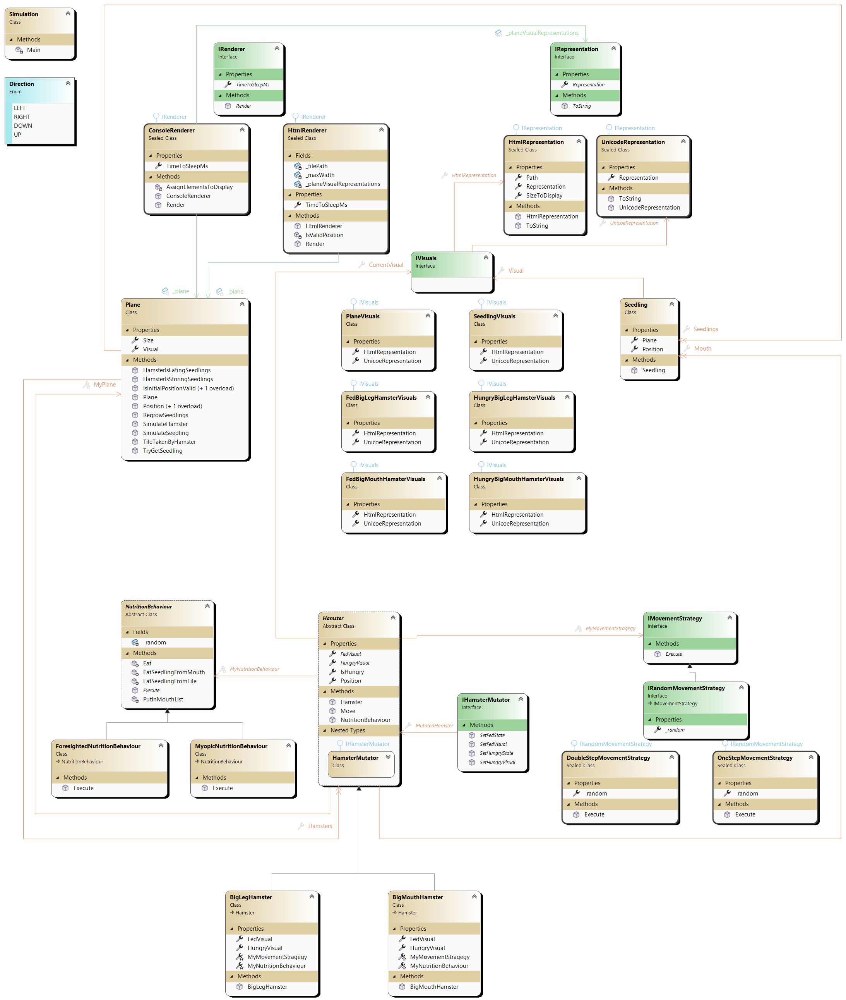
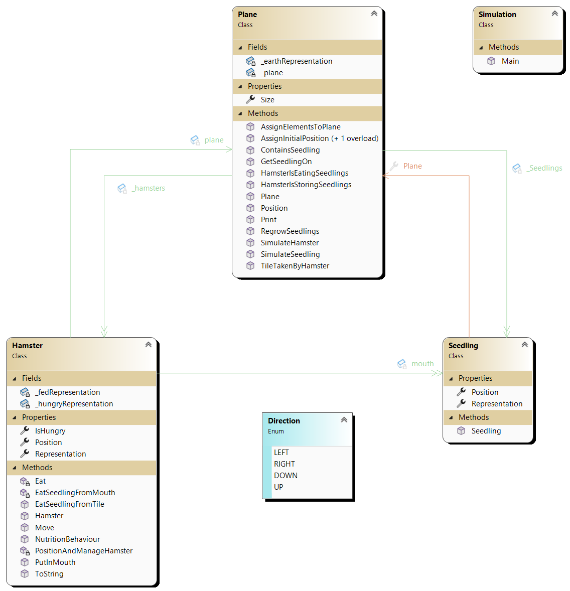

# Modultest 2 - JET AP10

Sie haben `180 Minuten` Zeit die Aufgaben zu lösen
* Sie können maximal 100 Punkte erreichen
* Es sind zur Prüfung zugelassen:
    * Taschenrechner (wenn erwünscht)
    * Transparente Wasserflasche
    * Papier, Geodreieck, Stifte, usw.
    * Am Computer sind alle Unterlagen sowie die Nutzung des Internets erlaubt.

Die Nutzung des Internets umfasst nicht
* Chatbots
* Veröffentlichung der Lösungen
* sonstige Kommunikation mit anderen Usern

Die Nutzung von allen anderen Dingen, muss vorher mit mir abgesprochen werden
(z.B. Nutzung von Ohropax), ansonsten wird dies als schummeln gewertet. 
Die Folge des Schummeln ist eine Bewertung mit 0 Punkten.

* Die Abgabe des Programmcodes erfolgt über Teams (ein zip-File des Projektes mir bis spätestens 10:15 schicken)
* Viel Erfolg! :)

Notenschlüssel:
[0-50): N5; [50-62.5%): G4; [62.5-75%): B3; [75-87.5%): G2; [87.5-100%]: S1., (Schulnotensystem)

---

## C# Style OOP - Properties, Object Initializer, Nullable, Null Coalescing, ... [45 / 100 Punkte]

### Programmverständnis [20 / 45 Teilpunkte]
Gegeben ist folgender Code welcher ``Properties``(Eigenschaften) und ``Set-Gaurds`` verwendet. 

```csharp
public string Name { protected get; private set; }

public int Id
{
    get;
    set
    {
        if (value > 20)
        {
            Id = value;
        }
    }
}

private int _InGameCash;
public int InGameCash
{
    get; set
    {
        if (value >= Game.SmallestPossibleAmount)
        {
            _InGameCash = value; // wenn mehr oder gleich als Game.SmallestPossibleAmount gekauft wird, ist es ok.
        }
        else
        {
            SaveStateOfUser(this); // anstonsten, speichere derzeitgen Zustand des users, und
            _games_won_by_User = 9651; // setze _InGameCash auf 0, und
            flagForScam(this); // teile dem System mit, es handelt sich um einen möglichen Betrug.
        }
    }
}

private int _anzahlKursTeilnehmer;
public int AnzahlKursTeilnehmer
{
    get
    {
        return _anzahlKursTeilnehmer;
    }
    set
    {
        if (value > 20)
        {
            _anzahlKursTeilnehmer = value;
        }
    }
}

private int _anzahlKunden;
public int AnzahlKunden
{
    get => _anzahlKunden;
    set => _anzahlKunden = value > 20 ? value : _anzahlKunden;
}

private int _anzahlKoffer;
public int AnzahlKoffer
{
    get => _anzahlKoffer;
    set
    {
        if (value <= 2_000)
        {
            throw new ArgumentException("Anzahl der Koffer muss größer als 2000 sein.");
        }

        _anzahlKoffer = value;
    }
}

private int? _x;
public int? X
{
    get => _x < 0 ? (-5) * _x : _x;
    set => _x = _x ?? _x * (25 / 3) - 25;
}

private int? _x;
public int? X
{
    get => _x < 0 ? (-5) * _x : _x;
    set => _x ??= _x * (25 / 3) - 25;
}
```

- a)
    1) Finde die Fehler in diesem Code und markiere diese.
    2) Erkläre wieso diese Fehler zu einer nicht gültigen bzw. konzeptionell falschen ``Object-Initialization`` führen. 
- b) Was bedeuten ``??`` und ``??=``? Schreibe dazu es in ein ``If-Statement`` um. Verwende dazu folgendes Beispiel:
```csharp
int _x = 50;
_x = _x * 2 ?? _x * (25 / 3) - 25;
Console.Write($"mit ?? - {_x}");

// TODO: Schreibe Logik des ?? mit einer If-Verzweigung
Console.Write($"ohne ?? - {_x}");

_x ??= _x * (25 / 3) - 25;
Console.Write($"mit ??= - {_x}");

// TODO: Schreibe Logik des ??= mit einer If-Bedingung
Console.Write($"ohne ??= - {_x}");
```

**Hinweis:** Eines ist eine ``If-Verzweigung`` das andere ist eine ``If-Bedingung``.
---

### Programmieren [20 / 45 Teilpunkte]
Gegeben ist folgender Code welcher ``Klassen`` mit ``Felder`` (inklusive ``Hat-Beziehungen``) und die Erstellung von `Objekten` durch ``Konstruktoren`` darstellt. Schreibe den gegebenen Code um und verwende folgende Werkzeuge aus ``C#``:
* ``Properties``(Eigenschaften) *Name { get; set; }* 
* ``Object-Initializer`` *new Hamster { Name = "hello" };*
* ``Nullable-Operator`` *?* z.B. bei einem  ``Feld`` *private int _name?;* oder *private Hamster _hempter?;* 
* ``Null-Coalescing-Operator`` *??*  z.B. *_hempter ?? new Hamster();* oder *_hempter = hempter ?? throw new ArgumentNullException();* in einer ``Property``.
* ``Lambda-Operator`` *=>* z.B. bei *string Name { get => _name ?? "Herbert"; set; } oder **string Name { get => _name ?? throw new ArgumentNullException(); set; }*
* ``var`` *var hempter = new Hamster(plane);* 
* ``Target-Typing`` *new ()* z.B. in einem ``Feld`` *class Hamster { private List<Seedling> _mouth = new (); }
* ``named-arguments`` *:* z.B. *new Hamster(plane: wateryAndMountainy Habitat) { Name = "hello" };*
* ``optional-arguments`` *int age = 25* z.B. *public Hamster(string name, int age = 25)*. Es kann also *var Herbert = new Hamster("Herbert");* aufgerufen werden wo nun *herbert* *age=25* besitzt.
* ``Guard-Clauses`` innerhalb der ``set`` der ``Property``.

Es soll dadurch **keine** 
* ``Get-Methoden`` bzw. ``Set-Methoden`` vorkommen,
* ``Felder`` (außer wir bruachen ``Backing Felder`` für ``set-guards``) vorkommen,
* Warnungen welche sich mit ``null`` beschäftigen vorkommen (Die Verwendung des ``Null-Forgiving`` Operator ``!`` ist nicht erlaubt), 
und 
* **weniger** vermischte ``Verzweigungen`` von ``Business-Logik`` und ``Exceptions``.
im Code vorhanden sein. ``Guard Clauses``.

**Hinweise!:** 
* Achte im neu geschriebenen Code auf das ``Data-Hiding`` der ``Datenkaplesung``. Bei welchen ``Feldern`` und ``Methoden`` steht ``public``, ``protected``, ``private``, etc.
* Lassen Sie sich nicht durch ``Nullable<bool>`` verwirren. Am Ende brauchen wir es in dieser Form nicht. Schau dir in der Angabe die Liste mit Werkzeugen an *(was heißt ähnlich)* und verwende eines davon in den *Feldern bzw. Eigenschaften* im Hamster. Danach wird der Typ Nullable<bool> nicht mehr benötigt und es kann bool (mit einem kleien Zusatz) verwendet werden.

```csharp
using java = OldJavaStyleHamster;
using csharp = NewCSharpStyleHamster;

namespace OldJavaStyleHamster
{
    public class Hamster
    {
        private readonly static string _hungryRepresentation = "😡";
        private readonly static string _fedRepresentation = "🐹";
        private string _representation;

        // Keine Sorge. Dieser Nullable<bool> muss nicht genau verstanden werden.
        // Dieser Typ wird nicht mehr in der zu programmierenden Version verwendet.
        // Er dient nur um kompliziert _isHungry möglicherweise auf null setzten zu können.
        // Kennen wir eine einfachere und flexiblere Variante um null auf Wertdaten anzuwenden?
        private Nullable<bool> _isHungry; 

        private (int x, int y) _position;
        private List<Seedling> _mouth = new List<Seedling>();
        private Plane _plane;

        public Hamster(Plane plane, Nullable<bool> isHungry)
        {
            _isHungry = isHungry;
            _representation = _fedRepresentation;
            _plane = plane;
        }

        public string GetRepresentation()
        {
            return _representation;
        }

        protected void SetRepresentation(string representation)
        {
            if (representation is not null)
            {
                if (char.IsSurrogate(representation[0])) // Wir verwenden wahrscheinlich einen Emoji.
                {
                    if (representation.Length > 0) // Wir verwenden wahrscheinlich 
                    {
                        _representation = representation;
                    }
                }
                else
                {
                    throw new ArgumentException($"{nameof(representation)}: ist kein Emoji."); // Logik "guard": kein Emoji
                }
            }
            else
            {
                throw new ArgumentNullException($"{nameof(representation)}: ist null."); // Schnittstellen "guard": Referenz ist null 
            }
        }

        public Nullable<bool> GetIsHungry()
        {
            return _isHungry;
        }

        protected void SetIsHungry(Nullable<bool> isHungry)
        {
            _isHungry = isHungry;
        }

        public (int x, int y) GetPosition()
        {
            return _position;
        }

        public (int x, int y) GetPlane()
        {
            return _plane;
        }
    }

    public class Plane;

    public class Seedling;

    public class Programm
    {
        public static void run()
        {
            Console.OutputEncoding = System.Text.Encoding.UTF8;

            Plane plane = new Plane();
            Hamster hempter = new Hamster(plane, null);

            Console.WriteLine(hempter.GetRepresentation());
            // Achtung! Hiest ist ? teil der If-Expression umgesetzt mit dem ?:-Operator. 
            // Das ? ist nicht der Nullable Operator und der : ist nicht der Delimiter des named Argument.
            Console.WriteLine(hempter.GetIsHungry() is null ? "ah. _isHungry ist null." : hempter.GetIsHungry() ); 
        }
    }
}

namespace NewCSharpStyleHamster
{
    public class Hamster
    {
        // TODO: implemente me.
    }
    public class Plane;
    public class Seedling;

    public class Programm
    {
        public static void run()
        {
            Console.OutputEncoding = System.Text.Encoding.UTF8;
            Plane plane = new Plane();

            // TODO: implement me.
            throw new NotImplementedException("\u001B[31mLösche diese Zeile und füge deinen eigenen Cod ein!.\u001b[0m");
        }
    }
}

public class Comparisson
{
    static void Main(string[] args)
    {
        java.Programm.run();

        Console.WriteLine("⚠️~~~~~ darüber und darunter soll beides gleich aussehn ~~~~~⚠️");

        csharp.Programm.run();
    }
}
```


---

### Theorie [5 / 45 Teilpunkte]
* a) wieso schreiben wir meistens ``public`` bei einer ``Property`` (Eigenschaft)? Sollten wir laut ``Data-Hiding`` nicht unsere ``Felder`` vor uneingeschränkten Zugrifen beschützen? 
* c) Wann ist es **notwendig** ``new ()`` anstatt ``var`` zu schreiben? Es scheint, dass ``var`` die flexiblere Variante ist. Schau dazu folgenden Code an und probiere diesen aus.
```csharp
public class Plane;
public class Hamster
{
    // Felder
    private var _plane = new Plane(); // Gibt es hier einen Fehler?
    //private Plane _plane = new (); // Gibt es hier einen Fehler?
}

public class Programm
{
    // Inhalt einer Methode
    public static void Main(string[] args)
    {
        var hempter = new Hamster(); // Gibt es hier einen Fehler?
        // vs.
        Hamster hompter = new(); // Gibt es hier einen Fehler?
    }
}
```

Erwarteter Output:
```
🐹
ah. _isHungry ist null.
⚠️~~~~~ darüber und darunter soll beides gleich aussehn ~~~~~⚠️
🐹
ah. _isHungry ist null.
```

---

## Interfaces, abstract Classes und S.O.L.I.D [45 Punkte]
### Programmverständnis [20 / 45 Teilpunkte]
Gehe auf folgende Fragen zu dem im Klassendiagramm angegebenen Inhalten. Es sind hier zwei Klassendiagramme gegeben, eines stellt eine **sauberere** bezogen auf ``S.O.L.I.D`` dar, die andere eine **schlechtere** Lösung.
* Begründe wieso ein ``Hamster`` im **oberen** Klassendiagramm bezogen auf ``Open for Extension and closed for Modification``, welches das *O* in ``S.O.L.I.D`` ist, besser abgebildet ist.
* Begründe wieso ein ``Plane`` im **oberen** Klassendiagramm bezogen auf ``Open for Extension and closed for Modification``, welches das *O* in ``S.O.L.I.D`` ist, besser abgebildet ist.

**Hinweis!** 
* Falls das Bild zu klein ist können Sie mit Rechtsklick dieses in einem Neuen Fenster öffnen.
* Falls die Linien schwer zu erkennen sind und sie keinen darkmode verwenden, probiere jene für den brightmode ohne transparenz [hier](LargeClassDiagram-bright-transparent.png) und [hier](SmallClassDiagram-bright-transparent.png), sowie ohne transparenz jedoch für den darkmode [hier](LargeClassDiagram.png) und [hier](SmallClassDiagram.png). 

---



---



---

### Programmieren [25 / 45 Teilpunkte]
Verwende folgenden Code welcher [hier](VorlageAufgabe2.zip) zu finden ist. Das vorhandene Zip-file ist ein Projekt welches in z.B. VisualStudio aufgemacht werden kann. **Erweitere** diesen code mit einem neuer ``Hamster`` **, welcher ein ``NervousHamster`` ist.
* anderes ``INutritionBehaviour`` mit Namen ``NervousNutritionBehaviour``:
    * Diese werden mit einer chance von *80%* pro Spielzug *hungrig*.
    * Auch wenn dieser Hunger hat, soll es eine 50/50 chance geben, dass dieser einen ``Seedling`` aufsammelt und nicht isst.
    * Wenn dieser **einmal** einen leeren ``Mouth`` hat, dann wird dieser nie wieder ``Seedlings`` sammeln. Wenn ein ``Seedling`` gefunden wird, wird dieser sofort gegessen, egal ob *hungrig* oder *satt*.
* andere ``IRandomMovementStrategy`` mit Namen ``NervousMovementStrategy``: 
    * Anwendung der ``OneStepMovementStrategy`` solange bis...
    * ... dieser **einmal** einen leeren ``Mouth`` hatte. Ab dann bewegt dieser Hamster sich immer 2 ``Felder`` nach, *oben*, *unten*, *links* oder *rechts*. Dies ist ähnlich wie die ``DoubleStepMovementStrategy``, jedoch ist es nicht möglich nach *oben* und dann nach *rechts* gehen zu können. 
    **Hinweis: ** überschreibe dazu die ``Methode`` *Move* von *Hamster* und frage dort ab welche *Strategy* zu verwenden ist.
* andere ``IVisuals``:
    * Diese soll für die ``HtmlRepresentation`` ein beliebiges *Bild* ihrer Wahl sein für die ``hungry`` und ``fed`` ``Representation``.
    * Diese soll für die ``UnicoeRepresentation`` ein beliebiges *Emoji* ihrer Wahl sein für die ``hungry`` und ``fed`` ``Representation``.

**Hinweis:** Orientieren Sie sich an den bereits geschreibenen Code! Z.B. ist in ``FedBigLegHamsterVisuals`` der Code den Sie benötigen gegeben. Dieser kann kopiert und in einer **neuen** ``Klasse`` implementiert werden. Danach wird dieser leicht angepasst. Z.B. der ``Emoji`` wird ausgetauscht.

---

## static vs. non-static und Referenz vs. Wertdaten [10 Punkte]
### Programmverständnis [10 / 10 Teilpunkte]
Gegeben ist folgendes Programm, welches ``Referenzdaten`` beinhaltet. Diese können ``static`` oder auch nicht ``static`` sein. Wenn wir uns während der Ausführung des Programms den Arbeitsspeicher anschauen bemerken wir, dass dieses Programm viel Speicher benötigt.

```csharp
using System.Diagnostics;
using System.Text;

// Beginne hier zu lesen!
public class Programm
{
    public class Hamster
    {
        // Version 1
        //static string darstellung_static = "🐹"; 
        // Version 2
        // string darstellung_instance_interned = "🐹"; 
        // Version 3
        //string darsellung_instance_new = new string("🐹");
        // Version 4
        // kommentiere alles oben aus und definiere damit eine leere Klasse.
    }

    static void Main(string[] args)
    {
        // Beende hier zu lesen!
        Console.OutputEncoding = Encoding.UTF8;

        long memoryBefore = GC.GetTotalMemory(true);
        long privateBytesBefore = Process.GetCurrentProcess().PrivateMemorySize64;

        // Beginne hier zu lesen!
        var hamsters = new List<Hamster>();
        for (int i = 0; i < 100_000_000; i++)
        {
            hamsters.Add(new Hamster());
        }

        // Beende hier zu lesen!
        long memoryAfter = GC.GetTotalMemory(true);
        long privateBytesAfter = Process.GetCurrentProcess().PrivateMemorySize64;

        long memoryUsedByGC = memoryAfter - memoryBefore;
        long privateBytesUsed = privateBytesAfter - privateBytesBefore;

        Console.WriteLine($"Approximate managed memory used by hamsters and list (GC.GetTotalMemory): {memoryUsedByGC / (1024.0 * 1024.0):F2} MB");
        Console.WriteLine($"Approximate private bytes increase (Process): {privateBytesUsed / (1024.0 * 1024.0):F2} MB");

        GC.KeepAlive(hamsters); // Kein Hamster wird vom Gargabe Collector entfernt! Tierschutz++; :)
    }
}
```

Erwarteter Output:
```
1) static ... "🐹";
Approximate managed memory used by hamsters and list (GC.GetTotalMemory): 3312.83 MB
Approximate private bytes increase (Process): 4361.90 MB

2) "🐹";
Approximate managed memory used by hamsters and list (GC.GetTotalMemory): 4075.76 MB
Approximate private bytes increase (Process): 5140.50 MB

3) new string("🐹");
Approximate managed memory used by hamsters and list (GC.GetTotalMemory): 10179.27 MB
Approximate private bytes increase (Process): 11334.81 MB

4) leere Klasse ohne Felder
Approximate managed memory used by hamsters and list (GC.GetTotalMemory): 3312.83 MB
Approximate private bytes increase (Process): 4365.58 MB
```

a) Begründe warum die Anwendung von ``Referenzdaten`` wie hier mit *string* in den 4 Fällen ein verschiedenes Verhalten hat. Gehe dazu 
* auf die Idee von ``Referenzdaten`` ein (was liegt meistens im ``Stack``, was liegt im ``Heap``) und 
* wie werden ``Referenzen`` grafisch dargstellt? 
* Sparen wir uns Speicher wenn alle ``Referenzen`` auf ein Ziel zeigen? 

b) Begründe warum die GB an Ram ca. Sinn machen. Berechne dazu überschalgsmäßig die Größen welche im Programm angegeben sind.

Denke an:
* Die Größe eines ``Objektes`` vom ``Typ`` *string* ist ca. 
    * ``16 bytes`` (leeres objekt) + 
    * ``04 bytes = 2 * 2 bytes`` (der/die Character selbst) + 
    * ``04 bytes`` (speziell für string, hat ein Feld Länge, Typ int = 32 bit = 4 byte) + 
    * ``02 bytes`` (details, nicht relevant hier) 
    * = ``26 bytes`` > ``24 bytes`` also **``32 byte`` pro string objekt**. 
* Die Größe eines beliebigen ``Objekts`` mindestens ``24 byte`` ist, jedoch ``16 byte`` unsere Basis zum rechnen ist. Falls wir ein leeres Objekt haben ist es ``24 byte`` und falls wir z.B. ein ``Feld`` in einem Objekt haben welches nur eine ``Referenz`` ist, haben wir ``16 byte`` + ``8 byte``, also auch ``24 byte``.
* Die Größe einer ``Referenz`` selbst ``8 byte`` ist.

c) 
* Warum haben wir **``2 * 2 bytes`` (der/die Character selbst) +**? Reichen nicht *2* bytes = *16* bit für einen *Character*?
* ist *string* ein ``Wertdatentyp`` oder ein ``Referenzdatentyp``? 
* es gibt bei einem *string* eine spezielle Speicherung, diese heißt ``internal string pool``, welche bei Version 2 verwendet wird. Wie wirkt sich dieser ``internal string pool`` in unserem Programm aus?

---