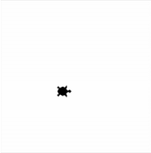
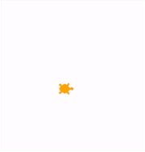
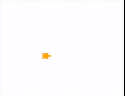
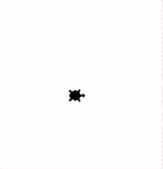

## Funktionen und Prozeduren aufrufen mit Turtle
### Garten und Haus abmessen
Unsere Turtle will ihr Haus und Ihren Garten abmessen. Genauer gesagt den Umfang dieser Bestimmen. Dazu nimmt sie einen Faden, befestigt diesen am Boden und geht eine gerade Strecke. Wenn sie sich dreht und eine neue gerade Strecke abgehen will, befestigit sie wieder den Faden. Sie tut das so lange bis sie Ihren quadratischen Garten und ihr quadratisches Haus abgemessen hat. Das Haus liegt im Mittelpunkt des Garten.

Zeichne nun ein kleines Quadrat zentriert in einem größeren Quadrat mit folgenden ``Prozeduren``. Den Umfang berechnen wir im nächsten Beispiel.
* ``penup()``: Hebe die Turtle in die Luft. Diese malt dadruch **keine** Linien wenn diese sich später bewegt.
* ``pendown()``: Gib die Turtle am Boden. Diese malt dadruch Linien wenn diese sich später bewegt.
* ``forward(200)``: Die Turtle bewegt sich 200 Schritte nach vorne. Vorne ist hier die *Blickrichtung* der Turtle.
* ``left(90)``: Die Turtle dreht sich um 90° nach links.
* ``goto(-100, 200)``: Die Turtle bewegt sich in einer *geraden Linie* zu der angegebenen *Position*. Die *Position* wird in *x* und *y* *Koordinaten* abegeben, wobei die Mitte des Fensters *x = 0* und *y = 0* ist.
* ``hideturtle()``: Die Turtle gräbt sich ein und versteckt sich.

**Hinweise:**
<div style="text-align: left;">
    
</div>

#### Version 1 - Mit Werten als Parameter
```python
from turtle import *

# --- Vorbereitung # ---
title("Übung 4.1: Verschachtelte Quadrate")
shape("turtle")
speed(1) # Wir verwenden mit dem Wert 1 eine sichtbare Geschwindigkeit der Turtle.

# --- Logik # ---
# --- Wir zeichnen das äußere Quadrat. (z.B. 200x200) # ---
# TODO: Lösche dieses Kommetar und schreibe den Programmcode hier!


# --- Inneres Quadrat zeichnen (z.B. 100x100) # ---
# TODO: Lösche dieses Kommetar und schreibe den Programmcode hier!

# --- Abschluss # ---
exitonclick() # Das Fenster wird geschlossen, wenn wir mit der Maus in das Fenster klicken.
```

### Was ist nun der Umfang von Haus und Garten?
Es liegt nun aus dem vorherigen Beispiel ein Faden am Boden, jedoch haben wir vergessen diesen abzumessen. Wiederhole das Beispiel von oben und zähle nach jeder geraden Bewegung mit der Schnur mit wie lange die Linien für den Garten und Haus sind. Dadurch haben wir den Umfang bestimmt und können diesen am Schluss in der Console ausgeben. Verwende zudem zwei verschiedene Farben (<span style="color:orange;">Orange</span> für den Garten und <span style="color:purple;">Violett</span> für das Haus) um die Schnüre besser unterscheiden zu können.

Zeichne ein kleines Quadrat zentriert in einem größeren Quadrat mit folgenden ``Prozeduren``.
* ``penup()``: Hebe die Turtle in die Luft. Diese malt dadruch **keine** Linien wenn diese sich später bewegt.
* ``pendown()``: Gib die Turtle am Boden. Diese malt dadruch Linien wenn diese sich später bewegt.
* ``forward(200)``: Die Turtle bewegt sich 200 Schritte nach vorne. Vorne ist hier die *Blickrichtung* der Turtle.
* ``left(90)``: Die Turtle dreht sich um 90° nach links.
* ``goto(-100, 200)``: Die Turtle bewegt sich in einer *geraden Linie* zu der angegebenen *Position*. Die *Position* wird in *x* und *y* *Koordinaten* abegeben, wobei die Mitte des Fensters *x = 0* und *y = 0* ist.
* ``hideturtle()``: Die Turtle gräbt sich ein und versteckt sich.
* ``color("orange")``: Die Turtle malt orange Linien am Bildschirm.
* ``print(umfang_garten, umfang_haus)``: Mit dieser ``Prozedur`` kann eine Variable für den Umfang des Gartens und eine Variable für den Umfang des Hauses auf die Console ausgegeben werden.

**Hinweise:**
<div style="text-align: left;">
    
</div>

```python
# --- Vorbereitung # ---
from turtle import *

title("Übung 4.2: Verschachtelte Quadrate - Farben und Umfang")
shape("turtle")
speed(1) # Wir verwenden mit dem Wert 1 eine sichtbare Geschwindigkeit der Turtle.

# --- Logik # ---
umfang_haus = 0   # Wir merken uns den Umfang des Hauses  in dieser Variable - wir setzten es am Anfang auf 0.
umfang_garten = 0 # Wir merken uns den Umfang des Gartens in dieser Variable - wir setzten es am Anfang auf 0.

# --- Äußeres Quadrat zeichnen (z.B. 200x200) # ---
# Wir verwenden die orange Schnur für den Garten.
color(...)

# TODO: Lösche dieses Kommetar und schreibe den Programmcode hier!

# Erste Vorwärtsbewegung mit der Schnur
# TODO: Lösche dieses Kommetar und schreibe den Programmcode hier!
# wir erhöhen die variable umfang_haus
umfang_garten = ... 

# Zweite Vorwärtsbewegung mit der Schnur
# TODO: Lösche dieses Kommetar und schreibe den Programmcode hier!
# wir erhöhen die variable umfang_garten
umfang_garten = ... !

# Dritte Vorwärtsbewegung mit der Schnur
# TODO: Lösche dieses Kommetar und schreibe den Programmcode hier!
# wir erhöhen die variable umfang_garten
umfang_garten = ... 

# Vierte Vorwärtsbewegung mit der Schnur
# TODO: Lösche dieses Kommetar und schreibe den Programmcode hier!
# wir erhöhen die variable umfang_garten
umfang_garten = ... 

# --- Inneres Quadrat zeichnen (z.B. 100x100) # ---
# Wir verwenden die violette Schnur für das Haus.
# Wir verwenden die orange Schnur für den Garten.
color(...)

# TODO: Lösche dieses Kommetar und schreibe den Programmcode hier!

# Erste Vorwärtsbewegung mit der Schnur
# TODO: Lösche dieses Kommetar und schreibe den Programmcode hier!
# wir erhöhen die variable umfang_haus
umfang_haus = ... 

# Zweite Vorwärtsbewegung mit der Schnur
# TODO: Lösche dieses Kommetar und schreibe den Programmcode hier!
# wir erhöhen die variable umfang_haus
umfang_haus = ... 

# Dritte Vorwärtsbewegung mit der Schnur
# TODO: Lösche dieses Kommetar und schreibe den Programmcode hier!
# wir erhöhen die variable umfang_haus
umfang_haus = ... 

# Vierte Vorwärtsbewegung mit der Schnur
# TODO: Lösche dieses Kommetar und schreibe den Programmcode hier!
# wir erhöhen die variable umfang_haus
umfang_haus = ... 

hideturtle()

# Ausgabe auf der Console.
print("Umfang des Gartens: ", umfang_garten, " - Umfang des Hauses: ", umfang_haus)

# --- Abschluss # ---
exitonclick() # Warten, bis das Fenster per Klick geschlossen wird.
```

### Wo bin ich und wohin gehe ich?
Wiederhole das vorherige Beispiel ohne Ausgabe des Umfänge, jedoch will unsere Turtle nicht verloren gehen. Diese schreibt auf den Boden nun die Koordinaten an der sie sich befindet und die Richtung in diese sie schaut. 

Finde mit folgenden ``Funktionen`` heraus in welche Richtung unsere Turtle schaut und an welcher Position sie sich befindet.
* ``position()``: Gibt dir die aktuelle Position der Turtle zurück.
* ``heading()``: Gibt dir die Richtung in die unsere Turtle schaut zurück.

Zeichne ein kleines Quadrat zentriert in einem größeren Quadrat mit folgenden ``Prozeduren``.
* ``penup()``: Hebe die Turtle in die Luft. Diese malt dadruch **keine** Linien wenn diese sich später bewegt.
* ``pendown()``: Gib die Turtle am Boden. Diese malt dadruch Linien wenn diese sich später bewegt.
* ``forward(200)``: Die Turtle bewegt sich 200 Schritte nach vorne. Vorne ist hier die *Blickrichtung* der Turtle.
* ``left(90)``: Die Turtle dreht sich um 90° nach links.
* ``goto(-100, 200)``: Die Turtle bewegt sich in einer *geraden Linie* zu der angegebenen *Position*. Die *Position* wird in *x* und *y* *Koordinaten* abegeben, wobei die Mitte des Fensters *x = 0* und *y = 0* ist.
* ``hideturtle()``: Die Turtle gräbt sich ein und versteckt sich.
* ``color("orange")``: Die Turtle malt orange Linien am Bildschirm.
* ``print(umfang_garten, umfang_haus)``: Mit dieser ``Prozedur`` kann eine Variable für den Umfang des Gartens und eine Variable für den Umfang des Hauses auf die Console ausgegeben werden.

**Hinweise:**
<div style="text-align: left;">
    
</div>

```python
from turtle import *

# --- Vorbereitung # ---
title("Übung 4.3: Verschachtelte Quadrate - Wo bin ich und wohin gehe ich?")
shape("turtle")
speed(1) # Wir verwenden mit dem Wert 1 eine sichtbare Geschwindigkeit der Turtle.

# --- Logik # ---
umfang_haus = 0   # Wir merken uns den Umfang des Hauses  in dieser Variable - wir setzten es am Anfang auf 0.
umfang_garten = 0 # Wir merken uns den Umfang des Gartens in dieser Variable - wir setzten es am Anfang auf 0.

# --- Äußeres Quadrat zeichnen (z.B. 200x200) # ---
# Wir verwenden die orange Schnur für den Garten.
# TODO: Lösche dieses Kommetar und schreibe den Programmcode hier!

# Erste Vorwärtsbewegung mit der Schnur
# TODO: Lösche dieses Kommetar und schreibe den Programmcode hier!
write("Pos: " + ... + "\n" + "Richtung: " + ...)

# Zweite Vorwärtsbewegung mit der Schnur
# TODO: Lösche dieses Kommetar und schreibe den Programmcode hier!
write("Pos: " + ... + "\n" + "Richtung: " + ...)

# Dritte Vorwärtsbewegung mit der Schnur
# TODO: Lösche dieses Kommetar und schreibe den Programmcode hier!
write("Pos: " + ... + "\n" + "Richtung: " + ...)

# Vierte Vorwärtsbewegung mit der Schnur
# TODO: Lösche dieses Kommetar und schreibe den Programmcode hier!
write("Pos: " + ... + "\n" + "Richtung: " + ...)


# --- Inneres Quadrat zeichnen (z.B. 100x100) # ---
# TODO: Lösche dieses Kommetar und schreibe den Programmcode hier!

# Wir verwenden die violette Schnur für das Haus.
# TODO: Lösche dieses Kommetar und schreibe den Programmcode hier!

# Erste Vorwärtsbewegung mit der Schnur
# TODO: Lösche dieses Kommetar und schreibe den Programmcode hier!
write("Pos: " + ... + "\n" + "Richtung: " + ...)

# Zweite Vorwärtsbewegung mit der Schnur
# TODO: Lösche dieses Kommetar und schreibe den Programmcode hier!
write("Pos: " + ... + "\n" + "Richtung: " + ...)

# Dritte Vorwärtsbewegung mit der Schnur
# TODO: Lösche dieses Kommetar und schreibe den Programmcode hier!
write("Pos: " + ... + "\n" + "Richtung: " + ...)

# Vierte Vorwärtsbewegung mit der Schnur
# TODO: Lösche dieses Kommetar und schreibe den Programmcode hier!
write("Pos: " + ... + "\n" + "Richtung: " + ...)

hideturtle()

# --- Abschluss # ---
exitonclick() # Warten, bis das Fenster per Klick geschlossen wird.
```

### Renovierung des Hauses
Nach der Abmessung des Hauses und des Gartens kommt der Turtle eine Idee. Sie will ihr Haus drehen und ein wenig vergrößern. Auch sollen die weiße Wand verschwinden und <span style="color:purple;">violett</span> eingefärbt werden. Im Garten sollen zudem Sand gestreut werden, welcher den Garten <span style="color:orange;">orange</span> färbt. 

Wiederhole vorheriges Programm jedoch drehe das innere Quadrat um 45 Grad. Die Eckpunkte des inneren Quadrats liegen auf den Mittelpunkten der äußeren Seiten.
Die Fläche des inneren Quadrats soll soll <span style="color:purple;">violett</span> gefüllt werden und die des außeren <span style="color:orange;">orange</span>.

Verwende folgende ``Prozeduren``:
* ``penup()``: Hebe die Turtle in die Luft. Diese malt dadruch **keine** Linien wenn diese sich später bewegt.
* ``pendown()``: Gib die Turtle am Boden. Diese malt dadruch Linien wenn diese sich später bewegt.
* ``forward(200)``: Die Turtle bewegt sich 200 Schritte nach vorne. Vorne ist hier die *Blickrichtung* der Turtle.
* ``left(90)``: Die Turtle dreht sich um 90° nach links.
* ``goto(-100, 200)``: Die Turtle bewegt sich in einer *geraden Linie* zu der angegebenen *Position*. Die *Position* wird in *x* und *y* *Koordinaten* abegeben, wobei die Mitte des Fensters *x = 0* und *y = 0* ist.
* ``hideturtle()``: Die Turtle gräbt sich ein und versteckt sich.
* ``color("purple", "purple")``: Die Turtle wird violett und malt violette Linien am Bildschirm. Dazu wird die Turtle violett ausgemalen. Rufe ``begin_fill()`` auf um den *Füllmodus* zu starten und ``end_fill()`` um diesen zu beenden.

**Hinweise:**
<div style="text-align: left;">
    
</div>

```python
from turtle import *
from math import sqrt

# --- Vorbereitung # ---
title("Übung 4.4: Renoviertes Haus")
shape('turtle')
speed(1)

# --- Äußeres Quadrat # ---
# TODO: Lösche dieses Kommetar und schreibe den Programmcode hier!

# Es wird die Farbe der Linien für das äußere Quadrat festgelegt.
color(..., ...) # Linienfarbe orange, Füllfarbe orange
begin_fill() # Wir starten das Ausmalen der Form. Wenn wir später end_fill() verwenden wird die Farbe reingemalen. 

# Erste Vorwärtsbewegung mit der Schnur
# TODO: Lösche dieses Kommetar und schreibe den Programmcode hier!

# Zweite Vorwärtsbewegung mit der Schnur
# TODO: Lösche dieses Kommetar und schreibe den Programmcode hier!

# Dritte Vorwärtsbewegung mit der Schnur
# TODO: Lösche dieses Kommetar und schreibe den Programmcode hier!

# Vierte Vorwärtsbewegung mit der Schnur
# TODO: Lösche dieses Kommetar und schreibe den Programmcode hier!

end_fill()
# --- Inneres gedrehtes Quadrat # ---
# Die Eckpunkte des inneren Quadrats liegen auf den Mittelpunkten der äußeren Seiten.
# Pythagoras: Hypothenuse^2 = Ankathete^2 + Gegenkathete^2
# Wir wollen die Hypothenuse ohne Quadrat. Wir ziehen deshalb die Wurzel links und rechts vom =. 
# Hypothenuse = wurzel(Ankathete^2 + Gegenkathete^2)
# Die Wurzel heißt auf Englisch square root (Abkürzung sqrt).
# Diese Funktion können wir verwenden, wenn wir ganz oben from math import sqrt schreiben.
ankathete = so_weit_gehe_ich / 2
gegenkathete = so_weit_gehe_ich / 2
laenge_des_inneren_quadrats = sqrt(ankathete**2 + gegenkathete**2) # Quadrieren wird in Python mit dem Operator ** umgesetzt.

penup()
goto(0, -so_weit_gehe_ich / 2) # Zum Mittelpunkt der unteren Seite gehen
left(so_viel_drehe_ich_mich / 2) # 45 Grad drehen, um das innere Quadrat zu beginnen
pendown()

color(..., ...) # Linienfarbe violett, Füllfarbe violett
begin_fill() # Wir starten das Ausmalen der Form. Wenn wir später end_fill() verwenden wird die Farbe reingemalen. 

# Erste Vorwärtsbewegung mit der Schnur
# TODO: Lösche dieses Kommetar und schreibe den Programmcode hier!

# Zweite Vorwärtsbewegung mit der Schnur
# TODO: Lösche dieses Kommetar und schreibe den Programmcode hier!

# Dritte Vorwärtsbewegung mit der Schnur
# TODO: Lösche dieses Kommetar und schreibe den Programmcode hier!

# Vierte Vorwärtsbewegung mit der Schnur
# TODO: Lösche dieses Kommetar und schreibe den Programmcode hier!

end_fill()
hideturtle()

# --- Abschluss # ---
exitonclick() # Das Fenster wird geschlossen, wenn wir mit der Maus in das Fenster klicken.
```