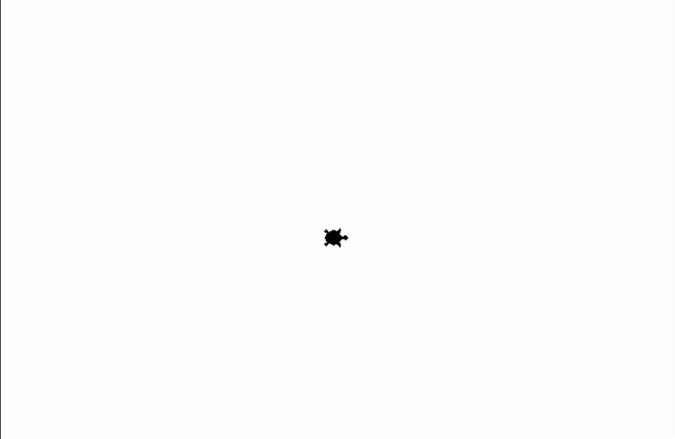
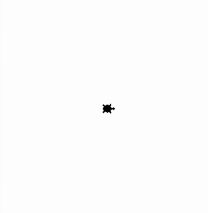

## Funktionen und Prozeduren aufrufen mit Turtle - Werte und Variablen als Parameter
### Aufgabe 1) - Den Garten mit dem Seil kennzeichnen
Unsere Turtle will ihren Garten kennzeichnen. Dazu nimmt sie einen Faden, befestigt diesen am Boden und geht eine gerade Strecke welche 200 Schritte lang ist. Wenn sie sich dreht und eine neue gerade Strecke abgehen will, befestigit sie wieder den Faden. Zum Befestingen des Fadens drückt sie sich am Boden und erzeugt einen Abdruck. Sie tut das so lange bis sie ihren quadratischen Garten umrandet hat.

**Hinweise:**
Zeichne dazu ein kleines Quadrat mit folgenden ``Prozeduren``.

* ``forward(200)``: Die Turtle bewegt sich 200 Schritte nach vorne. Vorne ist hier die *Blickrichtung* der Turtle.
* ``left(90)``: Die Turtle dreht sich um 90° nach links.
* ``stamp()``: Die Turtle drückt sich auf den Boden und hinterlässt einen Abdruck.
* ``hideturtle()``: Die Turtle gräbt sich ein und versteckt sich.

<div style="text-align: left;">
    
</div>

**Vorlage:**
```python
from turtle import *

# --- Vorbereitung ---
shape("turtle")
# Wir verwenden mit dem Wert 1 eine sichtbare Geschwindigkeit der Turtle.
speed(1) 

# --- Logik ---
# --- 1. Wir zeichnen den quadratischen Garten ---
# --- 1.1) Wir zeichnen eine horizontale Linie von links nach rechts ---
# Die Turtle drückt den Faden auf den Boden und befestigt diesen
# TODO: Lösche dieses Kommetar und schreibe den Programmcode hier!

# Die Turtle bewegt sich 200 Schritte in Blickrichtung nach vorne.
# TODO: Lösche dieses Kommetar und schreibe den Programmcode hier!

# Die Turtle dreht sich um 90° nach links.
# TODO: Lösche dieses Kommetar und schreibe den Programmcode hier!

# --- 1.2) Wir zeichnen eine vertikale Linie von unten nach oben ---
# Die Turtle drückt den Faden auf den Boden und befestigt diesen
# TODO: Lösche dieses Kommetar und schreibe den Programmcode hier!

# Die Turtle bewegt sich 200 Schritte in Blickrichtung nach vorne.
# TODO: Lösche dieses Kommetar und schreibe den Programmcode hier!

# Die Turtle dreht sich um 90° nach links.
# TODO: Lösche dieses Kommetar und schreibe den Programmcode hier!

# --- 1.3) Wir zeichnen eine horizontale Linie von rechts nach links ---
# Die Turtle drückt den Faden auf den Boden und befestigt diesen
# TODO: Lösche dieses Kommetar und schreibe den Programmcode hier!

# Die Turtle bewegt sich 200 Schritte in Blickrichtung nach vorne.
# TODO: Lösche dieses Kommetar und schreibe den Programmcode hier!

# Die Turtle dreht sich um 90° nach links.
# TODO: Lösche dieses Kommetar und schreibe den Programmcode hier!

# --- 1.4) Wir zeichnen eine vertikale Linie von oben nach unten ---
# Die Turtle drückt den Faden auf den Boden und befestigt diesen
# TODO: Lösche dieses Kommetar und schreibe den Programmcode hier!

# Die Turtle bewegt sich 200 Schritte in Blickrichtung nach vorne.
# TODO: Lösche dieses Kommetar und schreibe den Programmcode hier!

# Die Turtle dreht sich um 90° nach links.
# TODO: Lösche dieses Kommetar und schreibe den Programmcode hier!

# --- Abschluss ---
# Schließt das Fenster nicht, wenn das Programm beendet ist.
done() 
```

### Aufgabe 2) - Nochmals den Garten mit dem Seil kennzeichnen
Unsere Turtle hat jedoch vergessen, dass Ihr Garten eigentlich *300* Schritte lang ist **und** der Mittelpunkt des Garten in der Mitte des Strandes ist. Wiederhole [Aufgabe 1)](#garten-mit-seil-kennzeichnen) und arbeite die Änderungen ein.

**Hinweise:**
Zeichne dazu ein kleines Quadrat mit folgenden ``Prozeduren``.

* ``forward(300)``: Die Turtle bewegt sich 300 Schritte nach vorne. Vorne ist hier die *Blickrichtung* der Turtle.
* ``left(90)``: Die Turtle dreht sich um 90° nach links.
* ``stamp()``: Die Turtle drückt sich auf den Boden und hinterlässt einen Abdruck.
* ``hideturtle()``: Die Turtle gräbt sich ein und versteckt sich.
* ``goto(-150, -150)``: Die Turtle bewegt sich in einer *geraden Linie* zu der angegebenen *Position*. Die *Position* wird in *x* und *y* *Koordinaten* abegeben. Hier ist die Mitte des Fensters *x = 0* und *y = 0* ist.
* ``penup()``: Die Turtle legt **keinen** Faden am Boden ab. Diese malt dadruch **keine** Linien wenn diese sich **später** bewegt.
* ``pendown()``: Die Turtle legt **einen** Faden am Boden ab. Diese malt dadruch Linien wenn diese sich **später** bewegt.

<div style="text-align: left;">
    
</div>

**Vorlage:**
```python
from turtle import *

# --- Vorbereitung ---
shape("turtle")
# Wir verwenden mit dem Wert 1 eine sichtbare Geschwindigkeit der Turtle.
speed(1) 

# --- Logik ---
# --- 1. Usere Turtle geht in die Ecke des Gartens welche links-unten ist. ---
# Die Turtle packt den Faden in die Tasche.
# TODO: Lösche dieses Kommetar und schreibe den Programmcode hier!

# Die Turtle geht in die Ecke welche links-unten ist.
goto(..., ...) # TODO: Lösche dieses Kommentar, die drei Punkte und füge die korrekten Werte ein.

# Die Turtle nimmt den Faden aus der Tasche und legen ihn am Boden, wenn wir uns Bewegen.
# TODO: Lösche dieses Kommetar und schreibe den Programmcode hier!

# --- 2. Wir zeichnen den quadratischen Garten ---
# --- 2.1) Wir zeichnen eine horizontale Linie von links nach rechts ---
# Die Turtle drückt den Faden auf den Boden und befestigt diesen
stamp()

# Die Turtle bewegt sich 300 Schritte in Blickrichtung nach vorne.
forward(...) # TODO: Lösche dieses Kommentar, die drei Punkte und füge den korrekten Wert ein.

# Die Turtle dreht sich um 90° nach links.
left(90)

# --- 2.2) Wir zeichnen eine vertikale Linie von unten nach oben ---
# Die Turtle drückt den Faden auf den Boden und befestigt diesen
stamp()

# Die Turtle bewegt sich 300 Schritte in Blickrichtung nach vorne.
forward(...) # TODO: Lösche dieses Kommentar, die drei Punkte und füge den korrekten Wert ein.

# Die Turtle dreht sich um 90° nach links.
left(90)

# --- 2.3) Wir zeichnen eine horizontale Linie von rechts nach links ---
# Die Turtle drückt den Faden auf den Boden und befestigt diesen
stamp()

# Die Turtle bewegt sich 300 Schritte in Blickrichtung nach vorne.
forward(...) # TODO: Lösche dieses Kommentar, die drei Punkte und füge den korrekten Wert ein.

# Die Turtle dreht sich um 90° nach links.
left(90)

# --- 1.4) Wir zeichnen eine vertikale Linie von oben nach unten ---
# Die Turtle drückt den Faden auf den Boden und befestigt diesen
stamp()

# Die Turtle bewegt sich 300 Schritte in Blickrichtung nach vorne.
forward(...) # TODO: Lösche dieses Kommentar, die drei Punkte und füge den korrekten Wert ein.

# Die Turtle dreht sich um 90° nach links.
left(90)

# --- Abschluss ---
# Schließt das Fenster nicht, wenn das Programm beendet ist.
done() 
```

### Aufgabe 3) - Ein letztes Mal den Garten mit dem Seil kennzeichnen
Da unsere Turtle sich noch immer nicht sicher ist ob ihr Garten wirklich *300* lang ist, schaut diese nun im Bauplan nach. Dort steht eine Länge von ``laenge_garten = 314`` Schritten und zusätzlich ``winklel = 90``. Unsere Turtle verwendet nun direkt die Information aus dem Bauplan um nicht alle Schrite welche sie bis jetzt gemacht hat, sich neu auszudenken. 

**Hinweise:**
Verwende nun ``Variablen`` um nicht jedes ``forward(314)``, ``left(90)`` und ``goto(-314/2, -314/2)`` aufrufen zu müssen.

Zeichne dazu ein kleines Quadrat mit folgenden ``Prozeduren``.

* ``forward(laenge_garten)``: Die Turtle bewegt sich *laenge_garten* Schritte nach vorne. Vorne ist hier die *Blickrichtung* der Turtle.
* ``left(winkel)``: Die Turtle dreht sich um *winkel* nach links.
* ``stamp()``: Die Turtle drückt sich auf den Boden und hinterlässt einen Abdruck.
* ``hideturtle()``: Die Turtle gräbt sich ein und versteckt sich.
* ``goto(-laenge_garten/2, -laenge_garten/2)``: Die Turtle bewegt sich in einer *geraden Linie* zu der angegebenen *Position*. Die *Position* wird in *x* und *y* *Koordinaten* abegeben. Hier ist die Mitte des Fensters *x = 0* und *y = 0* ist.
* ``penup()``: Die Turtle legt **keinen** Faden am Boden ab. Diese malt dadruch **keine** Linien wenn diese sich **später** bewegt.
* ``pendown()``: Die Turtle legt **einen** Faden am Boden ab. Diese malt dadruch Linien wenn diese sich **später** bewegt.

<div style="text-align: left;">
    
</div>

**Vorlage:**
```python
from turtle import *

# --- Vorbereitung ---
shape("turtle")
# Wir verwenden mit dem Wert 1 eine sichtbare Geschwindigkeit der Turtle.
speed(1) 

# Wir legen Variablen an welche wir später wiederverwenden können.
laenge_garten = ... # TODO: Lösche dieses Kommentar, die drei Punkte und füge dort den korrekten Wert ein.
winkel = ... # TODO: Lösche dieses Kommentar, die drei Punkte und füge dort den korrekten Wert ein.

# --- Logik ---
# --- 1. Usere Turtle geht in die Ecke des Gartens welche links-unten ist. ---
# Die Turtle packt den Faden in die Tasche.
penup()

# Die Turtle geht in die Ecke welche links-unten ist.
ecke_links_unten_x = ... # TODO: Lösche dieses Kommentar, die drei Punkte und füge dort den korrekten Ausdruck ein.
ecke_links_unten_y = ... # TODO: Lösche dieses Kommentar, die drei Punkte und füge dort den korrekten Ausdruck ein.
goto(ecke_links_unten_x, ecke_links_unten_y)

# Die Turtle nimmt den Faden aus der Tasche und legen ihn am Boden, wenn wir uns Bewegen.
pendown()

# --- 2. Wir zeichnen den quadratischen Garten ---
# --- 2.1) Wir zeichnen eine horizontale Linie von links nach rechts ---
# Die Turtle drückt den Faden auf den Boden und befestigt diesen
stamp()

# Die Turtle bewegt sich 314 Schritte in Blickrichtung nach vorne.
forward(...) # TODO: Lösche dieses Kommentar, die drei Punkte und füge dort die Korrekte Variable ein.

# Die Turtle dreht sich um 90° nach links.
left(...) # TODO: Lösche dieses Kommentar, die drei Punkte und füge dort die Korrekte Variable ein.

# --- 2.2) Wir zeichnen eine vertikale Linie von unten nach oben ---
# Die Turtle drückt den Faden auf den Boden und befestigt diesen
stamp()

# Die Turtle bewegt sich 314 Schritte in Blickrichtung nach vorne.
forward(...) # TODO: Lösche dieses Kommentar, die drei Punkte und füge dort die Korrekte Variable ein.

# Die Turtle dreht sich um 90° nach links.
left(...) # TODO: Lösche dieses Kommentar, die drei Punkte und füge dort die Korrekte Variable ein.

# --- 2.3) Wir zeichnen eine horizontale Linie von rechts nach links ---
# Die Turtle drückt den Faden auf den Boden und befestigt diesen
stamp()

# Die Turtle bewegt sich 314 Schritte in Blickrichtung nach vorne.
forward(...) # TODO: Lösche dieses Kommentar, die drei Punkte und füge dort die Korrekte Variable ein.

# Die Turtle dreht sich um 90° nach links.
left(...) # TODO: Lösche dieses Kommentar, die drei Punkte und füge dort die Korrekte Variable ein.

# --- 2.4) Wir zeichnen eine vertikale Linie von oben nach unten ---
# Die Turtle drückt den Faden auf den Boden und befestigt diesen
stamp()

# Die Turtle bewegt sich 314 Schritte in Blickrichtung nach vorne.
forward(...) # TODO: Lösche dieses Kommentar, die drei Punkte und füge dort die Korrekte Variable ein.

# Die Turtle dreht sich um 90° nach links.
left(...) # TODO: Lösche dieses Kommentar, die drei Punkte und füge dort die Korrekte Variable ein.

# --- Abschluss ---
# Schließt das Fenster nicht, wenn das Programm beendet ist.
done() 
```

### Aufgabe 4) - Das Haus im Garten kennzeichnen
Unsere Turtle will nun nicht nur den Garten sondern auch ihr Haus kennzeichnen. Das Haus liegt in der Mitte des Gartens. Dazu nimmt sie einen zweiten Faden, befestigt diesen am Boden und geht eine gerade Strecke welche 157 Schritte lang ist. Wenn sie sich dreht und eine neue gerade Strecke abgehen will, befestigit sie wieder den Faden. Sie tut das so lange bis sie ihr quadratisches Haus und ihren quadratisches Garten umrandet hat. Für das Haus muss die Turtle nicht den Faben auf den Boden drücken, dieser hält an den Wänden von alleine.

Zeichne nun ein kleines Quadrat in der Mitte in einem größeren Quadrat mit folgenden ``Prozeduren``.

**Hinweise:**
Verwende nun ``Variablen`` für:

* die Länge des Gartens und des Hauses und
* den Winkel für die Drehung.

Zeichne dazu ein kleines Quadrat mit folgenden ``Prozeduren``.

* ``forward(laenge_garten)``: Die Turtle bewegt sich *laenge_garten* Schritte nach vorne. Vorne ist hier die *Blickrichtung* der Turtle.
* ``left(winkel)``: Die Turtle dreht sich um *winkel* nach links.
* ``stamp()``: Die Turtle drückt sich auf den Boden und hinterlässt einen Abdruck.
* ``hideturtle()``: Die Turtle gräbt sich ein und versteckt sich.
* ``goto(-laenge_garten/2, -laenge_garten/2)``: Die Turtle bewegt sich in einer *geraden Linie* zu der angegebenen *Position*. Die *Position* wird in *x* und *y* *Koordinaten* abegeben. Hier ist die Mitte des Fensters *x = 0* und *y = 0* ist.
* ``penup()``: Die Turtle legt **keinen** Faden am Boden ab. Diese malt dadruch **keine** Linien wenn diese sich **später** bewegt.
* ``pendown()``: Die Turtle legt **einen** Faden am Boden ab. Diese malt dadruch Linien wenn diese sich **später** bewegt.

<div style="text-align: left;">
    
</div>

**Vorlage:**
```python
from turtle import *

# --- Vorbereitung ---
shape("turtle")
# Wir verwenden mit dem Wert 1 eine sichtbare Geschwindigkeit der Turtle.
speed(1) 

# Wir legen Variablen an welche wir später wiederverwenden können.
laenge_garten = 314
winkel = 90

# --- Logik ---
# ------------------------------------------------------------------------
# --- 1. Usere Turtle geht in die Ecke des Gartens welche links-unten ist. ---
# Die Turtle packt den Faden in die Tasche.
penup()

# Die Turtle geht in die Ecke welche links-unten ist.
ecke_garten_links_unten_x = -laenge_garten/2
ecke_garten_links_unten_y = -laenge_garten/2
goto(ecke_garten_links_unten_x, ecke_garten_links_unten_y)

# Die Turtle nimmt den Faden aus der Tasche und legen ihn am Boden, wenn wir uns Bewegen.
pendown()

# ------------------------------------------------------------------------
# --- 2. Wir zeichnen den quadratischen Garten ---
# --- 2.1) Wir zeichnen eine horizontale Linie von links nach rechts ---
# Die Turtle drückt den Faden auf den Boden und befestigt diesen
stamp()

# Die Turtle bewegt sich 314 Schritte in Blickrichtung nach vorne.
forward(laenge_garten)

# Die Turtle dreht sich um 90° nach links.
left(winkel)

# --- 2.2) Wir zeichnen eine vertikale Linie von unten nach oben ---
# Die Turtle drückt den Faden auf den Boden und befestigt diesen
stamp()

# Die Turtle bewegt sich 314 Schritte in Blickrichtung nach vorne.
forward(laenge_garten)

# Die Turtle dreht sich um 90° nach links.
left(winkel)

# --- 2.3) Wir zeichnen eine horizontale Linie von rechts nach links ---
# Die Turtle drückt den Faden auf den Boden und befestigt diesen
stamp()

# Die Turtle bewegt sich 314 Schritte in Blickrichtung nach vorne.
forward(laenge_garten)

# Die Turtle dreht sich um 90° nach links.
left(winkel)

# --- 2.4) Wir zeichnen eine vertikale Linie von oben nach unten ---
# Die Turtle drückt den Faden auf den Boden und befestigt diesen
stamp()

# Die Turtle bewegt sich 314 Schritte in Blickrichtung nach vorne.
forward(laenge_garten)

# Die Turtle dreht sich um 90° nach links.
left(winkel)

# ------------------------------------------------------------------------
# --- 3. Usere Turtle geht zur Ecke des Hauses welche links-unten ist. ---
# Die Turtle packt den Faden in die Tasche.
penup()

# Die Turtle geht in die Ecke welche links-unten ist.
laenge_haus = laenge_garten / 2
ecke_haus_links_unten_x = -laenge_haus/2
ecke_haus_links_unten_y = -laenge_haus/2
goto(ecke_haus_links_unten_x, ecke_haus_links_unten_y)

# Die Turtle nimmt den Faden aus der Tasche und legen ihn am Boden, wenn wir uns Bewegen.
pendown()

# ------------------------------------------------------------------------
# --- 4. Wir zeichnen das quadratischen Haus ---
# --- 4.1) Wir zeichnen eine horizontale Linie von links nach rechts ---
# TODO: Lösche dieses Kommetar und schreibe den Programmcode hier!

# --- 4.2) Wir zeichnen eine vertikale Linie von unten nach oben ---
# TODO: Lösche dieses Kommetar und schreibe den Programmcode hier!

# --- 4.3) Wir zeichnen eine horizontale Linie von rechts nach links ---
# TODO: Lösche dieses Kommetar und schreibe den Programmcode hier!

# --- 4.4) Wir zeichnen eine vertikale Linie von oben nach unten ---
# TODO: Lösche dieses Kommetar und schreibe den Programmcode hier!

# ------------------------------------------------------------------------
# --- Abschluss ---
# Schließt das Fenster nicht, wenn das Programm beendet ist.
done() 
```