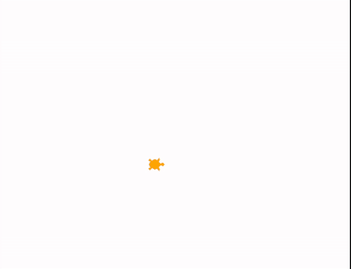
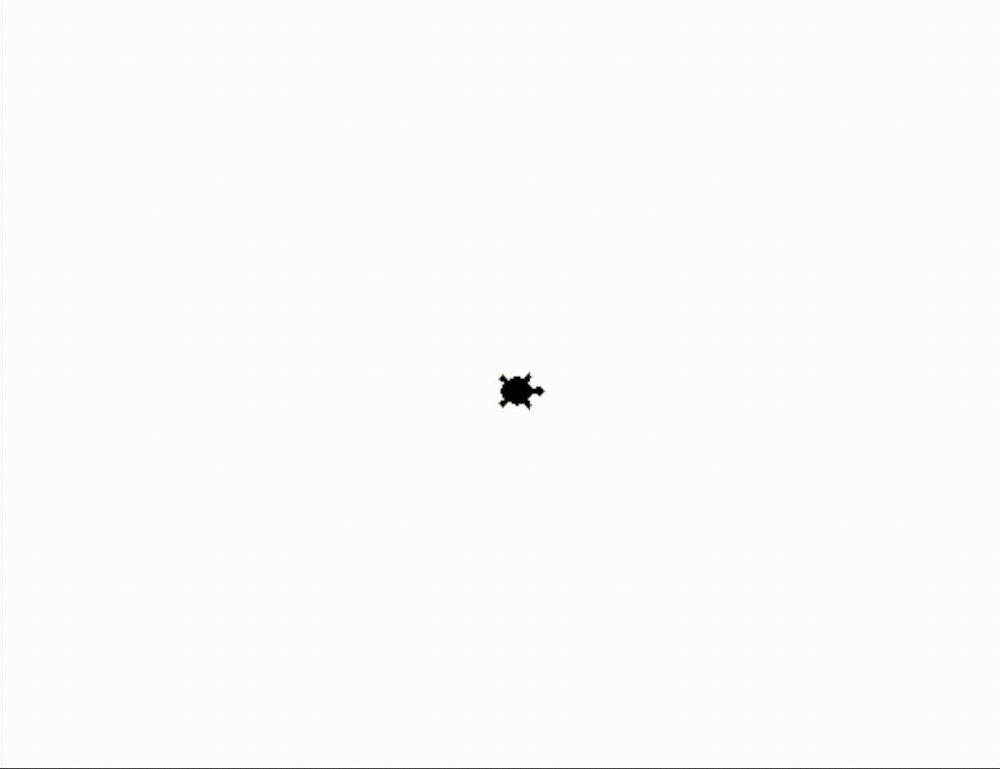
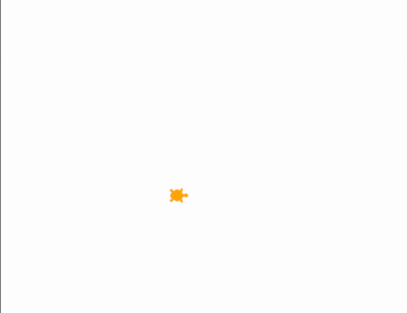

## Funktionen und Prozeduren aufrufen mit Turtle - Ausgabe und Berechnungen
### Aufgabe 1) - Was ist der Umfang von Haus und Garten?
Es liegen nun zwei Fäden nach der [Exercise 1](../../exercise1-werte_und_variablen_als_parameter/angabe.md) am Boden. Einer für den Garten und einer für das Haus. 
* Verwende nun zwei verschiedene Farben für die Fäden. Ein mal einen <span style="color:orange;">orangen Faden</span> für den Garten und einen <span style="color:purple;">violetten Faden</span> für das Haus um die Schnüre besser unterscheiden zu können.
* Wir verwenden die Formel für den Umfang eines Quadrates ``U = 4 * laenge_garten [Schritte]`` um den Umfang Gartens bestimmen zu können. Verwende ``laenge_haus`` um den Umfang des Gartens bestimmen zu können. Am Schluss des Programmes wird der Umfang des Gartens und der Umfang des Hauses in der Console mit ``print`` ausgegeben.
* Die Turtel vertraut der Formel nicht und möchte mitzählen. Sie schreibt nach jeder Bewegung auf den Boden wie viele Schritte sie bereits zurück gelegt hat. Sie merkt sich dazu in der ``Variable`` ``zurueckgelegter_weg`` wie weit sie gegangen ist. Am Ende sollte die gleiche Zahl wie ``U = 4 * laenge_garten [Schritte]`` rauskommen. 

**Hinweise:**
Verwende nun ``Variablen`` für:

* die Länge des Gartens und des Hauses,
* den Winkel für die Drehung und
* den Umfang des Gartens und des Hauses

Verwende folgende der bereits existierenden ``Prozeduren``:

* ``forward(laenge_garten)``: Die Turtle bewegt sich *laenge_garten* Schritte nach vorne. Vorne ist hier die *Blickrichtung* der Turtle.
* ``left(winkel)``: Die Turtle dreht sich um *winkel* nach links.
* ``stamp()``: Die Turtle drückt sich auf den Boden und hinterlässt einen Abdruck.
* ``hideturtle()``: Die Turtle gräbt sich ein und versteckt sich.
* ``goto(-laenge_garten/2, -laenge_garten/2)``: Die Turtle bewegt sich in einer *geraden Linie* zu der angegebenen *Position*. Die *Position* wird in *x* und *y* *Koordinaten* abegeben. Hier ist die Mitte des Fensters *x = 0* und *y = 0* ist.
* ``penup()``: Die Turtle legt **keinen** Faden am Boden ab. Diese malt dadruch **keine** Linien wenn diese sich **später** bewegt.
* ``pendown()``: Die Turtle legt **einen** Faden am Boden ab. Diese malt dadruch Linien wenn diese sich **später** bewegt.
* ``color("orange")``: Die Turtle malt orange Linien am Bildschirm.
* ``print(umfang_garten, umfang_haus)``: Damit kann eine Variable für den Umfang des Gartens und eine Variable für den Umfang des Hauses auf die Console ausgegeben werden.
* ``write(str(zurueckgelegter_weg) + " Schritte gegangen.")``: Mit dieser ``Prozedur`` kann z.B. der zurückgelegte Weg der Turtle auf den Bildschirm gezeichnet werden. **Achtung!** Es kann nicht ``write(str(zurueckgelegter_weg), "Schritte gegangen.")`` verwendet werden. Diesen Luxus haben wir nur bei ``print``.

<div style="text-align: left;">
    
</div>

Ausgabe in der Console
```
Umfang Garten: 1256 ~ Umfang Haus 628.0
```


**Lösung:**
```python
from turtle import *

# --- Vorbereitung ---
shape("turtle")
# Wir verwenden mit dem Wert 1 eine sichtbare Geschwindigkeit der Turtle.
speed(1) 

# --- Logik ---
# ------------------------------------------------------------------------
# Wir legen Variablen an welche wir später wiederverwenden können.
winkel = 90

laenge_garten = 314

# Achtung! Was ist der Typ von laenge_haus? Wir wollen ein Zahl ohne Komma, den Integer, um bei der Ausgabe keine Kommastelle zu haben.
laenge_haus = int(laenge_garten / 2) # Info: laenge_garten // 2 macht das gleiche kürzer.

umfang_haus = 4 * laenge_haus
umfang_garten = 4 * laenge_garten
zurueckgelegter_weg = 0

# --- 1. Usere Turtle geht in die Ecke des Gartens welche links-unten ist. ---
# Die Turtle verwendet eine orange Schnur für den Garten.
color("orange")

# Die Turtle packt den Faden in die Tasche.
penup()

# Die Turtle geht in die Ecke welche links-unten ist.
ecke_garten_links_unten_x = -laenge_garten/2
ecke_garten_links_unten_y = -laenge_garten/2
goto(ecke_garten_links_unten_x, ecke_garten_links_unten_y)

# Die Turtle nimmt den Faden aus der Tasche und legen ihn am Boden, wenn wir uns Bewegen.
pendown()

# ------------------------------------------------------------------------
# --- 2. Wir zeichnen den quadratischen Garten ---
# --- 2.1) Wir zeichnen eine horizontale Linie von links nach rechts ---
# Die Turtle drückt den Faden auf den Boden und befestigt diesen.
stamp()

# Die Turtle bewegt sich 314 Schritte in Blickrichtung nach vorne.
forward(laenge_garten)

# Wir zählen zu zurueckgelegter_weg die laenge_garten dazu und merken es wieder in zurueckgelegter_weg.
zurueckgelegter_weg += laenge_garten

# Die Turtle schreibt auf den Boden wie weit sie bereits gegangen ist.
write(str(zurueckgelegter_weg) + " von " + str(umfang_garten) + " Schritte", align="right")

# Die Turtle dreht sich um 90° nach links.
left(winkel)

# --- 2.2) Wir zeichnen eine vertikale Linie von unten nach oben ---
# Die Turtle drückt den Faden auf den Boden und befestigt diesen.
stamp() 

# Die Turtle bewegt sich 314 Schritte in Blickrichtung nach vorne.
forward(laenge_garten)

# Wir zählen zu zurueckgelegter_weg die laenge_garten dazu und merken es wieder in zurueckgelegter_weg.
zurueckgelegter_weg += laenge_garten

# Die Turtle schreibt auf den Boden wie weit sie bereits gegangen ist.
write(str(zurueckgelegter_weg) + " von " + str(umfang_garten) + " Schritte", align="right")


# Die Turtle dreht sich um 90° nach links.
left(winkel)

# --- 2.3) Wir zeichnen eine horizontale Linie von rechts nach links ---
# Die Turtle drückt den Faden auf den Boden und befestigt diesen.
stamp()

# Die Turtle bewegt sich 314 Schritte in Blickrichtung nach vorne.
forward(laenge_garten)

# Wir zählen zu zurueckgelegter_weg die laenge_garten dazu und merken es wieder in zurueckgelegter_weg.
zurueckgelegter_weg += laenge_garten

# Die Turtle schreibt auf den Boden wie weit sie bereits gegangen ist.
write(str(zurueckgelegter_weg) + " von " + str(umfang_garten) + " Schritte", align="right")

# Die Turtle dreht sich um 90° nach links.
left(winkel)

# --- 2.4) Wir zeichnen eine vertikale Linie von oben nach unten ---
# Die Turtle drückt den Faden auf den Boden und befestigt diesen.
stamp()

# Die Turtle bewegt sich 314 Schritte in Blickrichtung nach vorne.
forward(laenge_garten)

# Wir zählen zu zurueckgelegter_weg die laenge_garten dazu und merken es wieder in zurueckgelegter_weg.
zurueckgelegter_weg += laenge_garten

# Die Turtle schreibt auf den Boden wie weit sie bereits gegangen ist.
write(str(zurueckgelegter_weg) + " von " + str(umfang_garten) + " Schritte", align="right")

# Die Turtle dreht sich um 90° nach links.
left(winkel)

# ------------------------------------------------------------------------
# --- 3. Usere Turtle geht zur Ecke des Hauses welche links-unten ist. ---
# Die Turtle verwendet eine violette Schnur für den Garten.
color("purple")

# Die Turtle packt den Faden in die Tasche.
penup()

# Die Turtle geht in die Ecke welche links-unten ist.
zurueckgelegter_weg = 0
ecke_haus_links_unten_x = -laenge_haus/2
ecke_haus_links_unten_y = -laenge_haus/2
goto(ecke_haus_links_unten_x, ecke_haus_links_unten_y)

# Die Turtle nimmt den Faden aus der Tasche und legen ihn am Boden, wenn wir uns Bewegen.
pendown()

# ------------------------------------------------------------------------
# --- 4. Wir zeichnen das quadratischen Haus ---
# --- 4.1) Wir zeichnen eine horizontale Linie von links nach rechts ---
# Die Turtle bewegt sich 157 Schritte in Blickrichtung nach vorne.
forward(laenge_haus)

# Die Turtle dreht sich um 90° nach links.
left(winkel)

# Wir zählen zu umfang_haus die laenge_haus dazu und merken es wieder in umfang_haus.
zurueckgelegter_weg += laenge_haus

# Die Turtle schreibt auf den Boden wie weit sie bereits gegangen ist.
write(str(zurueckgelegter_weg) + " von " + str(umfang_haus) + " Schritte", align="right")

# --- 4.2) Wir zeichnen eine vertikale Linie von unten nach oben ---
# Die Turtle bewegt sich 157 Schritte in Blickrichtung nach vorne.
forward(laenge_haus)

# Die Turtle dreht sich um 90° nach links.
left(winkel)

# Wir zählen zu zurueckgelegter_weg die laenge_haus dazu und merken es wieder in zurueckgelegter_weg.
zurueckgelegter_weg += laenge_haus

# Die Turtle schreibt auf den Boden wie weit sie bereits gegangen ist.
write(str(zurueckgelegter_weg) + " von " + str(umfang_haus) + " Schritte", align="right")

# --- 4.3) Wir zeichnen eine horizontale Linie von rechts nach links ---
# Die Turtle bewegt sich 157 Schritte in Blickrichtung nach vorne.
forward(laenge_haus)

# Die Turtle dreht sich um 90° nach links.
left(winkel)

# Wir zählen zu zurueckgelegter_weg die laenge_haus dazu und merken es wieder in zurueckgelegter_weg.
zurueckgelegter_weg += laenge_haus

# Die Turtle schreibt auf den Boden wie weit sie bereits gegangen ist.
write(str(zurueckgelegter_weg) + " von " + str(umfang_haus) + " Schritte", align="right")

# --- 4.4) Wir zeichnen eine vertikale Linie von oben nach unten ---
# Die Turtle bewegt sich 157 Schritte in Blickrichtung nach vorne.
forward(laenge_haus)

# Die Turtle dreht sich um 90° nach links.
left(winkel)

# Wir zählen zu zurueckgelegter_weg die laenge_haus dazu und merken es wieder in zurueckgelegter_weg.
zurueckgelegter_weg += laenge_haus

# Die Turtle schreibt auf den Boden wie weit sie bereits gegangen ist.
write(str(zurueckgelegter_weg) + " von " + str(umfang_haus) + " Schritte", align="right")


# --- 5.) Wir geben den Umfang des Gartens und des Hauses auf der Console aus.
print("Umfang Garten:", umfang_garten, "~ Umfang Haus",  umfang_haus)

# ------------------------------------------------------------------------
# --- Abschluss ---
# Schließt das Fenster nicht, wenn das Programm beendet ist.
done()
```

### Aufgabe 2) - Wo bin ich und wohin gehe ich?
Wiederhole die [Aufgabe 1](#aufgabe-1---was-ist-der-umfang-von-haus-und-garten), jedoch will unsere Turtle nicht verloren gehen. Die Turtle glaubt nun der Formel für den Umfang und schreibt diese nicht mehr auf den Boden. Sie schreibt jedoch nun die Koordinaten an denen sie sich befindet und die Richtung in diese sie schaut auf den Boden. 

**Hinweise:**
Verwende nun ``Variablen`` für:

* die Länge des Gartens und des Hauses und
* den Winkel für die Drehung.

Verwende folgende der bereits existierenden ``Prozeduren``:

* ``forward(laenge_garten)``: Die Turtle bewegt sich *laenge_garten* Schritte nach vorne. Vorne ist hier die *Blickrichtung* der Turtle.
* ``left(winkel)``: Die Turtle dreht sich um *winkel* nach links.
* ``stamp()``: Die Turtle drückt sich auf den Boden und hinterlässt einen Abdruck.
* ``hideturtle()``: Die Turtle gräbt sich ein und versteckt sich.
* ``goto(-laenge_garten/2, -laenge_garten/2)``: Die Turtle bewegt sich in einer *geraden Linie* zu der angegebenen *Position*. Die *Position* wird in *x* und *y* *Koordinaten* abegeben. Hier ist die Mitte des Fensters *x = 0* und *y = 0* ist.
* ``penup()``: Die Turtle legt **keinen** Faden am Boden ab. Diese malt dadruch **keine** Linien wenn diese sich **später** bewegt.
* ``pendown()``: Die Turtle legt **einen** Faden am Boden ab. Diese malt dadruch Linien wenn diese sich **später** bewegt.
* ``color("orange")``: Die Turtle malt orange Linien am Bildschirm.
* ``write("Pos: " + str(position())``: Mit dieser ``Prozedur`` kann die Position der Turtle auf den Bildschirm gezeichnet werden. **Achtung!** Es kann nicht ``write("Pos: ", position())`` verwendet werden. Diesen Luxus haben wir nur bei ``print``.

Finde mit folgenden bereits existierenden ``Funktionen`` heraus in welche Richtung unsere Turtle schaut und an welcher Position sie sich befindet.
* ``position()``: Gibt dir die aktuelle Position der Turtle zurück.
* ``heading()``: Gibt dir die Richtung in die unsere Turtle schaut zurück.

<div style="text-align: left;">
    
</div>

**Lösung:**
```python
from turtle import *

# --- Vorbereitung ---
shape("turtle")
# Wir verwenden mit dem Wert 1 eine sichtbare Geschwindigkeit der Turtle.
speed(1) 
import time
time.sleep(3)
# --- Logik ---
# ------------------------------------------------------------------------
# Wir legen Variablen an welche wir später wiederverwenden können.
winkel = 90

laenge_garten = 314
laenge_haus = laenge_garten / 2

# --- 1. Usere Turtle geht in die Ecke des Gartens welche links-unten ist. ---
# Die Turtle verwendet eine orange Schnur für den Garten.
color("orange")

# Die Turtle packt den Faden in die Tasche.
penup()

# Die Turtle geht in die Ecke welche links-unten ist.
ecke_garten_links_unten_x = -laenge_garten/2
ecke_garten_links_unten_y = -laenge_garten/2
goto(ecke_garten_links_unten_x, ecke_garten_links_unten_y)

# Die Turtle nimmt den Faden aus der Tasche und legen ihn am Boden, wenn wir uns Bewegen.
pendown()

# ------------------------------------------------------------------------
# --- 2. Wir zeichnen den quadratischen Garten ---
# --- 2.1) Wir zeichnen eine horizontale Linie von links nach rechts ---
# Die Turtle drückt den Faden auf den Boden und befestigt diesen.
stamp()

# Die Turtle bewegt sich 314 Schritte in Blickrichtung nach vorne.
forward(laenge_garten)

# Die Turtle dreht sich um 90° nach links.
left(winkel)

# Die Turtle schreibt auf den Boden wie weit sie bereits gegangen ist.
write("Pos: " + str(position()) + "\n" + "Richtung: " + str(heading()))

# --- 2.2) Wir zeichnen eine vertikale Linie von unten nach oben ---
# Die Turtle drückt den Faden auf den Boden und befestigt diesen.
stamp() 

# Die Turtle bewegt sich 314 Schritte in Blickrichtung nach vorne.
forward(laenge_garten)

# Die Turtle dreht sich um 90° nach links.
left(winkel)

# Die Turtle schreibt auf den Boden wie weit sie bereits gegangen ist.
write("Pos: " + str(position()) + "\n" + "Richtung: " + str(heading()))

# --- 2.3) Wir zeichnen eine horizontale Linie von rechts nach links ---
# Die Turtle drückt den Faden auf den Boden und befestigt diesen.
stamp()

# Die Turtle bewegt sich 314 Schritte in Blickrichtung nach vorne.
forward(laenge_garten)

# Die Turtle dreht sich um 90° nach links.
left(winkel)

# Die Turtle schreibt auf den Boden wie weit sie bereits gegangen ist.
write("Pos: " + str(position()) + "\n" + "Richtung: " + str(heading()))

# --- 2.4) Wir zeichnen eine vertikale Linie von oben nach unten ---
# Die Turtle drückt den Faden auf den Boden und befestigt diesen.
stamp()

# Die Turtle bewegt sich 314 Schritte in Blickrichtung nach vorne.
forward(laenge_garten)

# Die Turtle dreht sich um 90° nach links.
left(winkel)

# Die Turtle schreibt auf den Boden wie weit sie bereits gegangen ist.
write("Pos: " + str(position()) + "\n" + "Richtung: " + str(heading()))

# ------------------------------------------------------------------------
# --- 3. Usere Turtle geht zur Ecke des Hauses welche links-unten ist. ---
# Die Turtle verwendet eine violette Schnur für den Garten.
color("purple")

# Die Turtle packt den Faden in die Tasche.
penup()

# Die Turtle geht in die Ecke welche links-unten ist.
ecke_haus_links_unten_x = -laenge_haus/2
ecke_haus_links_unten_y = -laenge_haus/2
goto(ecke_haus_links_unten_x, ecke_haus_links_unten_y)

# Die Turtle nimmt den Faden aus der Tasche und legen ihn am Boden, wenn wir uns Bewegen.
pendown()

# ------------------------------------------------------------------------
# --- 4. Wir zeichnen das quadratischen Haus ---
# --- 4.1) Wir zeichnen eine horizontale Linie von links nach rechts ---
# Die Turtle bewegt sich 157 Schritte in Blickrichtung nach vorne.
forward(laenge_haus)

# Die Turtle dreht sich um 90° nach links.
left(winkel)

# Die Turtle schreibt auf den Boden wie weit sie bereits gegangen ist.
write("Pos: " + str(position()) + "\n" + "Richtung: " + str(heading()))

# --- 4.2) Wir zeichnen eine vertikale Linie von unten nach oben ---
# Die Turtle bewegt sich 157 Schritte in Blickrichtung nach vorne.
forward(laenge_haus)

# Die Turtle dreht sich um 90° nach links.
left(winkel)

# Die Turtle schreibt auf den Boden wie weit sie bereits gegangen ist.
write("Pos: " + str(position()) + "\n" + "Richtung: " + str(heading()))

# --- 4.3) Wir zeichnen eine horizontale Linie von rechts nach links ---
# Die Turtle bewegt sich 157 Schritte in Blickrichtung nach vorne.
forward(laenge_haus)

# Die Turtle dreht sich um 90° nach links.
left(winkel)

# Die Turtle schreibt auf den Boden wie weit sie bereits gegangen ist.
write("Pos: " + str(position()) + "\n" + "Richtung: " + str(heading()))

# --- 4.4) Wir zeichnen eine vertikale Linie von oben nach unten ---
# Die Turtle bewegt sich 157 Schritte in Blickrichtung nach vorne.
forward(laenge_haus)

# Die Turtle dreht sich um 90° nach links.
left(winkel)

# Die Turtle schreibt auf den Boden wie weit sie bereits gegangen ist.
write("Pos: " + str(position()) + "\n" + "Richtung: " + str(heading()))

# ------------------------------------------------------------------------
# --- Abschluss ---
# Schließt das Fenster nicht, wenn das Programm beendet ist.
done()
```

### Aufgabe 3) - Renovierung des Hauses
Die Turtle glaubt nun nicht nur der Formel für den Umfang, sondern ist sich auch sicher, dass diese sich Orientieren kann. Sie schreibt nun nichts mehr auf den Boden. Nach der Abmessung des Hauses und des Gartens kommt der Turtle eine Idee. Sie will ihr Haus drehen und dadurch ein wenig vergrößern. Auch soll die weiße Wand verschwinden und <span style="color:purple;">violett</span> eingefärbt werden. Im Garten sollen zudem Sand gestreut werden, welcher den Garten <span style="color:orange;">orange</span> färbt. 

Wiederhole die [Aufgabe 1](#aufgabe-1---was-ist-der-umfang-von-haus-und-garten), jedoch drehe das innere Quadrat um 45 Grad. Die Eckpunkte des inneren Quadrats liegen auf den Mittelpunkten der äußeren Seiten.
Die Fläche des inneren Quadrats soll soll <span style="color:purple;">violett</span> gefüllt werden und die des außeren <span style="color:orange;">orange</span>.

**Hinweise:**
Verwende nun ``Variablen`` für:

* die Länge des Gartens und des Hauses und
* den Winkel für die Drehung.

Verwende folgende der bereits existierenden ``Prozeduren``:

* ``penup()``: Die Turtle legt **keinen** Faden am Boden ab. Diese malt dadruch **keine** Linien wenn diese sich **später** bewegt.
* ``pendown()``: Die Turtle legt **einen** Faden am Boden ab. Diese malt dadruch Linien wenn diese sich **später** bewegt.
* ``forward(200)``: Die Turtle bewegt sich 200 Schritte nach vorne. Vorne ist hier die *Blickrichtung* der Turtle.
* ``left(90)``: Die Turtle dreht sich um 90° nach links.
* ``goto(-100, 200)``: Die Turtle bewegt sich in einer *geraden Linie* zu der angegebenen *Position*. Die *Position* wird in *x* und *y* *Koordinaten* abegeben. Hier ist die Mitte des Fensters *x = 0* und *y = 0* ist.
* ``hideturtle()``: Die Turtle gräbt sich ein und versteckt sich.
* ``color("purple", "purple")``: Die Turtle wird violett und malt violette Linien am Bildschirm. Dazu wird die Turtle violett ausgemalen. Rufe ``begin_fill()`` auf um den *Füllmodus* zu starten und ``end_fill()`` um diesen zu beenden.

<div style="text-align: left;">
    
</div>

**Lösung:**
```python
from turtle import *
from math import sqrt

# --- Vorbereitung ---
shape("turtle")
# Wir verwenden mit dem Wert 1 eine sichtbare Geschwindigkeit der Turtle.
speed(1) 

# --- Logik ---
# ------------------------------------------------------------------------
# Wir legen Variablen an welche wir später wiederverwenden können.
winkel = 90
laenge_garten = 314

# --- 1. Usere Turtle geht in die Ecke des Gartens welche links-unten ist. ---
# Die Turtle verwendet eine orange Schnur und einen orangen Sand für den Garten.
color("orange", "orange") 

# Wir starten das Ausmalen des Gartens. Wenn wir später end_fill() verwenden wird die Farbe reingemalen. 
begin_fill() 

# Die Turtle packt den Faden in die Tasche.
penup()

# Die Turtle geht in die Ecke welche links-unten ist.
ecke_garten_links_unten_x = -laenge_garten/2
ecke_garten_links_unten_y = -laenge_garten/2
goto(ecke_garten_links_unten_x, ecke_garten_links_unten_y)

# Die Turtle nimmt den Faden aus der Tasche und legen ihn am Boden, wenn wir uns Bewegen.
pendown()

# ------------------------------------------------------------------------
# --- 2. Wir zeichnen den quadratischen Garten ---
# --- 2.1) Wir zeichnen eine horizontale Linie von links nach rechts ---
# Die Turtle drückt den Faden auf den Boden und befestigt diesen.
stamp()

# Die Turtle bewegt sich 314 Schritte in Blickrichtung nach vorne.
forward(laenge_garten)

# Die Turtle dreht sich um 90° nach links.
left(winkel)

# --- 2.2) Wir zeichnen eine vertikale Linie von unten nach oben ---
# Die Turtle drückt den Faden auf den Boden und befestigt diesen.
stamp() 

# Die Turtle bewegt sich 314 Schritte in Blickrichtung nach vorne.
forward(laenge_garten)

# Die Turtle dreht sich um 90° nach links.
left(winkel)

# --- 2.3) Wir zeichnen eine horizontale Linie von rechts nach links ---
# Die Turtle drückt den Faden auf den Boden und befestigt diesen.
stamp()

# Die Turtle bewegt sich 314 Schritte in Blickrichtung nach vorne.
forward(laenge_garten)

# Die Turtle dreht sich um 90° nach links.
left(winkel)

# --- 2.4) Wir zeichnen eine vertikale Linie von oben nach unten ---
# Die Turtle drückt den Faden auf den Boden und befestigt diesen.
stamp()

# Die Turtle bewegt sich 314 Schritte in Blickrichtung nach vorne.
forward(laenge_garten)

# Die Turtle dreht sich um 90° nach links.
left(winkel)

# Der Garten wurde fertig gezeichnet. Wir füllen nun den Sand in den Garten.
end_fill()

# ------------------------------------------------------------------------
# --- 3. Usere Turtle geht zur Ecke des Hauses nun bei der Hälfte der unteren Seite ist. ---
# Die Turtle verwendet eine violette Schnur und violette Farbe für das Haus.
color("purple", "purple")

# Wir starten das Ausmalen des Hauses. Wenn wir später end_fill() verwenden wird die Farbe reingemalen. 
begin_fill() 

# Die Turtle packt den Faden in die Tasche.
penup()

# Die Turtle geht zur Mitte der unteren Gartenlänge.
goto(0, -laenge_garten / 2)

# Die Turtle dreht sich um 45°, um mit der Hauswand zu beginnen.
left(winkel / 2)

# Die Turtle nimmt den Faden aus der Tasche und legen ihn am Boden, wenn wir uns Bewegen.
pendown()

# ------------------------------------------------------------------------
# --- 4. Wir zeichnen das um 45° verschobene quadratische Haus ---
# Die Eckpunkte des inneren Quadrats liegen auf den Mittelpunkten der äußeren Seiten.
# Pythagoras: Hypothenuse^2 = Ankathete^2 + Gegenkathete^2
# Wir wollen die Hypothenuse ohne Quadrat. Wir ziehen deshalb die Wurzel links und rechts vom =. 
# Hypothenuse = wurzel(Ankathete^2 + Gegenkathete^2)
# Die Wurzel heißt auf Englisch square root (Abkürzung sqrt).
# Diese Funktion können wir verwenden, wenn wir ganz oben from math import sqrt schreiben.
ankathete = laenge_garten / 2
gegenkathete = laenge_garten / 2

# Quadrieren wird in Python mit dem Operator ** umgesetzt.
laenge_haus = sqrt(ankathete**2 + gegenkathete**2) 

# --- 4.1) Wir zeichnen die erste Linie des Hauses ---
# Die Turtle bewegt sich 222.03 Schritte in Blickrichtung nach vorne.
forward(laenge_haus)

# Die Turtle dreht sich um 90° nach links.
left(winkel)

# --- 4.2) Wir zeichnen die zweite Linie des Hauses ---
# Die Turtle bewegt sich 222.03 Schritte in Blickrichtung nach vorne.
forward(laenge_haus)

# Die Turtle dreht sich um 90° nach links.
left(winkel)

# --- 4.3) Wir zeichnen die dritte Linie des Hauses ---
# Die Turtle bewegt sich 222.03 Schritte in Blickrichtung nach vorne.
forward(laenge_haus)

# Die Turtle dreht sich um 90° nach links.
left(winkel)

# --- 4.4) Wir zeichnen die vierte Linie des Hauses ---
# Die Turtle bewegt sich 222.03 Schritte in Blickrichtung nach vorne.
forward(laenge_haus)

# Die Turtle dreht sich um 90° nach links.
left(winkel)

# Das Haus wurde fertig gezeichnet. Wir malen nun das Haus an.
end_fill()

# ------------------------------------------------------------------------
# --- Abschluss ---
# Schließt das Fenster nicht, wenn das Programm beendet ist.
done()
```

### Aufgabe 4) - Renovierung des Hauses... ohne Pythagoras
Die Turtle ist nun fertig mit der renovierung des Hauses. Sie geht einen Schritt zurück und denkt nochmal über ihren Ansatz nach. Sie bemerkt nach langem Nachdenken, dass sie sich gar nicht die Länge des Hauses ausrechnen muss. Sie verwendet nun anstatt ``forward(laenge_haus)``, ``goto(ziel_x, ziel_y)``. Es ist nämlich einfacher die Eckpunkte des neuen Hauses zu bestimmen, als die Länge des Hauses. Der erste Wert von ``ziel_x`` ist ``ziel_x = laenge_garten // 2`` und der erste Wert von ``ziel_y`` ist ``ziel_y = 0``.

Wiederhole die [Aufgabe 3](#aufgabe-3---renovierung-des-hauses), jedoch überlege was ``ziel_x`` und ``ziel_y`` vor jedem Aufruf von ``goto(ziel_x, ziel_y)`` sein kann.

**Hinweise:**
Verwende nun ``Variablen`` für:

* die Länge des Gartens und des Hauses,
* den Winkel für die Drehung und
* die Koordinaten der Eckpunkte des inneren Hauses.

Verwende folgende der bereits existierenden ``Prozeduren``:

* ``penup()``: Die Turtle legt **keinen** Faden am Boden ab. Diese malt dadruch **keine** Linien wenn diese sich **später** bewegt.
* ``pendown()``: Die Turtle legt **einen** Faden am Boden ab. Diese malt dadruch Linien wenn diese sich **später** bewegt.
* ``forward(200)``: Die Turtle bewegt sich 200 Schritte nach vorne. Vorne ist hier die *Blickrichtung* der Turtle.
* ``left(90)``: Die Turtle dreht sich um 90° nach links.
* ``goto(-100, 200)``: Die Turtle bewegt sich in einer *geraden Linie* zu der angegebenen *Position*. Die *Position* wird in *x* und *y* *Koordinaten* abegeben. Hier ist die Mitte des Fensters *x = 0* und *y = 0* ist.
* ``hideturtle()``: Die Turtle gräbt sich ein und versteckt sich.
* ``color("purple", "purple")``: Die Turtle wird violett und malt violette Linien am Bildschirm. Dazu wird die Turtle violett ausgemalen. Rufe ``begin_fill()`` auf um den *Füllmodus* zu starten und ``end_fill()`` um diesen zu beenden.

<div style="text-align: left;">
    
</div>

**Lösung:**
```python
from turtle import *
from math import sqrt

# --- Vorbereitung ---
shape("turtle")
# Wir verwenden mit dem Wert 1 eine sichtbare Geschwindigkeit der Turtle.
speed(1) 

# --- Logik ---
# ------------------------------------------------------------------------
# Wir legen Variablen an welche wir später wiederverwenden können.
winkel = 90
laenge_garten = 314

# --- 1. Usere Turtle geht in die Ecke des Gartens welche links-unten ist. ---
# Die Turtle verwendet eine orange Schnur und einen orangen Sand für den Garten.
color("orange", "orange") 

# Wir starten das Ausmalen des Gartens. Wenn wir später end_fill() verwenden wird die Farbe reingemalen. 
begin_fill() 

# Die Turtle packt den Faden in die Tasche.
penup()

# Die Turtle geht in die Ecke welche links-unten ist.
ecke_garten_links_unten_x = -laenge_garten/2
ecke_garten_links_unten_y = -laenge_garten/2
goto(ecke_garten_links_unten_x, ecke_garten_links_unten_y)

# Die Turtle nimmt den Faden aus der Tasche und legen ihn am Boden, wenn wir uns Bewegen.
pendown()

# ------------------------------------------------------------------------
# --- 2. Wir zeichnen den quadratischen Garten ---
# --- 2.1) Wir zeichnen eine horizontale Linie von links nach rechts ---
# Die Turtle drückt den Faden auf den Boden und befestigt diesen.
stamp()

# Die Turtle bewegt sich 314 Schritte in Blickrichtung nach vorne.
forward(laenge_garten)

# Die Turtle dreht sich um 90° nach links.
left(winkel)

# --- 2.2) Wir zeichnen eine vertikale Linie von unten nach oben ---
# Die Turtle drückt den Faden auf den Boden und befestigt diesen.
stamp() 

# Die Turtle bewegt sich 314 Schritte in Blickrichtung nach vorne.
forward(laenge_garten)

# Die Turtle dreht sich um 90° nach links.
left(winkel)

# --- 2.3) Wir zeichnen eine horizontale Linie von rechts nach links ---
# Die Turtle drückt den Faden auf den Boden und befestigt diesen.
stamp()

# Die Turtle bewegt sich 314 Schritte in Blickrichtung nach vorne.
forward(laenge_garten)

# Die Turtle dreht sich um 90° nach links.
left(winkel)

# --- 2.4) Wir zeichnen eine vertikale Linie von oben nach unten ---
# Die Turtle drückt den Faden auf den Boden und befestigt diesen.
stamp()

# Die Turtle bewegt sich 314 Schritte in Blickrichtung nach vorne.
forward(laenge_garten)

# Die Turtle dreht sich um 90° nach links.
left(winkel)

# Der Garten wurde fertig gezeichnet. Wir füllen nun den Sand in den Garten.
end_fill()

# ------------------------------------------------------------------------
# --- 3. Usere Turtle geht zur Ecke des Hauses nun bei der Hälfte der unteren Seite ist. ---
# Die Turtle verwendet eine violette Schnur und violette Farbe für das Haus.
color("purple", "purple")

# Wir starten das Ausmalen des Hauses. Wenn wir später end_fill() verwenden wird die Farbe reingemalen. 
begin_fill() 

# Die Turtle packt den Faden in die Tasche.
penup()

# Die Turtle geht zur Mitte der unteren Gartenlänge.
goto(0, -laenge_garten / 2)

# Die Turtle nimmt den Faden aus der Tasche und legen ihn am Boden, wenn wir uns Bewegen.
pendown()

# ------------------------------------------------------------------------
# --- 4. Wir zeichnen das um 45° verschobene quadratische Haus ---
# --- 4.1) Wir zeichnen die erste Linie des Hauses ---
# Die Turtle bewegt sich auf Position laenge_graten / 2 in x und 0 in y.
goto(laenge_garten / 2, 0)

# --- 4.2) Wir zeichnen die zweite Linie des Hauses ---
# Die Turtle bewegt sich auf Position 0 in x und laenge_graten / 2 in y.
goto(0, laenge_garten / 2)

# --- 4.3) Wir zeichnen die dritte Linie des Hauses ---
# Die Turtle bewegt sich auf Position -laenge_graten / 2 in x und 0 in y.
goto(-laenge_garten / 2, 0)

# --- 4.4) Wir zeichnen die vierte Linie des Hauses ---
# Die Turtle bewegt sich auf Position 0 in x und -laenge_graten / 2 in y.
goto(0, -laenge_garten / 2)

# Das Haus wurde fertig gezeichnet. Wir malen nun das Haus an.
end_fill()

# ------------------------------------------------------------------------
# --- Abschluss ---
# Schließt das Fenster nicht, wenn das Programm beendet ist.
done()
```