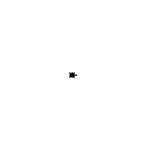
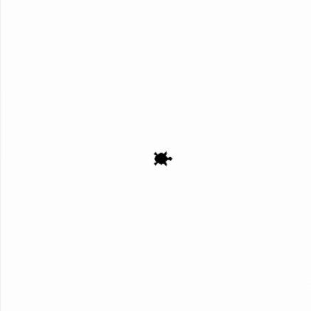
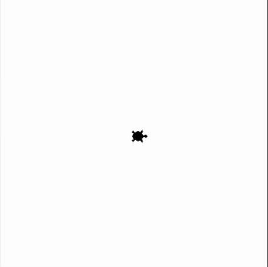

## Bedingte Anweisungen mit Turtle - unter Verwendung von Zufallszahlen 
### Aufgabe 1 - Nur auf der rechten Hälfte zeichnen (if ohne else)
Wir zoomen hinaus. Die Turtle ist in ihrem sandigen Garten, links davon das Meer, rechts davon die Wüste. Es ist zu heiß und unsere Turtle hat eine Idee. Sich im Sand eingraben und schlafen. Dazu würde sie gerne einen geeigneten Ort in der Wüste suchen. Da sie keine Ahnung hat wohin sie gehen soll, verwendet sie [geoguessr.com](https://www.geoguessr.com/maps), wählt ihr Land aus und erzeugt damit einen zufälligen Ort. Diesen gibt sie in einer Map-App ein und lässt sich dorthin navigieren. Ein Problem ist nur, dass dieser Ort auch im Meer sein kann. Falls das passiert bleibt unsere Turtle demotiviert im Haus stehen und tut nichts. Falls es in die Wüste ist, geht sie dorthin und gräbt sich ein. Bevor sie losgeht drückt diese einen Faden in den Boden um ihr am Haus wiederzufinden.

Wir setzen die Logik folgendermaßen um:
* Wenn die zufällige x-Koordinate in der rechten Bildschirmhälfte liegt (Wüste), bewege die Turtle dorthin und lass diese sich im Sand eingraben. 
* Wenn die zufällige x-Koordinate in der linken Bildschirmhälfte liegt, bleibt unsere Turtle stehen.

**Hinweise:**
Verwende dazu folgende ``Prozeduren``:
* ``pendown()``: Die Turtle legt **einen** Faden am Boden ab. Diese malt dadruch Linien wenn diese sich **später** bewegt.
* ``goto(-100, 200)``: Die Turtle bewegt sich in einer *geraden Linie* zu der angegebenen *Position*. Die *Position* wird in *x* und *y* *Koordinaten* abegeben. Hier ist die Mitte des Fensters *x = 0* und *y = 0* ist.
* ``hideturtle()``: Die Turtle gräbt sich ein und versteckt sich.
* ``stamp()``: Die Turtle drückt sich auf den Boden und kann somit einen Faden befestigen.

Sowie folgende ``Funktionen``:
* ``randint(3, 8)``: Wir ziehen eine zufällige Zahl ohne Kommastellen von z.B. 3 bis 8. Wir wollen hier die Breite und Höhe des Fensters in der sich die Turtle befindet verwenden.
* ``window_width()``: Gibt die breite unseres Fenstes zurück. Merke dir die Antwort mit einer ``Variable``. Das geht so *breite = window_width()*.
* ``window_height()``: Gibt die breite unseres Fenstes zurück. Merke dir die Antwort mit einer ``Variable``. Das geht so *hoehe = window_height()*.

<div style="text-align: left;">
    
    
</div>

**Vorlage:**
```python
from turtle import *
from random import randint

# --- Vorbereitung ---
shape("turtle")
# Wir verwenden mit dem Wert 1 eine sichtbare Geschwindigkeit der Turtle.
speed(1)

# --- Logik ---
# Wir generierem zufällige Koordinaten innerhalb der Fenstergröße.
# Das Wort Zufall wird im Englischen das Wort random. 
breite = ... # TODO: Lösche dieses Kommentar, die drei Punkte und füge dort die korrekte Funktion ein.
hoehe = ... # TODO: Lösche dieses Kommentar, die drei Punkte und füge dort die korrekte Funktion ein.

# Die Bildschrimbreite geht von z.B. 0 bis 100. Für unsre Turtle ist jedoch die Mitte dieser Breite der 0-Punkt.
# Dadurch ändert sich 0 bis 100 zu -50 bis 50.
# Um die Turtle zufällig zu navigieren, müssen wir eine Zahl zwischen -50 und 50 ziehen. 
# Das gleiche gilt für die Hoehe.
# Lege zwei Variable an die die hälfte der bildschirmbreite bzw. der bildschirmhoehe ist.
halbe_breite_mit_komma = ... # TODO: Lösche dieses Kommentar, die drei Punkte und füge dort den korrekten Ausdruck ein.
halbe_hoehe_mit_komma = ... # TODO: Lösche dieses Kommentar, die drei Punkte und füge dort den korrekten Ausdruck ein.

# Die Division ergibt immer eine Kommazahl (float), auch wenn wir 4 / 2 = 2.0 rechnen.
# Wir müssen deshalb das Ergebnis in eine Zahl ohne Komma (einen Integer) umwandlen. 
halbe_breite_ohne_komma = ... # TODO: Lösche dieses Kommentar, die drei Punkte und füge dort die korrekte Funktion ein.
halbe_hoehe_ohne_komma = ... # TODO: Lösche dieses Kommentar, die drei Punkte und füge dort die korrekte Funktion ein.

# Da wir zufällige Zahlen ohne Komma wollen, verwenden wir die Funktion randint.
# Diese benötigt zwei zahlen, zwischen denen sie zufällig eine Wählt. 
# randint(3, 8) gibt eine Zahl welche 3 sein kann, 8 sein kann und alles dazwischen. Alles dazwischen ist 4, 5, 6 und 7.
# Der Name ist eine Kombination aus Random und Integer, was Zufall und Zahl ohne Komma bedeutet.
ziel_in_x = randint(..., ...)
ziel_in_y = randint(..., ...)

# Die Turtle bewegt sich nur zu den Koordinaten, wenn wir auf der rechten Bildschirmhälfte uns befinden.
# Verwende dazu das Keyword if um die Bedingte Anweisung umzusetzen.
# TODO: Lösche dieses Kommetar und schreibe den Programmcode hier!

# Die Turtle drückt den Faden auf den Boden und machen damit einen Abdruck.
# TODO: Lösche dieses Kommetar und schreibe den Programmcode hier!

# Die Turtle holt den Faden aus der Tasche und legt diesen auf den Boden, wenn diese losgeht.
# TODO: Lösche dieses Kommetar und schreibe den Programmcode hier!

# Die Turtle geht in einer geraden linie zu den angegebenen Kooridinaten.
# TODO: Lösche dieses Kommetar und schreibe den Programmcode hier!

# Am schluss gräbt sich die Turtle ein um im Sand zu schlafen.
# TODO: Lösche dieses Kommetar und schreibe den Programmcode hier!

# Wenn die Turtle nach links gehen würde, dann mache nichts.
# TODO: Lösche dieses Kommetar und schreibe hier nichts!

# --- Abschluss ---
# Schließt das Fenster nicht, wenn das Programm beendet ist.
done()
```

### Aufgabe 2 - Nur in einem links und rechts abgegrenzten Bereich zeichnen
Unsere Turtle ist immer noch zu heiß. Sie will nun nicht mehr so weit nach rechts gehen. Sie erweitert ihr *demotiviert nichts tun* zusätzlich auf Ziele welche weiter rechts als die hälfte von der Wüste liegen.

Wir setzen die Logik der ``Bedingten Anweisung`` folgendermaßen um:
* **WENN** die x-Koordinate in der rechten Bildschirmhälfte liegt (Wüste) ``und`` und in der *vorderen Hälfte* der rechten Bildschirmhälfte (Wüste) liegt, **DANN** bewege die Turtle dorthin. Danach gräbt sich diese im Sand ein.

**Hinweise:**
Verwende dazu folgende ``Prozeduren``:
* ``pendown()``: Die Turtle legt **einen** Faden am Boden ab. Diese malt dadruch Linien wenn diese sich **später** bewegt.
* ``goto(-100, 200)``: Die Turtle bewegt sich in einer *geraden Linie* zu der angegebenen *Position*. Die *Position* wird in *x* und *y* *Koordinaten* abegeben. Hier ist die Mitte des Fensters *x = 0* und *y = 0* ist.
* ``hideturtle()``: Die Turtle gräbt sich ein und versteckt sich.
* ``stamp()``: Die Turtle drückt sich auf den Boden und kann somit einen Faden befestigen.

Sowie folgende ``Funktionen``:
* ``randint(3, 8)``: Wir ziehen eine zufällige Zahl ohne Kommastellen von z.B. 3 bis 8. Wir wollen hier die Breite und Höhe des Fensters in der sich die Turtle befindet verwenden.
* ``window_width()``: Gibt die breite unseres Fenstes zurück. Merke dir die Antwort mit einer ``Variable``. Das geht so *breite = window_width()*.
* ``window_height()``: Gibt die breite unseres Fenstes zurück. Merke dir die Antwort mit einer ``Variable``. Das geht so *hoehe = window_height()*.

<div style="text-align: left;">
    
    
</div>

**Vorlage:**
```python
from turtle import *
from random import randint

# --- Vorbereitung ---
shape("turtle")
# Wir verwenden mit dem Wert 1 eine sichtbare Geschwindigkeit der Turtle.
speed(1)

# --- Logik ---
# Wir generierem zufällige Koordinaten innerhalb der Fenstergröße.
# Das Wort Zufall wird im Englischen das Wort random. 
breite = window_width()
hoehe = window_height()

# Die Bildschrimbreite geht von z.B. 0 bis 100. Für unsre Turtle ist jedoch die Mitte dieser Breite der 0-Punkt.
# Dadurch ändert sich 0 bis 100 zu -50 bis 50.
# Um die Turtle zufällig zu navigieren, müssen wir eine Zahl zwischen -50 und 50 ziehen. 
# Das gleiche gilt für die Hoehe.
# Lege zwei Variable an die die hälfte der bildschirmbreite bzw. der bildschirmhoehe ist.
halbe_breite_mit_komma = breite / 2 
halbe_hoehe_mit_komma = hoehe / 2 

# Die Division ergibt immer eine Kommazahl (float), auch wenn wir 4 / 2 = 2.0 rechnen.
# Wir müssen deshalb das Ergebnis in eine Zahl ohne Komma (einen Integer) umwandlen. 
halbe_breite_ohne_komma = int(halbe_breite_mit_komma) 
halbe_hoehe_ohne_komma = int(halbe_hoehe_mit_komma) 

# Info: Es kann natürlich der Ausdruck breite / 2 direkt in die Funktion int hineingeschrieben werden.
# halbe_breite_ohne_komma = int(breite/2)

# Info: Oder wir verwenden eine Division, wo eine Zahl ohne Komma rauskommt. Die Ganzzahldivision.
# Diese ist unter 5 dividiert durch 2 ist 2, mit 1 Rest bekannt und wird mit Python mit // geschrieben.
# Das 1 Rest wird hier mit // ignorieret.
# halbe_breite_ohne_komma = breite // 2 
# halbe_hoehe_ohne_komma = hoehe // 2

# Da wir zufällige Zahlen ohne Komma wollen, verwenden wir die Funktion randint.
# Diese benötigt zwei zahlen, zwischen denen sie zufällig eine Wählt. 
# randint(3, 8) gibt eine Zahl welche 3 sein kann, 8 sein kann und alles dazwischen. Alles dazwischen ist 4, 5, 6 und 7.
# Der Name ist eine Kombination aus Random und Integer, was Zufall und Zahl ohne Komma bedeutet.
ziel_in_x = randint(-halbe_breite_ohne_komma, halbe_breite_ohne_komma)
ziel_in_y = randint(-halbe_hoehe_ohne_komma, halbe_hoehe_ohne_komma)

# Die Turtle bewegt sich nur zu den Koordinaten, wenn wir uns zwischen 0 und einem Viertel der Breite befinden.
if ... # TODO: Lösche dieses Kommentar, die drei Punkte und füge dort den korrekten logischen Ausdruck ein.
    # Hier ist die Einrückung wichtig! Drücke die Tabulator Taste dazu, (links neben dem Q).
    # Die Turtle drückt den Faden auf den Boden und machen damit einen Abdruck.
    stamp() 
    
    # Die Turtle holt den Faden aus der Tasche und legt diesen auf den Boden, wenn diese losgeht.
    pendown() 
    
    # Die Turtle geht in einer geraden linie zu den angegebenen Kooridinaten.
    goto(ziel_in_x, ziel_in_y)

    # Am schluss gräbt sich die Turtle ein um im Sand zu schlafen.
    hideturtle() 

# --- Abschluss ---
# Schließt das Fenster nicht, wenn das Programm beendet ist.
done()
```

### Aufgabe 3 - Nur in einem links und rechts oder nach unten abgegrenzten Bereich zeichnen
Unsere Turtle ist immer noch zu heiß. Sie will wie zuvor nicht mehr so weit nach rechts gehen. Zusätzlich ist ihr aufgefallen, wenn sie nach Norden geht, ist es kälter. Ihr macht es dadurch es nichts mehr aus tief in die Wüste hineinzugehen, wenn sie nach norden geht.

Wir setzen die Logik der ``Bedingten Anweisung`` folgendermaßen um:
* **WENN** die x-Koordinate in der rechten Bildschirmhälfte liegt (Wüste) ``und`` und in der *vorderen Hälfte* der rechten Bildschirmhälfte (Wüste) liegt ``oder`` x-Koordinate in der rechten Bildschirmhälfte liegt (Wüste) ``und`` die y-Koordinate in der oberen Bildschirmhäfte liegt, **DANN** bewege die Turtle dorthin. Danach gräbt sich diese im Sand ein.

**Hinweise:**
Verwende dazu folgende ``Prozeduren``:
* ``pendown()``: Die Turtle legt **einen** Faden am Boden ab. Diese malt dadruch Linien wenn diese sich **später** bewegt.
* ``goto(-100, 200)``: Die Turtle bewegt sich in einer *geraden Linie* zu der angegebenen *Position*. Die *Position* wird in *x* und *y* *Koordinaten* abegeben. Hier ist die Mitte des Fensters *x = 0* und *y = 0* ist.
* ``hideturtle()``: Die Turtle gräbt sich ein und versteckt sich.
* ``stamp()``: Die Turtle drückt sich auf den Boden und kann somit einen Faden befestigen.

Sowie folgende ``Funktionen``:
* ``randint(3, 8)``: Wir ziehen eine zufällige Zahl ohne Kommastellen von z.B. 3 bis 8. Wir wollen hier die Breite und Höhe des Fensters in der sich die Turtle befindet verwenden.
* ``window_width()``: Gibt die breite unseres Fenstes zurück. Merke dir die Antwort mit einer ``Variable``. Das geht so *breite = window_width()*.
* ``window_height()``: Gibt die breite unseres Fenstes zurück. Merke dir die Antwort mit einer ``Variable``. Das geht so *hoehe = window_height()*.

<div style="text-align: left;">
    
    
    
</div>

**Vorlage:**
```python
from turtle import *
from random import randint

# --- Vorbereitung ---
shape("turtle")
# Wir verwenden mit dem Wert 1 eine sichtbare Geschwindigkeit der Turtle.
speed(1)

# --- Logik ---
# Wir generierem zufällige Koordinaten innerhalb der Fenstergröße.
# Das Wort Zufall wird im Englischen das Wort random. 
breite = window_width()
hoehe = window_height()

# Die Bildschrimbreite geht von z.B. 0 bis 100. Für unsre Turtle ist jedoch die Mitte dieser Breite der 0-Punkt.
# Dadurch ändert sich 0 bis 100 zu -50 bis 50.
# Um die Turtle zufällig zu navigieren, müssen wir eine Zahl zwischen -50 und 50 ziehen. 
# Das gleiche gilt für die Hoehe.
# Lege zwei Variable an die die hälfte der bildschirmbreite bzw. der bildschirmhoehe ist.
halbe_breite_mit_komma = breite / 2 
halbe_hoehe_mit_komma = hoehe / 2 

# Die Division ergibt immer eine Kommazahl (float), auch wenn wir 4 / 2 = 2.0 rechnen.
# Wir müssen deshalb das Ergebnis in eine Zahl ohne Komma (einen Integer) umwandlen. 
halbe_breite_ohne_komma = int(halbe_breite_mit_komma) 
halbe_hoehe_ohne_komma = int(halbe_hoehe_mit_komma) 

# Info: Es kann natürlich der Ausdruck breite / 2 direkt in die Funktion int hineingeschrieben werden.
# halbe_breite_ohne_komma = int(breite/2)

# Info: Oder wir verwenden eine Division, wo eine Zahl ohne Komma rauskommt. Die Ganzzahldivision.
# Diese ist unter 5 dividiert durch 2 ist 2, mit 1 Rest bekannt und wird mit Python mit // geschrieben.
# Das 1 Rest wird hier mit // ignorieret.
# halbe_breite_ohne_komma = breite // 2 
# halbe_hoehe_ohne_komma = hoehe // 2

# Da wir zufällige Zahlen ohne Komma wollen, verwenden wir die Funktion randint.
# Diese benötigt zwei zahlen, zwischen denen sie zufällig eine Wählt. 
# randint(3, 8) gibt eine Zahl welche 3 sein kann, 8 sein kann und alles dazwischen. Alles dazwischen ist 4, 5, 6 und 7.
# Der Name ist eine Kombination aus Random und Integer, was Zufall und Zahl ohne Komma bedeutet.
ziel_in_x = randint(-halbe_breite_ohne_komma, halbe_breite_ohne_komma)
ziel_in_y = randint(-halbe_hoehe_ohne_komma, halbe_hoehe_ohne_komma)

# Die Turtle bewegt sich zu den Koordinaten, wenn wir uns zwischen 0 und einem Viertel der Breite befinden.
# Die Turtle bewegt sich auch zu den Koordinaten, wenn wir uns größer als 0 in der Breite und größer als 0 in der Höhe befinden.
if ... # TODO: Lösche dieses Kommentar, die drei Punkte und füge dort den korrekten logischen Ausdruck ein.
    # Hier ist die Einrückung wichtig! Drücke die Tabulator Taste dazu, (links neben dem Q).
    # Die Turtle drückt den Faden auf den Boden und machen damit einen Abdruck.
    stamp() 
    
    # Die Turtle holt den Faden aus der Tasche und legt diesen auf den Boden, wenn diese losgeht.
    pendown() 
    
    # Die Turtle geht in einer geraden linie zu den angegebenen Kooridinaten.
    goto(ziel_in_x, ziel_in_y)

    # Am schluss gräbt sich die Turtle ein um im Sand zu schlafen.
    hideturtle() 
# else:
#     pass
    # Wenn die Turtle nach links gehen würde, dann mache nichts.
    # Wenn wir ansonsten (else) und mache nichts (pass) schreiben würden, können wir else und pass auch weglassen.

# --- Abschluss ---
# Schließt das Fenster nicht, wenn das Programm beendet ist.
done()
```

### Aufgabe 3.1 - Variablen statt Werte in der Bedingung verwenden
Da wir schon komplizierte ``Bedingungen`` in unserer ``Bedingten Anweisung`` haben, wollen wir diese durch ``Variablen`` benennen. Das erleichtert uns das Lesen des Codes. Ansonsten ist es hier die gleiche Angabe wie in [Aufgabe 3](#aufgabe-3---nur-in-einem-links-und-rechts-oder-nach-unten-abgegrenzten-bereich-zeichnen).

Verwende nun ``Variablen`` für:
* der logische Ausdruck *Turtle geht in den norden und nach rechts*,
* der logische Ausdruck *Turtle geht nach rechts und nicht zu weit nach rechts* und
* ein logische Ausdruck die beiden vorherigen zusammenfasst. Diese ist unsere ``Bedingung`` für die ``Bedingte Anweisung``.

**Vorlage:**
```python
from turtle import *
from random import randint

# --- Vorbereitung ---
shape("turtle")
# Wir verwenden mit dem Wert 1 eine sichtbare Geschwindigkeit der Turtle.
speed(1)

# --- Logik ---
# Wir generierem zufällige Koordinaten innerhalb der Fenstergröße.
# Das Wort Zufall wird im Englischen das Wort random. 
breite = window_width()
hoehe = window_height()

# Die Bildschrimbreite geht von z.B. 0 bis 100. Für unsre Turtle ist jedoch die Mitte dieser Breite der 0-Punkt.
# Dadurch ändert sich 0 bis 100 zu -50 bis 50.
# Um die Turtle zufällig zu navigieren, müssen wir eine Zahl zwischen -50 und 50 ziehen. 
# Das gleiche gilt für die Hoehe.
# Lege zwei Variable an die die hälfte der bildschirmbreite bzw. der bildschirmhoehe ist.
halbe_breite_mit_komma = breite / 2 
halbe_hoehe_mit_komma = hoehe / 2 

# Die Division ergibt immer eine Kommazahl (float), auch wenn wir 4 / 2 = 2.0 rechnen.
# Wir müssen deshalb das Ergebnis in eine Zahl ohne Komma (einen Integer) umwandlen. 
halbe_breite_ohne_komma = int(halbe_breite_mit_komma) 
halbe_hoehe_ohne_komma = int(halbe_hoehe_mit_komma) 

# Info: Es kann natürlich der Ausdruck breite / 2 direkt in die Funktion int hineingeschrieben werden.
# halbe_breite_ohne_komma = int(breite/2)

# Info: Oder wir verwenden eine Division, wo eine Zahl ohne Komma rauskommt. Die Ganzzahldivision.
# Diese ist unter 5 dividiert durch 2 ist 2, mit 1 Rest bekannt und wird mit Python mit // geschrieben.
# Das 1 Rest wird hier mit // ignorieret.
# halbe_breite_ohne_komma = breite // 2 
# halbe_hoehe_ohne_komma = hoehe // 2

# Da wir zufällige Zahlen ohne Komma wollen, verwenden wir die Funktion randint.
# Diese benötigt zwei zahlen, zwischen denen sie zufällig eine Wählt. 
# randint(3, 8) gibt eine Zahl welche 3 sein kann, 8 sein kann und alles dazwischen. Alles dazwischen ist 4, 5, 6 und 7.
# Der Name ist eine Kombination aus Random und Integer, was Zufall und Zahl ohne Komma bedeutet.
ziel_in_x = randint(-halbe_breite_ohne_komma, halbe_breite_ohne_komma)
ziel_in_y = randint(-halbe_hoehe_ohne_komma, halbe_hoehe_ohne_komma)

# Die Turtle bewegt sich zu den Koordinaten, wenn wir uns zwischen 0 und einem Viertel der Breite befinden.
# Die Turtle bewegt sich auch zu den Koordinaten, wenn wir uns größer als 0 in der Breite und größer als 0 in der Höhe befinden.
gehe_nach_nicht_zu_weit_in_die_wueste = ... # TODO: Lösche dieses Kommentar, die drei Punkte und füge dort den korrekten logischen Ausdruck ein.
gehe_nach_norden_und_weit_in_die_wueste = ... # TODO: Lösche dieses Kommentar, die drei Punkte und füge dort den korrekten logischen Ausdruck ein.

verhalten_bei_hitze = ... # TODO: Lösche dieses Kommentar, die drei Punkte und füge dort den korrekten logischen Ausdruck ein.

if verhalten_bei_hitze:
    # Hier ist die Einrückung wichtig! Drücke die Tabulator Taste dazu, (links neben dem Q).
    # Die Turtle drückt den Faden auf den Boden und machen damit einen Abdruck.
    stamp() 
    
    # Die Turtle holt den Faden aus der Tasche und legt diesen auf den Boden, wenn diese losgeht.
    pendown() 
    
    # Die Turtle geht in einer geraden linie zu den angegebenen Kooridinaten.
    goto(ziel_in_x, ziel_in_y)

    # Am schluss gräbt sich die Turtle ein um im Sand zu schlafen.
    hideturtle() 

# --- Abschluss ---
# Schließt das Fenster nicht, wenn das Programm beendet ist.
done()
```