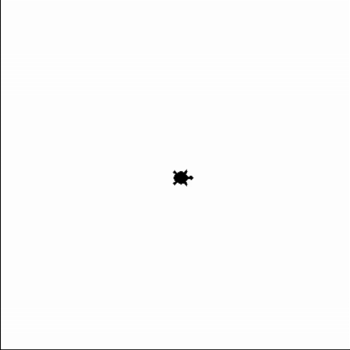
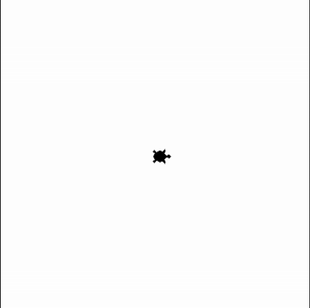
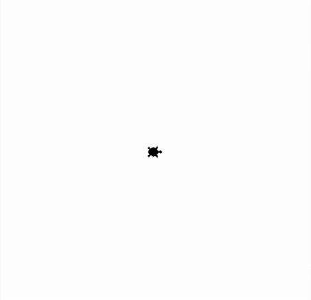
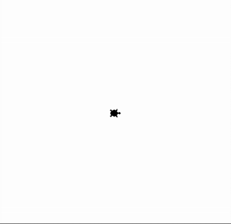
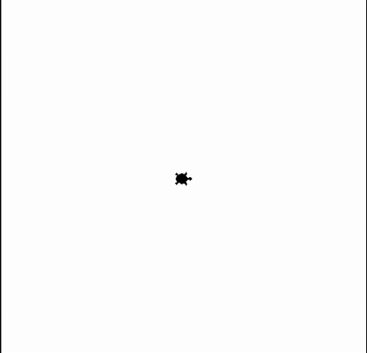
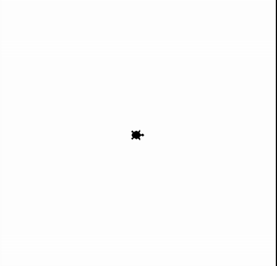

## Verzweigungen mit Turtle - unter Verwendung von Zufallszahlen 
### Aufgabe 1 - Anderes Verhalten im Wasser als am Sand (if mit else)
Nachdem unsere Turtle sich im Sand abgekühlt ist sie hungrig. Sie sucht nach Blumen eines Kaktus in der Wüste und nach im Meer nach Algen und Seegras. Sie ist wie zuvor im Haus am Rande des Meers. Links von Ihr ist das Meer und rechts von ihr die Wüste. 
* Da sie wieder nicht weiß wohin, versucht sie sich wieder mit zufälligen Positionen. 
* Egal ob Wasser oder Wüste, sie legt wieder einen Faden ab und befestigt diesen im Garten indem sie sich in den Boden drückt. Sie hat dabei die bereits verwendete Form der Turtle.
* Da sie hungrig ist, geht sie am Sand mit der doppelten Geschwindigkeit welche am Land üblich ist. Wenn die Turtle ins Meer geht, dann schwimmt sie und ist um das 50-fache Schneller als die normale Geschwindigkeit am Land. Im Meer ist es egal ob sie hungrig ist oder nicht, da sie immer so schnell ist. 
* Wenn die Turtle im Meer schwimmt, dann sehen wir keine Beine und deshalb nur einen Kreis. Ansonsten stelle sie als Pfeil dar, denn Sie ist doppelt so schnell als sonst. 
* Am schluss taucht sie im Wasser, am Land jedoch bleibt sie einfach stehen.

**Hinweise:**
Verwende ``Variablen`` für:

* die Geschwindigkeit der Turtle am Wasser, am Land und hungrig am Land,
* die Form im Garten, in der Wüste und im Wasser.

Entscheide selbst ob hier ``Variablen`` für
* den logischen Ausdruck der ``Bedingung`` unserer ``Verzweigung`` verwendet werden sollen.

Verwende dazu folgende ``Prozeduren``:

* ``pendown()``: Die Turtle legt **einen** Faden am Boden ab. Diese malt dadruch Linien wenn diese sich **später** bewegt.
* ``goto(-100, 200)``: Die Turtle bewegt sich in einer *geraden Linie* zu der angegebenen *Position*. Die *Position* wird in *x* und *y* *Koordinaten* abegeben. Hier ist die Mitte des Fensters *x = 0* und *y = 0* ist.
* ``hideturtle()``: Die Turtle gräbt sich ein und versteckt sich.
* ``stamp()``: Die Turtle drückt sich auf den Boden und hinterlässt einen Abdruck.
* ``shape("turtle")``, ``shape("circle")`` oder ``shape("arrow")``: Wir lassen unsere Turtle anders aussehen.

Sowie folgende ``Funktionen``:

* ``randint(3, 8)``: Wir ziehen eine zufällige Zahl ohne Kommastellen von z.B. 3 bis 8.
* ``window_width()``: Gibt die breite unseres Fenstes zurück. Merke dir die Antwort mit einer ``Variable``. Das geht so *breite = window_width()*.
* ``window_height()``: Gibt die breite unseres Fenstes zurück. Merke dir die Antwort mit einer ``Variable``. Das geht so *hoehe = window_height()*.

<div style="text-align: left;">
    
    
</div>

**Vorlage:**
```python
from turtle import *
from random import randint

# --- Vorbereitung ---
# Die Variablen für die Geschwindigkeit.
geschwindigkeit_am_land = ... # TODO: Lösche dieses Kommentar, die drei Punkte und füge dort den korrekten Wert ein.
geschwindigkeit_am_land_hungrig = ... # TODO: Lösche dieses Kommentar, die drei Punkte und füge dort den korrekten Ausdruck ein.
geschwindigkeit_im_wasser = ... # TODO: Lösche dieses Kommentar, die drei Punkte und füge dort den korrekten Ausdruck ein.

# Die Variablen für die Form.
form_am_land = ... # TODO: Lösche dieses Kommentar, die drei Punkte und füge dort den korrekten Wert ein.
form_am_land_hungrig = ... # TODO: Lösche dieses Kommentar, die drei Punkte und füge dort den korrekten Wert ein.
form_im_wasser = ... # TODO: Lösche dieses Kommentar, die drei Punkte und füge dort den korrekten Wert ein.

shape(...) # TODO: Lösche dieses Kommentar, die drei Punkte und füge dort die korrekte Variable ein.
speed(...) # TODO: Lösche dieses Kommentar, die drei Punkte und füge dort die korrekte Variable ein.

# --- Logik ---
# Wir generierem zufällige Koordinaten innerhalb der Fenstergröße.
# Das Wort Zufall wird im Englischen das Wort random. 
breite = window_width()
hoehe = window_height()

# Die Bildschrimbreite geht von z.B. 0 bis 100. Für unsre Turtle ist jedoch die Mitte dieser Breite der 0-Punkt.
# Dadurch ändert sich 0 bis 100 zu -50 bis 50.
# Um die Turtle zufällig zu navigieren, müssen wir eine Zahl zwischen -50 und 50 ziehen. 
# Das gleiche gilt für die Hoehe.

# Die Ganzzahldivision.
# Diese ist unter 5 dividiert durch 2 ist 2, mit 1 Rest bekannt und wird mit Python mit // geschrieben.
# Das 1 Rest wird hier mit // ignorieret.
halbe_breite_ohne_komma = breite // 2 
halbe_hoehe_ohne_komma = hoehe // 2

# Da wir zufällige Zahlen ohne Komma wollen, verwenden wir die Funktion randint.
# Diese benötigt zwei zahlen, zwischen denen sie zufällig eine Wählt. 
# randint(3, 8) gibt eine Zahl welche 3 sein kann, 8 sein kann und alles dazwischen. Alles dazwischen ist 4, 5, 6 und 7.
# Der Name ist eine Kombination aus Random und Integer, was Zufall und Zahl ohne Komma bedeutet.
ziel_in_x = randint(-halbe_breite_ohne_komma, halbe_breite_ohne_komma)
ziel_in_y = randint(-halbe_hoehe_ohne_komma, halbe_hoehe_ohne_komma)

# Die Turtle nimmt den Faden aus der Tasche und legt ihn am Boden wenn sie losgeht.
pendown()

# Die Turtle drückt den Faden in den boden, fixiert diesen und macht einen Abdruck von sich selbst.
stamp()

# Wir bewegen die Turtle und passen an mit einer Verzweigung an wie diese dargestellt wird (Kreis oder Turtle) und wie schnell diese ist. 
if ... # TODO: Lösche dieses Kommentar, die drei Punkte und füge dort den korrekten logischen Ausdruck ein.

# Setze die Geschwindigkeit auf die Landgeschwindigkeit. 
# TODO: Lösche dieses Kommetar und schreibe den Programmcode hier!

# Die Turtle geht und ist als Arrow sichtbar.
# TODO: Lösche dieses Kommetar und schreibe den Programmcode hier!

# Wir bewegen die Turtle und passen an mit einer Verzweigung an wie diese dargestellt wird (Kreis oder Turtle) und wie schnell diese ist. 
# TODO: Lösche dieses Kommetar und schreibe den Programmcode hier!

# Setze die Geschwindigkeit auf die Wassergeschwindigkeit.
# TODO: Lösche dieses Kommetar und schreibe den Programmcode hier!

# Die Turtle schwimmt und es ist nur der Panzer sichtbar. Quasi nur ein Kreis.
# Das englische Wort für Kreis ist circle.
# TODO: Lösche dieses Kommetar und schreibe den Programmcode hier!

# Wir bewegen uns zur zufällig gewählten Position.
goto(ziel_in_x, ziel_in_y)

# Am schluss gräbt sich die Turtle in den Sand oder taucht im Wasser unter.
hideturtle()

# --- Abschluss ---
# Schließt das Fenster nicht, wenn das Programm beendet ist.
done()
```

### Aufgabe 2 - Anderes Verhalten im Wasser als am Sand und im Norden und Süden (if mit elif und else)
Am nächsten Tag ist die Turtle wieder hungrig und verhält sich auch im prinzip gleich. Jedoch hat die beim vorherigen Tag gemerkt, dass der nördliche Teil des Wassers gefährlich ist. Dort sind scharfe Steine und bilden ein Riff. Sie muss hier genau so langsam wie in der Wüste nach essen suchen. Auch ist es so grell am Land im Süden, denn die Turtle geht genau auf den Sonnenaufgang zu. Sie dreht sich deshalb nach Westen und geht quasi rückwärts an ihr Ziel. Dadurch ist sie genau so schnell wie wenn sie sich ohne Hunger fortbewegen würde.

**Hinweise:**
Verwende ``Variablen`` für:

* die Geschwindigkeit der Turtle am Wasser, am Land und hungrig am Land,
* die Form im Garten, in der Wüste und im Wasser und
* die ``logischen Ausdrücke`` der ``Bedingungen`` unserer ``Mehrfachverzweigung``.

Verwende dazu folgende ``Prozeduren``:

* ``pendown()``: Die Turtle legt **einen** Faden am Boden ab. Diese malt dadruch Linien wenn diese sich **später** bewegt.
* ``goto(-100, 200)``: Die Turtle bewegt sich in einer *geraden Linie* zu der angegebenen *Position*. Die *Position* wird in *x* und *y* *Koordinaten* abegeben. Hier ist die Mitte des Fensters *x = 0* und *y = 0* ist.
* ``hideturtle()``: Die Turtle gräbt sich ein und versteckt sich.
* ``stamp()``: Die Turtle drückt sich auf den Boden und hinterlässt einen Abdruck.
* ``shape("turtle")``, ``shape("circle")`` oder ``shape("arrow")``: Wir lassen unsere Turtle anders aussehen.

Sowie folgende ``Funktionen``:

* ``randint(3, 8)``: Wir ziehen eine zufällige Zahl ohne Kommastellen von z.B. 3 bis 8.
* ``window_width()``: Gibt die breite unseres Fenstes zurück. Merke dir die Antwort mit einer ``Variable``. Das geht so *breite = window_width()*.
* ``window_height()``: Gibt die breite unseres Fenstes zurück. Merke dir die Antwort mit einer ``Variable``. Das geht so *hoehe = window_height()*.

<table>
    <tr>
        <td style="border: 1px solid #ccc; padding: 5px;">
            
        </td>
        <td style="border: 1px solid #ccc; padding: 5px;">
            
        </td>
    </tr>
    <tr>
        <td style="border: 1px solid #ccc; padding: 5px;">
            
        </td>
        <td style="border: 1px solid #ccc; padding: 5px;">
            
        </td>
    </tr>
</table>

**Vorlage:**
```python
from turtle import *
from random import randint

# --- Vorbereitung ---
# Die Variablen für die Geschwindigkeit.
geschwindigkeit_am_land = 1
geschwindigkeit_am_land_hungrig = 2 * geschwindigkeit_am_land
geschwindigkeit_im_wasser = 50 * geschwindigkeit_am_land

# Die Variablen für die Form.
form_am_land = "turtle"
form_am_land_hungrig = "arrow"
form_im_wasser = "circle"

shape(form_am_land) 
speed(geschwindigkeit_am_land)

# --- Logik ---
# Wir generierem zufällige Koordinaten innerhalb der Fenstergröße.
# Das Wort Zufall wird im Englischen das Wort random. 
breite = window_width()
hoehe = window_height()

# Die Bildschrimbreite geht von z.B. 0 bis 100. Für unsre Turtle ist jedoch die Mitte dieser Breite der 0-Punkt.
# Dadurch ändert sich 0 bis 100 zu -50 bis 50.
# Um die Turtle zufällig zu navigieren, müssen wir eine Zahl zwischen -50 und 50 ziehen. 
# Das gleiche gilt für die Hoehe.

# Die Ganzzahldivision.
# Diese ist unter 5 dividiert durch 2 ist 2, mit 1 Rest bekannt und wird mit Python mit // geschrieben.
# Das 1 Rest wird hier mit // ignorieret.
halbe_breite_ohne_komma = breite // 2 
halbe_hoehe_ohne_komma = hoehe // 2

# Da wir zufällige Zahlen ohne Komma wollen, verwenden wir die Funktion randint.
# Diese benötigt zwei zahlen, zwischen denen sie zufällig eine Wählt. 
# randint(3, 8) gibt eine Zahl welche 3 sein kann, 8 sein kann und alles dazwischen. Alles dazwischen ist 4, 5, 6 und 7.
# Der Name ist eine Kombination aus Random und Integer, was Zufall und Zahl ohne Komma bedeutet.
ziel_in_x = randint(-halbe_breite_ohne_komma, halbe_breite_ohne_komma)
ziel_in_y = randint(-halbe_hoehe_ohne_komma, halbe_hoehe_ohne_komma)

# Die Turtle nimmt den Faden aus der Tasche und legt ihn am Boden wenn sie losgeht.
pendown()

# Die Turtle drückt den Faden in den boden, fixiert diesen und macht einen Abdruck von sich selbst.
stamp()

# Wir bewegen die Turtle und passen an mit einer Mehrfachverzweigung an wie diese dargestellt wird (Kreis oder Turtle) und wie schnell diese ist. 
im_wasser = ... # TODO: Lösche dieses Kommentar, die drei Punkte und füge dort den korrekten logischen Ausdruck ein.
am_land = ... # TODO: Lösche dieses Kommentar, die drei Punkte und füge dort den korrekten logischen Ausdruck ein.

norden = ... # TODO: Lösche dieses Kommentar, die drei Punkte und füge dort den korrekten logischen Ausdruck ein.
sueden = ... # TODO: Lösche dieses Kommentar, die drei Punkte und füge dort den korrekten logischen Ausdruck ein.

schnell_im_wasser = ... # TODO: Lösche dieses Kommentar, die drei Punkte und füge dort den korrekten logischen Ausdruck ein.
langsam_im_wasser = ... # TODO: Lösche dieses Kommentar, die drei Punkte und füge dort den korrekten logischen Ausdruck ein.

bewegt_sich_rueckwaerts_am_land = ... # TODO: Lösche dieses Kommentar, die drei Punkte und füge dort den korrekten logischen Ausdruck ein.
bewegt_sich_vorwärts_am_land = ... # TODO: Lösche dieses Kommentar, die drei Punkte und füge dort den korrekten logischen Ausdruck ein.

if schnell_im_wasser:
# Setze die Geschwindigkeit auf die Wassergeschwindigkeit. 
# TODO: Lösche dieses Kommetar und schreibe den Programmcode hier!

# Die Turtle schwimmt und es ist nur der Panzer sichtbar. Quasi nur ein Kreis.
# Das englische Wort für Kreis ist circle.
# TODO: Lösche dieses Kommetar und schreibe den Programmcode hier!

# Wir bewegen uns zur zufällig gewählten Position.
# TODO: Lösche dieses Kommetar und schreibe den Programmcode hier!

# Am schluss taucht die Turtle im Wasser unter.
# TODO: Lösche dieses Kommetar und schreibe den Programmcode hier!

elif langsam_im_wasser:
# Setze die Geschwindigkeit auf die hungrige Landgeschwindigkeit.
# TODO: Lösche dieses Kommetar und schreibe den Programmcode hier!

# Die Turtle schwimmt und es ist nur der Panzer sichtbar. Quasi nur ein Kreis.
# Das englische Wort für Kreis ist circle.
# TODO: Lösche dieses Kommetar und schreibe den Programmcode hier!

# Wir bewegen uns zur zufällig gewählten Position.
# TODO: Lösche dieses Kommetar und schreibe den Programmcode hier!

# Am schluss taucht die Turtle im Wasser unter.
# TODO: Lösche dieses Kommetar und schreibe den Programmcode hier!

elif bewegt_sich_rueckwaerts_am_land:
# Setze die Geschwindigkeit auf die hungrige Landgeschwindigkeit.
# TODO: Lösche dieses Kommetar und schreibe den Programmcode hier!

# Die Turtle geht und ist als Arrow sichtbar.
# TODO: Lösche dieses Kommetar und schreibe den Programmcode hier!

# Die Turtle dreht sich nach Westen um nicht geblendet zu werden.
# TODO: Lösche dieses Kommetar und schreibe den Programmcode hier!

# Wir bewegen uns zur zufällig gewählten Position.
# TODO: Lösche dieses Kommetar und schreibe den Programmcode hier!

elif bewegt_sich_vorwärts_am_land:
# Setze die Geschwindigkeit auf die hungrige Landgeschwindigkeit.
# TODO: Lösche dieses Kommetar und schreibe den Programmcode hier!

# Die Turtle geht und ist als Arrow sichtbar.
# TODO: Lösche dieses Kommetar und schreibe den Programmcode hier!

# Wir bewegen uns zur zufällig gewählten Position.
# TODO: Lösche dieses Kommetar und schreibe den Programmcode hier!

else:
    # Hier sollten wir nie herkommen! Jedoch kann es passieren, wenn wir Fehler machen.
    # Wir geben deshalb aus, dass wir hier nie herkommen sollten
    fehler = "DAS SOLLTE NIE PASSIEREN!"
    write(fehler)
    print(fehler)

# --- Abschluss ---
# Schließt das Fenster nicht, wenn das Programm beendet ist.
done()
```

### Sehr Fortgeschritten und sehr Optional - Aufgabe 2.1 - Anderes Verhalten im Wasser als am Sand und im Norden und Süden (verschachteltes if und else)
Weierlesen auf eigene Gefahr. Hier ist es das Ziel den Code ein wenig zu verstehen und nicht selbst zu implementieren. Wir bemerken damit, dass verschachtelte Verzweigungen, sehr schnell, sehr komplex werden können. Es gibt eigene Techniken um hier einen Überblick zu behalten, diese sind jedoch bei weitem nicht sinnvoll hier zu betrachten (Guard Clauses, early Exit und die Verbindung zu De'Morgans Law). 

Wir wiederholen die [Aufgabe 2](#aufgabe-2---anderes-verhalten-im-wasser-als-am-sand-und-im-norden-und-süden-if-mit-elif-und-else), nur haben wir dort bemerkt, dass in der ``Mehrfachverzweigung`` doppelter Code vorkommt. Wir setzen z.B. in jedem Zweig ``goto(ziel_in_x, ziel_in_y)``. Wir können ``goto(ziel_in_x, ziel_in_y)`` aber nicht nach der ``Mehrfachverzweigung`` **einmal** aufrufen, denn wenn wir im Wasser sind, dann rufen wir **nach** ``goto(ziel_in_x, ziel_in_y)`` die ``Funktion`` ``hide()`` auf. Wenn wir es trotzdem tun würden, wäre die Folge, dass wir uns verstecken bevor wir losgehen. Das klingt nicht sinnvoll. Wir können hier jedoch probieren eine ``Verschachtelung`` von ``Verzweigungen`` zu verwenden. Wie schaffen es dadurch keinen doppelten Code zu erzeugen, jedoch ist der Preis, dass es alles schwerer nachzuvolliehen wird.

**Lösung:**
```python
from turtle import *
from random import randint

# --- Vorbereitung ---
# Die Variablen für die Geschwindigkeit.
geschwindigkeit_am_land = 1
geschwindigkeit_am_land_hungrig = 2 * geschwindigkeit_am_land
geschwindigkeit_im_wasser = 50 * geschwindigkeit_am_land

# Die Variablen für die Form.
form_am_land = "turtle"
form_am_land_hungrig = "arrow"
form_im_wasser = "circle"

shape(form_am_land) 
speed(geschwindigkeit_am_land)

# --- Logik ---
# Wir generierem zufällige Koordinaten innerhalb der Fenstergröße.
# Das Wort Zufall wird im Englischen das Wort random. 
breite = window_width()
hoehe = window_height()

# Die Bildschrimbreite geht von z.B. 0 bis 100. Für unsre Turtle ist jedoch die Mitte dieser Breite der 0-Punkt.
# Dadurch ändert sich 0 bis 100 zu -50 bis 50.
# Um die Turtle zufällig zu navigieren, müssen wir eine Zahl zwischen -50 und 50 ziehen. 
# Das gleiche gilt für die Hoehe.

# Die Ganzzahldivision.
# Diese ist unter 5 dividiert durch 2 ist 2, mit 1 Rest bekannt und wird mit Python mit // geschrieben.
# Das 1 Rest wird hier mit // ignorieret.
halbe_breite_ohne_komma = breite // 2 
halbe_hoehe_ohne_komma = hoehe // 2

# Da wir zufällige Zahlen ohne Komma wollen, verwenden wir die Funktion randint.
# Diese benötigt zwei zahlen, zwischen denen sie zufällig eine Wählt. 
# randint(3, 8) gibt eine Zahl welche 3 sein kann, 8 sein kann und alles dazwischen. Alles dazwischen ist 4, 5, 6 und 7.
# Der Name ist eine Kombination aus Random und Integer, was Zufall und Zahl ohne Komma bedeutet.
ziel_in_x = randint(-halbe_breite_ohne_komma, halbe_breite_ohne_komma)
ziel_in_y = randint(-halbe_hoehe_ohne_komma, halbe_hoehe_ohne_komma)

# Die Turtle nimmt den Faden aus der Tasche und legt ihn am Boden wenn sie losgeht.
pendown()

# Die Turtle drückt den Faden in den boden, fixiert diesen und macht einen Abdruck von sich selbst.
stamp()

# Wir bewegen die Turtle und passen an mit einer Mehrfachverzweigung an wie diese dargestellt wird (Kreis oder Turtle) und wie schnell diese ist. 
im_wasser = ziel_in_x < 0
am_land = ziel_in_x >= 0

norden = ziel_in_y > 0
sueden = ziel_in_y <= 0

schnell_im_wasser = im_wasser and sueden
langsam_im_wasser = im_wasser and norden

bewegt_sich_rueckwaerts_am_land = am_land and sueden
bewegt_sich_vorwärts_am_land = am_land and norden

# Alles was für sueden und norden doppelt steht, schreiben wir auf die 1. Ebene am_land.
if am_land:
    # Die Turtle geht und ist als Arrow sichtbar.
    shape(form_am_land_hungrig) 

    # Es gilt in der 2. Ebene am_land and sueden, also bewegt_sich_rueckwaerts_am_land.
    if sueden:
        # Setze die Geschwindigkeit auf die hungrige Landgeschwindigkeit.
        speed(geschwindigkeit_am_land)

        # Die Turtle dreht sich nach Westen um nicht geblendet zu werden.
        left(180)

    # Es gilt in der 2. am_land and norden, also bewegt_sich_vorwärts_am_land.
    if norden:
        # Setze die Geschwindigkeit auf die hungrige Landgeschwindigkeit.
        speed(geschwindigkeit_am_land_hungrig)

# Alles was für sueden und norden doppelt steht, schreiben wir auf die 1. Ebene im_wasser.
elif im_wasser:
    # Die Turtle schwimmt und es ist nur der Panzer sichtbar. Quasi nur ein Kreis.
    # Das englische Wort für Kreis ist circle.
    shape(form_im_wasser) 

    # Es gilt in der 2. im_wasser and sueden, also schnell_im_wasser.
    if sueden: 
        # Setze die Geschwindigkeit auf die Wassergeschwindigkeit. 
        speed(geschwindigkeit_im_wasser)

    # Es gilt in der 2. Ebene im_wasser and norden, also langsam_im_wasser.
    if norden:
        # Setze die Geschwindigkeit auf die hungrige Landgeschwindigkeit.
        speed(geschwindigkeit_am_land_hungrig)

# Wir können nun auch nach der Verzweigung auf die 0. Ebene zurück gehen und nur ein mal goto(ziel_in_x, ziel_in_y) aufrufen
# Wir bewegen uns zur zufällig gewählten Position.
goto(ziel_in_x, ziel_in_y)

# Wir fragen nochmals ab ob wir im Wasser sind und verstecken die Turtle.
if im_wasser:
    # Am schluss taucht die Turtle im Wasser unter.
    hideturtle()

# --- Abschluss ---
# Schließt das Fenster nicht, wenn das Programm beendet ist.
done()
```