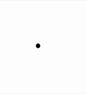

## Verzweigungen mit Turtle
### Nur auf der rechten Hälfte zeichnen
Die Turtle startet am Rande einer Düne. Links von ihr geht es steil nach unten und rechts von ihr ist normaler Sand. Die Turtle drückt sich auf den Boden um einen Abdruck zu machen. Damit vergisst sie nicht wo es stiel nach unten geht. Danach geht die Turtle irgendwo hin und bewegt sich dadurch auf eine zufällige Position. Wenn die x-Koordinate in der rechten Bildschirmhälfte liegt, bewege die Turtle dorthin und lass diese sich im Sand eingraben. Wenn die x-Koordinate in der linken Bildschirmhälfte liegt, bleibt unsere Turtle stehen. Sie will nicht hinunterfallen. Es soll also nichts passieren. 

Verwende dazu folgende ``Funktionen``:
* ``penup()``: Hebe die Turtle in die Luft. Diese malt dadruch **keine** Linien wenn diese sich später bewegt.
* ``goto(-100, 200)``: Die Turtle bewegt sich in einer *geraden Linie* zu der angegebenen *Position*. Die *Position* wird in *x* und *y* *Koordinaten* abegeben, wobei die Mitte des Fensters *x = 0* und *y = 0* ist.
* ``hideturtle()``: Die Turtle gräbt sich ein und versteckt sich.
* ``stamp()``: Die Turtle drückt sich auf den Boden und hinterlässt einen Abdruck.

Sowie folgende ``Funktionen``:
* ``randint(3, 8)``: Wir ziehen eine zufällige Zahl ohne Kommastellen von z.B. 3 bis 8.
* ``window_width()``: Gibt die breite unseres Fenstes zurück. Merke dir die Antwort mit einer ``Variable``. Das geht so *breite = window_width()*.
* ``window_height()``: Gibt die breite unseres Fenstes zurück. Merke dir die Antwort mit einer ``Variable``. Das geht so *hoehe = window_height()*.

**Hinweise:**
<div style="text-align: left;">
    
    
</div>

```python
from turtle import *
from random import randint

# --- Vorbereitung # ---
title("Übung 5.1: Turtle in der rechten Hälfte")
shape("turtle")
speed(1) # Wir verwenden mit dem Wert 1 eine sichtbare Geschwindigkeit der Turtle.

# --- Logik # ---
# Wir generierem zufällige Koordinaten innerhalb der Fenstergröße.
# Das Wort Zufall wird im Englischen das Wort random. 
# Da wir zufällige Zahlen ohne Komma wollen, verwenden wir die Funktion randint.
# Der Name ist eine Kombination aus Random und Integer, was Zufall und Zahl ohne Komma bedeutet.
# TODO: Lösche dieses Kommetar und schreibe den Programmcode hier!

ziel_in_x = randint(..., ...)
ziel_in_y = randint(..., ...)

# Wir bewegen die Turtle nur zu den Koordinaten, wenn wir auf der rechten Bildschirmhälfte uns befinden.
if ... > 0:
    # TODO: Lösche dieses Kommetar und schreibe den Programmcode hier!

# Wenn die Turtle nach links gehen würde, dann mache nichts.
# TODO: Lösche dieses Kommetar und schreibe den Programmcode hier!

# --- Abschluss # ---
exitonclick() # Das Fenster wird geschlossen, wenn wir mit der Maus in das Fenster klicken.
```

### Unterschiedliches Symbol pro Seite
Unsere Turtle steht am Rande des Meeres. Links von Ihr ist das Meer und rechts von ihr ist Sand. Die Turtle sich auf eine zufällige Position bewegen. Wenn die Turtle ins Meer geht, schwimmt sie. Ansonsten geht sie am Sand. Wenn die Turtle im Meer schwimmt, stelle sie als Kreis dar. Ansosnten stelle sie als Turtle, wie bisher dar. Am schluss taucht sie ab oder gräbt sich ein.

Verwende dazu folgende ``Prozeduren``:
* ``penup()``: Hebe die Turtle in die Luft. Diese malt dadruch **keine** Linien wenn diese sich später bewegt.
* ``goto(-100, 200)``: Die Turtle bewegt sich in einer *geraden Linie* zu der angegebenen *Position*. Die *Position* wird in *x* und *y* *Koordinaten* abegeben, wobei die Mitte des Fensters *x = 0* und *y = 0* ist.
* ``hideturtle()``: Die Turtle gräbt sich ein und versteckt sich.
* ``stamp()``: Drücke die Turtle (sanft genug) auf den Boden und hinterlasse einen Abdruck.
* ``shape("turtle")`` oder ``shape("circle")``: Wir lassen unsere Turtle anders aussehen. Wir können folgende Werte übergeben ``"circle"`` und ``"turtle"``. 

Sowie folgende ``Funktionen``:
* ``randint(3, 8)``: Wir ziehen eine zufällige Zahl ohne Kommastellen von z.B. 3 bis 8.
* ``window_width()``: Gibt die breite unseres Fenstes zurück. Merke dir die Antwort mit einer ``Variable``. Das geht so *breite = window_width()*.
* ``window_height()``: Gibt die breite unseres Fenstes zurück. Merke dir die Antwort mit einer ``Variable``. Das geht so *hoehe = window_height()*.

**Hinweise:**
<div style="text-align: left;">
    
    
</div>

```python
from turtle import *
from random import randint

# --- Vorbereitung # ---
title("Übung 5.2: Anderes Symbol")
speed(1) # Wir verwenden mit dem Wert 1 eine sichtbare Geschwindigkeit der Turtle.

# --- Logik # ---
# Wir generierem zufällige Koordinaten innerhalb der Fenstergröße.
# Das Wort Zufall wird im Englischen das Wort random. 
# Da wir zufällige Zahlen ohne Komma wollen, verwenden wir die Funktion randint.
# Der Name ist eine Kombination aus Random und Integer, was Zufall und Zahl ohne Komma bedeutet.
# TODO: Lösche dieses Kommetar und schreibe den Programmcode hier!

# Wir bewegen die Turtle und passen an wie diese dargestellt wird (Kreis oder Turtle). 
# TODO: Lösche dieses Kommetar und schreibe den Programmcode hier!

# --- Abschluss # ---
exitonclick() # Das Fenster wird geschlossen, wenn wir mit der Maus in das Fenster klicken.
```