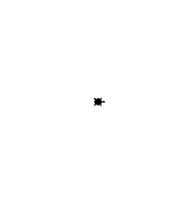

## Verzweigungen mit Turtle
### Nur auf der rechten Hälfte zeichnen
Die Turtle startet am Rande einer Düne. Links von ihr geht es steil nach unten und rechts von ihr ist normaler Sand. Die Turtle drückt sich auf den Boden um einen Abdruck zu machen. Damit vergisst sie nicht wo es stiel nach unten geht. Danach geht die Turtle irgendwo hin und bewegt sich dadurch auf eine zufällige Position. Wenn die x-Koordinate in der rechten Bildschirmhälfte liegt, bewege die Turtle dorthin und lass diese sich im Sand eingraben. Wenn die x-Koordinate in der rechten Bildschirmhälfte liegt, bleibt unsere Turtle stehen. Sie will nicht hinunterfallen. Es soll also nichts passieren. 

Verwende dazu folgende ``Funktionen``:
* ``penup()``: Hebe die Turtle in die Luft. Diese malt dadruch **keine** Linien wenn diese sich später bewegt.
* ``goto(-100, 200)``: Die Turtle bewegt sich in einer *geraden Linie* zu der angegebenen *Position*. Die *Position* wird in *x* und *y* *Koordinaten* abegeben, wobei die Mitte des Fensters *x = 0* und *y = 0* ist.
* ``hideturtle()``: Die Turtle gräbt sich ein und versteckt sich.
* ``randint(3, 8)``: Wir ziehen eine zufällige Zahl ohne Kommastellen von z.B. 3 bis 8.
* ``stamp()``: Die Turtle drückt sich auf den Boden und hinterlässt einen Abdruck.
* ``window_width()``: Gibt die breite unseres Fenstes zurück. Merke dir die Antwort mit einer ``Variable``. Das geht so *breite = window_width()*.
* ``window_height()``: Gibt die breite unseres Fenstes zurück. Merke dir die Antwort mit einer ``Variable``. Das geht so *hoehe = window_height()*.

**Hinweise:**
<div style="text-align: left;">
    
    
</div>

```python
from turtle import *
from random import randint

# --- Vorbereitung # ---
title("Übung 2.1: Turtle in der rechten Hälfte")
shape("turtle")
speed(1) # Wir verwenden mit dem Wert 1 eine sichtbare Geschwindigkeit der Turtle.

# --- Logik # ---
# Wir generierem zufällige Koordinaten innerhalb der Fenstergröße.
# Das Wort Zufall wird im Englischen das Wort random. 
# Da wir zufällige Zahlen ohne Komma wollen, verwenden wir die Funktion randint.
# Der Name ist eine Kombination aus Random und Integer, was Zufall und Zahl ohne Komma bedeutet.
breite = window_width()
hoehe = window_height()

# halbe_breite_als_int = int(breite / 2) # die Division ergibt immer eine Kommazahl, auch wenn wir 4 / 2 = 2.0 rechnen.
halbe_breite_ohne_komma = breite // 2 # oder wir verwenden eine Division, wo eine Zahl ohne Komma rauskommt.
halbe_hoehe_ohne_komma = hoehe // 2

ziel_in_x = randint(-halbe_breite_ohne_komma, halbe_breite_ohne_komma)
ziel_in_y = randint(-halbe_hoehe_ohne_komma, halbe_hoehe_ohne_komma)

# Wir bewegen die Turtle nur zu den Koordinaten, wenn wir auf der rechten Bildschirmhälfte uns befinden.
if ziel_in_x > 0:
    stamp() # Wir drücken die Turtle auf den Boden und machen damit einen Abdruck.
    penup() # Wir heben die Turtle auf, damit wir keine Linie zeichnen.
    goto(ziel_in_x, ziel_in_y)
    hideturtle() # Am schluss verstecken wir die Turtle

# Wenn die Turtle nach links gehen würde, dann mache nichts.

# --- Abschluss # ---
exitonclick() # Das Fenster wird geschlossen, wenn wir mit der Maus in das Fenster klicken.
```

### Unterschiedliches Symbol pro Seite
Unsere Turtle steht am Rande des Meeres. Links von Ihr ist das Meer und rechts von ihr ist Sand. Die Turtle sich auf eine zufällige Position bewegen. Wenn die Turtle ins Meer geht, schwimmt sie. Ansonsten geht sie am Sand. Wenn die Turtle im Meer schwimmt, stelle sie als Kreis dar. Ansosnten stelle sie als Turtle, wie bisher dar. Am schluss taucht sie ab oder gräbt sich ein.

Verwende dazu folgende ``Funktionen``:
* ``penup()``: Hebe die Turtle in die Luft. Diese malt dadruch **keine** Linien wenn diese sich später bewegt.
* ``goto(-100, 200)``: Die Turtle bewegt sich in einer *geraden Linie* zu der angegebenen *Position*. Die *Position* wird in *x* und *y* *Koordinaten* abegeben, wobei die Mitte des Fensters *x = 0* und *y = 0* ist.
* ``hideturtle()``: Die Turtle gräbt sich ein und versteckt sich.
* ``randint(3, 8)``: Wir ziehen eine zufällige Zahl ohne Kommastellen von z.B. 3 bis 8.
* ``stamp()``: Drücke die Turtle (sanft genug) auf den Boden und hinterlasse einen Abdruck.
* ``window_width()``: Gibt die breite unseres Fenstes zurück. Merke dir die Antwort mit einer ``Variable``. Das geht so *breite = window_width()*.
* ``window_height()``: Gibt die breite unseres Fenstes zurück. Merke dir die Antwort mit einer ``Variable``. Das geht so *hoehe = window_height()*.
* ``shape("turtle")`` oder ``shape("circle")``: Wir lassen unsere Turtle anders aussehen. Wir können folgende Werte übergeben ``"circle"`` und ``"turtle"``. 

**Hinweise:**
<div style="text-align: left;">
    
    
</div>

```python
from turtle import *
from random import randint

# --- Vorbereitung # ---
title("Übung 2.2: Anderes Symbol")
speed(1) # Wir verwenden mit dem Wert 1 eine sichtbare Geschwindigkeit der Turtle.

# --- Logik # ---
# Wir generierem zufällige Koordinaten innerhalb der Fenstergröße.
# Das Wort Zufall wird im Englischen das Wort random. 
# Da wir zufällige Zahlen ohne Komma wollen, verwenden wir die Funktion randint.
# Der Name ist eine Kombination aus Random und Integer, was Zufall und Zahl ohne Komma bedeutet.
breite = window_width()
hoehe = window_height()

# halbe_breite_als_int = int(breite / 2) # die Division ergibt immer eine Kommazahl, auch wenn wir 4 / 2 = 2.0 rechnen.
halbe_breite_ohne_komma = breite // 2 # oder wir verwenden eine Division, wo eine Zahl ohne Komma rauskommt.
halbe_hoehe_ohne_komma = hoehe // 2

ziel_in_x = randint(-halbe_breite_ohne_komma, halbe_breite_ohne_komma) # hier darf keine Kommazahl übergeben werden!
ziel_in_y = randint(-halbe_hoehe_ohne_komma, halbe_hoehe_ohne_komma) # hier darf keine Kommazahl übergeben werden!

# Wir bewegen die Turtle und passen an wie diese dargestellt wird (Kreis oder Turtle). 
penup() # Wir heben die Turtle auf, damit wir keine Linie zeichnen.

if ziel_in_x > 0:
    shape('turtle') # Wir verwenden die Form für die rechte Seite auf 'turtle' setzen
else:
    shape('circle') # Form für die linke Seite auf 'circle' setzen

# Wir bewegen uns zur Position zufällig gewählten Position.
goto(ziel_in_x, ziel_in_y)

# Am schluss versteckt sich die Turtle.
hideturtle()

# --- Abschluss # ---
exitonclick() # Das Fenster wird geschlossen, wenn wir mit der Maus in das Fenster klicken.
```