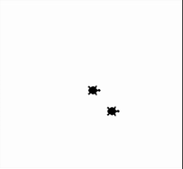
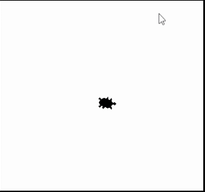
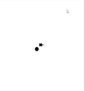
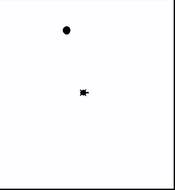

## Schleifen mit Turtle
### Wiederholte Bewegung - für immer
Unsere Turtle will die Welt erforschen. Dazu merkt sich unsere Turtle am Anfang wo sie gestartet ist. Das ist auf der Position *x=0* und *y=0*. Sie steht also wieder am Rande des Meeres. Links von ihr ist das Meer und rechts von ihr ist Sand. Nun wiederholt sie folgendes Verhalten **für immer**. Die Turtle bewegt sich auf *eine zufällige Position* und **markiert** diese. Sie *gräbt* sich nicht mehr ein, sondern bewegt sich zu ihrer Markierung in der Mitte zurück. Wenn sie in der Mitte angekommen ist, geht sie zur nächsten zufälligen Position. Wenn die Turtle ins Meer geht, schwimmt sie. Ansonsten geht sie am Sand. Wenn die Turtle im Meer schwimmt, stelle sie als Kreis dar. Ansonsten stelle sie als Turtle, wie bisher dar. 

Verwende dazu folgende ``Prozeduren``:
* ``penup()``: Die Turtle legt **keinen** Faden am Boden ab. Diese malt dadruch **keine** Linien wenn diese sich **später** bewegt.
* ``goto(-100, 200)``: Die Turtle bewegt sich in einer *geraden Linie* zu der angegebenen *Position*. Die *Position* wird in *x* und *y* *Koordinaten* abegeben. Hier ist die Mitte des Fensters *x = 0* und *y = 0* ist.
* ``hideturtle()``: Die Turtle gräbt sich ein und versteckt sich.
* ``stamp()``: Die Turtle drückt sich auf den Boden und hinterlässt einen Abdruck.
* ``shape("turtle")`` oder ``shape("circle")``: Wir lassen unsere Turtle anders aussehen. Wir können folgende Werte übergeben ``"circle"`` und ``"turtle"``. 

Sowie folgende ``Funktionen``:
* ``randint(3, 8)``: Wir ziehen eine zufällige Zahl ohne Kommastellen von z.B. 3 bis 8.
* ``window_width()``: Gibt die breite unseres Fenstes zurück. Merke dir die Antwort mit einer ``Variable``. Das geht so *breite = window_width()*.
* ``window_height()``: Gibt die breite unseres Fenstes zurück. Merke dir die Antwort mit einer ``Variable``. Das geht so *hoehe = window_height()*.

**Hinweise:**
<div style="text-align: left;">
    
</div>

```python
from turtle import *
from random import randint

# --- Vorbereitung (passiert nur einmal) ---
title("Übung 6.1: Wiederholte Bewegung - für immer")
shape('turtle')
speed(1) # Etwas schneller, da wir mehrere Bewegungen haben
penup() # Wir heben die Turtle nur einmal am Anfang auf.

# --- Logik ---
# Wir drücken die Turtle auf den Boden und machen damit einen Abdruck. Dadruch merkt sie sich wo sie gestartet ist.
stamp() 
penup() # Wir heben die Turtle auf, damit wir keine Linie zeichnen.

# Wir generierem zufällige Koordinaten innerhalb der Fenstergröße.
# Das Wort Zufall wird im Englischen das Wort random. 
# Da wir zufällige Zahlen ohne Komma wollen, verwenden wir die Funktion randint.
# Der Name ist eine Kombination aus Random und Integer, was Zufall und Zahl ohne Komma bedeutet.
breite = window_width()
hoehe = window_height()

# halbe_breite_als_int = int(breite / 2) # die Division ergibt immer eine Kommazahl, auch wenn wir 4 / 2 = 2.0 rechnen.
halbe_breite_ohne_komma = breite // 2 # oder wir verwenden eine Division, wo eine Zahl ohne Komma rauskommt.
halbe_hoehe_ohne_komma = hoehe // 2

while True:
    ziel_in_x = randint(-halbe_breite_ohne_komma, halbe_breite_ohne_komma) # hier darf keine Kommazahl übergeben werden!
    ziel_in_y = randint(-halbe_hoehe_ohne_komma, halbe_hoehe_ohne_komma) # hier darf keine Kommazahl übergeben werden!

    # Wir bewegen die Turtle und passen an wie diese dargestellt wird (Kreis oder Turtle). 
    if ziel_in_x > 0:
        shape('turtle') # Wir verwenden die Form für die rechte Seite auf 'turtle' setzen
    else:
        shape('circle') # Form für die linke Seite auf 'circle' setzen

    # Wir bewegen uns zur zufällig gewählten Position.
    goto(ziel_in_x, ziel_in_y)
    # Wir bewegen uns zur Ausgangsposition zurück.
    goto(0, 0)

# --- Abschluss ---
```

### Wiederholte Bewegung - 5 mal
Unsere Turtle will wieder die Welt erforschen. Die Angabe aus der vorherigen Beispiel ist wieder umzusetzen. Jedoch ist die Turtle nach 5 Bewegungen müde, kehrt zur Mitte zurück und hört danach auf.

Verwende dazu folgende ``Prozeduren``:
* ``penup()``: Die Turtle legt **keinen** Faden am Boden ab. Diese malt dadruch **keine** Linien wenn diese sich **später** bewegt.
* ``goto(-100, 200)``: Die Turtle bewegt sich in einer *geraden Linie* zu der angegebenen *Position*. Die *Position* wird in *x* und *y* *Koordinaten* abegeben. Hier ist die Mitte des Fensters *x = 0* und *y = 0* ist.
* ``hideturtle()``: Die Turtle gräbt sich ein und versteckt sich.
* ``stamp()``: Die Turtle drückt sich auf den Boden und hinterlässt einen Abdruck.
* ``shape("turtle")`` oder ``shape("circle")``: Wir lassen unsere Turtle anders aussehen. Wir können folgende Werte übergeben ``"circle"`` und ``"turtle"``. 

Sowie folgende ``Funktionen``:
* ``randint(3, 8)``: Wir ziehen eine zufällige Zahl ohne Kommastellen von z.B. 3 bis 8.
* ``window_width()``: Gibt die breite unseres Fenstes zurück. Merke dir die Antwort mit einer ``Variable``. Das geht so *breite = window_width()*.
* ``window_height()``: Gibt die breite unseres Fenstes zurück. Merke dir die Antwort mit einer ``Variable``. Das geht so *hoehe = window_height()*.

**Hinweise:**
<div style="text-align: left;">
    
</div>

```python
from turtle import *
from random import randint

# --- Vorbereitung (passiert nur einmal) ---
title("Übung 6.2: Wiederholte Bewegung - 5 mal")
shape('turtle')
speed(1) # Etwas schneller, da wir mehrere Bewegungen haben
penup() # Wir heben die Turtle nur einmal am Anfang auf.

# --- Logik ---
# Wir drücken die Turtle auf den Boden und machen damit einen Abdruck. Dadruch merkt sie sich wo sie gestartet ist.
stamp() 
penup() # Wir heben die Turtle auf, damit wir keine Linie zeichnen.

# Wir generierem zufällige Koordinaten innerhalb der Fenstergröße.
# Das Wort Zufall wird im Englischen das Wort random. 
# Da wir zufällige Zahlen ohne Komma wollen, verwenden wir die Funktion randint.
# Der Name ist eine Kombination aus Random und Integer, was Zufall und Zahl ohne Komma bedeutet.
breite = window_width()
hoehe = window_height()

# halbe_breite_als_int = int(breite / 2) # die Division ergibt immer eine Kommazahl, auch wenn wir 4 / 2 = 2.0 rechnen.
halbe_breite_ohne_komma = breite // 2 # oder wir verwenden eine Division, wo eine Zahl ohne Komma rauskommt.
halbe_hoehe_ohne_komma = hoehe // 2

for so_oft_habe_ich_mich_bewegt in range(5):
    ziel_in_x = randint(-halbe_breite_ohne_komma, halbe_breite_ohne_komma) # hier darf keine Kommazahl übergeben werden!
    ziel_in_y = randint(-halbe_hoehe_ohne_komma, halbe_hoehe_ohne_komma) # hier darf keine Kommazahl übergeben werden!

    # Wir bewegen die Turtle und passen an wie diese dargestellt wird (Kreis oder Turtle). 
    if ziel_in_x > 0:
        shape('turtle') # Wir verwenden die Form für die rechte Seite auf 'turtle' setzen
    else:
        shape('circle') # Form für die linke Seite auf 'circle' setzen

    # Wir bewegen uns zur zufällig gewählten Position.
    goto(ziel_in_x, ziel_in_y)
    # Wir bewegen uns zur Ausgangsposition zurück.
    goto(0, 0)

# --- Abschluss ---
shape('turtle')
write("😪", align="right", font=('Arial', 25, 'normal'))
exitonclick() # Das Fenster wird geschlossen, wenn wir mit der Maus in das Fenster klicken.
```

### Wiederholte Bewegung - *manchmal* für immer
Unsere Turtle will wieder die Welt erforschen. Die Angabe aus der vorherigen Beispiel ist wieder umzusetzen. Jedoch will die Turtle Abwechslung. Wenn sie 4-mal im gleichen Habitat (Sand oder Wasser) sich aufhält, dann hört sie auf und gräbt sich in der mitte wieder ein.

Verwende dazu folgende ``Prozeduren``:
* ``penup()``: Die Turtle legt **keinen** Faden am Boden ab. Diese malt dadruch **keine** Linien wenn diese sich **später** bewegt.
* ``goto(-100, 200)``: Die Turtle bewegt sich in einer *geraden Linie* zu der angegebenen *Position*. Die *Position* wird in *x* und *y* *Koordinaten* abegeben. Hier ist die Mitte des Fensters *x = 0* und *y = 0* ist.
* ``hideturtle()``: Die Turtle gräbt sich ein und versteckt sich.
* ``stamp()``: Die Turtle drückt sich auf den Boden und hinterlässt einen Abdruck.
* ``shape("turtle")`` oder ``shape("circle")``: Wir lassen unsere Turtle anders aussehen. Wir können folgende Werte übergeben ``"circle"`` und ``"turtle"``. 

Sowie folgende ``Funktionen``:
* ``randint(3, 8)``: Wir ziehen eine zufällige Zahl ohne Kommastellen von z.B. 3 bis 8.
* ``window_width()``: Gibt die breite unseres Fenstes zurück. Merke dir die Antwort mit einer ``Variable``. Das geht so *breite = window_width()*.
* ``window_height()``: Gibt die breite unseres Fenstes zurück. Merke dir die Antwort mit einer ``Variable``. Das geht so *hoehe = window_height()*.

**Hinweise:**
<div style="text-align: left;">
    
    
</div>

```python
from turtle import *
from random import randint

# --- Vorbereitung (passiert nur einmal) ---
title("Übung 6.3: Wiederholte Bewegung - *manchmal* für immer")
shape('turtle')
speed(1) # Etwas schneller, da wir mehrere Bewegungen haben
penup() # Wir heben die Turtle nur einmal am Anfang auf.

# --- Logik ---
stamp() # Wir drücken die Turtle auf den Boden und machen damit einen Abdruck. Dadruch merkt sie sich wo sie gestartet ist.
penup() # Wir heben die Turtle auf, damit wir keine Linie zeichnen.

# Wir generierem zufällige Koordinaten innerhalb der Fenstergröße.
# Das Wort Zufall wird im Englischen das Wort random. 
# Da wir zufällige Zahlen ohne Komma wollen, verwenden wir die Funktion randint.
# Der Name ist eine Kombination aus Random und Integer, was Zufall und Zahl ohne Komma bedeutet.
breite = window_width()
hoehe = window_height()

# halbe_breite_als_int = int(breite / 2) # die Division ergibt immer eine Kommazahl, auch wenn wir 4 / 2 = 2.0 rechnen.
halbe_breite_ohne_komma = breite // 2 # oder wir verwenden eine Division, wo eine Zahl ohne Komma rauskommt.
halbe_hoehe_ohne_komma = hoehe // 2

# Solange unsere Turtle interessiert ist, wiederholen wir die Erforschung der Welt. 
# Wir starten deshalb mit der booleschen Variable ist_interessiert mit Wert True (Wahr auf englisch).
ist_interessiert = True

# Wir müssen uns auch merken wie oft die Turtle sich langweilt. Bedeutet wenn wir z.B. im Sand beginnen und ende, dann erhöhe ich diese Variable um eins.
# Wenn diese gleich 3 ist, bricht die Turtle die Reise ab.
langeweile_steigt = 1
ziel_in_x = 0

# Solange unsere Turtle interessiert ist, wiederholen wir die Erforschung der Welt.
while ist_interessiert:
    # Wir merken uns die alte x-Position der Schildkröte um beurteilen zu können, ob diese gelangweilt ist oder nicht.
    altes_ziel_in_x = ziel_in_x

    # Wir erzeugen nun ein neues Ziel für unsere Schildkröte.
    ziel_in_x = randint(-halbe_breite_ohne_komma, halbe_breite_ohne_komma) # hier darf keine Kommazahl übergeben werden!
    ziel_in_y = randint(-halbe_hoehe_ohne_komma, halbe_hoehe_ohne_komma) # hier darf keine Kommazahl übergeben werden!

    # Wir bewegen die Turtle und passen an wie diese dargestellt wird (Kreis oder Turtle). 
    if ziel_in_x > 0:
        shape('turtle') # Wir verwenden die Form für die rechte Seite auf 'turtle' setzen
    else:
        shape('circle') # Form für die linke Seite auf 'circle' setzen

    # Ist unsere Turtle noch interessiert an der Erforschung?
    bleibt_im_wasser = altes_ziel_in_x < 0 and ziel_in_x < 0
    bleibt_im_sand = altes_ziel_in_x >= 0 and ziel_in_x >= 0

    if bleibt_im_wasser or bleibt_im_sand:
        langeweile_steigt += 1
    else:
        langeweile_steigt = 1
        
    if langeweile_steigt == 4:
        ist_interessiert = False

    # Wir bewegen uns zur zufällig gewählten Position.
    goto(ziel_in_x, ziel_in_y)
    stamp()

    # Optionaler Code um es etwas netter zu machen.
    if bleibt_im_wasser or bleibt_im_sand:
        write("🙄", align="right", font=('Arial', 25, 'normal'))
    else:
        write("😃", align="right", font=('Arial', 25, 'normal'))
        
    if langeweile_steigt == 4:
        write("😪💤",  align="right", font=('Arial', 25, 'normal'))

    # Wir bewegen uns zur Ausgangsposition zurück.
    goto(0, 0)


# --- Abschluss ---
exitonclick() # Das Fenster wird geschlossen, wenn wir mit der Maus in das Fenster klicken.
```