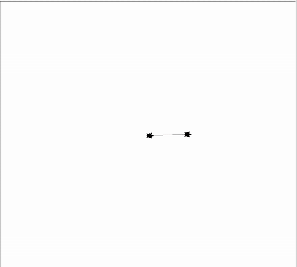
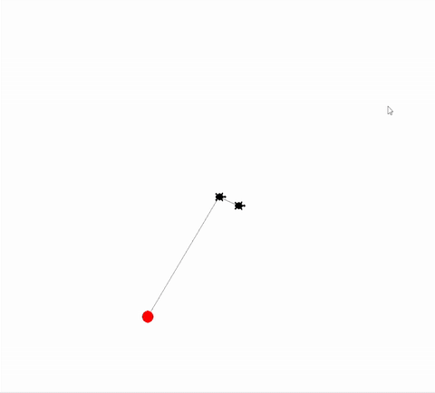
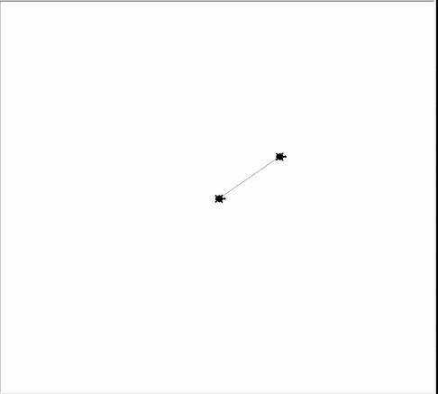
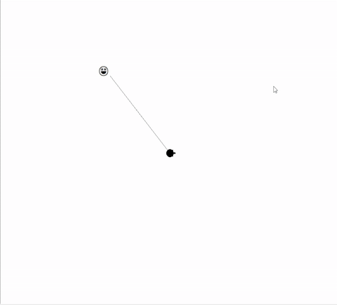

## Schleifen mit Turtle
### Aufgabe 1 - Wiederholte Bewegung für immer
Unsere Turtle hat gegessen, geschlafen und nun ist ihr langweilig. Eine beschäftigung ist die Welt erforschen. 
* Dazu merkt sich unsere Turtle am Anfang wo sie gestartet ist. Das ist auf der Position *x=0* und *y=0*. Sie startet wieder am Haus am Rande des Meeres. Links von ihr ist das Meer und rechts von ihr ist Sand. 
* Nun wiederholt sie folgendes Verhalten **für immer**. 
    * Die Turtle legt einen Faden vom Haus weg bis zum Ziel aus, denn sie will nicht verloren gehen. Beim rückweg geht sie den Faden nach, legt jedoch keinen neuen. Sie sammelt auch den Faden nicht wieder auf wenn diese wieder zu Hause ist.
    * Im wasser ist die Turtle immer noch 50 mal so schnell wie in der Wüste.
    * Die Turtle bewegt sich auf *eine zufällige Position* und *markiert* diese mit einem <span style="color:red;">roten Kreis</span>. Sie *gräbt* sich nicht mehr ein, sondern bewegt sich zu ihrem Haus in der Mitte zurück.
    * Wenn sie in der Mitte angekommen ist, geht sie zur nächsten zufälligen Position. 
* Wenn die Turtle ins Meer geht, schwimmt sie. Ansonsten geht sie am Sand. Wenn die Turtle im Meer schwimmt, stelle sie als Kreis dar. Ansonsten stelle sie als Turtle, wie bisher dar. 

**Hinweise:**
Verwende dazu folgende ``Prozeduren``:

* ``pendown()``: Die Turtle legt **einen** Faden am Boden ab. Diese malt dadruch Linien wenn diese sich **später** bewegt.
* ``penup()``: Die Turtle legt **keinen** Faden am Boden ab. Diese malt dadruch **keine** Linien wenn diese sich **später** bewegt.
* ``goto(-100, 200)``: Die Turtle bewegt sich in einer *geraden Linie* zu der angegebenen *Position*. Die *Position* wird in *x* und *y* *Koordinaten* abegeben. Hier ist die Mitte des Fensters *x = 0* und *y = 0* ist.
* ``stamp()``: Die Turtle drückt sich auf den Boden und hinterlässt einen Abdruck.
* ``shape("turtle")`` oder ``shape("circle")``: Wir lassen unsere Turtle anders aussehen. Wir können folgende Werte übergeben ``"circle"`` und ``"turtle"``. 
* ``dot(25, "red")``: Wir malen einen roten Kreis mit Durchmesser 25 am Boden.

Sowie folgende ``Funktionen``:

* ``randint(3, 8)``: Wir ziehen eine zufällige Zahl ohne Kommastellen von z.B. 3 bis 8.
* ``window_width()``: Gibt die breite unseres Fenstes zurück. Merke dir die Antwort mit einer ``Variable``. Das geht so *breite = window_width()*.
* ``window_height()``: Gibt die breite unseres Fenstes zurück. Merke dir die Antwort mit einer ``Variable``. Das geht so *hoehe = window_height()*.

<div style="text-align: left;">
    
</div>

**Vorlage:**
```python
from turtle import *
from random import randint

# --- Vorbereitung ---
# Die Variablen für die Geschwindigkeit.
geschwindigkeit_am_land = 1
geschwindigkeit_im_wasser = 50 * geschwindigkeit_am_land

# Die Variablen für die Form.
form_am_land = "turtle"
form_im_wasser = "circle"

shape(form_am_land) 
speed(geschwindigkeit_am_land)

# --- Logik ---
# Die Turtle nimmt den Faden aus der Tasche und legt ihn am Boden wenn sie losgeht.
pendown()

# Die Turtle drückt den Faden in den boden, fixiert diesen und macht einen Abdruck von sich selbst.
stamp()

breite = window_width()
hoehe = window_height()

halbe_breite_ohne_komma = breite // 2 
halbe_hoehe_ohne_komma = hoehe // 2

# Der start der Schleife welche niemals abbrechen soll. Wir brauchen also eine Bedingung was ein logischer Ausdruck ist, welcher immer wahr ist.       
while ... # TODO: Lösche dieses Kommentar, die drei Punkte und füge dort den korrekten logischen Ausdruck ein.
    ziel_in_x = randint(-halbe_breite_ohne_komma, halbe_breite_ohne_komma) 
    ziel_in_y = randint(-halbe_hoehe_ohne_komma, halbe_hoehe_ohne_komma) 

    # Wir bewegen die Turtle und passen an wie diese dargestellt wird (Kreis oder Turtle). 
    if ziel_in_x > 0:
        # Wir verwenden die Form für die rechte Seite. Diese ist 'turtle'.
        shape(form_am_land) 
        speed(geschwindigkeit_am_land)
    else:
        # Wir verwenden die Form für die rechte Seite. Diese ist 'circle'.
        shape(form_im_wasser) 
        speed(geschwindigkeit_im_wasser)

    # Die Turtle nimmt den Faden aus der Tasche und legt ihn am Boden wenn sie losgeht.
    # TODO: Lösche dieses Kommetar und schreibe den Programmcode hier!

    # Die Turtle bewegt sich an einen zufällig gewählten Ort.
    # TODO: Lösche dieses Kommetar und schreibe den Programmcode hier!

    # Die Turtle markier diesen Ort mit einem roten Punkt.
    # TODO: Lösche dieses Kommetar und schreibe den Programmcode hier!

    # Die Turtle schneidet den Faden ab und gibt die Rolle mit dem Faden wieder in die Tasche. Sie legt ihn nicht mehr auf den Boden wenn sie losgeht.
    # TODO: Lösche dieses Kommetar und schreibe den Programmcode hier!

    # Die Turtle bewegt sich zur Ausgangsposition zurück.
    # TODO: Lösche dieses Kommetar und schreibe den Programmcode hier!

# --- Abschluss ---
# Hier steht nichts mehr... denn wir sind für immer oben gefangen.
```

### Aufgabe 2 - Wiederholte Bewegung 5 mal
Unsere Turtle will wieder die Welt erforschen. Die Angabe aus der [Aufgabe 1](#aufgabe-2---wiederholte-bewegung-5-mal) Beispiel ist wieder umzusetzen. Jedoch ist die Turtle nach 5 Bewegungen müde, kehrt zur Mitte zurück und hört danach auf.

**Hinweise:**
Verwende dazu folgende ``Prozeduren``:

* ``pendown()``: Die Turtle legt **einen** Faden am Boden ab. Diese malt dadruch Linien wenn diese sich **später** bewegt.
* ``penup()``: Die Turtle legt **keinen** Faden am Boden ab. Diese malt dadruch **keine** Linien wenn diese sich **später** bewegt.
* ``goto(-100, 200)``: Die Turtle bewegt sich in einer *geraden Linie* zu der angegebenen *Position*. Die *Position* wird in *x* und *y* *Koordinaten* abegeben. Hier ist die Mitte des Fensters *x = 0* und *y = 0* ist.
* ``stamp()``: Die Turtle drückt sich auf den Boden und hinterlässt einen Abdruck.
* ``shape("turtle")`` oder ``shape("circle")``: Wir lassen unsere Turtle anders aussehen. Wir können folgende Werte übergeben ``"circle"`` und ``"turtle"``. 
* ``dot(25, "red")``: Wir malen einen roten Kreis mit Durchmesser 25 am Boden.

Sowie folgende ``Funktionen``:

* ``randint(3, 8)``: Wir ziehen eine zufällige Zahl ohne Kommastellen von z.B. 3 bis 8.
* ``window_width()``: Gibt die breite unseres Fenstes zurück. Merke dir die Antwort mit einer ``Variable``. Das geht so *breite = window_width()*.
* ``window_height()``: Gibt die breite unseres Fenstes zurück. Merke dir die Antwort mit einer ``Variable``. Das geht so *hoehe = window_height()*.

<div style="text-align: left;">
    
</div>

**Vorlage:**
```python
from turtle import *
from random import randint

# --- Vorbereitung ---
# Die Variablen für die Geschwindigkeit.
geschwindigkeit_am_land = 1
geschwindigkeit_im_wasser = 50 * geschwindigkeit_am_land

# Die Variablen für die Form.
form_am_land = "turtle"
form_im_wasser = "circle"

shape(form_am_land) 
speed(geschwindigkeit_am_land)

# --- Logik ---
# Die Turtle nimmt den Faden aus der Tasche und legt ihn am Boden wenn sie losgeht.
pendown()

# Die Turtle drückt den Faden in den boden, fixiert diesen und macht einen Abdruck von sich selbst.
stamp()

breite = window_width()
hoehe = window_height()

halbe_breite_ohne_komma = breite // 2 
halbe_hoehe_ohne_komma = hoehe // 2

# Der start der Schleife welche nach 5 Wiederholungen abbrechen soll. 
for ... in ... # TODO: Lösche dieses Kommentar, die drei Punkte und füge dort den korrekten Ausdruck ein.
    ziel_in_x = randint(-halbe_breite_ohne_komma, halbe_breite_ohne_komma) 
    ziel_in_y = randint(-halbe_hoehe_ohne_komma, halbe_hoehe_ohne_komma) 

    # Wir bewegen die Turtle und passen an wie diese dargestellt wird (Kreis oder Turtle). 
    if ziel_in_x > 0:
        # Wir verwenden die Form für die rechte Seite. Diese ist 'turtle'.
        shape(form_am_land) 
        speed(geschwindigkeit_am_land)
    else:
        # Wir verwenden die Form für die rechte Seite. Diese ist 'circle'.
        shape(form_im_wasser) 
        speed(geschwindigkeit_im_wasser)

    # Die Turtle nimmt den Faden aus der Tasche und legt ihn am Boden wenn sie losgeht.
    pendown()

    # Die Turtle bewegt sich an einen zufällig gewählten Ort.
    goto(ziel_in_x, ziel_in_y)

    # Die Turtle markier diesen Ort mit einem roten Punkt.
    dot(25, "red")

    # Die Turtle schneidet den Faden ab und gibt die Rolle mit dem Faden wieder in die Tasche. Sie legt ihn nicht mehr auf den Boden wenn sie losgeht.
    penup()

    # Die Turtle bewegt sich zur Ausgangsposition zurück.
    goto(0, 0)

# --- Abschluss ---
shape('turtle')
write("😪", align="right", font=('Arial', 25, 'normal'))
# Schließt das Fenster nicht, wenn das Programm beendet ist.
done()
```

### Aufgabe 3 - Wiederholte Bewegung *manchmal* für immer
Unsere Turtle will wieder die Welt erforschen. Die Angabe aus [Aufgabe 1](#aufgabe-1---wiederholte-bewegung-für-immer) ist wieder umzusetzen. Jedoch will die Turtle Abwechslung. Wenn sie 4-mal im gleichen Habitat (Sand oder Wasser) sich aufhält, dann hört sie auf und gräbt sich in der mitte wieder ein.

**Hinweise:**
Verwende dazu folgende ``Prozeduren``:

* ``pendown()``: Die Turtle legt **einen** Faden am Boden ab. Diese malt dadruch Linien wenn diese sich **später** bewegt.
* ``penup()``: Die Turtle legt **keinen** Faden am Boden ab. Diese malt dadruch **keine** Linien wenn diese sich **später** bewegt.
* ``goto(-100, 200)``: Die Turtle bewegt sich in einer *geraden Linie* zu der angegebenen *Position*. Die *Position* wird in *x* und *y* *Koordinaten* abegeben. Hier ist die Mitte des Fensters *x = 0* und *y = 0* ist.
* ``stamp()``: Die Turtle drückt sich auf den Boden und hinterlässt einen Abdruck.
* ``shape("turtle")`` oder ``shape("circle")``: Wir lassen unsere Turtle anders aussehen. Wir können folgende Werte übergeben ``"circle"`` und ``"turtle"``. 

Sowie folgende ``Funktionen``:

* ``randint(3, 8)``: Wir ziehen eine zufällige Zahl ohne Kommastellen von z.B. 3 bis 8.
* ``window_width()``: Gibt die breite unseres Fenstes zurück. Merke dir die Antwort mit einer ``Variable``. Das geht so *breite = window_width()*.
* ``window_height()``: Gibt die breite unseres Fenstes zurück. Merke dir die Antwort mit einer ``Variable``. Das geht so *hoehe = window_height()*.

<div style="text-align: left;">
    
    
</div>

**Vorlage:**
```python
from turtle import *
from random import randint

# --- Vorbereitung ---
# Die Variablen für die Geschwindigkeit.
geschwindigkeit_am_land = 1
geschwindigkeit_im_wasser = 50 * geschwindigkeit_am_land

# Die Variablen für die Form.
form_am_land = "turtle"
form_im_wasser = "circle"

shape(form_am_land) 
speed(geschwindigkeit_am_land)

# --- Logik ---
# Die Turtle nimmt den Faden aus der Tasche und legt ihn am Boden wenn sie losgeht.
pendown()

# Die Turtle drückt den Faden in den boden, fixiert diesen und macht einen Abdruck von sich selbst.
stamp()

breite = window_width()
hoehe = window_height()

halbe_breite_ohne_komma = breite // 2 
halbe_hoehe_ohne_komma = hoehe // 2

# Solange unsere Turtle interessiert ist, wiederholen wir die Erforschung der Welt. 
# Wir starten deshalb mit der booleschen Variable turtle_ist_interessiert mit Wert True (Wahr auf englisch).
turtle_ist_interessiert = True

# Wir müssen uns auch merken wie oft die Turtle sich langweilt. Bedeutet wenn wir z.B. im Sand beginnen und ende, dann erhöhe ich diese Variable um eins.
# Wenn diese gleich 4 ist, bricht die Turtle die Reise ab.
keine_langeweile = 1
langeweile_level = keine_langeweile

# Wir legen eine Variable an welche in der Schleife überschrieben werden kann. Der erste Wert ist wichtig und ist hier 0. 
# Sie bestimmt ob wir uns am Anfang am Land oder im Meer befinden. Da wir im Haus starten, ist diese am Land und wir brauchen eine Zahl größer gleich 0.
ziel_in_x = 0

# Solange unsere Turtle interessiert ist, wiederholen wir die Erforschung der Welt.
while turtle_ist_interessiert:
    # Wir merken uns die alte x-Position der Schildkröte um beurteilen zu können, ob diese gelangweilt ist oder nicht.
    altes_ziel_in_x = ... # TODO: Lösche dieses Kommentar, die drei Punkte und füge dort die korrekte Variable ein.

    ziel_in_x = randint(-halbe_breite_ohne_komma, halbe_breite_ohne_komma) 
    ziel_in_y = randint(-halbe_hoehe_ohne_komma, halbe_hoehe_ohne_komma) 

    # Wir bewegen die Turtle und passen an wie diese dargestellt wird (Kreis oder Turtle). 
    if ziel_in_x > 0:
        # Wir verwenden die Form für die rechte Seite. Diese ist 'turtle'.
        shape(form_am_land) 
        speed(geschwindigkeit_am_land)
    else:
        # Wir verwenden die Form für die rechte Seite. Diese ist 'circle'.
        shape(form_im_wasser) 
        speed(geschwindigkeit_im_wasser)

    # Ist unsere Turtle noch interessiert an der Erforschung?
    bleibt_im_wasser = ... # TODO: Lösche dieses Kommentar, die drei Punkte und füge dort den korrekten logischen Ausdruck ein.
    bleibt_im_sand = ... # TODO: Lösche dieses Kommentar, die drei Punkte und füge dort den korrekten logischen Ausdruck ein.

    # Wir sind gelangweilt wenn wir ein 2. mal hintereinander im Wasser oder ein 2. mal hintereinander in der Wüste uns aufhalten.
    if ... # TODO: Lösche dieses Kommentar, die drei Punkte und füge dort den korrekten logischen Ausdruck ein.
        # Hier steigt das langeweile level um eins.
        langeweile_level ... # TODO: Lösche dieses Kommentar, die drei Punkte und füge dort den korrekten Ausdruck ein.
    # Wenn wir Abwechslung haben, dann setzen wir die langweilweile_steigt zurück auf 1. Wir haben ja wieder Interesse.
    else:
        langeweile_level ... # TODO: Lösche dieses Kommentar, die drei Punkte und füge dort den korrekten Ausdruck ein.
        
    # Wenn das langeweile_level 3 mal hintereinander gestiegen ist, also von 1 auf 4, dann ist unsere Turtle nicht mehr interessiert.
    if langeweile_level == 4:
        turtle_ist_interessiert ... # TODO: Lösche dieses Kommentar, die drei Punkte und füge dort den korrekten Wert ein.

    # Die Turtle nimmt den Faden aus der Tasche und legt ihn am Boden wenn sie losgeht.
    pendown()

    # Die Turtle bewegt sich an einen zufällig gewählten Ort.
    goto(ziel_in_x, ziel_in_y)

    # Optionaler Code um es etwas netter zu machen (wir sehen wie gelangweilt die Turtle ist).
    if bleibt_im_wasser or bleibt_im_sand:
        write("🙄", align="right", font=('Arial', 25, 'normal'))
    else:
        write("😃", align="right", font=('Arial', 25, 'normal'))
        
    # Die Turtle schneidet den Faden ab und gibt die Rolle mit dem Faden wieder in die Tasche. Sie legt ihn nicht mehr auf den Boden wenn sie losgeht.
    penup()

    # Die Turtle bewegt sich zur Ausgangsposition zurück.
    goto(0, 0)

    # Optionaler Code um es etwas netter zu machen (wir sehen wie gelangweilt die Turtle ist).
    if langeweile_level == 4:
        write("😪💤",  align="right", font=('Arial', 25, 'normal'))

# --- Abschluss ---
# Schließt das Fenster nicht, wenn das Programm beendet ist.
done()
```