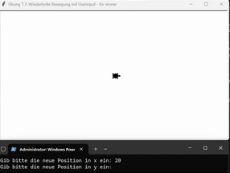
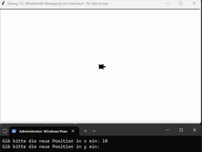
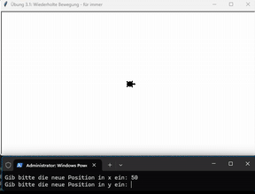

## Userinput auf der Console mit Turtle
### Aufgabe 1 - Vereinfachte wiederholte Bewegung mit Userinput für immer
Unsere Turtle will wieder die Welt erforschen. Dazu mekrt sich unsere Turtle am Anfang wo sie gestartet ist. Das ist auf der Position *x=0* und *y=0*. Sie steht also wieder am Rande des Meeres. Links von ihr ist das Meer und rechts von ihr ist Sand. Nun wiederholt sie folgendes Verhalten **für immer**. Die Turtle bewegt sich auf **ein vom User gewählte Position**. Sie *gräbt* sich nicht mehr ein, sondern bewegt sich zu ihrer Markierung in der Mitte zurück. Wenn sie in der Mitte angekommen ist, geht sie zur nächsten **vom User gewählten** Position. Wenn die Turtle ins Meer geht, schwimmt sie. Ansonsten geht sie am Sand. Wenn die Turtle im Meer schwimmt, stelle sie als Kreis dar. Ansonsten stelle sie als Turtle, wie bisher dar. 

**Hinweise:**
Verwende dazu folgende ``Prozeduren``:
* ``penup()``: Die Turtle legt **keinen** Faden am Boden ab. Diese malt dadruch **keine** Linien wenn diese sich **später** bewegt.
* ``goto(-100, 200)``: Die Turtle bewegt sich in einer *geraden Linie* zu der angegebenen *Position*. Die *Position* wird in *x* und *y* *Koordinaten* abegeben. Hier ist die Mitte des Fensters *x = 0* und *y = 0* ist.
* ``hideturtle()``: Die Turtle gräbt sich ein und versteckt sich.
* ``stamp()``: Die Turtle drückt sich auf den Boden und hinterlässt einen Abdruck.
* ``shape("turtle")`` oder ``shape("circle")``: Wir lassen unsere Turtle anders aussehen. Wir können folgende Werte übergeben ``"circle"`` und ``"turtle"``. 

Sowie folgende ``Funktionen``:
* ``input("Gib bitte die neue Position in x ein: ")``: Das Programm wartet bis der user etwas eingegeben hat. Davor schreiben wir *"Gib bitte die neue Position in x und dann y ein: "* auf die Console damit die Benutzer:innen wissen was sie tun soll.

<div style="text-align: left;">
    
</div>

**Lösung:**
```python
from turtle import *
from random import randint

# --- Vorbereitung (passiert nur einmal) ---
shape('turtle')
speed(1)
# --- Logik ---
# Wir drücken die Turtle auf den Boden und machen damit einen Abdruck. Dadruch merkt sie sich wo sie gestartet ist.
stamp() 
penup()

while True:
    # Führer war hier der zufällig gewählte Ort. Jetzt ist es der User, der diesen angibt.
    # Achte auf die Typen! Kommt eine Zahl oder ein Text von der Funktion input zurück?
    ziel_in_x = int(input("Gib bitte die neue Position in x ein: "))
    ziel_in_y = int(input("Gib bitte die neue Position in y ein: "))

    # Wir bewegen die Turtle und passen an wie diese dargestellt wird (Kreis oder Turtle). 
    if ziel_in_x > 0:
        # Wir verwenden die Form für die rechte Seite auf 'turtle' setzen
        shape('turtle') 
    else:
        # Form für die linke Seite auf 'circle' setzen
        shape('circle') 

    # Wir bewegen uns zur zufällig gewählten Position.
    goto(ziel_in_x, ziel_in_y)
    print("Ziel erreich!🏁 Drehe um.🔁")

    # Wir bewegen uns zur Ausgangsposition zurück.
    goto(0, 0)

# --- Abschluss ---
```

### Wiederholte Bewegung mit Userinput - für *fast* immer
Unsere Turtle will wieder die Welt erforschen. Jedoch gibt es einen Unterschied zur vorherigen Angabe. Wenn wir *-9999* eingeben, dann sagen wir der Turtle wir wollen nicht mehr Erkunden. Damit endet unser Programm.

**Hinweise:**
Verwende dazu folgende ``Prozeduren``:
* ``penup()``: Die Turtle legt **keinen** Faden am Boden ab. Diese malt dadruch **keine** Linien wenn diese sich **später** bewegt.
* ``goto(-100, 200)``: Die Turtle bewegt sich in einer *geraden Linie* zu der angegebenen *Position*. Die *Position* wird in *x* und *y* *Koordinaten* abegeben. Hier ist die Mitte des Fensters *x = 0* und *y = 0* ist.
* ``hideturtle()``: Die Turtle gräbt sich ein und versteckt sich.
* ``stamp()``: Die Turtle drückt sich auf den Boden und hinterlässt einen Abdruck.
* ``shape("turtle")`` oder ``shape("circle")``: Wir lassen unsere Turtle anders aussehen. Wir können folgende Werte übergeben ``"circle"`` und ``"turtle"``. 

Sowie folgende ``Funktionen``:
* ``input("Gib bitte die neue Position in x ein: ")``: Das Programm wartet bis der user etwas eingegeben hat. Davor schreiben wir *"Gib bitte die neue Position in x und dann y ein: "* auf die Console damit die Benutzer:innen wissen was sie tun soll.
<div style="text-align: left;">
    
</div>

**Lösung:**
```python
from turtle import *
from random import randint

# --- Vorbereitung (passiert nur einmal) ---
shape('turtle')
speed(1)
# --- Logik ---
# Wir drücken die Turtle auf den Boden und machen damit einen Abdruck. Dadruch merkt sie sich wo sie gestartet ist.
stamp() 
penup()

while True:
    # Führer war hier der zufällig gewählte Ort. Jetzt ist es der User, der diesen angibt.
    # Achte auf die Typen! Kommt eine Zahl oder ein Text von der Funktion input zurück?
    ziel_in_x = int(input("Gib bitte die neue Position in x ein: "))
    ziel_in_y = int(input("Gib bitte die neue Position in y ein: "))

    # Wir hören nun auf wenn wir -9999 bei ziel_in_x oder -9999 bei ziel_in_y eingegeben wird.
    # Wir können mit == Vergleiche anstellen. Das bedeutet ist links von == das gleiche wie rechts?
    # Wir fragen also ist -9999 == -9999 und dort würde als Antwort True rauskommen.
    # Ersetze nun ein -9999 mit der richtigen Variable, welche beliebige Werte haben kann.
    if ziel_in_x == -9999 or ziel_in_y == -9999:
        print("Genug erforscht. 🐢 Bis bald.👋🏻")

        # Mit dem Keyword break springen wir aus einer Schleife rauß und erzwingen damit ein Ende. 
        # Das ist die nicht so feine Brechstangen-Variante. 
        # Alternativ muss die Bedingung der Schleife auf False gesetzt werden.
        break

    # Wir bewegen die Turtle und passen an wie diese dargestellt wird (Kreis oder Turtle). 
    if ziel_in_x > 0:
        shape('turtle') # Wir verwenden die Form für die rechte Seite auf 'turtle' setzen
    else:
        shape('circle') # Form für die linke Seite auf 'circle' setzen

    # Wir bewegen uns zur zufällig gewählten Position.
    goto(ziel_in_x, ziel_in_y)
    print("Ziel erreich!🏁 Drehe um.🔁")

    # Wir bewegen uns zur Ausgangsposition zurück.
    goto(0, 0)

# --- Abschluss ---
```

### Wiederholte Bewegung mit Userinput für *fast* immer - angenehmere Variante
Unsere Turtle will wieder die Welt erforschen. Jedoch ist es unagenehm zwei mal *-9999* einzugeben wenn wir abbrechen wollen. Wir versuchen nun einmal "bye" einzugeben um der Turtle zu sagen, dass wir aufhören wollen. Dazu müssen wir eine ``Variable`` verwenden welche einen *Text* halten kann. Da ist eine ``Variable`` des ``Typs`` *String*. 

**Hinweise:****Lösung:**
Verwende dazu folgende ``Prozeduren``:
* ``penup()``: Die Turtle legt **keinen** Faden am Boden ab. Diese malt dadruch **keine** Linien wenn diese sich **später** bewegt.
* ``goto(-100, 200)``: Die Turtle bewegt sich in einer *geraden Linie* zu der angegebenen *Position*. Die *Position* wird in *x* und *y* *Koordinaten* abegeben. Hier ist die Mitte des Fensters *x = 0* und *y = 0* ist.
* ``hideturtle()``: Die Turtle gräbt sich ein und versteckt sich.
* ``stamp()``: Die Turtle drückt sich auf den Boden und hinterlässt einen Abdruck.
* ``shape("turtle")`` oder ``shape("circle")``: Wir lassen unsere Turtle anders aussehen. Wir können folgende Werte übergeben ``"circle"`` und ``"turtle"``. 

Sowie folgende ``Funktionen``:
* ``input("Gib bitte die neue Position in x ein: ")``: Das Programm wartet bis der user etwas eingegeben hat. Davor schreiben wir *"Gib bitte die neue Position in x und dann y ein: "* auf die Console damit die Benutzer:innen wissen was sie tun soll.

<div style="text-align: left;">
    
</div>

**Lösung:**
```python
from turtle import *
from random import randint

# --- Vorbereitung (passiert nur einmal) ---
shape('turtle')
speed(1)
# --- Logik ---
# Wir drücken die Turtle auf den Boden und machen damit einen Abdruck. Dadruch merkt sie sich wo sie gestartet ist.
stamp() 
penup()

while True:
    # Führer war hier der zufällig gewählte Ort. Jetzt ist es der User, der diesen angibt.
    # Achte auf die Typen! Kommt eine Zahl oder ein Text von der Funktion input zurück?
    eingabe = input("Gib bitte die neue Position in x ein: ")

    # Wir hören nun auf wenn wir "bye" bei der Variable eingabe eingeben.
    # Wir können mit == Vergleiche anstellen. Das bedeutet ist links von == das gleiche wie rechts?
    # Wir fragen also ist "bye" == "bye und dort würde als Antwort True rauskommen.
    # Ersetze nun ein "bye" mit der richtigen Variable, welche beliebige Werte haben kann.
    if eingabe == "bye":
        print("Genug erforscht. 🐢 Bis bald.👋🏻")
        break

    else:
        # Wenn wir nicht bye eingeben, erwarten wir eine Zahl. 
        # Wir müssen aus dem Text eine nun eine Zahl ohne Kommastellen machen.
        ziel_in_x = int(eingabe)

    eingabe = input("Gib bitte die neue Position in y ein: ")

    # Wir hören nun auf wenn wir "bye" bei der Variable  eingabe eingeben.
    # Wir können mit == Vergleiche anstellen. Das bedeutet ist links von == das gleiche wie rechts?
    # Wir fragen also ist "bye" == "bye und dort würde als Antwort True rauskommen.
    # Ersetze nun ein "bye" mit der richtigen Variable, welche beliebige Werte haben kann.
    if eingabe == "bye":
        print("Genug erforscht. 🐢 Bis bald.👋🏻")
        break
    
    else:
        # Wenn wir nicht bye eingeben, erwarten wir eine Zahl. 
        # Wir müssen aus dem Text eine nun eine Zahl ohne Kommastellen machen.
        ziel_in_y = int(eingabe)

    # Wir bewegen die Turtle und passen an wie diese dargestellt wird (Kreis oder Turtle). 
    if ziel_in_x > 0:
        shape('turtle') # Wir verwenden die Form für die rechte Seite auf 'turtle' setzen
    else:
        shape('circle') # Form für die linke Seite auf 'circle' setzen

    # Wir bewegen uns zur zufällig gewählten Position.
    goto(ziel_in_x, ziel_in_y)
    print("Ziel erreich!🏁 Drehe um.🔁")

    # Wir bewegen uns zur Ausgangsposition zurück.
    goto(0, 0)

# --- Abschluss ---
```


