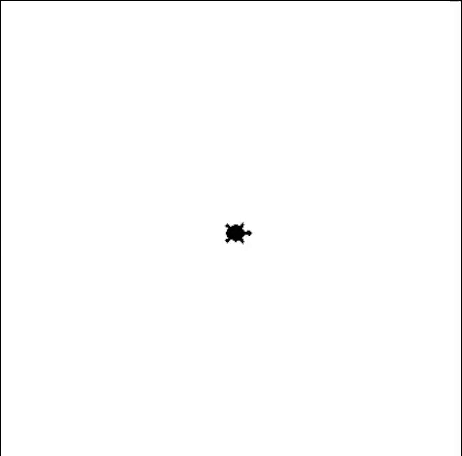

## Userinput als Events mit Turtle
### Aufgabe 1 - Mausgesteuerte Bewegung
Wir legen unserer Turtle mit der Maus Seegras irgendwo am Bildschirm hin. Wir drücken dazu mit der Linken Maustaste auf einen Ort am Bildschirm.
Die Turtle bewegt sich anschließend dorthin und macht einen Abdruck von sich selbst um sich zu merken wo einmal ein Seegras hingelegt worden ist. Wenn wir auf einen anderen Ort klicken, bewegt sich die Turtle auch dorthin und macht weider einen Abdruck. Dieses verhalten wiederholt sich bis wir das Fenster rechts oben beim X schließen.

**Hinweise:**
Verwende dazu folgende ``Prozeduren``:
* ``penup()``: Die Turtle legt **keinen** Faden am Boden ab. Diese malt dadruch **keine** Linien wenn diese sich **später** bewegt.
* ``goto(-100, 200)``: Die Turtle bewegt sich in einer *geraden Linie* zu der angegebenen *Position*. Die *Position* wird in *x* und *y* *Koordinaten* abegeben. Hier ist die Mitte des Fensters *x = 0* und *y = 0* ist.
* ``hideturtle()``: Die Turtle gräbt sich ein und versteckt sich.
* ``stamp()``: Die Turtle drückt sich auf den Boden und hinterlässt einen Abdruck.

Sowie folgende ``Funktionen``:
* * ``onclick(meine_funktion)``: *meine_funktion* ist eine eigens geschriebene ``Funktion`` welche ausgeführt wird, wenn wir auf den Bildschirm drücken. Sperre zudem den Bildschirm mit ``screen.onclick(None)``, damit kein Mausclick mehr akzeptiert wird.

**Lösung:**
<div style="text-align: left;">
    
</div>

```python
from turtle import *

# --- Vorbereitung ---
screen = Screen()
shape('turtle')
speed(3)

# --- Eigene Funktionen ---
# Diese Funktion wird aufgerufen, wenn der Benutzer auf den Bildschirm klickt
def bewege_turtle(x, y):
    goto(x, y) # Bewege die Turtle zu den geklickten Koordinaten
    stamp() # Wir drücken die Turtle auf den Boden und machen damit einen Abdruck.

# --- Logik ---
penup()

# Diese Funktion ist eine komplizierte. Wir behandeln dies nur weil es im Lehrplan steht.
# Diese horch auf einen Klick mit der Maus. Wir nennen das ein Event. Wenn dieses Event passiert, führen wir den Code in der eigens geschriebenen Funktion bewege_turtle aus. Wir erreichen das, wenn wir den Namen der Funktion übergeben. Wir verwenden die Funktion damit als Variable. Der Aufruf der Funktion passiert dann innerhalb von onclick und ist nicht mehr für uns ersichtlich.
# Zudem lebt diese ``Funktion`` bei der ``Variable`` screen. Wir können dies deshalb nur aufrufen wenn wir davor screen mit einem Punkt danach schreiben.
screen.onclick(bewege_turtle)

# --- Abschluss ---
# Das hier ist eine Art Schleife. Wir lassen das Programm laufen und wenn ein Event passiert, dann führen wir dieses aus.
screen.mainloop()
```


### Aufgabe 2 - Farbige Punkte mit Mehrfachverzweigung
#### Links-oben, links-unten, rechts-oben und rechts-unten 
Wenn der Benutzer klickt, erscheint ein großer Punkt (ca. 1 cm Durchmesser). Die Farbe des Punktes hängt vom Quadranten des Klicks ab: 
* oben links ist rot, 
* oben rechts blau,
* unten links grün und 
* unten rechts gelb.

**Hinweise:**
Verwende dazu folgende ``Prozeduren``:
* ``penup()``: Die Turtle legt **keinen** Faden am Boden ab. Diese malt dadruch **keine** Linien wenn diese sich **später** bewegt.
* ``goto(-100, 200)``: Die Turtle bewegt sich in einer *geraden Linie* zu der angegebenen *Position*. Die *Position* wird in *x* und *y* *Koordinaten* abegeben. Hier ist die Mitte des Fensters *x = 0* und *y = 0* ist.
* ``hideturtle()``: Die Turtle gräbt sich ein und versteckt sich.
* ``dot(durchmesser, "red")``: Wir malen einen Kreis am Boden in der angegebenen Farbe.

Sowie folgende ``Funktionen``:
* * ``onclick(meine_funktion)``: *meine_funktion* ist eine eigens geschriebene ``Funktion`` welche ausgeführt wird, wenn wir auf den Bildschirm drücken. Sperre zudem den Bildschirm mit ``screen.onclick(None)``, damit kein Mausclick mehr akzeptiert wird.
Unsere Turtle fängt an zu graben. Was sich unter dem Sand verbrigt weiß sie noch nicht. Hilf den Ort mit der Maus zu zeigen wo sie Graben soll.

**Lösung:**
```python
from turtle import *

# --- Vorbereitung ---
screen = Screen()
hideturtle()
speed("fastest")
penup()

# --- Logik ---
DOT_DIAMETER = 80

def draw_colored_dot(x, y):
    goto(x, y)

    # Farbe basierend auf dem Quadranten bestimmen.
    # Der Quadrant legt gest ob wir uns Links-oben, links-unten, rechts-oben und rechts-unten ist.
    # Oben Links
    if x < 0 and y > 0: 
        dot(DOT_DIAMETER, "red")

    # Oben Rechts
    elif x > 0 and y > 0: 
        dot(DOT_DIAMETER, "blue")

    # Unten Links
    elif x < 0 and y < 0: 
        dot(DOT_DIAMETER, "green")

    else: # Unten Rechts
        dot(DOT_DIAMETER, "yellow")

# Auf Klicks lauschen
screen.onclick(draw_colored_dot)

# --- Abschluss ---
screen.mainloop()
```

#### Streifen
Zeichne Steifen von oben nach unten. Wenn der Benutzer klickt, erscheint ein großer Punkt (40 Pixel an Durchmesser). Die Farbe hängt ab in welchen Steifen wir graben: 
1. Steifen ganz links ist grün.
2. Steifen links ist violett.
3. Steifen in der Mitte ist orange.
4. Steifen rechts ist blau.
5. Steifen ganz rechts ist rot.

**Hinweise:**
Verwende dazu folgende ``Prozeduren``:
* ``penup()``: Die Turtle legt **keinen** Faden am Boden ab. Diese malt dadruch **keine** Linien wenn diese sich **später** bewegt.
* ``goto(-100, 200)``: Die Turtle bewegt sich in einer *geraden Linie* zu der angegebenen *Position*. Die *Position* wird in *x* und *y* *Koordinaten* abegeben. Hier ist die Mitte des Fensters *x = 0* und *y = 0* ist.
* ``hideturtle()``: Die Turtle gräbt sich ein und versteckt sich.
* ``dot(durchmesser, "red")``: Wir malen einen Kreis am Boden in der angegebenen Farbe.

Sowie folgende ``Funktionen``:
* * ``onclick(meine_funktion)``: *meine_funktion* ist eine eigens geschriebene ``Funktion`` welche ausgeführt wird, wenn wir auf den Bildschirm drücken. Sperre zudem den Bildschirm mit ``screen.onclick(None)``, damit kein Mausclick mehr akzeptiert wird.
Unsere Turtle fängt an zu graben. Was sich unter dem Sand verbrigt weiß sie noch nicht. Hilf den Ort mit der Maus zu zeigen wo sie Graben soll.

**Lösung:**
```python
from turtle import *

# --- Vorbereitung ---
screen = Screen()
breite = window_width()
hideturtle()
speed("fastest")

# Vertikale Streifen zeichnen
# Für 5 Streifen brauchen wir 4 Trennlinien.
# Jede Linie ist bei einem Fünftel der Breite verschoben.
# Die Koordinaten gehen von -breite/2 bis +breite/2.
# Positionen der Linien: -3/10, -1/10, +1/10, +3/10 der Breite
linie1_x = -breite * 0.3
linie2_x = -breite * 0.1
linie3_x = breite * 0.1
linie4_x = breite * 0.3
    
penup()

# --- Logik ---
groesse_des_punktes = 40

def zeichne_bunten_punkt(x, y):
    penup() 
    goto(x, y)

    # Farbe basierend auf expliziter Bereichslogik bestimmen
    
    # Streifen 1 (ganz links)
    if x <= linie1_x:
        dot(groesse_des_punktes, "green")
        
    # Streifen 2 (links)
    elif linie1_x < x and x <= linie2_x:
        dot(groesse_des_punktes, "violet")
        
    # Streifen 3 (Mitte)
    elif linie2_x < x and x <= linie3_x:
        dot(groesse_des_punktes, "orange")
        
    # Streifen 4 (rechts)
    elif linie3_x < x and x <= linie4_x:
        dot(groesse_des_punktes, "blue")
        
    # Streifen 5 (ganz rechts)
    elif linie4_x < x:
        dot(groesse_des_punktes, "red")

# Auf Klicks lauschen
screen.onclick(zeichne_bunten_punkt)

# --- Abschluss ---
screen.mainloop()
```

### Aufgabe 3 - Bewegen mit der Tastatur
Wir wollen nun die Turtle mit der Tastatur steuern.

**Hinweise:**
Verwende dazu folgende ``Prozeduren``:
* ``penup()``: Die Turtle legt **keinen** Faden am Boden ab. Diese malt dadruch **keine** Linien wenn diese sich **später** bewegt.
* ``goto(-100, 200)``: Die Turtle bewegt sich in einer *geraden Linie* zu der angegebenen *Position*. Die *Position* wird in *x* und *y* *Koordinaten* abegeben. Hier ist die Mitte des Fensters *x = 0* und *y = 0* ist.
* ``hideturtle()``: Die Turtle gräbt sich ein und versteckt sich.
* ``dot(durchmesser, "red")``: Wir malen einen Kreis am Boden in der angegebenen Farbe.

Sowie folgende ``Funktionen``:
* * ``onclick(meine_funktion)``: *meine_funktion* ist eine eigens geschriebene ``Funktion`` welche ausgeführt wird, wenn wir auf den Bildschirm drücken. Sperre zudem den Bildschirm mit ``screen.onclick(None)``, damit kein Mausclick mehr akzeptiert wird.
Unsere Turtle fängt an zu graben. Was sich unter dem Sand verbrigt weiß sie noch nicht. Hilf den Ort mit der Maus zu zeigen wo sie Graben soll

**Lösung:**
```python
from turtle import *

# --- Vorbereitung ---
screen = Screen()

# Erstellen unserer Helden-Turtle
shape("turtle")
shapesize(2)
color("darkgreen")
penup()

# --- Logik ---
# Wir definieren, wie weit die Turtle bei jedem Tastendruck gehen soll.
SCHRITTWEITE = 20

# Wir brauchen vier separate Funktionen, eine für jede Pfeiltaste.

def gehe_hoch():
    """Setzt die Ausrichtung nach oben (90 Grad) und geht einen Schritt."""
    setheading(90)
    forward(SCHRITTWEITE)

def gehe_runter():
    """Setzt die Ausrichtung nach unten (270 Grad) und geht einen Schritt."""
    setheading(270)
    forward(SCHRITTWEITE)

def gehe_links():
    """Setzt die Ausrichtung nach links (180 Grad) und geht einen Schritt."""
    setheading(180)
    forward(SCHRITTWEITE)

def gehe_rechts():
    """Setzt die Ausrichtung nach rechts (0 Grad) und geht einen Schritt."""
    setheading(0)
    forward(SCHRITTWEITE)


# --- Ereignis-Verknüpfung (Event Binding) ---
# Damit Tastendrücke erkannt werden, müssen wir zwei Dinge tun:
# 1. Dem screen sagen, dass er "zuhören" soll.
screen.listen()

# 2. Jede Taste mit der Funktion verknüpfen, die sie auslösen soll.
# Die Namen für die Pfeiltasten sind: "Up", "Down", "Left", "Right"
screen.onkey(gehe_hoch, "Up")
screen.onkey(gehe_runter, "Down")
screen.onkey(gehe_links, "Left")
screen.onkey(gehe_rechts, "Right")


# --- Abschluss ---
# Hält das Fenster offen und wartet auf Tastendrücke.
screen.mainloop()
```