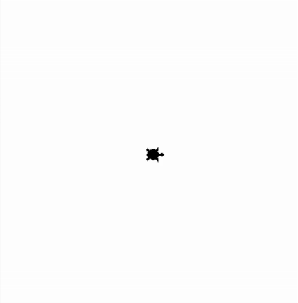

## Funktionen und Prozeduren selbst schreiben mit Turtle
### Aufgabe 1) - Wirklich jetzt ein letztes Mal den Garten mit dem Seil kennzeichnen
Wir verwenden die [Aufgabe 3 der exercise 1 aus dem Kapitel Funktionen](../../../L04FunktionenUndProzedurenAnwenden/exercise1-werte_und_variablen_als_parameter/angabe.md#aufgabe-3---ein-letztes-mal-den-garten-mit-dem-seil-kennzeichnen) anwenden. Wir haben seitdem neue Werkzeuge kennengelernt. Wir können mit ``Schleifen`` und eigens geschriebenen ``Prozeduren`` die Aufgabe nun kürzer und lesbarer lösen.

**Hinweise:**
Verwende eigens geschriebene ``Prozeduren`` welche ``Schleifen`` beinhaltet.

<div style="text-align: left;">
    
</div>

**Lösung:**
```python
from turtle import *

# --- Prozeduren  ---
def gehe_zum_start(seitenlaenge):
    """Hebt den Stift, geht zur linken unteren Ecke und senkt den Stift wieder."""
    penup()
    ecke_x = -seitenlaenge / 2
    ecke_y = -seitenlaenge / 2
    goto(ecke_x, ecke_y)
    pendown()

def zeichne_quadratischen_garten(seitenlaenge, drehwinkel):
    """Zeichnet ein Quadrat mit der angegebenen Seitenlänge und setzt an jeder Ecke einen Stempel."""
    # Diese Schleife wiederholt den Block 4 Mal, für jede Seite des Quadrats.
    for _ in range(4):
        stamp()
        forward(seitenlaenge)
        left(drehwinkel)

# --- Hauptprogramm ---

# --- Vorbereitung ---
shape("turtle")
speed(1) 

# Wir legen Variablen an, welche wir später wiederverwenden können.
laenge_garten = 314
winkel = 90

# --- 2. Logik ---
# Rufe die Prozeduren in der richtigen Reihenfolge auf.
gehe_zum_start(laenge_garten)
zeichne_quadratischen_garten(laenge_garten, winkel)

# --- 3. Abschluss ---
# Versteckt die Turtle am Ende für eine saubere Ansicht.
hideturtle()
# Schließt das Fenster nicht, wenn das Programm beendet ist.
done()
```

### Aufgabe 2) - Das Haus im Garten nochmals kennzeichnen
Wir verwenden die [Aufgabe 4 der exercise 1 aus dem Kapitel Funktionen](../../../L04FunktionenUndProzedurenAnwenden/exercise1-werte_und_variablen_als_parameter/angabe.md#aufgabe-3---ein-letztes-mal-den-garten-mit-dem-seil-kennzeichnen) anwenden. Wir haben seitdem neue Werkzeuge kennengelernt. Wir können mit ``Schleifen`` und eigens geschriebenen ``Prozeduren`` die Aufgabe nun kürzer und lesbarer lösen.

**Hinweise:**
<div style="text-align: left;">
    
</div>

**Lösung:**
```python
from turtle import *

# --- Prozeduren ---
def gehe_zum_start(groesse):
    """Hebt den Stift, geht zur linken unteren Ecke eines zentrierten Objekts und senkt den Stift wieder."""
    penup()
    ecke_x = -groesse / 2
    ecke_y = -groesse / 2
    goto(ecke_x, ecke_y)
    pendown()

def zeichne_quadrat(laenge, mit_stempel):
    """
    Zeichnet ein Quadrat mit der gegebenen Seitenlänge.
    Setzt optional an jeder Ecke einen Stempel, wenn mit_stempel=True ist.
    """
    for _ in range(4):
        # Der Stempel wird nur gesetzt, wenn die Prozedur mit mit_stempel=True aufgerufen wird.
        if mit_stempel:
            stamp()
        forward(laenge)
        left(90)

def zeichne_garten(laenge):
    gehe_zum_start(laenge)
    zeichne_quadrat(laenge, True)

def zeichne_haus(laenge):
    gehe_zum_start(laenge)
    zeichne_quadrat(laenge, False)

# --- Hauptprogramm ---

# --- 1. Vorbereitung ---
shape("turtle")
speed(1) 

# Wir legen die Variablen an, die wir für Garten und Haus benötigen.
laenge_garten = 314
laenge_haus = laenge_garten / 2

# --- 2. Logik ---
# Der Ablauf ist jetzt klar lesbar: erst der Garten, dann das Haus.

# Zeichne den Garten
zeichne_garten(laenge_garten)

# Zeichne das Haus
zeichne_haus(laenge_haus)

# --- 3. Abschluss ---
# Versteckt die Turtle am Ende für eine saubere Ansicht.
hideturtle()
# Schließt das Fenster nicht, wenn das Programm beendet ist.
done()
```