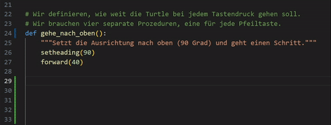
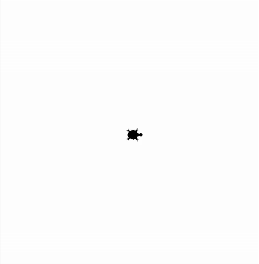

## Funktionen und Prozeduren selbst schreiben mit Turtle
### Aufgabe 1) - ein wirklich letztes Mal den Garten mit dem Seil kennzeichnen
Wir verwenden die [Aufgabe 3 der exercise 1 aus dem Kapitel Funktionen](../../L04FunktionenUndProzedurenAnwenden/exercise1-werte_und_variablen_als_parameter/angabe.md#aufgabe-3---ein-letztes-mal-den-garten-mit-dem-seil-kennzeichnen) anwenden. Wir haben seitdem neue Werkzeuge kennengelernt. Wir können mit ``Schleifen`` und eigens geschriebenen ``Prozeduren`` die Aufgabe nun kürzer und lesbarer lösen.

**Anmerkung:** Folgendes geht in Editor IDLE nicht! Aber in z.B. Visual Studio Code: Wenn du mit der Maus über den Namen der Funktion oder Prozedur bei einem Aufruf fährst und wartest, kommt eine Info. Der Text was hier steht, haben wir selbst geschrieben. Bei der Erstellung der Funktion oder Prozedur wirst du unten aufgeforder einen Text innerhalb von den drei Anführungszeichen ``""" Ich kommuniziere dem Aufrufer was die Funktion macht! """`` zu schreiben. Diesen sehen wir wenn wir beim Aufruf drüberfahren.

<div style="text-align: left;">
    
</div>

**Hinweise:**
Verwende eigens geschriebene ``Prozeduren`` welche ``Schleifen`` beinhaltet.

<div style="text-align: left;">
    
</div>

**Lösung:**
```python
from turtle import *

# --- Prozeduren und Funktionen (wir erstellen hier) ---
# Prozeduren sind Blöcke von Programmcode welche später einfach aufgerufen werden können. 
# Wir haben bereits mit welchen gearbeitet die schon wer anderer für uns geschrieben hat. Erinnere dich an den Aufruf der Prozedur shape("circle"). 
# Das ist eine Prozedur zum ändern der Form unserer Turtle.
# Hier ist shape der Name und "circle" Information vom Aufrufer an die Prozedur. Diese weiß sonst nicht was sie tun soll. Turlte? Circle? Square?
# Wenn wir eigene Prozeduren erstellen wollen, müssen wir das dem Programm irgendwie sagen. Sonst können wir sie nicht aufrufen.
# Erstellen tun wir diese mit dem Keyword def (kurz für define, was für uns erstellen heißt). Danach kommt der Name der Prozedur, und am Schluss die Parameter in runden Klammern. Am Ende kommt ein Doppelpunkt, denn wir Rücken danach um eine Ebene nach rechts ein.

# Schreibe eine Prozedur 
# * mit dem  Namen gehe_in_die_ecke_des_gartens, 
# * welche die Variable seitenlaenge_des_gartens als Parameter hat. 
# Der inhalt der Prozedur ist uns bekannt! Wir haben diesen schon oft geschreiben. 

... # TODO: Lösche dieses Kommentar, die drei Punkte und füge dort die korrekt zu erstellende Prozedur ein.
    # Wir schreiben am Anfang unserer Prozedur kurz was diese tut. Sonst kennt sich keiner aus.
    # Wir tun das mit einem spezielles Kommentar, was DocString genannt wird.
    """ ... """ 
    penup()
    ecke_x = -seitenlaenge_des_gartens / 2
    ecke_y = -seitenlaenge_des_gartens / 2
    goto(ecke_x, ecke_y)
    pendown()

# Wir schreiben noch eine Prozedur 
# * mit dem Namen lege_schnur_entlang_des_quadratischen_garten, welche die 
# * Variable seitenlaenge_des_gartens und winkel als Parameter hat. 
# TODO: Lösche dieses Kommentar, die drei Punkte und füge dort die korrekt zu erstellende Prozedur ein.
    """ ... """ # TODO: Lösche dieses Kommentar, die drei Punkte und füge dort eine Beschreibung der Prozedur ein.
    # Diese Schleife wiederholt das Zeichnen der Seite des Quadrats 4-mal.
    for wie_oft_schon in range(4):
        stamp()
        forward(seitenlaenge_des_gartens)
        left(winkel)

# ------------------------------------------------------------------------------------------------------------
# --- Hauptprogramm (wir rufen hier auf) ---

# --- Vorbereitung ---
shape("turtle")
speed(1) 

# Wir legen Variablen an, welche wir später wiederverwenden können.
laenge_garten = 314
winkel = 90

# --- Logik ---
# Rufe die oben erstellten Prozeduren in der richtigen Reihenfolge auf.
gehe_in_die_ecke_des_gartens(laenge_garten)
lege_schnur_entlang_des_quadratischen_garten(laenge_garten, winkel)

# --- Abschluss ---
# Schließt das Fenster nicht, wenn das Programm beendet ist.
done()
```

### Aufgabe 2) - Das Haus im Garten mit Prozeduren kennzeichnen
Wir verwenden die [Aufgabe 4 der exercise 1 aus dem Kapitel Funktionen](L04FunktionenUndProzedurenAnwenden/exercise1-werte_und_variablen_als_parameter/angabe.md#aufgabe-3---ein-letztes-mal-den-garten-mit-dem-seil-kennzeichnen) anwenden. Wir haben seitdem neue Werkzeuge kennengelernt. Wir können mit ``Schleifen`` und eigens geschriebenen ``Prozeduren`` die Aufgabe nun kürzer und lesbarer lösen.

**Hinweise:**
<div style="text-align: left;">
    
</div>

**Lösung:**
```python
from turtle import *

# --- Prozeduren ---
# Schreibe eine Prozedur mit dem Namen gehe_in_ecke, welche die Variable groesse als Parameter hat. 
# Diese Prozedur macht das gleiche wie in Aufgabe 1, ist jedoch ein wenig kürzer geschrieben.
def gehe_in_ecke_quadrat(groesse):
    """
    Geh in die link untere Ecke des Gartens oder des Hauses. 
    Da beides Quadrate sind ist der name der Prozedur gehe_in_ecke_quadrat.
    """
    penup()
    ecke_x = -groesse / 2
    ecke_y = -groesse / 2
    goto(ecke_x, ecke_y)
    pendown()

# Wir bemerken, dass wir nicht nur einen Garten zeichnen wollen, sondern auch ein Haus. Beides sind quadrate.
# Wir bemerken auch, dass der Winkel immer 90° bei einem Quadrat ist. Wir müssen es also nicht beim Aufruf hinschreiben.
# Wir haben jedoch beim Haus einen Unterschied zum Garten. Beim Haus hält der Faden von alleine. 
# Beim Garten muss die Turtle den Faden in den Ecken befestingen. Was sie mit einem Abdruck von sich selbst tut.
# Diesen Unterschied müssen wir in der Prozedur Programmieren. Beim Aufruf geben wir mit dem Parameter mit_stempel bekannt, ob wir ein Haus oder ein

# Schreibe eine Prozedur mit dem Namen lege_schnur, welche die Variable laenge und haelt_von_alleine als Parameter hat.
... # TODO: Lösche dieses Kommentar, die drei Punkte und füge dort die korrekt zu erstellende Prozedur ein.
    """
    Legt eine Schnur entlang des Gartens oder des Hauses.
    Befestigt optional an jeder Ecke die Schnur, wenn haelt_von_alleine den Wert False hat.
    """

    # Wir verwenden die variable links neben dem Keyword in nicht. Wir schreiben deshalb _ anstatt einen sinnvollen Namen.
    for _ in range(4):
        # Hält die schnur nicht von alleine? Wenn ja, befestige sie.
        if ... # TODO: Lösche dieses Kommentar, die drei Punkte und füge dort den korrekten logischen Ausdruck ein.
            stamp()

        forward(laenge)
        left(90)

# Wir können auch Prozeduren innerhalb von Prozeduren aufrufen. Wir schreiben hier eine neue und verwenden die alten dort.

# Schreibe eine Prozedur mit dem Namen zeichne_garten, welche die Variable laenge als Parameter hat.
... # TODO: Lösche dieses Kommentar, die drei Punkte und füge dort die korrekt zu erstellende Prozedur ein.
    # Wir rufen hier die oben geschriebenen Prozeduren auf. Hält beim Garten die Schnur von alleine?
    # TODO: Lösche dieses Kommetar und schreibe den Programmcode hier!

# Schreibe eine Prozedur mit dem Namen zeichne_haus, welche die Variable laenge als Parameter hat.
... # TODO: Lösche dieses Kommentar, die drei Punkte und füge dort die korrekt zu erstellende Prozedur ein.
    # Wir rufen hier die oben geschriebenen Prozeduren auf. Hält beim Haus die Schnur von alleine?
    # TODO: Lösche dieses Kommetar und schreibe den Programmcode hier!  

# --- Hauptprogramm ---

# --- Vorbereitung ---
shape("turtle")
speed(1) 

# Wir legen die Variablen an, die wir für Garten und Haus benötigen.
laenge_garten = 314
laenge_haus = laenge_garten / 2

# --- Logik ---
# Der Ablauf ist jetzt klar lesbar. Zuerst der Garten, dann das Haus.

# Zeichne den Garten
zeichne_garten(laenge_garten)

# Zeichne das Haus
zeichne_haus(laenge_haus)

# --- Abschluss ---
# Schließt das Fenster nicht, wenn das Programm beendet ist.
done()
```

### Aufgabe 3) - Das Haus im Garten mit Prozeduren und Funktionen kennzeichnen
Wir verwenden die [Aufgabe 4 der exercise 1 aus dem Kapitel Funktionen](L04FunktionenUndProzedurenAnwenden/exercise1-werte_und_variablen_als_parameter/angabe.md#aufgabe-3---ein-letztes-mal-den-garten-mit-dem-seil-kennzeichnen) anwenden. Wir haben seitdem neue Werkzeuge kennengelernt. Wir können mit ``Schleifen`` und eigens geschriebenen ``Prozeduren`` die Aufgabe nun kürzer und lesbarer lösen.

**Hinweise:**
<div style="text-align: left;">
    
</div>

**Lösung:**
```python
from turtle import *

# --- Funktionen ---
# Die Unterscheidung zwischen Funktion und Prozedur ist nicht nötig. Wir könnten alles auch eine Funktion nennen. 
# Denke an ohne_komma = int(3.5). Wir geben nicht nur der Funktion 3.5 damit diese weiß was sie tun soll, 
# sondern der Aufrufer was int(3.5) schreibt bekommt auch 3 zurück. Funktionen sind also Prozeduren welche etwas zurück geben.

# Schreibe eine Funktion mit dem Namen gehe_in_ecke, welche die Variable groesse als Parameter hat. 
# Weiters gibt diese als Rückgabe die Position der Ecke an. Es ist jedoch nicht wirklch die Ecke, denn diese wäre zwei Zahlen gleichzeitg z.B. (-100, 100). Dafür lernen wir später ein Tupel oder eine Liste kennen.
... # TODO: Lösche dieses Kommentar, die drei Punkte und füge dort die korrekt zu erstellende Funktion ein.
    """
    Berechne die Koordinaten der Ecke links unten. 
    Naja fast. 
    """
    return -groesse / 2

# --- Prozeduren ---
# Schreibe eine Prozedur mit dem Namen gehe_in_ecke, welche die Variable groesse als Parameter hat. 
# Diese Prozedur macht das gleiche wie in Aufgabe 1, ist jedoch ein wenig kürzer geschrieben.
def gehe_in_ecke_quadrat(groesse):
    """
    Geh in die link untere Ecke des Gartens oder des Hauses. 
    Da beides Quadrate sind ist der name der Prozedur gehe_in_ecke_quadrat.
    """
    penup()
    ecke_x = ... # TODO: Lösche dieses Kommentar, die drei Punkte und füge dort den korrekten Aufruf der Prozedur ein.
    ecke_y = ... # TODO: Lösche dieses Kommentar, die drei Punkte und füge dort den korrekten Aufruf der Prozedur ein.
    goto(ecke_x, ecke_y)
    pendown()

# Wir bemerken, dass wir nicht nur einen Garten zeichnen wollen, sondern auch ein Haus. Beides sind quadrate.
# Wir bemerken auch, dass der Winkel immer 90° bei einem Quadrat ist. Wir müssen es also nicht beim Aufruf hinschreiben.
# Wir haben jedoch beim Haus einen Unterschied zum Garten. Beim Haus hält der Faden von alleine. 
# Beim Garten muss die Turtle den Faden in den Ecken befestingen. Was sie mit einem Abdruck von sich selbst tut.
# Diesen Unterschied müssen wir in der Prozedur Programmieren. Beim Aufruf geben wir mit dem Parameter mit_stempel bekannt, ob wir ein Haus oder ein

# Schreibe eine Prozedur mit dem Namen lege_schnur, welche die Variable laenge und haelt_von_alleine als Parameter hat.
def lege_schnur(laenge, haelt_von_alleine):
    """
    Legt eine Schnur entlang des Gartens oder des Hauses.
    Befestigt optional an jeder Ecke die Schnur, wenn haelt_von_alleine den Wert False hat.
    """

    # Wir verwenden die variable links neben dem Keyword in nicht. Wir schreiben deshalb _ anstatt einen sinnvollen Namen.
    for _ in range(4):
        # Hält die schnur nicht von alleine? Wenn ja, befestige sie.
        if not haelt_von_alleine:
            stamp()

        forward(laenge)
        left(90)

# Wir können auch Prozeduren innerhalb von Prozeduren aufrufen. Wir schreiben hier eine neue und verwenden die alten dort.

# Schreibe eine Prozedur mit dem Namen zeichne_garten, welche die Variable laenge als Parameter hat.
def zeichne_garten(laenge):
    # Wir rufen hier die oben geschriebenen Prozeduren auf. Hält beim Garten die Schnur von alleine?
    gehe_in_ecke_quadrat(laenge)
    lege_schnur(laenge, False)

# Schreibe eine Prozedur mit dem Namen zeichne_haus, welche die Variable laenge als Parameter hat.
def zeichne_haus(laenge):
    # Wir rufen hier die oben geschriebenen Prozeduren auf. Hält beim Haus die Schnur von alleine?
    gehe_in_ecke_quadrat(laenge)
    lege_schnur(laenge, True)

# --- Hauptprogramm ---

# --- Vorbereitung ---
shape("turtle")
speed(1) 

# Wir legen die Variablen an, die wir für Garten und Haus benötigen.
laenge_garten = 314
laenge_haus = laenge_garten / 2

# --- Logik ---
# Der Ablauf ist jetzt klar lesbar. Zuerst der Garten, dann das Haus.

# Zeichne den Garten
zeichne_garten(laenge_garten)

# Zeichne das Haus
zeichne_haus(laenge_haus)

# --- Abschluss ---
# Schließt das Fenster nicht, wenn das Programm beendet ist.
done()
```