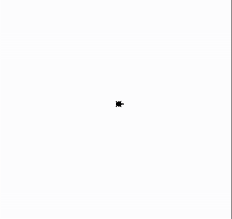
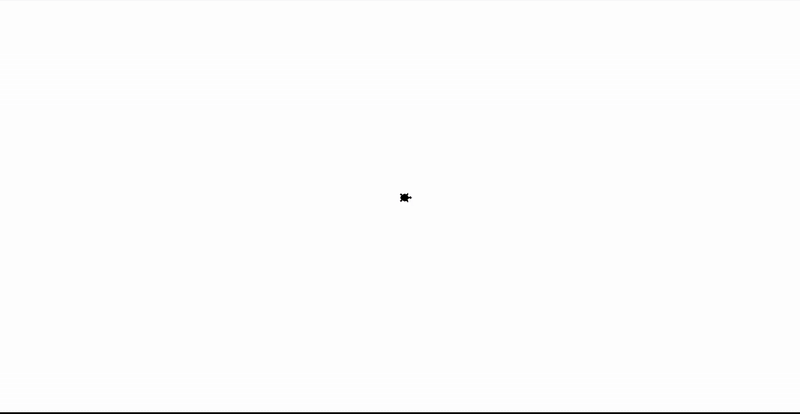
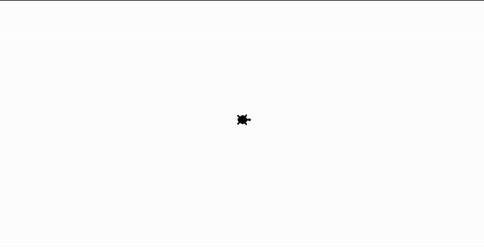
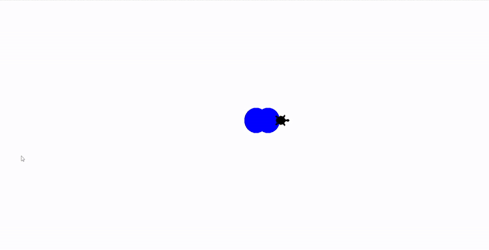

## Userinput als Events mit Turtle
### Aufgabe 1 - Mausgesteuerte Bewegung
Wir legen unserer Turtle mit der Maus Seegras irgendwo am Bildschirm hin. Wir drücken dazu mit der Linken Maustaste auf einen Ort am Bildschirm.
Die Turtle bewegt sich anschließend dorthin und macht einen Abdruck von sich selbst um sich zu merken wo einmal ein Seegras hingelegt worden ist. Wenn wir auf einen anderen Ort klicken, bewegt sich die Turtle auch dorthin und macht weider einen Abdruck. Dieses verhalten wiederholt sich bis wir das Fenster rechts oben beim X schließen.

**Hinweise:**
Verwende dazu folgende ``Prozeduren``:

* ``penup()``: Die Turtle legt **keinen** Faden am Boden ab. Diese malt dadruch **keine** Linien wenn diese sich **später** bewegt.
* ``goto(-100, 200)``: Die Turtle bewegt sich in einer *geraden Linie* zu der angegebenen *Position*. Die *Position* wird in *x* und *y* *Koordinaten* abegeben. Hier ist die Mitte des Fensters *x = 0* und *y = 0* ist.
* ``stamp()``: Die Turtle drückt sich auf den Boden und hinterlässt einen Abdruck.
* ``screen.onclick(meine_prozedur)``: *meine_prozedur* ist eine eigens geschriebene ``Prozedur`` welche ausgeführt wird, wenn wir auf den Bildschirm drücken.

<div style="text-align: left;">
    
</div>

**Lösung:**
```python
from turtle import *

# --- Vorbereitung ---
screen = Screen()
shape('turtle')
speed(3)

# --- Eigene Prozeduren ---
# Diese Prozedur wird aufgerufen, wenn der Benutzer auf den Bildschirm klickt.
# Es wird hier die position der Mausklicks in x und y übergeben.
# Wichtig sind die Argumente x und y. Diese müssen vorhanden sein, sonst gibt es einen Fehler.
def bewege_turtle(x, y):
    # Bewege die Turtle zu den Koordinaten der Maus.
    goto(x, y) 

    # Die Turtle ist so schnell dass diese einen Abdruck am Zielort macht.
    stamp() 

# --- Logik ---
penup()

# Diese Prozedur screen.onclick ist eine kompliziert. Sie ist ein Event und eine Methode. 
# Wir irgnoriern aber was eine Methode ist und denken uns screen.onclick ist der name der Prozedur.
# Die Prozedur screen.onclick horch auf einen Klick mit der Maus. Wir nennen das ein Event. 
# Wenn dieses Event passiert, wir dürcken die Maustaste, führen wir den Code in der eigens geschriebenen Prozedur bewege_turtle aus. 
# Um das zu tun schreiben verwenden wir den Namen der Prozedur bewege_turtle und geben diesen der Prozedur screen.onclick. 
# Wir rufen dabei nicht bewege_turtle(3,5) mit den runden Klammern auf! Ein Event will nur den Namen der Prozedur. 
screen.onclick(bewege_turtle)

# --- Abschluss ---
# Das hier ist eine Art Schleife. Wir lassen das Programm laufen und wenn ein Event passiert, dann führen wir dieses aus.
screen.mainloop()
```


### Aufgabe 2 - Ausmalen
#### Links-oben, links-unten, rechts-oben und rechts-unten 
Die Turtle will die Wüste und das Meer umdekoriern. Sie braucht aber dazu deine Hilfe wo sie beginnen soll. Zeige mit der Maus der Turtle wohin sie gehen soll. Dort angekommen färbt sie einen kleinen Ort ein. Welche Farbe sagt uns dabei foglende Bedingungen.
* oben links ist rot, 
* oben rechts ist blau,
* unten links ist gelb und 
* unten rechts ist grün.
Die Angaben sind von dem Haus der Turtle ausgehend.

**Hinweise:**
Verwende dazu folgende ``Prozeduren``:

* ``penup()``: Die Turtle legt **keinen** Faden am Boden ab. Diese malt dadruch **keine** Linien wenn diese sich **später** bewegt.
* ``goto(-100, 200)``: Die Turtle bewegt sich in einer *geraden Linie* zu der angegebenen *Position*. Die *Position* wird in *x* und *y* *Koordinaten* abegeben. Hier ist die Mitte des Fensters *x = 0* und *y = 0* ist.
* ``dot(durchmesser, "red")``: Wir malen einen Kreis am Boden in der angegebenen Farbe.
* ``screen.onclick(meine_prozedur)``: *meine_prozedur* ist eine eigens geschriebene ``Prozedur`` welche ausgeführt wird, wenn wir auf den Bildschirm drücken.

<div style="text-align: left;">
    
</div>

**Lösung:**
```python
from turtle import *

# --- Vorbereitung ---
screen = Screen()
speed("fastest")
shape("turtle")
penup()

# --- Logik ---
durchmesser = 80

def draw_colored_dot(x, y):
    goto(x, y)

    # Farbe basierend auf dem Ort bestimmen.
    # Je nachdem wir Links-oben, links-unten, rechts-oben und rechts-unten mit der Maus drücken, hinterlässt die Turtle eine andere Farbe.
    # Der ort ist ausgehend von Ihrem Haus 0,0 zu sehen.

    # Oben Links
    if x < 0 and y > 0: 
        dot(durchmesser, "red")

    # Oben Rechts
    elif x > 0 and y > 0: 
        dot(durchmesser, "blue")

    # Unten Links
    elif x < 0 and y < 0: 
        dot(durchmesser, "yellow")

    # Wir verwenden hier else als "Rest". Hier wird alles was nicht oben in den ifs unn elifs "reinpasst" ausgeführt.
    # Dieser "Rest" ist bei uns der Fall "grüner Punkt".
    # Wir sollten bei komplizierteren Programmen sowas eher vermeiden und wie bisher ein else "das ist ein Fehler" ausführen.

    # Unten Rechts
    else: 
        dot(durchmesser, "green")

# Auf Klicks lauschen
screen.onclick(draw_colored_dot)

goto(x,y)

# --- Abschluss ---
screen.mainloop()
```

#### Streifen
Die Turtle will die Wüste und das Meer nochmals umdekoriern. Jedoch ein wenig andres. Sie braucht wieder dazu deine Hilfe wo sie beginnen soll. Zeige mit der Maus der Turtle wohin sie gehen soll. Dort angekommen färbt sie einen kleinen Ort ein. Welche Farbe sagt uns dabei foglende Bedingungen.
1. Steifen ganz links ist orange.
2. Steifen links ist violett.
3. Steifen rechts ist blau.
4. Steifen ganz rechts ist gelb.
Die Angaben sind von dem Haus der Turtle ausgehend. Alle Streifen sind gleich breit und zwar ein viertel der gesamten Welt (Bildschirmbreite).


**Hinweise:**
Verwende dazu folgende ``Prozeduren``:

* ``penup()``: Die Turtle legt **keinen** Faden am Boden ab. Diese malt dadruch **keine** Linien wenn diese sich **später** bewegt.
* ``goto(-100, 200)``: Die Turtle bewegt sich in einer *geraden Linie* zu der angegebenen *Position*. Die *Position* wird in *x* und *y* *Koordinaten* abegeben. Hier ist die Mitte des Fensters *x = 0* und *y = 0* ist.
* ``dot(durchmesser, "red")``: Wir malen einen Kreis am Boden in der angegebenen Farbe.
* ``screen.onclick(meine_prozedur)``: *meine_prozedur* ist eine eigens geschriebene ``Prozedur`` welche ausgeführt wird, wenn wir auf den Bildschirm drücken.

Mach auch das Fenster so groß wie den Bildschirm, sonst kann es Fehler geben.

<div style="text-align: left;">
    
</div>


**Lösung:**
```python
from turtle import *

# --- Vorbereitung ---
screen = Screen()
breite = window_width()
shape("turtle")
speed("fastest")

# Vertikale Streifen zeichnen
# Für 4 Streifen brauchen wir 3 Trennlinien.
# Die eine Trennlinie geht durch das Haus bei 0 in der x-Position.
# die eine andere Trennlinie halbiert das Meer und
# die eine andere Trennlinie halbiert die Wüste.
linie_haus = 0
linie_meer = -breite / 2
linie_wueste = breite / 2
    
penup()

# --- Logik ---
# Wir bekommen magischeweise hier x und y von außen herein. Das ist aber nur beim Maus-Event der Fall und z.B. bei einem Tastatur-Event nicht der Fall.
def zeichne_bunten_punkt_und_bewege_turtle(x, y):
    groesse_des_punktes = 40
    penup() 
    goto(x, y)
    
    # Streifen ganz links
    if -breite < x and x <= linie_meer:
        dot(groesse_des_punktes, "orange")
        
    # Streifen links
    elif linie_meer < x and x <= linie_haus:
        dot(groesse_des_punktes, "violet")
        
    # Streifen rechts
    elif linie_haus < x and x <= linie_wueste:
        dot(groesse_des_punktes, "blue")
        
    # Streifen ganz rechts
    elif linie_wueste < x and x <= breite:
        dot(groesse_des_punktes, "yellow")

    # Wir verwenden hier else als "Es ist was unerwartetes passiert". Hier wird wenn etwas nicht in die ifs und elifs oben reinpasst, eine Warnung ausgegeben.
    # Wir sollten bei komplizierteren Programmen besser "else ist etwas unerwartetes" als "else ist der z.B. grüne punkt" verwenden.
    else:
        ohje = "Das sollte gar nie passieren"
        print(ohje)
        write(ohje)


# --- Ereignis-Verknüpfung ---
# Damit Events erkannt werden, müssen wir zwei Dinge tun:
# 1. Dem screen sagen, dass er "zuhören" soll.
screen.listen()

# 2. Eine Prozedur dem Event übergeben welche ausgeführt wird.
screen.onclick(zeichne_bunten_punkt_und_bewege_turtle)

# --- Abschluss ---
screen.mainloop()
```

### Aufgabe 3 - Bewegen mit der Tastatur
Wir wollen nun nicht mehr mit der Maus der Turtle die Anweisungen schicken. Wir tun es mit der Tastatur. Wir verwenden die Pfeiltasten zum bewegen und die Leertaste um einen Ort einzufärben. Die Logik des Einfärbens ist aus der [Aufgabe 2](#aufgabe-2---ausmalen) zu übernehmen.

**Hinweise:**
Verwende dazu folgende ``Prozeduren``:

* ``penup()``: Die Turtle legt **keinen** Faden am Boden ab. Diese malt dadruch **keine** Linien wenn diese sich **später** bewegt.
* ``goto(-100, 200)``: Die Turtle bewegt sich in einer *geraden Linie* zu der angegebenen *Position*. Die *Position* wird in *x* und *y* *Koordinaten* abegeben. Hier ist die Mitte des Fensters *x = 0* und *y = 0* ist.
* ``hideturtle()``: Die Turtle gräbt sich ein und versteckt sich.
* ``dot(durchmesser, "red")``: Wir malen einen Kreis am Boden in der angegebenen Farbe.
* ``screen.onkey(meine_prozedur, "Up")``: *meine_prozedur* ist eine eigens geschriebene ``Prozedur`` welche ausgeführt wird, wenn wir mit der Tastatur die Nach-Oben-Pfeiltaste drücken.
* ``setheading(90)``: Die Turtel dreht sich in die angegebene Richtung. Der Unterschied zu z.B. ``left(90)`` ist, dass hier wir uns 90° nach links in **Blickrichtung** der Turtle drehen. Mit ``setheading(90)`` schauen wir immer nach oben, egal wo die Turtel hinschaut. Es erlaubt uns also 
    * ``setheading(0)`` uns nach rechts zu schaun, 
    * ``setheading(90)`` uns nach oben zu schaun, 
    * ``setheading(180)`` uns nach links zu schaun, 
    * ``setheading(270)`` uns nach unten zu schaun, 
    * ``setheading(360)`` uns nach rechts zu schaun,

Verwende dazu folgende ``Funktionen``:

* ``xcor()``: Gibt die x-Position der Turtle zurück. Da es eine Funktion ist kann xcor() überall verwendet werden wo eine Zahl erwartet wird.
* ``ycor()``: Gibt die y-Position der Turtle zurück. Da es eine Funktion ist kann ycor() überall verwendet werden wo eine Zahl erwartet wird.


<div style="text-align: left;">
    
</div>


**Lösung:**
```python
from turtle import *

# --- Vorbereitung ---
screen = Screen()
breite = window_width()

# Erstellen unserer Helden-Turtle
shape("turtle")
shapesize(2)
penup()

# --- Logik ---
# Vertikale Streifen zeichnen
# Für 4 Streifen brauchen wir 3 Trennlinien.
# Die eine Trennlinie geht durch das Haus bei 0 in der x-Position.
# die eine andere Trennlinie halbiert das Meer und
# die eine andere Trennlinie halbiert die Wüste.
linie_haus = 0
linie_meer = -breite / 2
linie_wueste = breite / 2

# Wir definieren, wie weit die Turtle bei jedem Tastendruck gehen soll.
# Wir brauchen vier separate Prozeduren, eine für jede Pfeiltaste.
def gehe_nach_oben():
    """Setzt die Ausrichtung nach oben (90 Grad) und geht einen Schritt."""
    # Drehe die Turtle nach oben. 
    setheading(90)

    # Gehe eine gewisse Anzahl an Schritten in diese Richtung.
    forward(40)

def gehe_nach_unten():
    """Setzt die Ausrichtung nach unten (270 Grad) und geht einen Schritt."""
    # Drehe die Turtle nach unten. 
    setheading(270)

    # Gehe eine gewisse Anzahl an Schritten in diese Richtung.
    forward(40)

def gehe_nach_links():
    """Setzt die Ausrichtung nach links (180 Grad) und geht einen Schritt."""
    # Drehe die Turtle nach links. 
    setheading(180)

    # Gehe eine gewisse Anzahl an Schritten in diese Richtung.
    forward(40)

def gehe_nach_rechts():
    """Setzt die Ausrichtung nach rechts (0 Grad) und geht einen Schritt."""
    # Drehe die Turtle nach rechts. 
    setheading(0)

    # Gehe eine gewisse Anzahl an Schritten in diese Richtung.
    forward(40)

# Wir brauchen auch die Prozedur welche für die Farben zuständig ist. Dabei ist keine Änderung notwendig.
def zeichne_bunten_punkt():
    groesse_des_punktes = 80

    # Wir bekommen leider nicht wie beim Maus-Event die Koordinaten von außen herein.
    # Wir müssen es selbst bestimmen. Wir verwenden dazu xcor() und ycor().
    x = xcor()
    y = ycor()

    penup() 
    goto(x, y)
    
    # Streifen ganz links
    if -breite < x and x <= linie_meer:
        dot(groesse_des_punktes, "orange")
        
    # Streifen links
    elif linie_meer < x and x <= linie_haus:
        dot(groesse_des_punktes, "violet")
        
    # Streifen rechts
    elif linie_haus < x and x <= linie_wueste:
        dot(groesse_des_punktes, "blue")
        
    # Streifen ganz rechts
    elif linie_wueste < x and x <= breite:
        dot(groesse_des_punktes, "yellow")

    else:
        ohje = "Das sollte gar nie passieren"
        print(ohje)
        write(ohje)

# --- Ereignis-Verknüpfung ---
# Damit Tastendrücke erkannt werden, müssen wir zwei Dinge tun:
# 1. Dem screen sagen, dass er "zuhören" soll.
screen.listen()

# 2. Eine Prozedur dem Event übergeben welche ausgeführt wird.
# Die Namen für die Pfeiltasten sind: "Up", "Down", "Left", "Right"
# Bewegen
screen.onkey(gehe_hoch, "Up")
screen.onkey(gehe_runter, "Down")
screen.onkey(gehe_links, "Left")
screen.onkey(gehe_rechts, "Right")

# Zeichnen
screen.onkey(zeichne_bunten_punkt, "space")

# --- Abschluss ---
screen.mainloop()
```

### Aufgabe 4 - Bewegen mit der Tastatur, ein wenig anders.
Wir wollen nun nicht mehr mit der Leertaste der Turtle die Anweisung einfärben schicken. Diese soll es automatisch tun wenn sie sich bewegt. Die Logik des Einfärbens und Bewegens ist aus der [Aufgabe 3](#aufgabe-3---bewegen-mit-der-tastatur) zu übernehmen.

**Hinweise:**
Verwende dazu folgende ``Prozeduren``:

* ``penup()``: Die Turtle legt **keinen** Faden am Boden ab. Diese malt dadruch **keine** Linien wenn diese sich **später** bewegt.
* ``goto(-100, 200)``: Die Turtle bewegt sich in einer *geraden Linie* zu der angegebenen *Position*. Die *Position* wird in *x* und *y* *Koordinaten* abegeben. Hier ist die Mitte des Fensters *x = 0* und *y = 0* ist.
* ``hideturtle()``: Die Turtle gräbt sich ein und versteckt sich.
* ``dot(durchmesser, "red")``: Wir malen einen Kreis am Boden in der angegebenen Farbe.
* ``screen.onkey(meine_prozedur, "Up")``: *meine_prozedur* ist eine eigens geschriebene ``Prozedur`` welche ausgeführt wird, wenn wir mit der Tastatur die Nach-Oben-Pfeiltaste drücken.
* ``setheading(90)``: Die Turtel dreht sich in die angegebene Richtung. Der Unterschied zu z.B. ``left(90)`` ist, dass hier wir uns 90° nach links in **Blickrichtung** der Turtle drehen. Mit ``setheading(90)`` schauen wir immer nach oben, egal wo die Turtel hinschaut. Es erlaubt uns also 
    * ``setheading(0)`` uns nach rechts zu schaun, 
    * ``setheading(90)`` uns nach oben zu schaun, 
    * ``setheading(180)`` uns nach links zu schaun, 
    * ``setheading(270)`` uns nach unten zu schaun, 
    * ``setheading(360)`` uns nach rechts zu schaun,

Verwende dazu folgende ``Funktionen``:

* ``xcor()``: Gibt die x-Position der Turtle zurück. Da es eine Funktion ist kann xcor() überall verwendet werden wo eine Zahl erwartet wird.
* ``ycor()``: Gibt die y-Position der Turtle zurück. Da es eine Funktion ist kann ycor() überall verwendet werden wo eine Zahl erwartet wird.

<div style="text-align: left;">
    
</div>

**Lösung:**
```python
from turtle import *

# --- Vorbereitung ---
screen = Screen()
breite = window_width()

# Erstellen unserer Helden-Turtle
shape("turtle")
shapesize(2)
penup()

# --- Logik ---
# Vertikale Streifen zeichnen
# Für 4 Streifen brauchen wir 3 Trennlinien.
# Die eine Trennlinie geht durch das Haus bei 0 in der x-Position.
# die eine andere Trennlinie halbiert das Meer und
# die eine andere Trennlinie halbiert die Wüste.
linie_haus = 0
linie_meer = -breite / 2
linie_wueste = breite / 2

# Wir definieren, wie weit die Turtle bei jedem Tastendruck gehen soll.
# Wir brauchen vier separate Prozeduren, eine für jede Pfeiltaste.
def gehe_nach_oben():
    """Setzt die Ausrichtung nach oben (90 Grad) und geht einen Schritt."""
    # Drehe die Turtle nach oben. 
    setheading(90)

    # Gehe eine gewisse Anzahl an Schritten in diese Richtung.
    forward(40)

    # Wir bekommen leider nicht wie beim Maus-Event die Koordinaten von außen herein.
    # Wir müssen es selbst bestimmen. Wir verwenden dazu xcor() und ycor().
    # Eine Funktion kann direkt verwendet werden um zeichne_bunten_punkt die x-Position und y-Position zu übergeben.
    # Eine Funktion erzeugt einen Wert, wir brauchen deshalb keine extra Variable dazu.
    # Das funktioniert nicht mit einer Prozedur! Denn diese gibt nichts zurück und erzeugt damit nichts!

    # Rufe hier das zeichnen des farbigen Punktes auf und übergebe xcor() und ycor().
    zeichne_bunten_punkt(xcor(), ycor())

def gehe_nach_unten():
    """Setzt die Ausrichtung nach unten (270 Grad) und geht einen Schritt."""
    # Drehe die Turtle nach unten. 
    setheading(270)

    # Gehe eine gewisse Anzahl an Schritten in diese Richtung.
    forward(40)

    # Rufe hier das zeichnen des farbigen Punktes auf und übergebe xcor() und ycor().
    zeichne_bunten_punkt(xcor(), ycor())

def gehe_nach_links():
    """Setzt die Ausrichtung nach links (180 Grad) und geht einen Schritt."""
    # Drehe die Turtle nach links. 
    setheading(180)

    # Gehe eine gewisse Anzahl an Schritten in diese Richtung.
    forward(40)

    # Rufe hier das zeichnen des farbigen Punktes auf und übergebe xcor() und ycor().
    zeichne_bunten_punkt(xcor(), ycor())

def gehe_nach_rechts():
    """Setzt die Ausrichtung nach rechts (0 Grad) und geht einen Schritt."""
    # Drehe die Turtle nach rechts. 
    setheading(0)

    # Gehe eine gewisse Anzahl an Schritten in diese Richtung.
    forward(40)

    # Rufe hier das zeichnen des farbigen Punktes auf und übergebe xcor() und ycor().
    zeichne_bunten_punkt(xcor(), ycor())

# Wir brauchen auch die Prozedur welche für die Farben zuständig ist. Dabei ist keine Änderung notwendig.
def zeichne_bunten_punkt(x, y):
    groesse_des_punktes = 80

    penup() 
    goto(x, y)
    
    # Streifen ganz links
    if -breite < x and x <= linie_meer:
        dot(groesse_des_punktes, "orange")
        
    # Streifen links
    elif linie_meer < x and x <= linie_haus:
        dot(groesse_des_punktes, "violet")
        
    # Streifen rechts
    elif linie_haus < x and x <= linie_wueste:
        dot(groesse_des_punktes, "blue")
        
    # Streifen ganz rechts
    elif linie_wueste < x and x <= breite:
        dot(groesse_des_punktes, "yellow")

    else:
        ohje = "Das sollte gar nie passieren"
        print(ohje)
        write(ohje)

# --- Ereignis-Verknüpfung ---
# Damit Tastendrücke erkannt werden, müssen wir zwei Dinge tun:
# 1. Dem screen sagen, dass er "zuhören" soll.
screen.listen()

# 2. Eine Prozedur dem Event übergeben welche ausgeführt wird.
# Die Namen für die Pfeiltasten sind: "Up", "Down", "Left", "Right"
# Bewegen
screen.onkey(gehe_hoch, "Up")
screen.onkey(gehe_runter, "Down")
screen.onkey(gehe_links, "Left")
screen.onkey(gehe_rechts, "Right")

# --- Abschluss ---
screen.mainloop()
```