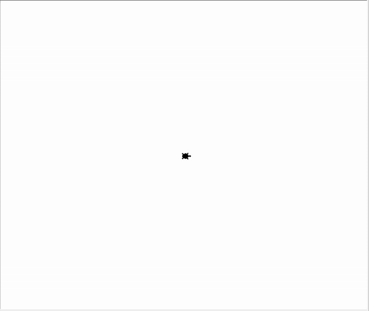
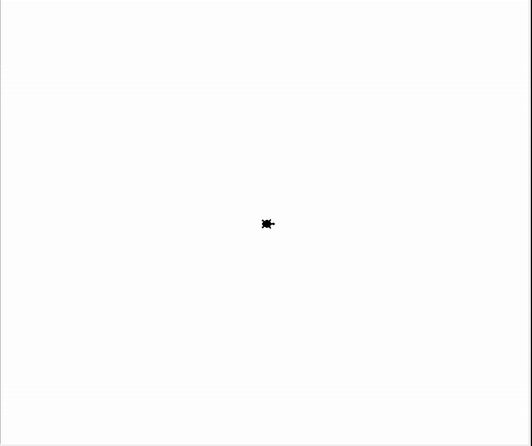
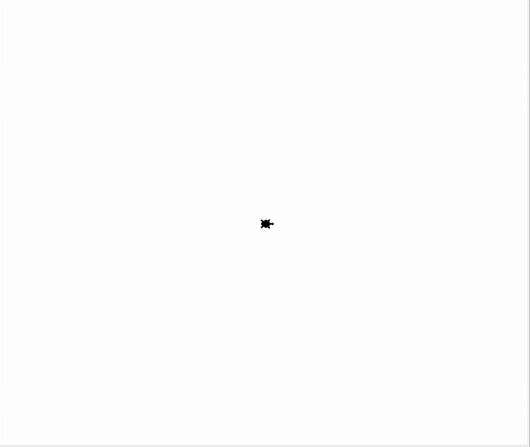

## Listen und Tupel in Turtle
### Aufgabe 1 - Wiederholte Bewegung 5 mal mit einer Farbe aus der Liste
Unsere Turtle will wieder die Welt erforschen. Wir halten uns an die Angabe aus [Schleifen, exercise 1, Aufgabe 2](L06SchleifenUndRekursion/exercise1-while_und_for_schleifen/angabe.md#aufgabe-2---wiederholte-bewegung-5-mal). Die Turtel will jedoch bevor sie startet sich für eine Farben für die Markierungen entscheiden. Diese Farbe soll jedoch nur aus einer Dose in ihrem Rucksack kommen. Wir verwenden dazu eine ``Liste`` an Farben ``["red", "black", "yellow", "blue", "orange"]`` welche wir ``rucksack`` nennen. Die Turtle hat sich für das 4. Fach im Rucksack entschieden. Sie will also die <span style="color:blue;">blaue Farbe</span> haben.

**Hinweise:**
Verwende dazu folgende ``Prozeduren``:
* ``pendown()``: Die Turtle legt **einen** Faden am Boden ab. Diese malt dadruch Linien wenn diese sich **später** bewegt.
* ``penup()``: Die Turtle legt **keinen** Faden am Boden ab. Diese malt dadruch **keine** Linien wenn diese sich **später** bewegt.
* ``goto(-100, 200)``: Die Turtle bewegt sich in einer *geraden Linie* zu der angegebenen *Position*. Die *Position* wird in *x* und *y* *Koordinaten* abegeben. Hier ist die Mitte des Fensters *x = 0* und *y = 0* ist.
* ``stamp()``: Die Turtle drückt sich auf den Boden und hinterlässt einen Abdruck.
* ``shape("turtle")`` oder ``shape("circle")``: Wir lassen unsere Turtle anders aussehen. Wir können folgende Werte übergeben ``"circle"`` und ``"turtle"``. 
* ``dot(25, "red")``: Wir malen einen roten Kreis mit Durchmesser 25 am Boden.

Sowie folgende ``Funktionen``:
* ``randint(3, 8)``: Wir ziehen eine zufällige Zahl ohne Kommastellen von z.B. 3 bis 8.
* ``window_width()``: Gibt die breite unseres Fenstes zurück. Merke dir die Antwort mit einer ``Variable``. Das geht so *breite = window_width()*.
* ``window_height()``: Gibt die breite unseres Fenstes zurück. Merke dir die Antwort mit einer ``Variable``. Das geht so *hoehe = window_height()*.

<div style="text-align: left;">
    
</div>

**Vorlage:**
```python
from turtle import *
from random import randint

# --- Vorbereitung ---
# Die Variablen für die Geschwindigkeit.
geschwindigkeit_am_land = 1
geschwindigkeit_im_wasser = 50 * geschwindigkeit_am_land

# Die Variablen für die Form.
form_am_land = "turtle"
form_im_wasser = "circle"

shape(form_am_land) 
speed(geschwindigkeit_am_land)

# --- Logik ---
# Die Turtle nimmt den Faden aus der Tasche und legt ihn am Boden wenn sie losgeht.
pendown()

# Die Turtle drückt den Faden in den boden, fixiert diesen und macht einen Abdruck von sich selbst.
stamp()

breite = window_width()
hoehe = window_height()

halbe_breite_ohne_komma = breite // 2 
halbe_hoehe_ohne_komma = hoehe // 2

# Wir erstellen eine Liste mit 5 Farben. Dieser wird als Text (String) dargestellt. 
rucksack = ... # TODO: Lösche dieses Kommentar, die drei Punkte und füge dort den korrekten Ausdruck ein.

# TODO: Lösche dieses Kommetar und schreibe den Programmcode hier!
# Der start der Schleife welche nach 5 Wiederholungen abbrechen soll. 
for so_oft_habe_ich_mich_bewegt in range(5):
    ziel_in_x = randint(-halbe_breite_ohne_komma, halbe_breite_ohne_komma) 
    ziel_in_y = randint(-halbe_hoehe_ohne_komma, halbe_hoehe_ohne_komma) 

    # Wir bewegen die Turtle und passen an wie diese dargestellt wird (Kreis oder Turtle). 
    if ziel_in_x > 0:
        # Wir verwenden die Form für die rechte Seite. Diese ist 'turtle'.
        shape(form_am_land) 
        speed(geschwindigkeit_am_land)
    else:
        # Wir verwenden die Form für die rechte Seite. Diese ist 'circle'.
        shape(form_im_wasser) 
        speed(geschwindigkeit_im_wasser)

    # Die Turtle nimmt den Faden aus der Tasche und legt ihn am Boden wenn sie losgeht.
    pendown()

    # Die Turtle bewegt sich an einen zufällig gewählten Ort.
    goto(ziel_in_x, ziel_in_y)

    # Die Turtle markier diesen Ort mit einem Punkt.
    # Die Farbe wird zufällig aus ["red", "black", "yellow", "blue", "orange"] gewählt.
    # Verwende die eckigen Klammern [] um auf das 4. Fach zuzugreifen.
    # Achtung! Wenn der Rucksack 5 Farben hat, wie sprechen wir das 4. Fach an?
    farbe = ... # TODO: Lösche dieses Kommentar, die drei Punkte und füge dort den korrekten Ausdruck ein.
    dot(25, ...) # TODO: Lösche dieses Kommentar, die drei Punkte und füge dort den korrekten Ausdruck ein.

    # Die Turtle schneidet den Faden ab und gibt die Rolle mit dem Faden wieder in die Tasche. Sie legt ihn nicht mehr auf den Boden wenn sie losgeht.
    penup()

    # Die Turtle bewegt sich zur Ausgangsposition zurück.
    goto(0, 0)

# --- Abschluss ---
shape('turtle')
write("😪", align="right", font=('Arial', 25, 'normal'))
# Schließt das Fenster nicht, wenn das Programm beendet ist.
done()
```

### Aufgabe 2 - Wiederholte Bewegung 5 mal mit zufälliger Farbe aus der Liste
Unsere Turtle will wieder die Welt erforschen. Wir halten uns an die Angabe aus [Aufgabe 1](#aufgabe-1---wiederholte-bewegung-5-mal-mit-einer-farbe-aus-der-liste). Die Turtle hat sich jedoch nicht entscheiden können welche Farbe sie möchte. Sie greift in ihre Tasche, findet einen fünf-seitigen Würfel und wirft diesen. Sie will also eine zufällige Farbe aus dem Rucksack haben.

**Hinweise:**
Verwende dazu folgende ``Prozeduren``:
* ``pendown()``: Die Turtle legt **einen** Faden am Boden ab. Diese malt dadruch Linien wenn diese sich **später** bewegt.
* ``penup()``: Die Turtle legt **keinen** Faden am Boden ab. Diese malt dadruch **keine** Linien wenn diese sich **später** bewegt.
* ``goto(-100, 200)``: Die Turtle bewegt sich in einer *geraden Linie* zu der angegebenen *Position*. Die *Position* wird in *x* und *y* *Koordinaten* abegeben. Hier ist die Mitte des Fensters *x = 0* und *y = 0* ist.
* ``stamp()``: Die Turtle drückt sich auf den Boden und hinterlässt einen Abdruck.
* ``shape("turtle")`` oder ``shape("circle")``: Wir lassen unsere Turtle anders aussehen. Wir können folgende Werte übergeben ``"circle"`` und ``"turtle"``. 
* ``dot(25, "red")``: Wir malen einen roten Kreis mit Durchmesser 25 am Boden.

Sowie folgende ``Funktionen``:
* ``randint(3, 8)``: Wir ziehen eine zufällige Zahl ohne Kommastellen von z.B. 3 bis 8.
* ``window_width()``: Gibt die breite unseres Fenstes zurück. Merke dir die Antwort mit einer ``Variable``. Das geht so *breite = window_width()*.
* ``window_height()``: Gibt die breite unseres Fenstes zurück. Merke dir die Antwort mit einer ``Variable``. Das geht so *hoehe = window_height()*.
* ``len(rucksack)``: Gibt an wie viel farben in unserem Rucksack sind. Hier sind es 5.

<div style="text-align: left;">
    
</div>

**Vorlage:**
```python
from turtle import *
from random import randint

# --- Vorbereitung ---
# Die Variablen für die Geschwindigkeit.
geschwindigkeit_am_land = 1
geschwindigkeit_im_wasser = 50 * geschwindigkeit_am_land

# Die Variablen für die Form.
form_am_land = "turtle"
form_im_wasser = "circle"

shape(form_am_land) 
speed(geschwindigkeit_am_land)

# --- Logik ---
# Die Turtle nimmt den Faden aus der Tasche und legt ihn am Boden wenn sie losgeht.
pendown()

# Die Turtle drückt den Faden in den boden, fixiert diesen und macht einen Abdruck von sich selbst.
stamp()

breite = window_width()
hoehe = window_height()

halbe_breite_ohne_komma = breite // 2 
halbe_hoehe_ohne_komma = hoehe // 2

# Wir erstellen eine Liste mit 5 Farben. Dieser wird als Text (String) dargestellt. 
rucksack = ["red", "black", "yellow", "blue", "orange"]

# Der start der Schleife welche nach 5 Wiederholungen abbrechen soll. 
for so_oft_habe_ich_mich_bewegt in range(5):
    ziel_in_x = randint(-halbe_breite_ohne_komma, halbe_breite_ohne_komma) 
    ziel_in_y = randint(-halbe_hoehe_ohne_komma, halbe_hoehe_ohne_komma) 

    # Wir bewegen die Turtle und passen an wie diese dargestellt wird (Kreis oder Turtle). 
    if ziel_in_x > 0:
        # Wir verwenden die Form für die rechte Seite. Diese ist 'turtle'.
        shape(form_am_land) 
        speed(geschwindigkeit_am_land)
    else:
        # Wir verwenden die Form für die rechte Seite. Diese ist 'circle'.
        shape(form_im_wasser) 
        speed(geschwindigkeit_im_wasser)

    # Die Turtle nimmt den Faden aus der Tasche und legt ihn am Boden wenn sie losgeht.
    pendown()

    # Die Turtle bewegt sich an einen zufällig gewählten Ort.
    goto(ziel_in_x, ziel_in_y)

    # Die Turtle markier diesen Ort mit einem Punkt.
    # Die Farbe wird zufällig aus ["red", "black", "yellow", "blue", "orange"] gewählt.
    # Verwende 0 und die Länge der Liste rucksack um die zufälligen Zahlen zu begrenzen.
    # Achtugn! Wenn der Rucksack 5 Farben hat, kann randint die Zahl 5 erzeugen? Können wir rucksack[5] schreiben?
    fach = ... # TODO: Lösche dieses Kommentar, die drei Punkte und füge dort den korrekten Ausdruck ein.
    farbe = ... # TODO: Lösche dieses Kommentar, die drei Punkte und füge dort den korrekten Ausdruck ein.

    dot(25, farbe)

    # Die Turtle schneidet den Faden ab und gibt die Rolle mit dem Faden wieder in die Tasche. Sie legt ihn nicht mehr auf den Boden wenn sie losgeht.
    penup()

    # Die Turtle bewegt sich zur Ausgangsposition zurück.
    goto(0, 0)

# --- Abschluss ---
shape('turtle')
write("😪", align="right", font=('Arial', 25, 'normal'))
# Schließt das Fenster nicht, wenn das Programm beendet ist.
done()
```

### Aufgabe 3 - Wiederholte Bewegung 5 mal mit einer Farbe aus der Liste
Unsere Turtle will wieder die Welt erforschen. Wir halten uns an die Angabe aus [Aufgabe 1](#aufgabe-1---wiederholte-bewegung-5-mal-mit-einer-farbe-aus-der-liste). Die Turtle hat sich für das letzte Fach im Rucksack entschieden. Es ist heiß und sie will aber unter keinen Umständen im Kopf die Position der letzten Tasche ausrechnen. Berechnen könnte sie es mit ``rucksack[len(rucksack)-1]``. Sie will also die <span style="color:orange;">orange Farbe</span> haben, jedoch **direkt** auf das letzte Fach zugreifen.

**Hinweise:**
Verwende den Zugriffsoperator ``[]`` mit ``-1`` bei der Liste ``rucksack``. Unsere Liste können wir uns wie einen Kreis vorstellen. Hier ist ``rucksack[0]`` ist das **erste** Fach, ``rucksack[1]`` ist das **zweite** Fach, ``rucksack[-1]`` ist das **letze** Fach und ``rucksack[-2]`` ist das **vorletze** Fach.

Verwende dazu folgende ``Prozeduren``:
* ``pendown()``: Die Turtle legt **einen** Faden am Boden ab. Diese malt dadruch Linien wenn diese sich **später** bewegt.
* ``penup()``: Die Turtle legt **keinen** Faden am Boden ab. Diese malt dadruch **keine** Linien wenn diese sich **später** bewegt.
* ``goto(-100, 200)``: Die Turtle bewegt sich in einer *geraden Linie* zu der angegebenen *Position*. Die *Position* wird in *x* und *y* *Koordinaten* abegeben. Hier ist die Mitte des Fensters *x = 0* und *y = 0* ist.
* ``stamp()``: Die Turtle drückt sich auf den Boden und hinterlässt einen Abdruck.
* ``shape("turtle")`` oder ``shape("circle")``: Wir lassen unsere Turtle anders aussehen. Wir können folgende Werte übergeben ``"circle"`` und ``"turtle"``. 
* ``dot(25, "red")``: Wir malen einen roten Kreis mit Durchmesser 25 am Boden.

Sowie folgende ``Funktionen``:
* ``randint(3, 8)``: Wir ziehen eine zufällige Zahl ohne Kommastellen von z.B. 3 bis 8.
* ``window_width()``: Gibt die breite unseres Fenstes zurück. Merke dir die Antwort mit einer ``Variable``. Das geht so *breite = window_width()*.
* ``window_height()``: Gibt die breite unseres Fenstes zurück. Merke dir die Antwort mit einer ``Variable``. Das geht so *hoehe = window_height()*.

<div style="text-align: left;">
    
</div>

**Vorlage:**
```python
from turtle import *
from random import randint

# --- Vorbereitung ---
# Die Variablen für die Geschwindigkeit.
geschwindigkeit_am_land = 1
geschwindigkeit_im_wasser = 50 * geschwindigkeit_am_land

# Die Variablen für die Form.
form_am_land = "turtle"
form_im_wasser = "circle"

shape(form_am_land) 
speed(geschwindigkeit_am_land)

# --- Logik ---
# Die Turtle nimmt den Faden aus der Tasche und legt ihn am Boden wenn sie losgeht.
pendown()

# Die Turtle drückt den Faden in den boden, fixiert diesen und macht einen Abdruck von sich selbst.
stamp()

breite = window_width()
hoehe = window_height()

halbe_breite_ohne_komma = breite // 2 
halbe_hoehe_ohne_komma = hoehe // 2

# Wir erstellen eine Liste mit 5 Farben. Dieser wird als Text (String) dargestellt. 
rucksack = ["red", "black", "yellow", "blue", "orange"]

# Der start der Schleife welche nach 5 Wiederholungen abbrechen soll. 
for so_oft_habe_ich_mich_bewegt in range(5):
    ziel_in_x = randint(-halbe_breite_ohne_komma, halbe_breite_ohne_komma) 
    ziel_in_y = randint(-halbe_hoehe_ohne_komma, halbe_hoehe_ohne_komma) 

    # Wir bewegen die Turtle und passen an wie diese dargestellt wird (Kreis oder Turtle). 
    if ziel_in_x > 0:
        # Wir verwenden die Form für die rechte Seite. Diese ist 'turtle'.
        shape(form_am_land) 
        speed(geschwindigkeit_am_land)
    else:
        # Wir verwenden die Form für die rechte Seite. Diese ist 'circle'.
        shape(form_im_wasser) 
        speed(geschwindigkeit_im_wasser)

    # Die Turtle nimmt den Faden aus der Tasche und legt ihn am Boden wenn sie losgeht.
    pendown()

    # Die Turtle bewegt sich an einen zufällig gewählten Ort.
    goto(ziel_in_x, ziel_in_y)

    # Die Turtle markier diesen Ort mit einem Punkt.
    # Die Farbe wird zufällig aus ["red", "black", "yellow", "blue", "orange"] gewählt.
    # Die letzte Tasche im Rucksack soll gewählt werden.
    # Verwende dazu nicht rucksack[len(rucksack) - 1]
    farbe = ... # TODO: Lösche dieses Kommentar, die drei Punkte und füge dort den korrekten Ausdruck ein.

    dot(25, farbe)

    # Die Turtle schneidet den Faden ab und gibt die Rolle mit dem Faden wieder in die Tasche. Sie legt ihn nicht mehr auf den Boden wenn sie losgeht.
    penup()

    # Die Turtle bewegt sich zur Ausgangsposition zurück.
    goto(0, 0)

# --- Abschluss ---
shape('turtle')
write("😪", align="right", font=('Arial', 25, 'normal'))
# Schließt das Fenster nicht, wenn das Programm beendet ist.
done()
```

### Aufgabe 4 - Wiederholte Bewegung 5 mal mit allen Farben aus dem Rucksack
Unsere Turtle will wieder die Welt erforschen. Wir halten uns an die Angabe aus [Aufgabe 1](#aufgabe-1---wiederholte-bewegung-5-mal-mit-einer-farbe-aus-der-liste). Die Turtel will beginnend mit <span style="color:red;">red</span>, danach <span style="color:black;">violett</span>, danach <span style="color:yellow;">gelb</span>, danach <span style="color:blue;">blau</span> und zum Schluss <span style="color:orange;">orange</span> für die 5 Markierungen verwenden. Der Zugriff auf diese Farben soll also mit Hilfe einer ``for`` Schleife passieren.

**Hinweise:**
Verwende dazu folgende ``Prozeduren``:
* ``pendown()``: Die Turtle legt **einen** Faden am Boden ab. Diese malt dadruch Linien wenn diese sich **später** bewegt.
* ``penup()``: Die Turtle legt **keinen** Faden am Boden ab. Diese malt dadruch **keine** Linien wenn diese sich **später** bewegt.
* ``goto(-100, 200)``: Die Turtle bewegt sich in einer *geraden Linie* zu der angegebenen *Position*. Die *Position* wird in *x* und *y* *Koordinaten* abegeben. Hier ist die Mitte des Fensters *x = 0* und *y = 0* ist.
* ``stamp()``: Die Turtle drückt sich auf den Boden und hinterlässt einen Abdruck.
* ``shape("turtle")`` oder ``shape("circle")``: Wir lassen unsere Turtle anders aussehen. Wir können folgende Werte übergeben ``"circle"`` und ``"turtle"``. 
* ``dot(25, "red")``: Wir malen einen roten Kreis mit Durchmesser 25 am Boden.

Sowie folgende ``Funktionen``:
* ``randint(3, 8)``: Wir ziehen eine zufällige Zahl ohne Kommastellen von z.B. 3 bis 8.
* ``window_width()``: Gibt die breite unseres Fenstes zurück. Merke dir die Antwort mit einer ``Variable``. Das geht so *breite = window_width()*.
* ``window_height()``: Gibt die breite unseres Fenstes zurück. Merke dir die Antwort mit einer ``Variable``. Das geht so *hoehe = window_height()*.

<div style="text-align: left;">
    
</div>

**Vorlage:**
```python
from turtle import *
from random import randint

# --- Vorbereitung ---
# Die Variablen für die Geschwindigkeit.
geschwindigkeit_am_land = 1
geschwindigkeit_im_wasser = 50 * geschwindigkeit_am_land

# Die Variablen für die Form.
form_am_land = "turtle"
form_im_wasser = "circle"

shape(form_am_land) 
speed(geschwindigkeit_am_land)

# --- Logik ---
# Die Turtle nimmt den Faden aus der Tasche und legt ihn am Boden wenn sie losgeht.
pendown()

# Die Turtle drückt den Faden in den boden, fixiert diesen und macht einen Abdruck von sich selbst.
stamp()

breite = window_width()
hoehe = window_height()

halbe_breite_ohne_komma = breite // 2 
halbe_hoehe_ohne_komma = hoehe // 2

# Wir erstellen eine Liste mit 5 Elementen. Wenn wir also alle mit einer For Schleife durcharbeiten, haben wir 5 Wiederholungen des Codes in der Schleife. 
farben_zum_markieren = ... # TODO: Lösche dieses Kommentar, die drei Punkte und füge dort den korrekten Ausdruck ein.

# Der start der Schleife welche nach 5 Wiederholungen abbrechen soll. 
# Wir zählen nicht mehr mit ...
# for so_oft_habe_ich_mich_bewegt in range(5):
# ... sondern geben direkt die Liste an.
# In jedem Schleifendurchlauf tauschen wir aus was in farbe steht und zwar mit der nächsten Farbe in der Liste.
for ... # TODO: Lösche dieses Kommentar, die drei Punkte und füge dort den korrekten Ausdruck ein.
    ziel_in_x = randint(-halbe_breite_ohne_komma, halbe_breite_ohne_komma) 
    ziel_in_y = randint(-halbe_hoehe_ohne_komma, halbe_hoehe_ohne_komma) 

    # Wir bewegen die Turtle und passen an wie diese dargestellt wird (Kreis oder Turtle). 
    if ziel_in_x > 0:
        # Wir verwenden die Form für die rechte Seite. Diese ist 'turtle'.
        shape(form_am_land) 
        speed(geschwindigkeit_am_land)
    else:
        # Wir verwenden die Form für die rechte Seite. Diese ist 'circle'.
        shape(form_im_wasser) 
        speed(geschwindigkeit_im_wasser)

    # Die Turtle nimmt den Faden aus der Tasche und legt ihn am Boden wenn sie losgeht.
    pendown()

    # Die Turtle bewegt sich an einen zufällig gewählten Ort.
    goto(ziel_in_x, ziel_in_y)

    # Die Turtle markier diesen Ort mit einem Punkt.
    # Die Farbe wird aus ["red", "black", "yellow", "blue", "orange"] gewählt.
    # Unsere for-Schleife wählt diese für uns nacheinander aus.
    dot(25, ...) ... # TODO: Lösche dieses Kommentar, die drei Punkte und füge dort die korrekte Variable ein.

    # Die Turtle schneidet den Faden ab und gibt die Rolle mit dem Faden wieder in die Tasche. Sie legt ihn nicht mehr auf den Boden wenn sie losgeht.
    penup()

    # Die Turtle bewegt sich zur Ausgangsposition zurück.
    goto(0, 0)

# --- Abschluss ---
shape('turtle')
write("😪", align="right", font=('Arial', 25, 'normal'))
# Schließt das Fenster nicht, wenn das Programm beendet ist.
done()
```

### Aufgabe 5 - Wiederholte Bewegung 5 mal mit allen Farben aus dem verschlossenen Rucksack
Unsere Turtle will wieder die Welt erforschen. Wir halten uns an die Angabe aus [Aufgabe 1](#aufgabe-4---wiederholte-bewegung-5-mal-mit-allen-farben-aus-dem-rucksack). Es ist jedoch der Turtel etwas passiert. Sie hat sich zu "wobbelig" bewegt und alle Fächer mit den Farben haben sich vermischt. Es ist nun im Rucksack jedes Tasche <span style="color:black">schwarz</span>. Im folgenden Code sehen wir wie das passiert ist.
```python
# Wir erstellen eine Liste mit 5 Elementen. Wenn wir also alle mit einer For Schleife durcharbeiten, haben wir 5 Wiederholungen des Codes in der Schleife. 
farben_zum_markieren = ["red", "black", "yellow", "blue", "orange"]

# Durch das gehen, ist die 2. Tasche in die 1. Tasche geflossen. 
farben_zum_markieren[0] = farben_zum_markieren[1]

# Durch das gehen, ist die 1. Tasche in die 4. Tasche geflossen. 
farben_zum_markieren[3] = farben_zum_markieren[0]

# Durch das gehen, ist die 4. Tasche in die 3. Tasche geflossen. 
farben_zum_markieren[2] = farben_zum_markieren[3]

# Durch das gehen, ist die 2. Tasche in die 5. Tasche geflossen. 
farben_zum_markieren[4] = farben_zum_markieren[2]

# Es steht nun alles schwarz.
# ["black", "black", "black", "black", "black"]
```

Wie können wir einen Rucksack bauen der es der Turtel erlaubt zu Schwanken? Die Antwort ist ein Tupel. 
Ein Tupel schaut wie eine Liste aus nur schreiben wir es mit ``("red", "black", "yellow", "blue", "orange")`` anstatt wie bei der Liste ``["red", "black", "yellow", "blue", "orange"]``. Es verhindert, dass wir unsere Fächer im Rucksack neu belegen drüfen. Wir dürfen es wie gewohnt lesen ``ruckack[3]``, egal ob Tupel oder Liste. Aber nicht beschreiben, wenn es ein Tupel ist.

**Hinweise:**
Verwende dazu folgende ``Prozeduren``:
* ``pendown()``: Die Turtle legt **einen** Faden am Boden ab. Diese malt dadruch Linien wenn diese sich **später** bewegt.
* ``penup()``: Die Turtle legt **keinen** Faden am Boden ab. Diese malt dadruch **keine** Linien wenn diese sich **später** bewegt.
* ``goto(-100, 200)``: Die Turtle bewegt sich in einer *geraden Linie* zu der angegebenen *Position*. Die *Position* wird in *x* und *y* *Koordinaten* abegeben. Hier ist die Mitte des Fensters *x = 0* und *y = 0* ist.
* ``stamp()``: Die Turtle drückt sich auf den Boden und hinterlässt einen Abdruck.
* ``shape("turtle")`` oder ``shape("circle")``: Wir lassen unsere Turtle anders aussehen. Wir können folgende Werte übergeben ``"circle"`` und ``"turtle"``. 
* ``dot(25, "red")``: Wir malen einen roten Kreis mit Durchmesser 25 am Boden.

Sowie folgende ``Funktionen``:
* ``randint(3, 8)``: Wir ziehen eine zufällige Zahl ohne Kommastellen von z.B. 3 bis 8.
* ``window_width()``: Gibt die breite unseres Fenstes zurück. Merke dir die Antwort mit einer ``Variable``. Das geht so *breite = window_width()*.
* ``window_height()``: Gibt die breite unseres Fenstes zurück. Merke dir die Antwort mit einer ``Variable``. Das geht so *hoehe = window_height()*.

<div style="text-align: left;">
    
</div>

**Vorlage:**
```python
from turtle import *
from random import randint

# --- Vorbereitung ---
# Die Variablen für die Geschwindigkeit.
geschwindigkeit_am_land = 1
geschwindigkeit_im_wasser = 50 * geschwindigkeit_am_land

# Die Variablen für die Form.
form_am_land = "turtle"
form_im_wasser = "circle"

shape(form_am_land) 
speed(geschwindigkeit_am_land)

# --- Logik ---
# Die Turtle nimmt den Faden aus der Tasche und legt ihn am Boden wenn sie losgeht.
pendown()

# Die Turtle drückt den Faden in den boden, fixiert diesen und macht einen Abdruck von sich selbst.
stamp()

breite = window_width()
hoehe = window_height()

halbe_breite_ohne_komma = breite // 2 
halbe_hoehe_ohne_komma = hoehe // 2

# Wir erstellen ein Tupel mit 5 Elementen. Wenn wir also alle mit einer For Schleife durcharbeiten, haben wir 5 Wiederholungen des Codes in der Schleife. 
farben_zum_markieren = ... # TODO: Lösche dieses Kommentar, die drei Punkte und füge dort den korrekten Ausdruck ein.

# Python lässt das nicht mehr zu! Es kommt ein Fehler. 
# Durch das gehen, ist die 2. Tasche in die 1. Tasche geflossen. 
# farben_zum_markieren[0] = farben_zum_markieren[1]

# Python lässt das nicht mehr zu! Es kommt ein Fehler. 
# # Durch das gehen, ist die 1. Tasche in die 4. Tasche geflossen. 
# farben_zum_markieren[3] = farben_zum_markieren[0]

# Python lässt das nicht mehr zu! Es kommt ein Fehler. 
# # Durch das gehen, ist die 4. Tasche in die 3. Tasche geflossen. 
# farben_zum_markieren[2] = farben_zum_markieren[3]

# Python lässt das nicht mehr zu! Es kommt ein Fehler. 
# # Durch das gehen, ist die 2. Tasche in die 5. Tasche geflossen. 
# farben_zum_markieren[4] = farben_zum_markieren[2]

# Es kann das nicht mehr passieren!
# ["black", "black", "black", "black", "black"]

# Der start der Schleife welche nach 5 Wiederholungen abbrechen soll. 
# Wir zählen nicht mehr mit ...
# for so_oft_habe_ich_mich_bewegt in range(5):
# ... sondern geben direkt das Tupel an.
# In jedem Schleifendurchlauf tauschen wir aus was in farbe steht und zwar mit der nächsten Farbe im Tupel.
for ... # TODO: Lösche dieses Kommentar, die drei Punkte und füge dort den korrekten Ausdruck ein.
    ziel_in_x = randint(-halbe_breite_ohne_komma, halbe_breite_ohne_komma) 
    ziel_in_y = randint(-halbe_hoehe_ohne_komma, halbe_hoehe_ohne_komma) 

    # Wir bewegen die Turtle und passen an wie diese dargestellt wird (Kreis oder Turtle). 
    if ziel_in_x > 0:
        # Wir verwenden die Form für die rechte Seite. Diese ist 'turtle'.
        shape(form_am_land) 
        speed(geschwindigkeit_am_land)
    else:
        # Wir verwenden die Form für die rechte Seite. Diese ist 'circle'.
        shape(form_im_wasser) 
        speed(geschwindigkeit_im_wasser)

    # Die Turtle nimmt den Faden aus der Tasche und legt ihn am Boden wenn sie losgeht.
    pendown()

    # Die Turtle bewegt sich an einen zufällig gewählten Ort.
    goto(ziel_in_x, ziel_in_y)

    # Die Turtle markier diesen Ort mit einem Punkt.
    # Die Farbe wird aus ["red", "black", "yellow", "blue", "orange"] gewählt.
    # Unsere for-Schleife wählt diese für uns nacheinander aus.
    dot(25, ...) # TODO: Lösche dieses Kommentar, die drei Punkte und füge dort die korrekte Variable ein.

    # Die Turtle schneidet den Faden ab und gibt die Rolle mit dem Faden wieder in die Tasche. Sie legt ihn nicht mehr auf den Boden wenn sie losgeht.
    penup()

    # Die Turtle bewegt sich zur Ausgangsposition zurück.
    goto(0, 0)

# --- Abschluss ---
shape('turtle')
write("😪", align="right", font=('Arial', 25, 'normal'))
# Schließt das Fenster nicht, wenn das Programm beendet ist.
done()
```