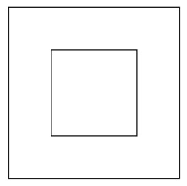

## Python Turtle
### Allgemeine Anforderungen für alle Programme:

Der Zeichen-Cursor sollte das 'turtle'-Symbol sein.
Das Programmfenster sollte sich erst nach einem Mausklick des Benutzers schließen.

### 1. Bereits existierende Funktionen aufrufen
#### Ein Quadrat in einem Quadrat zeichnen
Zeichne ein kleines Quadrat zentriert in einem größeren Quadrat, nur mit folgenden ``Funktionen``.
* ``turtle.penup()``
* ``turtle.pendown()``
* ``turtle.forward(zahl)``
* ``turtle.left(zahl)``
* ``turtle.goto(x, y)``



```python
from turtle import *

# # --- Vorbereitung # ---
screen = Screen()
screen.title("Übung 1.1: Verschachtelte Quadrate")
turtle = Turtle()
turtle.shape('turtle')
turtle.speed(3) # Eine sichtbare Geschwindigkeit verwenden

# --- Äußeres Quadrat zeichnen (z.B. 200x200) # ---
# TODO: implement me

# --- Inneres Quadrat zeichnen (z.B. 100x100) # ---
# TODO: implement me

# --- Abschluss # ---
turtle.hideturtle()
screen.exitonclick() # Warten, bis das Fenster per Klick geschlossen wird
```

#### Ein gedrehtes inneres Quadrat in ein Quadrat zeichnen
Zeichne ein Quadrat und darin ein zweites, um 45 Grad gedrehtes Quadrat.

**Bonus:** Die Linien des äußeren Quadrats sind rot, die des inneren gelb, und die Fläche des inneren Quadrats (die Überlappung) ist blau gefüllt.
Verwende folgende ``Funktionen``:
* ``turtle.color("yellow", "blue")``
* ``turtle.begin_fill()``
* ``turtle.end_fill()``
* ``turtle.penup()``
* ``turtle.pendown()``
* ``turtle.forward(zahl)``
* ``turtle.left(zahl)``
* ``turtle.goto(x, y)``

**Tipp:** Wir können auch die Namen der ``Parameter`` verwenden um besser lesbare Aufrufe der ``Funktion`` zu erstellen.
Schreibe dazu ``t.color(color1="yellow", color2="blue")``. Nagut. Wir sind jetzt nicht schlauer. Jedoch wenn die Namen der ``Parameter`` ``t.color(linie="yellow", hintergrund="blue")``, würden wir besser verstehen was wir machen.


```python
import turtle
import math

# # --- Vorbereitung # ---
screen = turtle.Screen()
screen.title("Übung 1.2: Gedrehtes Quadrat")
t = turtle.Turtle()
t.shape('turtle')
t.speed(3)

# --- Äußeres Quadrat # ---
# TODO: implement me

# --- Inneres gedrehtes Quadrat # ---
# Die Eckpunkte des inneren Quadrats liegen auf den Mittelpunkten der äußeren Seiten.
side_inner = math.sqrt(2) * (side_outer / 2)

# TODO: implement me

# --- Abschluss # ---
t.hideturtle()
screen.exitonclick()
```

### 2. Verzweigungen
#### Nur auf der rechten Hälfte zeichnen
Generiere zufällige Koordinaten. Wenn die x-Koordinate in der rechten Bildschirmhälfte liegt, bewege die Turtle dorthin. Sonst passiert nichts.

Verwende dazu folgende ``Funktionen``:
* ``random.randint(kleinste_zahl, größte_zahl)``: zufällige ganze Zahl (3, -5, 1523,) von kleinste_zahl bis größte_zahl.
* ``turtle.stamp()``: zeichnet die Turtle auf den Screen.
* ``turtle.hideturtle()``: verstecke die Turtle.
* ``turtle.penup()``
* ``turtle.pendown()``
* ``turtle.left(zahl)``
* ``turtle.goto(x, y)``

```python
import turtle
import random

# # --- Vorbereitung # ---
screen = turtle.Screen()
screen.title("Übung 2.1: Zeichnen rechte Hälfte")
screen_width = screen.window_width()
t = turtle.Turtle()
t.shape('turtle')

# --- Logik # ---
# Generiere zufällige Koordinaten innerhalb der Fenstergröße
random_x = random.randint(-screen_width // 2, screen_width // 2)
random_y = random.randint(-screen.window_height() // 2, screen.window_height() // 2)

# TODO: implement me

# --- Abschluss # ---
screen.exitonclick()
```

#### Unterschiedliches Symbol pro Seite
Generiere zufällige Koordinaten. Wenn der Punkt in der rechten Hälfte liegt, zeichne eine Turtle. Sonst (in der linken Hälfte) zeichne einen Kreis als Cursor.

Verwende dazu folgende ``Funktionen``:
* ``turtle.shape("turtle")``: wie soll die turtle aussehen? Es geht hier z.B. "turtle" und "circle". 
* ``random.randint(kleinste_zahl, größte_zahl)``: zufällige ganze Zahl (3, -5, 1523,) von kleinste_zahl bis größte_zahl.
* ``turtle.pendown()``
* ``turtle.goto(x, y)``

```python
import turtle
import random

# # --- Vorbereitung # ---
screen = turtle.Screen()
screen.title("Übung 2.2: Anderes Symbol")
screen_width = screen.window_width()
t = turtle.Turtle()

# --- Logik # ---
# TODO: implement me

# --- Abschluss # ---
screen.exitonclick()
```

#### Mausgesteuerte Bewegung mit Stopp-Bedingung
Der Benutzer klickt ins Fenster, und die Turtle bewegt sich dorthin. Das Programm reagiert nicht mehr auf Klicks, wenn die Turtle in die linke Fensterhälfte bewegt wird.

Verwende dazu folgende ``Funktionen``:
* ``screen.onclick(meine_funktion)``: meine_funktion ist eine eigens geschriebene ``Funktion`` welche ausgeführt wird, wenn wir auf den Bildschirm drücken. Sperre zudem den bildschirm mit ``screen.onclick(None)``, damit kein Mausclick mehr akzeptiert wird.
Zahl (3, -5, 1523,) von kleinste_zahl bis größte_zahl.
* ``turtle.left(zahl)``
* ``turtle.goto(x, y)``

```python
import turtle

# # --- Vorbereitung # ---
screen = turtle.Screen()
screen.title("Übung 2.3: Maussteuerung")
t = turtle.Turtle()
t.shape('turtle')
t.speed('fastest')
t.penup()

# --- Logik # ---
def move_turtle(x, y):
    # TODO: implement me

# warte auf den Mausclick
screen.onclick(move_turtle)

# Hält die Hauptprogrammschleife am Laufen, um auf Ereignisse zu warten
screen.mainloop()
```

### Farbige Punkte pro Quadrant bei Klick
Zeichne ein Fadenkreuz. Wenn der Benutzer klickt, erscheint ein großer Punkt (ca. 1 cm Durchmesser). Die Farbe des Punktes hängt vom Quadranten des Klicks ab: 
* oben links ist rot, 
* oben rechts blau,
* unten links grün und 
* unten rechts gelb.

```python
import turtle

# # --- Vorbereitung # ---
screen = turtle.Screen()
screen.title("Übung 2.4: Quadranten-Punkte")
screen_width = screen.window_width()
screen_height = screen.window_height()
t = turtle.Turtle()
t.hideturtle()
t.speed(0)

# --- Fadenkreuz zeichnen # ---
def draw_colored_dot(x, y):
    # TODO: implement me
    

# warte auf den Mausclick
screen.onclick(draw_colored_dot)

# --- Abschluss # ---
screen.mainloop()
```