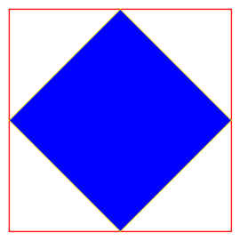

## Python Turtle
### Allgemeine Anforderungen für alle Programme:

Der Zeichen-Cursor sollte das 'turtle'-Symbol sein.
Das Programmfenster sollte sich erst nach einem Mausklick des Benutzers schließen.

### 1. Bereits existierende Funktionen aufrufen
#### Ein Quadrat in einem Quadrat zeichnen
Zeichne ein kleines Quadrat zentriert in einem größeren Quadrat, nur mit folgenden ``Funktionen``.
* ``turtle.penup()``
* ``turtle.pendown()``
* ``turtle.forward(zahl)``
* ``turtle.left(zahl)``



```python
import turtle

# # --- Vorbereitung # ---
screen = turtle.Screen()
screen.title("Übung 1.1: Verschachtelte Quadrate")
t = turtle.Turtle()
t.shape('turtle')
t.speed(3) # Eine sichtbare Geschwindigkeit verwenden

# --- Äußeres Quadrat zeichnen (z.B. 200x200) # ---
# TODO: implement me

# --- Inneres Quadrat zeichnen (z.B. 100x100) # ---
# TODO: implement me

# --- Abschluss # ---
t.hideturtle()
screen.exitonclick() # Warten, bis das Fenster per Klick geschlossen wird
```

#### Ein gedrehtes inneres Quadrat in ein Quadrat zeichnen
Zeichne ein Quadrat und darin ein zweites, um 45 Grad gedrehtes Quadrat.

**Bonus:** Die Linien des äußeren Quadrats sind rot, die des inneren gelb, und die Fläche des inneren Quadrats (die Überlappung) ist blau gefüllt.
Verwende folgende ``Funktionen``:
* ``turtle.color("yellow", "blue")``
* ``turtle.begin_fill()``
* ``turtle.end_fill()``

**Tipp:** Wir können auch die Namen der ``Parameter`` verwenden um besser lesbare Aufrufe der ``Funktion`` zu erstellen.
Schreibe dazu ``t.color(color1="yellow", color2="blue")``. Nagut. Wir sind jetzt nicht schlauer. Jedoch wenn die Namen der ``Parameter`` ``t.color(linie="yellow", hintergrund="blue")``, würden wir besser verstehen was wir machen.


```python
import turtle
import math

# # --- Vorbereitung # ---
screen = turtle.Screen()
screen.title("Übung 1.2: Gedrehtes Quadrat")
t = turtle.Turtle()
t.shape('turtle')
t.speed(3)

# --- Äußeres Quadrat # ---
# TODO: implement me

# --- Inneres gedrehtes Quadrat # ---
# Die Eckpunkte des inneren Quadrats liegen auf den Mittelpunkten der äußeren Seiten.
side_inner = math.sqrt(2) * (side_outer / 2)

# TODO: implement me

# --- Abschluss # ---
t.hideturtle()
screen.exitonclick()
```

### 2. Verzweigungen
#### Nur auf der rechten Hälfte zeichnen
Generiere zufällige Koordinaten. Wenn die x-Koordinate in der rechten Bildschirmhälfte liegt, bewege die Turtle dorthin. Sonst passiert nichts.

Verwende dazu folgende ``Funktionen``:
* ``random.randint(kleinste_zahl, größte_zahl)``: zufällige ganze Zahl (3, -5, 1523,) von kleinste_zahl bis größte_zahl.
* ``turtle.stamp()``: zeichnet die Turtle auf den Screen.
* ``turtle.hideturtle()``: verstecke die Turtle.
* ````


```python
import turtle
import random

# # --- Vorbereitung # ---
screen = turtle.Screen()
screen.title("Übung 2.1: Zeichnen rechte Hälfte")
screen_width = screen.window_width()
t = turtle.Turtle()
t.shape('turtle')

# --- Logik # ---
# Generiere zufällige Koordinaten innerhalb der Fenstergröße
random_x = random.randint(-screen_width // 2, screen_width // 2)
random_y = random.randint(-screen.window_height() // 2, screen.window_height() // 2)

# Prüfen, ob die x-Koordinate in der rechten Hälfte liegt
# Das Zentrum ist (0,0), also ist die rechte Hälfte bei x > 0
if random_x > 0:
    t.penup()
    t.goto(random_x, random_y)
    t.stamp() # Hinterlässt einen Abdruck der Turtle
else:
    # Wenn nicht rechts, nichts tun. Das Programm wartet nur auf das Schließen.
    t.hideturtle()

# --- Abschluss # ---
screen.exitonclick()
```

Unterschiedliches Symbol pro Seite
Ziel: Generiere zufällige Koordinaten. Wenn der Punkt in der rechten Hälfte liegt, zeichne eine Turtle. Sonst (in der linken Hälfte) zeichne einen Kreis als Cursor.

```python
import turtle
import random

# # --- Vorbereitung # ---
screen = turtle.Screen()
screen.title("Übung 2.2: Anderes Symbol")
screen_width = screen.window_width()
t = turtle.Turtle()

# --- Logik # ---
random_x = random.randint(-screen_width // 2, screen_width // 2)
random_y = random.randint(-screen.window_height() // 2, screen.window_height() // 2)

Prüfen, in welcher Hälfte sich der Punkt befindet
if random_x > 0:
t.shape('turtle') # Form für die rechte Seite auf 'turtle' setzen
else:
t.shape('circle') # Form für die linke Seite auf 'circle' setzen

Zur Position bewegen und das gewählte Symbol anzeigen
t.penup()
t.goto(random_x, random_y)

# --- Abschluss # ---
screen.exitonclick()
```

3. Mit Bedingungen und Schleifen
Diese Übungen kombinieren Benutzereingaben, Schleifen und bedingte Logik.

Mausgesteuerte Bewegung mit Stopp-Bedingung
Ziel: Der Benutzer klickt ins Fenster, und die Turtle bewegt sich dorthin. Das Programm reagiert nicht mehr auf Klicks, wenn die Turtle in die linke Fensterhälfte bewegt wird.

```python
import turtle

# # --- Vorbereitung # ---
screen = turtle.Screen()
screen.title("Übung 3.1: Maussteuerung")
t = turtle.Turtle()
t.shape('turtle')
t.speed('fastest')
t.penup()

# --- Logik # ---
Diese Funktion wird aufgerufen, wenn der Benutzer auf den Bildschirm klickt
def move_turtle(x, y):
t.goto(x, y) # Bewege die Turtle zu den geklickten Koordinaten

# Prüfen, ob die Turtle jetzt in der linken Hälfte des Bildschirms ist
if t.xcor() < 0:
    # Wenn ja, aufhören, auf weitere Klicks zu lauschen
    screen.onclick(None)
    t.write(" Ich bin in der linken Hälfte, Stopp!", align="center", font=("Arial", 16, "normal"))
Dem Bildschirm sagen, dass er die Funktion move_turtle bei jedem Klick aufrufen soll
screen.onclick(move_turtle)

Hält die Hauptprogrammschleife am Laufen, um auf Ereignisse zu warten
screen.mainloop()
```

Farbige Punkte pro Quadrant bei Klick
Ziel: Zeichne ein Fadenkreuz. Wenn der Benutzer klickt, erscheint ein großer Punkt (ca. 1 cm Durchmesser). Die Farbe des Punktes hängt vom Quadranten des Klicks ab: oben links ist rot, oben rechts blau, unten links grün und unten rechts gelb.

```python
import turtle

# # --- Vorbereitung # ---
screen = turtle.Screen()
screen.title("Übung 3.2: Quadranten-Punkte")
screen_width = screen.window_width()
screen_height = screen.window_height()
t = turtle.Turtle()
t.hideturtle()
t.speed(0)

# --- Fadenkreuz zeichnen # ---
t.penup()
t.goto(-screen_width/2, 0)
t.pendown()
t.goto(screen_width/2, 0)
t.penup()
t.goto(0, -screen_height/2)
t.pendown()
t.goto(0, screen_height/2)

Eine Turtle zum Zeichnen der Punkte erstellen
dot_drawer = turtle.Turtle()
dot_drawer.shape('turtle')
dot_drawer.penup()

# --- Logik # ---
Ungefähr 38 Pixel pro cm auf den meisten Bildschirmen
DOT_DIAMETER = 38

def draw_colored_dot(x, y):
dot_drawer.goto(x, y)

# Farbe basierend auf dem Quadranten bestimmen
if x < 0 and y > 0: # Oben Links
    dot_drawer.dot(DOT_DIAMETER, "red")
elif x > 0 and y > 0: # Oben Rechts
    dot_drawer.dot(DOT_DIAMETER, "blue")
elif x < 0 and y < 0: # Unten Links
    dot_drawer.dot(DOT_DIAMETER, "green")
else: # Unten Rechts
    dot_drawer.dot(DOT_DIAMETER, "yellow")
Auf Klicks lauschen
screen.onclick(draw_colored_dot)

# --- Abschluss # ---
screen.mainloop()
```

Konsolen-Navigationsspiel (Teil 1 & 2)
Ziel: Navigiere eine Turtle von einem zufälligen Startpunkt zu einem zufälligen Ziel mit Konsolenbefehlen ("up 100", etc.).
Beschränkungen Teil 2:

Der Benutzer muss einen strikten Befehlszyklus "up", "down", "left", "right" einhalten.
Das Spiel ist nur gewonnen, wenn das Ziel erreicht wird und der Zyklus abgeschlossen ist.
Die Distanz für jeden Zug muss zwischen 50 und 200 liegen.
```python
import turtle
import random

# # --- Vorbereitung # ---
screen = turtle.Screen()
screen.title("Übung 3.3: Navigationsspiel")
screen_width = screen.window_width()
screen_height = screen.window_height()

Spieler-Turtle
player = turtle.Turtle()
player.shape('turtle')
player.color('blue')
player.penup()

Zufällige Startposition für den Spieler festlegen
start_x = random.randint(-screen_width/2 + 50, screen_width/2 - 50)
start_y = random.randint(-screen_height/2 + 50, screen_height/2 - 50)
player.goto(start_x, start_y)

Zufälliges Ziel festlegen und zeichnen
goal_x = random.randint(-screen_width/2 + 50, screen_width/2 - 50)
goal_y = random.randint(-screen_height/2 + 50, screen_height/2 - 50)
goal_marker = turtle.Turtle()
goal_marker.hideturtle()
goal_marker.penup()
goal_marker.goto(goal_x, goal_y)
goal_marker.dot(20, 'red')
goal_marker.write("ZIEL", align='center')

# --- Spiellogik # ---
COMMAND_PATTERN = ['up', 'down', 'left', 'right']
command_index = 0 # Verfolgt unsere Position im Befehlsmuster

while True:
# Siegbedingung prüfen, BEVOR eine neue Eingabe abgefragt wird
if player.distance(goal_x, goal_y) < 20:
if command_index == 0: # Prüfen, ob das Muster vollständig ist
player.write(" DU HAST GEWONNEN! ", font=("Arial", 20, "bold"))
break # Die Schleife verlassen
else:
# Am Ziel, aber Muster unvollständig
player.write(f"Am Ziel, aber du musst das Muster beenden! Nächster Befehl: '{COMMAND_PATTERN[command_index]}'")

# Benutzereingabe abfragen
next_move = COMMAND_PATTERN[command_index]
prompt = f"Gib deinen nächsten Zug ein. Erforderlich: '{next_move}' (z.B. '{next_move} 100')"
user_input = screen.textinput("Navigationsbefehl", prompt)

if user_input is None: # Benutzer hat Abbrechen gedrückt
    break

try:
    parts = user_input.split()
    direction = parts[0].lower()
    distance = int(parts[1])

    # Eingabe gegen alle Einschränkungen prüfen
    if direction != next_move:
        continue # Den Rest überspringen und erneut fragen
    
    if not (50 < distance < 200):
        continue # Den Rest überspringen und erneut fragen

    # # --- Wenn die Eingabe gültig ist, den Zug verarbeiten # ---
    if direction == 'up':
        player.setheading(90)
    elif direction == 'down':
        player.setheading(270)
    elif direction == 'left':
        player.setheading(180)
    elif direction == 'right':
        player.setheading(0)
    
    player.forward(distance)
    
    # Zum nächsten Befehl im Muster wechseln
    command_index = (command_index + 1) % len(COMMAND_PATTERN)

except (ValueError, IndexError):
    # Behandelt ungültige Eingaben wie "up" oder "hallo welt"
    continue
# --- Abschluss # ---
screen.exitonclick()
